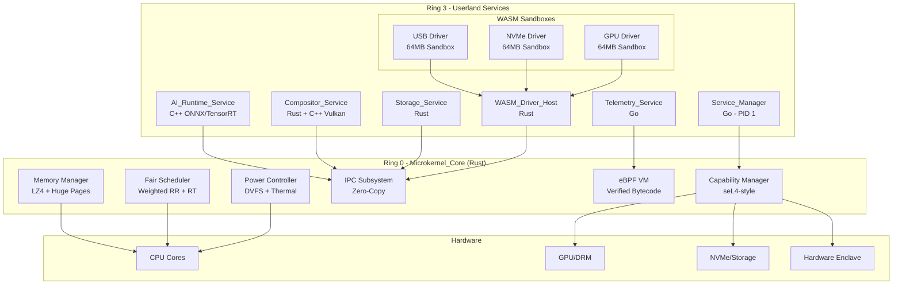

# Polymera OS Advanced Kernel Features - Design Document

## Overview

This design document specifies the architecture for Polymera OS's advanced kernel features, implementing a true microkernel architecture with polyglot userland services. The design follows the seL4-inspired capability-based security model while enabling high-performance graphics, AI-driven power management, and crash-resilient driver isolation.

The architecture strictly separates:
- **Ring 0 (Microkernel_Core)**: Memory management, scheduling, IPC, capabilities - written in safe Rust
- **Ring 3 (Userland Services)**: Graphics, storage, drivers, AI - written in the best language for each task

## Architecture



## Components and Interfaces

### 1. Memory Manager (Ring 0 / Rust)

```rust
/// Memory Manager - handles virtual memory, compression, and huge pages
pub struct MemoryManager {
    /// Page frame allocator
    frame_allocator: FrameAllocator,
    /// LZ4 compression engine for inactive pages
    compressor: Lz4Compressor,
    /// Huge page pool (2MB pages)
    huge_page_pool: HugePagePool,
    /// Per-process page tables
    page_tables: BTreeMap<ProcessId, PageTable>,
    /// Memory pressure threshold (0.0 - 1.0)
    pressure_threshold: f32,
    /// Compressed page cache
    compressed_cache: CompressedPageCache,
}

impl MemoryManager {
    /// Allocate memory for a process, auto-promoting to huge pages if > 2MB
    pub fn allocate(&mut self, pid: ProcessId, size: usize, cap: &CapabilityHandle) 
        -> Result<VirtualAddress, MemoryError>;
    
    /// Check memory pressure and compress inactive pages if > 80%
    pub fn check_pressure(&mut self) -> PressureStatus;
    
    /// Decompress a page on access (must complete within 100μs)
    pub fn decompress_page(&mut self, addr: VirtualAddress) -> Result<(), MemoryError>;
    
    /// Validate memory access against capability handle
    pub fn validate_access(&self, pid: ProcessId, addr: VirtualAddress, cap: &CapabilityHandle) 
        -> Result<(), PageFault>;
    
    /// Get memory statistics
    pub fn stats(&self) -> MemoryStats;
}

/// Memory statistics for monitoring
#[derive(Debug, Clone)]
pub struct MemoryStats {
    pub total_bytes: usize,
    pub used_bytes: usize,
    pub compressed_bytes: usize,
    pub compression_ratio: f32,
    pub huge_page_count: usize,
    pub fragmentation_ratio: f32,
}
```

### 2. Fair Scheduler (Ring 0 / Rust)

```rust
/// Fair Scheduler with weighted round-robin and soft real-time support
pub struct FairScheduler {
    /// Run queues per CPU core
    run_queues: Vec<RunQueue>,
    /// Real-time task queue (preempts normal tasks)
    rt_queue: RealTimeQueue,
    /// Task weights for fair scheduling
    weights: BTreeMap<ProcessId, u32>,
    /// NUMA topology information
    numa_topology: NumaTopology,
    /// Load balancer state
    load_balancer: LoadBalancer,
}

impl FairScheduler {
    /// Schedule next task on given CPU
    pub fn schedule(&mut self, cpu: CpuId) -> Option<TaskContext>;
    
    /// Submit a real-time task (compositor, audio)
    pub fn submit_rt(&mut self, task: Task, deadline_us: u64) -> Result<(), SchedulerError>;
    
    /// Migrate task to balance load across CPUs
    pub fn balance_load(&mut self) -> Vec<Migration>;
    
    /// Detect and handle spin loops
    pub fn detect_spin_loop(&mut self, pid: ProcessId) -> Option<HealthCheck>;
    
    /// Set thread affinity for NUMA optimization
    pub fn set_affinity(&mut self, tid: ThreadId, mask: AffinityMask) -> Result<(), SchedulerError>;
}

/// Real-time task priority levels
#[derive(Debug, Clone, Copy, PartialEq, Eq, PartialOrd, Ord)]
pub enum RtPriority {
    Audio = 0,      // Highest - audio must never skip
    Compositor = 1, // High - 60fps requirement
    Input = 2,      // Medium - responsive input
    Normal = 255,   // Not real-time
}
```

### 3. Capability Manager (Ring 0 / Rust)

```rust
/// Capability Manager - seL4-style capability-based security
pub struct CapabilityManager {
    /// Capability derivation tree
    cap_tree: CapabilityTree,
    /// Per-process capability spaces
    cspaces: BTreeMap<ProcessId, CapabilitySpace>,
    /// Revocation log for audit
    revocation_log: RevocationLog,
}

impl CapabilityManager {
    /// Create initial empty capability space for new process
    pub fn create_cspace(&mut self, pid: ProcessId) -> CapabilitySpace;
    
    /// Grant capability from parent to child
    pub fn grant(&mut self, from: ProcessId, to: ProcessId, cap: Capability) 
        -> Result<CapabilityHandle, CapError>;
    
    /// Revoke capability and all derived handles
    pub fn revoke(&mut self, cap: CapabilityHandle) -> Result<Vec<ProcessId>, CapError>;
    
    /// Validate IPC handle for inter-service communication
    pub fn validate_ipc(&self, from: ProcessId, to: ProcessId, handle: &IpcHandle) 
        -> Result<(), CapError>;
    
    /// Check W^X enforcement for memory region
    pub fn check_wxorx(&self, pid: ProcessId, addr: VirtualAddress, prot: Protection) 
        -> Result<(), CapError>;
}

/// Capability types
#[derive(Debug, Clone)]
pub enum Capability {
    Memory { base: VirtualAddress, size: usize, perms: Permissions },
    Ipc { target: ProcessId },
    Device { device_id: DeviceId, ops: DeviceOps },
    Framebuffer { drm_fd: u32 },
    Enclave { enclave_id: EnclaveId },
}
```

### 4. IPC Subsystem (Ring 0 / Rust)

```rust
/// Zero-copy IPC subsystem
pub struct IpcSubsystem {
    /// Endpoint registry
    endpoints: BTreeMap<EndpointId, Endpoint>,
    /// Shared memory regions for zero-copy
    shared_regions: BTreeMap<SharedRegionId, SharedRegion>,
    /// Message queues per endpoint
    queues: BTreeMap<EndpointId, MessageQueue>,
}

impl IpcSubsystem {
    /// Send message with zero-copy semantics
    pub fn send(&mut self, from: ProcessId, to: EndpointId, msg: &Message, cap: &IpcHandle) 
        -> Result<(), IpcError>;
    
    /// Receive message (blocking or non-blocking)
    pub fn receive(&mut self, endpoint: EndpointId, timeout: Option<Duration>) 
        -> Result<Message, IpcError>;
    
    /// Create shared memory region for zero-copy transfers
    pub fn create_shared_region(&mut self, size: usize) -> Result<SharedRegionId, IpcError>;
    
    /// Send high-priority message (for AI power predictions)
    pub fn send_priority(&mut self, from: ProcessId, to: EndpointId, msg: &Message, priority: u8) 
        -> Result<(), IpcError>;
}

/// IPC Message format
#[derive(Debug, Clone)]
pub struct Message {
    pub msg_type: MessageType,
    pub payload: MessagePayload,
    pub timestamp: u64,
}

#[derive(Debug, Clone)]
pub enum MessageType {
    FrameReady,
    PowerBoost,
    ServiceSuspend,
    HealthCheck,
    DriverLoad,
    EnclaveRequest,
}
```

### 5. Power Controller (Ring 0 / Rust)

```rust
/// Power Controller - DVFS and thermal management
pub struct PowerController {
    /// CPU frequency domains
    freq_domains: Vec<FrequencyDomain>,
    /// Current power state
    power_state: PowerState,
    /// Thermal sensors
    thermal_sensors: Vec<ThermalSensor>,
    /// Voltage regulator interface
    voltage_regulator: VoltageRegulator,
}

impl PowerController {
    /// Execute atomic voltage/frequency change
    pub fn set_frequency(&mut self, domain: usize, freq_mhz: u32) -> Result<(), PowerError>;
    
    /// Handle power boost request from AI service
    pub fn boost(&mut self, duration_ms: u64) -> Result<(), PowerError>;
    
    /// Check thermal state and throttle if needed
    pub fn check_thermal(&mut self) -> ThermalAction;
    
    /// Get current power consumption estimate
    pub fn power_estimate(&self) -> PowerEstimate;
}

/// Thermal action to take
#[derive(Debug, Clone)]
pub enum ThermalAction {
    None,
    Throttle { target_freq_mhz: u32 },
    Emergency { shutdown_in_ms: u64 },
}
```

### 6. eBPF VM (Ring 0 / Rust)

```rust
/// eBPF Virtual Machine for safe kernel instrumentation
pub struct EbpfVm {
    /// Verified programs
    programs: BTreeMap<ProgramId, VerifiedProgram>,
    /// Ring buffers for trace output
    ring_buffers: Vec<RingBuffer>,
    /// Attached probes
    probes: Vec<Probe>,
    /// Performance counters interface
    perf_counters: PerfCounters,
}

impl EbpfVm {
    /// Load and verify eBPF bytecode
    pub fn load_program(&mut self, bytecode: &[u8]) -> Result<ProgramId, EbpfError>;
    
    /// Attach probe to syscall or IPC event
    pub fn attach_probe(&mut self, program: ProgramId, hook: HookPoint) -> Result<ProbeId, EbpfError>;
    
    /// Read trace events from ring buffer
    pub fn read_events(&mut self, buffer_id: usize, max_events: usize) -> Vec<TraceEvent>;
    
    /// Read hardware performance counter
    pub fn read_perf_counter(&self, counter: PerfCounterType) -> u64;
}

/// Trace event recorded by eBPF probe
#[derive(Debug, Clone)]
pub struct TraceEvent {
    pub timestamp_ns: u64,
    pub pid: ProcessId,
    pub event_type: EventType,
    pub args: [u64; 6],
}

/// Hook points for eBPF probes
#[derive(Debug, Clone)]
pub enum HookPoint {
    Syscall(SyscallNumber),
    IpcSend,
    IpcReceive,
    ContextSwitch,
    PageFault,
    Interrupt(u8),
}
```

### 7. WASM Driver Host (Ring 3 / Rust)

```rust
/// WASM Driver Host - sandboxed driver execution
pub struct WasmDriverHost {
    /// WASM runtime engine
    engine: WasmEngine,
    /// Active driver sandboxes
    sandboxes: HashMap<DriverId, DriverSandbox>,
    /// Driver registry (device_id -> wasm_path)
    registry: DriverRegistry,
    /// IPC channel to kernel
    kernel_ipc: IpcChannel,
}

impl WasmDriverHost {
    /// Load driver for device
    pub fn load_driver(&mut self, device_id: DeviceId) -> Result<DriverId, DriverError>;
    
    /// Create sandbox with 64MB memory limit
    pub fn create_sandbox(&mut self, wasm_bytes: &[u8]) -> Result<DriverSandbox, DriverError>;
    
    /// Handle IO port access request from driver
    pub fn handle_io_request(&mut self, driver: DriverId, port: u16, op: IoOp) 
        -> Result<IoResult, DriverError>;
    
    /// Terminate crashed sandbox
    pub fn terminate_sandbox(&mut self, driver: DriverId) -> Result<(), DriverError>;
}

/// Driver sandbox with strict resource limits
pub struct DriverSandbox {
    pub id: DriverId,
    pub instance: WasmInstance,
    pub memory_limit: usize,  // 64MB max
    pub memory_used: usize,
    pub io_ports: Vec<u16>,   // Allowed IO ports
}
```

### 8. Compositor Service (Ring 3 / Rust + C++)

```rust
/// Compositor Service - manages scene graph and Vulkan rendering
pub struct CompositorService {
    /// Scene graph (Rust for thread safety)
    scene_graph: SceneGraph,
    /// Vulkan renderer (C++ FFI)
    renderer: VulkanRenderer,
    /// Shared memory buffers for zero-copy
    frame_buffers: HashMap<WindowId, SharedBuffer>,
    /// IPC channel for frame notifications
    ipc: IpcChannel,
}

impl CompositorService {
    /// Handle frame ready notification
    pub fn on_frame_ready(&mut self, window: WindowId, buffer: &SharedBuffer) -> Result<(), CompositorError>;
    
    /// Composite all windows and present
    pub fn composite(&mut self) -> Result<(), CompositorError>;
    
    /// Handle display hotplug
    pub fn on_display_change(&mut self, event: DisplayEvent) -> Result<(), CompositorError>;
}

/// Scene graph node
#[derive(Debug)]
pub struct SceneNode {
    pub id: NodeId,
    pub transform: Transform,
    pub children: Vec<NodeId>,
    pub surface: Option<SurfaceId>,
    pub opacity: f32,
}
```

### 9. Storage Service (Ring 3 / Rust)

```rust
/// Storage Service - CoW filesystem with snapshots and deduplication
pub struct StorageService {
    /// Block device interface
    block_device: BlockDevice,
    /// Deduplication index (hash -> block_id)
    dedup_index: HashMap<BlockHash, BlockId>,
    /// Snapshot tree
    snapshots: SnapshotTree,
    /// Write-ahead log for crash consistency
    wal: WriteAheadLog,
    /// IPC channel to kernel for enclave access
    kernel_ipc: IpcChannel,
}

impl StorageService {
    /// Write data with CoW semantics
    pub fn write(&mut self, inode: InodeId, offset: u64, data: &[u8]) -> Result<(), StorageError>;
    
    /// Create snapshot
    pub fn create_snapshot(&mut self, name: &str) -> Result<SnapshotId, StorageError>;
    
    /// Deduplicate block
    pub fn deduplicate(&mut self, data: &[u8]) -> Result<BlockId, StorageError>;
    
    /// Request key unwrap from hardware enclave
    pub fn unwrap_key(&self, wrapped_key: &[u8]) -> Result<Key, StorageError>;
    
    /// Recover from crash using WAL
    pub fn recover(&mut self) -> Result<(), StorageError>;
}
```

### 10. Service Manager (Ring 3 / Go)

```go
// ServiceManager - PID 1, manages service lifecycle
type ServiceManager struct {
    services    map[ServiceId]*Service
    capabilities map[ServiceId][]Capability
    ipcChannel  *IpcChannel
    healthChecks map[ServiceId]*HealthCheck
}

// SpawnService creates a new service with zero capabilities
func (sm *ServiceManager) SpawnService(manifest *ServiceManifest) (*Service, error)

// GrantCapability grants a capability to a service
func (sm *ServiceManager) GrantCapability(svc ServiceId, cap Capability) error

// HandleCrash detects and recovers from service crashes
func (sm *ServiceManager) HandleCrash(svc ServiceId) error

// SuspendServices puts background services into suspend state
func (sm *ServiceManager) SuspendServices() error
```

## Data Models

### Capability Handle

```rust
/// Capability handle - unforgeable reference to a capability
#[derive(Debug, Clone, PartialEq, Eq, Hash)]
pub struct CapabilityHandle {
    /// Unique handle ID
    pub id: u64,
    /// Capability type
    pub cap_type: CapabilityType,
    /// Parent handle (for revocation)
    pub parent: Option<u64>,
    /// Generation number (invalidated on revoke)
    pub generation: u32,
}

#[derive(Debug, Clone, Copy, PartialEq, Eq, Hash)]
pub enum CapabilityType {
    Memory,
    Ipc,
    Device,
    Framebuffer,
    Enclave,
    IoPort,
}
```

### Process Context

```rust
/// Process context for scheduling
#[derive(Debug)]
pub struct ProcessContext {
    pub pid: ProcessId,
    pub state: ProcessState,
    pub priority: Priority,
    pub rt_priority: Option<RtPriority>,
    pub cpu_time_us: u64,
    pub weight: u32,
    pub affinity: AffinityMask,
    pub cspace: CapabilitySpace,
}

#[derive(Debug, Clone, Copy, PartialEq, Eq)]
pub enum ProcessState {
    Ready,
    Running,
    Blocked,
    Suspended,
    Terminated,
}
```

### Driver Manifest

```rust
/// WASM driver manifest
#[derive(Debug, Clone, Serialize, Deserialize)]
pub struct DriverManifest {
    pub name: String,
    pub version: String,
    pub device_ids: Vec<DeviceId>,
    pub memory_limit: usize,
    pub io_ports: Vec<u16>,
    pub signature: Vec<u8>,
}
```


## Correctness Properties

*A property is a characteristic or behavior that should hold true across all valid executions of a system-essentially, a formal statement about what the system should do. Properties serve as the bridge between human-readable specifications and machine-verifiable correctness guarantees.*

Based on the acceptance criteria analysis, the following correctness properties must be verified:

### Property 1: Memory Compression Trigger
*For any* memory state where pressure exceeds 80%, the Memory_Manager shall initiate LZ4 compression of inactive pages before any swap operations occur.
**Validates: Requirements 1.2**

### Property 2: Huge Page Promotion
*For any* memory allocation request larger than 2MB, the Memory_Manager shall allocate from the huge page pool rather than standard 4KB pages.
**Validates: Requirements 1.3**

### Property 3: Capability-Enforced Memory Access
*For any* memory access attempt where the address is not mapped to the process's capability handle, the Memory_Manager shall trigger a page fault and terminate the process.
**Validates: Requirements 1.4**

### Property 4: Atomic Voltage Change
*For any* voltage change request, the Power_Controller shall complete the hardware state transition atomically without partial state visible to other components.
**Validates: Requirements 2.1**

### Property 5: AI Power Boost IPC
*For any* high-load prediction from the AI_Runtime_Service, the resulting IPC message to the kernel shall have priority higher than normal messages.
**Validates: Requirements 2.3**

### Property 6: Idle Service Suspension
*For any* system idle state, the Service_Manager shall transition all background services to suspended state, reducing wake-up events.
**Validates: Requirements 2.4**

### Property 7: Zero-Copy Frame Rendering
*For any* window frame render operation, the application shall write to shared memory and the Frame_Ready IPC message shall reference the same memory region without copying.
**Validates: Requirements 3.2**

### Property 8: Compositor Crash Recovery
*For any* Compositor_Service crash, the Service_Manager shall detect the failure and spawn a new compositor instance while the kernel continues running.
**Validates: Requirements 3.3**

### Property 9: Copy-on-Write Snapshot Semantics
*For any* write operation to a file with an existing snapshot, the Storage_Service shall allocate a new block rather than modifying the original block.
**Validates: Requirements 4.1**

### Property 10: Block Deduplication
*For any* two data blocks with identical content, the Storage_Service shall store only one copy and maintain reference counts for both.
**Validates: Requirements 4.2**

### Property 11: Crash Consistency
*For any* simulated crash during a write operation, the Storage_Service shall recover to a consistent state using the write-ahead log without data corruption.
**Validates: Requirements 4.3**

### Property 12: Enclave Key Isolation
*For any* encryption key request, the Storage_Service shall obtain the unwrapped key via kernel IPC to the hardware enclave, and the raw key shall never be stored in the service's memory after use.
**Validates: Requirements 4.4**

### Property 13: Driver Discovery
*For any* device plug event, the Service_Manager shall locate a matching WASM driver binary based on the device ID within the driver registry.
**Validates: Requirements 5.1**

### Property 14: Driver Sandbox Memory Limit
*For any* loaded WASM driver, the sandbox memory limit shall be enforced at 64MB maximum, rejecting allocations that would exceed this limit.
**Validates: Requirements 5.2**

### Property 15: IO Port Validation
*For any* IO port access from a WASM driver, the request shall be validated by the kernel before execution, rejecting access to ports not in the driver's allowed list.
**Validates: Requirements 5.3**

### Property 16: Driver Crash Isolation
*For any* WASM driver crash or illegal instruction, only the affected sandbox shall be terminated while all other sandboxes and the kernel continue operating.
**Validates: Requirements 5.4**

### Property 17: Fair CPU Scheduling
*For any* set of competing services with assigned weights, the CPU time allocated to each service shall be proportional to its weight over a scheduling window.
**Validates: Requirements 6.1**

### Property 18: Real-Time Preemption
*For any* real-time task (Compositor, Audio) becoming runnable, the scheduler shall preempt any normal-priority task within the preemption deadline.
**Validates: Requirements 6.2**

### Property 19: NUMA Affinity Respect
*For any* thread with a set affinity mask, the scheduler shall only schedule that thread on CPUs included in the mask.
**Validates: Requirements 6.3**

### Property 20: Spin Loop Detection
*For any* service that stops responding to IPC health checks, the scheduler shall reduce its priority and notify the Service_Manager.
**Validates: Requirements 6.4**

### Property 21: Zero Capability Spawn
*For any* newly spawned service, its capability space shall be empty until the Service_Manager explicitly grants capabilities.
**Validates: Requirements 7.1**

### Property 22: IPC Handle Enforcement
*For any* IPC send operation, the sender must possess a valid IPC handle for the destination, and sends without valid handles shall be rejected.
**Validates: Requirements 7.2**

### Property 23: Capability Revocation Cascade
*For any* capability revocation, all handles derived from the revoked capability shall become invalid immediately.
**Validates: Requirements 7.3**

### Property 24: W^X Memory Protection
*For any* memory region, the Memory_Manager shall reject attempts to make the region both writable and executable simultaneously.
**Validates: Requirements 7.4**

### Property 25: eBPF Verification
*For any* eBPF program load, the bytecode shall pass verification before execution, rejecting programs with unsafe operations.
**Validates: Requirements 8.1**

### Property 26: Trace Event Completeness
*For any* triggered eBPF probe, the recorded trace event shall contain a valid timestamp, caller PID, and event arguments.
**Validates: Requirements 8.2**

### Property 27: Trace Data Format Round-Trip
*For any* trace event, serializing to the standard format and deserializing shall produce an equivalent event.
**Validates: Requirements 8.4**

## Error Handling

### Error Types

```rust
/// Memory management errors
#[derive(Debug, Clone)]
pub enum MemoryError {
    OutOfMemory { requested: usize, available: usize },
    PageFault { address: VirtualAddress, reason: FaultReason },
    CompressionFailed { page: PageId, reason: String },
    HugePageUnavailable { requested: usize },
    CapabilityViolation { pid: ProcessId, address: VirtualAddress },
}

/// Scheduler errors
#[derive(Debug, Clone)]
pub enum SchedulerError {
    InvalidAffinity { mask: AffinityMask, available_cpus: u32 },
    RtQueueFull { queue_size: usize },
    ProcessNotFound { pid: ProcessId },
    SpinLoopDetected { pid: ProcessId, duration_ms: u64 },
}

/// Capability errors
#[derive(Debug, Clone)]
pub enum CapError {
    InvalidHandle { handle: u64, generation: u32 },
    InsufficientPermissions { required: Permissions, actual: Permissions },
    HandleRevoked { handle: u64 },
    WxViolation { address: VirtualAddress },
    IpcDenied { from: ProcessId, to: ProcessId },
}

/// Driver errors
#[derive(Debug, Clone)]
pub enum DriverError {
    DriverNotFound { device_id: DeviceId },
    SandboxCreationFailed { reason: String },
    MemoryLimitExceeded { limit: usize, requested: usize },
    IoPortDenied { port: u16 },
    IllegalInstruction { offset: u64 },
    SignatureInvalid { driver: String },
}

/// Storage errors
#[derive(Debug, Clone)]
pub enum StorageError {
    IoError { operation: String, errno: i32 },
    SnapshotNotFound { id: SnapshotId },
    EnclaveCommunicationFailed { reason: String },
    WalCorrupted { offset: u64 },
    DedupIndexFull,
}
```

### Error Recovery Strategies

1. **Memory Pressure Recovery**:
   - Compress inactive pages using LZ4
   - If compression ratio < 2:1, fall back to swap
   - Notify Service_Manager to suspend non-critical services

2. **Driver Crash Recovery**:
   - Terminate only the affected WASM sandbox
   - Log crash details for debugging
   - Attempt to reload driver if device still present
   - Notify applications using the device

3. **Compositor Crash Recovery**:
   - Service_Manager detects broken IPC pipe
   - Spawn new Compositor_Service instance
   - Restore window state from shared memory buffers
   - Resume rendering within 200ms

4. **Capability Revocation**:
   - Immediately invalidate all derived handles
   - Fail in-flight operations using revoked capabilities
   - Log revocation for audit trail

5. **Storage Crash Recovery**:
   - Replay write-ahead log on startup
   - Verify block checksums
   - Rebuild dedup index if corrupted
   - No fsck required due to log-structured design

## Testing Strategy

### Dual Testing Approach

The Advanced Kernel Features will use both unit tests and property-based tests:

- **Unit tests** verify specific examples, edge cases, and error conditions
- **Property-based tests** verify universal properties that should hold across all inputs

### Property-Based Testing Framework

The implementation will use:
- **Rust**: `proptest` crate for kernel and Rust services
- **Go**: `gopter` package for Service_Manager
- **C++**: `rapidcheck` for Vulkan compositor

Each property test will:
- Run a minimum of 100 iterations
- Be tagged with a comment referencing the correctness property
- Use the format: `**Feature: advanced-kernel-features, Property {number}: {property_text}**`

### Test Categories

1. **Memory Manager Tests**
   - Compression trigger at 80% pressure
   - Huge page promotion for > 2MB allocations
   - Capability-enforced access validation
   - Decompression latency (< 100μs)

2. **Scheduler Tests**
   - Fair time-slicing with weights
   - Real-time preemption timing
   - NUMA affinity enforcement
   - Spin loop detection

3. **Capability Tests**
   - Zero capability spawn
   - IPC handle validation
   - Revocation cascade
   - W^X enforcement

4. **Driver Tests**
   - Sandbox memory limits
   - IO port validation
   - Crash isolation
   - Hot-plug handling

5. **Storage Tests**
   - CoW snapshot semantics
   - Deduplication correctness
   - Crash recovery
   - Enclave key isolation

6. **Integration Tests**
   - Cross-service IPC
   - Power boost from AI service
   - Compositor crash recovery
   - End-to-end tracing

### Example Property Tests

```rust
use proptest::prelude::*;

proptest! {
    /// **Feature: advanced-kernel-features, Property 2: Huge Page Promotion**
    #[test]
    fn huge_page_promotion(size in 2*1024*1024usize..16*1024*1024) {
        let mut mm = MemoryManager::new();
        let cap = CapabilityHandle::new_memory(size);
        let result = mm.allocate(ProcessId(1), size, &cap);
        prop_assert!(result.is_ok());
        let addr = result.unwrap();
        prop_assert!(mm.is_huge_page(addr));
    }
    
    /// **Feature: advanced-kernel-features, Property 14: Driver Sandbox Memory Limit**
    #[test]
    fn driver_memory_limit(alloc_size in 1usize..128*1024*1024) {
        let mut host = WasmDriverHost::new();
        let sandbox = host.create_sandbox(&MINIMAL_DRIVER).unwrap();
        let result = sandbox.allocate(alloc_size);
        if alloc_size > 64 * 1024 * 1024 {
            prop_assert!(result.is_err());
        } else {
            prop_assert!(result.is_ok());
        }
    }
    
    /// **Feature: advanced-kernel-features, Property 17: Fair CPU Scheduling**
    #[test]
    fn fair_scheduling(
        weights in prop::collection::vec(1u32..100, 2..10)
    ) {
        let mut sched = FairScheduler::new();
        let total_weight: u32 = weights.iter().sum();
        
        // Create services with weights
        for (i, &w) in weights.iter().enumerate() {
            sched.add_service(ProcessId(i as u64), w);
        }
        
        // Run for 1000 time slices
        let mut cpu_time = vec![0u64; weights.len()];
        for _ in 0..1000 {
            if let Some(ctx) = sched.schedule(CpuId(0)) {
                cpu_time[ctx.pid.0 as usize] += 1;
            }
        }
        
        // Verify proportional allocation (within 10% tolerance)
        for (i, &w) in weights.iter().enumerate() {
            let expected = (w as f64 / total_weight as f64) * 1000.0;
            let actual = cpu_time[i] as f64;
            prop_assert!((actual - expected).abs() / expected < 0.1);
        }
    }
    
    /// **Feature: advanced-kernel-features, Property 23: Capability Revocation Cascade**
    #[test]
    fn revocation_cascade(depth in 1usize..5, breadth in 1usize..4) {
        let mut cap_mgr = CapabilityManager::new();
        let root = cap_mgr.create_root_capability();
        
        // Build capability tree
        let mut handles = vec![root];
        for _ in 0..depth {
            let mut new_handles = vec![];
            for &parent in &handles {
                for _ in 0..breadth {
                    let child = cap_mgr.derive(parent).unwrap();
                    new_handles.push(child);
                }
            }
            handles.extend(new_handles);
        }
        
        // Revoke root
        cap_mgr.revoke(root).unwrap();
        
        // All derived handles should be invalid
        for &handle in &handles {
            prop_assert!(cap_mgr.validate(handle).is_err());
        }
    }
}
```

### Test Data Generators

```rust
/// Generate arbitrary memory allocation sizes
fn any_allocation_size() -> impl Strategy<Value = usize> {
    prop_oneof![
        1usize..4096,           // Small allocations
        4096..2*1024*1024,      // Medium allocations  
        2*1024*1024..64*1024*1024, // Large (huge page candidates)
    ]
}

/// Generate arbitrary process contexts
fn any_process_context() -> impl Strategy<Value = ProcessContext> {
    (
        any::<u64>(),           // pid
        any_process_state(),    // state
        1u32..100,              // weight
        any_affinity_mask(),    // affinity
    ).prop_map(|(pid, state, weight, affinity)| {
        ProcessContext {
            pid: ProcessId(pid),
            state,
            priority: Priority::Normal,
            rt_priority: None,
            cpu_time_us: 0,
            weight,
            affinity,
            cspace: CapabilitySpace::empty(),
        }
    })
}

/// Generate arbitrary capability trees
fn any_capability_tree(max_depth: usize) -> impl Strategy<Value = Vec<CapabilityHandle>> {
    // Implementation generates random tree structures
}
```

