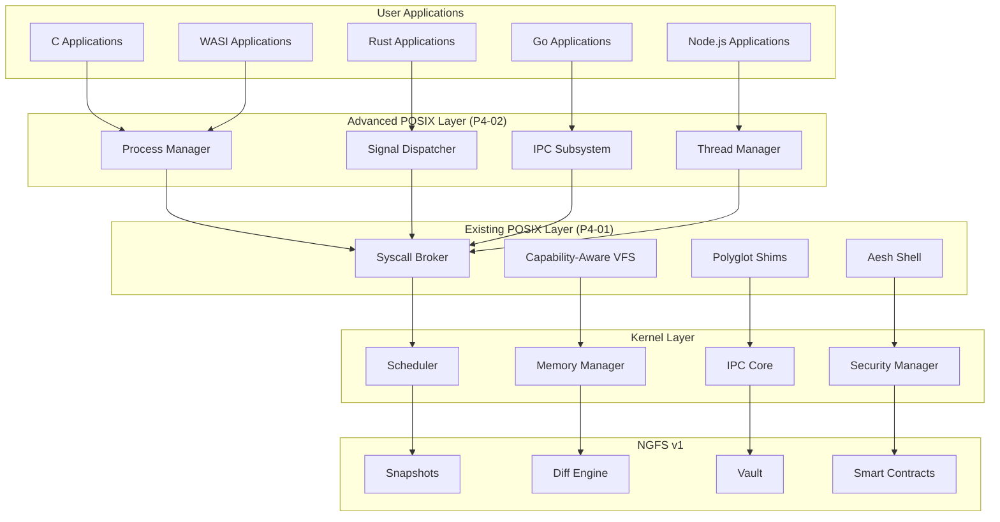
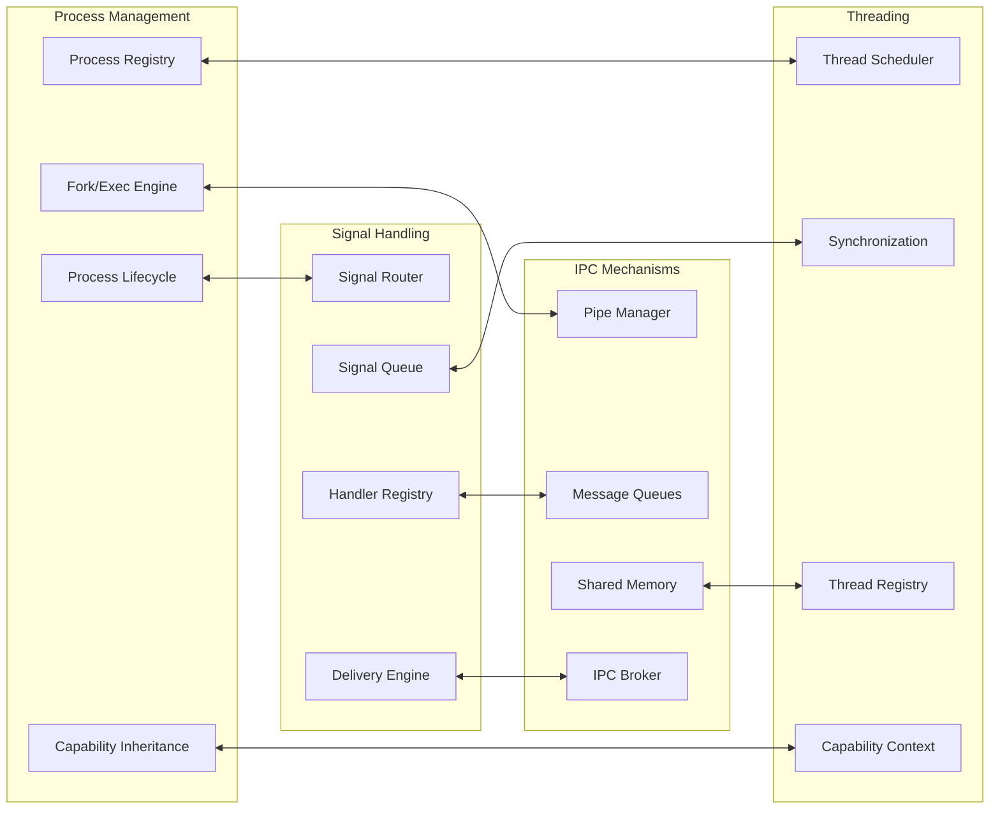

# Design Document

## Overview

The Advanced POSIX Features (P4-02) design extends the existing Aetheris OS POSIX surface with comprehensive process management, signal handling, IPC mechanisms, and threading capabilities. This design builds upon the established kernel foundation with syscall broker, capability framework, NGFS v1 filesystem, and existing P4-01 POSIX surface to provide a complete polyglot operating system environment.

The design maintains the core principles of Aetheris OS: capability-based security, polyglot runtime support, quantum-ready cryptography, and performance-first architecture. All new features integrate seamlessly with existing components while preserving the microkernel architecture and security boundaries.

## Architecture

### High-Level System Architecture



### Component Integration Architecture



## Components and Interfaces

### Process Management Component

#### Process Manager Interface

```rust
pub struct ProcessManager {
    processes: Arc<RwLock<HashMap<ProcessId, ProcessDescriptor>>>,
    capability_store: Arc<CapabilityStore>,
    scheduler_interface: Arc<SchedulerInterface>,
    audit_logger: Arc<AuditLogger>,
}

impl ProcessManager {
    pub fn spawn(&self, request: SpawnRequest) -> SpawnResponse;
    pub fn fork(&self, parent_cap: &str) -> SpawnResponse;
    pub fn exec(&self, process_cap: &str, executable: &str, args: Vec<String>) -> Result<(), ProcessError>;
    pub fn wait(&self, process_cap: &str, child_pid: Option<ProcessId>) -> WaitResponse;
    pub fn kill(&self, process_cap: &str, target_pid: ProcessId, signal: Signal) -> Result<(), ProcessError>;
    pub fn list_processes(&self, list_cap: &str) -> Vec<ProcessInfo>;
    pub fn get_process_info(&self, process_cap: &str, pid: ProcessId) -> Option<ProcessInfo>;
}
```

#### Process Descriptor Structure

```rust
#[derive(Debug, Clone)]
pub struct ProcessDescriptor {
    pub pid: ProcessId,
    pub ppid: Option<ProcessId>,
    pub state: ProcessState,
    pub capabilities: Vec<String>,
    pub memory_regions: Vec<MemoryRegion>,
    pub file_descriptors: HashMap<i32, FileDescriptor>,
    pub signal_handlers: HashMap<Signal, SignalHandler>,
    pub threads: Vec<ThreadId>,
    pub created_at: SystemTime,
    pub cpu_time: Duration,
    pub memory_usage: usize,
}

#[derive(Debug, Clone, PartialEq)]
pub enum ProcessState {
    Created,
    Running,
    Sleeping,
    Waiting,
    Zombie,
    Terminated,
}
```

#### Process Lifecycle Management

```rust
pub struct ProcessLifecycle {
    pub fn create_process(&self, config: ProcessConfig) -> Result<ProcessId, ProcessError>;
    pub fn initialize_process(&self, pid: ProcessId, executable: &str) -> Result<(), ProcessError>;
    pub fn start_process(&self, pid: ProcessId) -> Result<(), ProcessError>;
    pub fn suspend_process(&self, pid: ProcessId) -> Result<(), ProcessError>;
    pub fn resume_process(&self, pid: ProcessId) -> Result<(), ProcessError>;
    pub fn terminate_process(&self, pid: ProcessId, exit_code: i32) -> Result<(), ProcessError>;
    pub fn cleanup_process(&self, pid: ProcessId) -> Result<(), ProcessError>;
}
```

### Signal Handling Component

#### Signal Dispatcher Interface

```rust
pub struct SignalDispatcher {
    signal_queues: Arc<RwLock<HashMap<ProcessId, VecDeque<PendingSignal>>>>,
    signal_handlers: Arc<RwLock<HashMap<ProcessId, HashMap<Signal, SignalHandler>>>>,
    capability_validator: Arc<CapabilityValidator>,
    delivery_engine: Arc<SignalDeliveryEngine>,
}

impl SignalDispatcher {
    pub fn register_handler(&self, process_cap: &str, signal: Signal, handler: SignalHandler) -> Result<(), SignalError>;
    pub fn send_signal(&self, sender_cap: &str, target_pid: ProcessId, signal: Signal) -> Result<(), SignalError>;
    pub fn deliver_pending_signals(&self, pid: ProcessId) -> Result<Vec<DeliveredSignal>, SignalError>;
    pub fn mask_signals(&self, process_cap: &str, mask: SignalMask) -> Result<(), SignalError>;
    pub fn get_pending_signals(&self, process_cap: &str) -> Vec<Signal>;
}
```

#### Signal Types and Handlers

```rust
#[derive(Debug, Clone, Copy, PartialEq, Eq, Hash)]
pub enum Signal {
    SIGINT = 2,
    SIGKILL = 9,
    SIGTERM = 15,
    SIGUSR1 = 10,
    SIGUSR2 = 12,
    SIGCHLD = 17,
    SIGSTOP = 19,
    SIGCONT = 18,
}

#[derive(Debug, Clone)]
pub enum SignalHandler {
    Default,
    Ignore,
    Custom(SignalHandlerFunction),
}

#[derive(Debug, Clone)]
pub struct PendingSignal {
    pub signal: Signal,
    pub sender_pid: ProcessId,
    pub timestamp: SystemTime,
    pub data: Option<SignalData>,
}
```

#### Signal Delivery Engine

```rust
pub struct SignalDeliveryEngine {
    pub fn queue_signal(&self, target_pid: ProcessId, signal: PendingSignal) -> Result<(), SignalError>;
    pub fn deliver_signal(&self, pid: ProcessId, signal: PendingSignal) -> Result<DeliveredSignal, SignalError>;
    pub fn handle_signal_synchronously(&self, pid: ProcessId, signal: Signal) -> Result<(), SignalError>;
    pub fn handle_signal_asynchronously(&self, pid: ProcessId, signal: Signal) -> Result<(), SignalError>;
}
```

### IPC Mechanisms Component

#### IPC Subsystem Interface

```rust
pub struct IPCSubsystem {
    pipes: Arc<RwLock<HashMap<PipeId, PipeDescriptor>>>,
    message_queues: Arc<RwLock<HashMap<QueueId, MessageQueue>>>,
    shared_memory: Arc<RwLock<HashMap<ShmId, SharedMemorySegment>>>,
    capability_enforcer: Arc<CapabilityEnforcer>,
}

impl IPCSubsystem {
    pub fn create_pipe(&self, creator_cap: &str) -> Result<(PipeId, FileDescriptor, FileDescriptor), IPCError>;
    pub fn create_message_queue(&self, creator_cap: &str, config: QueueConfig) -> Result<QueueId, IPCError>;
    pub fn create_shared_memory(&self, creator_cap: &str, size: usize, permissions: ShmPermissions) -> Result<ShmId, IPCError>;
    pub fn send_message(&self, sender_cap: &str, queue_id: QueueId, message: Message) -> Result<(), IPCError>;
    pub fn receive_message(&self, receiver_cap: &str, queue_id: QueueId, timeout: Option<Duration>) -> Result<Message, IPCError>;
    pub fn attach_shared_memory(&self, process_cap: &str, shm_id: ShmId) -> Result<*mut u8, IPCError>;
    pub fn detach_shared_memory(&self, process_cap: &str, shm_id: ShmId) -> Result<(), IPCError>;
}
```

#### Pipe Implementation

```rust
#[derive(Debug)]
pub struct PipeDescriptor {
    pub id: PipeId,
    pub read_fd: FileDescriptor,
    pub write_fd: FileDescriptor,
    pub buffer: Arc<Mutex<VecDeque<u8>>>,
    pub capacity: usize,
    pub readers: Arc<AtomicUsize>,
    pub writers: Arc<AtomicUsize>,
    pub created_at: SystemTime,
}

pub struct PipeManager {
    pub fn create_pipe(&self, capacity: usize) -> Result<PipeDescriptor, IPCError>;
    pub fn write_pipe(&self, pipe_id: PipeId, data: &[u8]) -> Result<usize, IPCError>;
    pub fn read_pipe(&self, pipe_id: PipeId, buffer: &mut [u8]) -> Result<usize, IPCError>;
    pub fn close_pipe_end(&self, pipe_id: PipeId, end: PipeEnd) -> Result<(), IPCError>;
}
```

#### Message Queue Implementation

```rust
#[derive(Debug)]
pub struct MessageQueue {
    pub id: QueueId,
    pub messages: VecDeque<QueuedMessage>,
    pub max_messages: usize,
    pub max_message_size: usize,
    pub permissions: QueuePermissions,
    pub created_at: SystemTime,
}

#[derive(Debug, Clone)]
pub struct QueuedMessage {
    pub id: MessageId,
    pub priority: u8,
    pub data: Vec<u8>,
    pub sender_pid: ProcessId,
    pub timestamp: SystemTime,
}

pub struct MessageQueueManager {
    pub fn send_message(&self, queue_id: QueueId, message: Message, priority: u8) -> Result<(), IPCError>;
    pub fn receive_message(&self, queue_id: QueueId, timeout: Option<Duration>) -> Result<QueuedMessage, IPCError>;
    pub fn peek_message(&self, queue_id: QueueId) -> Result<Option<QueuedMessage>, IPCError>;
    pub fn get_queue_info(&self, queue_id: QueueId) -> Result<QueueInfo, IPCError>;
}
```

#### Shared Memory Implementation

```rust
#[derive(Debug)]
pub struct SharedMemorySegment {
    pub id: ShmId,
    pub size: usize,
    pub permissions: ShmPermissions,
    pub physical_pages: Vec<PhysicalPage>,
    pub attached_processes: HashMap<ProcessId, VirtualAddress>,
    pub created_at: SystemTime,
}

pub struct SharedMemoryManager {
    pub fn allocate_segment(&self, size: usize, permissions: ShmPermissions) -> Result<ShmId, IPCError>;
    pub fn attach_to_process(&self, shm_id: ShmId, pid: ProcessId, address: Option<VirtualAddress>) -> Result<VirtualAddress, IPCError>;
    pub fn detach_from_process(&self, shm_id: ShmId, pid: ProcessId) -> Result<(), IPCError>;
    pub fn deallocate_segment(&self, shm_id: ShmId) -> Result<(), IPCError>;
}
```

### Threading Component

#### Thread Manager Interface

```rust
pub struct ThreadManager {
    threads: Arc<RwLock<HashMap<ThreadId, ThreadDescriptor>>>,
    synchronization: Arc<SynchronizationManager>,
    scheduler_interface: Arc<ThreadSchedulerInterface>,
    capability_context: Arc<ThreadCapabilityContext>,
}

impl ThreadManager {
    pub fn create_thread(&self, process_cap: &str, config: ThreadConfig) -> Result<ThreadId, ThreadError>;
    pub fn join_thread(&self, thread_cap: &str, target_tid: ThreadId) -> Result<ThreadResult, ThreadError>;
    pub fn detach_thread(&self, thread_cap: &str, target_tid: ThreadId) -> Result<(), ThreadError>;
    pub fn cancel_thread(&self, thread_cap: &str, target_tid: ThreadId) -> Result<(), ThreadError>;
    pub fn get_thread_info(&self, thread_cap: &str, tid: ThreadId) -> Option<ThreadInfo>;
    pub fn list_threads(&self, process_cap: &str, pid: ProcessId) -> Vec<ThreadInfo>;
}
```

#### Thread Descriptor Structure

```rust
#[derive(Debug, Clone)]
pub struct ThreadDescriptor {
    pub tid: ThreadId,
    pub pid: ProcessId,
    pub state: ThreadState,
    pub capabilities: Vec<String>,
    pub stack_region: MemoryRegion,
    pub entry_point: VirtualAddress,
    pub registers: ThreadRegisters,
    pub created_at: SystemTime,
    pub cpu_time: Duration,
}

#[derive(Debug, Clone, PartialEq)]
pub enum ThreadState {
    Created,
    Ready,
    Running,
    Blocked,
    Terminated,
}
```

#### Synchronization Primitives

```rust
pub struct SynchronizationManager {
    mutexes: Arc<RwLock<HashMap<MutexId, MutexDescriptor>>>,
    semaphores: Arc<RwLock<HashMap<SemaphoreId, SemaphoreDescriptor>>>,
    condition_variables: Arc<RwLock<HashMap<CondVarId, CondVarDescriptor>>>,
}

impl SynchronizationManager {
    pub fn create_mutex(&self, creator_cap: &str, config: MutexConfig) -> Result<MutexId, SyncError>;
    pub fn lock_mutex(&self, thread_cap: &str, mutex_id: MutexId, timeout: Option<Duration>) -> Result<(), SyncError>;
    pub fn unlock_mutex(&self, thread_cap: &str, mutex_id: MutexId) -> Result<(), SyncError>;
    pub fn create_semaphore(&self, creator_cap: &str, initial_count: u32, max_count: u32) -> Result<SemaphoreId, SyncError>;
    pub fn wait_semaphore(&self, thread_cap: &str, sem_id: SemaphoreId, timeout: Option<Duration>) -> Result<(), SyncError>;
    pub fn signal_semaphore(&self, thread_cap: &str, sem_id: SemaphoreId) -> Result<(), SyncError>;
    pub fn create_condition_variable(&self, creator_cap: &str) -> Result<CondVarId, SyncError>;
    pub fn wait_condition(&self, thread_cap: &str, cond_id: CondVarId, mutex_id: MutexId, timeout: Option<Duration>) -> Result<(), SyncError>;
    pub fn notify_condition(&self, thread_cap: &str, cond_id: CondVarId, notify_all: bool) -> Result<(), SyncError>;
}
```

## Data Models

### Core Data Structures

#### Process Identification and Management

```rust
pub type ProcessId = u32;
pub type ThreadId = u64;
pub type PipeId = u32;
pub type QueueId = u32;
pub type ShmId = u32;
pub type MutexId = u32;
pub type SemaphoreId = u32;
pub type CondVarId = u32;

#[derive(Debug, Clone)]
pub struct ProcessConfig {
    pub executable_path: String,
    pub arguments: Vec<String>,
    pub environment: HashMap<String, String>,
    pub working_directory: String,
    pub capabilities: Vec<String>,
    pub resource_limits: ResourceLimits,
}

#[derive(Debug, Clone)]
pub struct ResourceLimits {
    pub max_memory: usize,
    pub max_cpu_time: Duration,
    pub max_file_descriptors: u32,
    pub max_threads: u32,
}
```

#### Request/Response Structures

```rust
#[derive(Debug, Clone)]
pub struct SpawnRequest {
    pub config: ProcessConfig,
    pub parent_capabilities: Vec<String>,
    pub inherit_environment: bool,
    pub inherit_file_descriptors: Vec<i32>,
}

#[derive(Debug, Clone)]
pub struct SpawnResponse {
    pub success: bool,
    pub pid: Option<ProcessId>,
    pub error: Option<ProcessError>,
    pub capabilities: Vec<String>,
}

#[derive(Debug, Clone)]
pub struct WaitResponse {
    pub success: bool,
    pub pid: Option<ProcessId>,
    pub exit_code: Option<i32>,
    pub signal: Option<Signal>,
    pub resource_usage: Option<ResourceUsage>,
}
```

#### IPC Data Structures

```rust
#[derive(Debug, Clone)]
pub struct Message {
    pub id: MessageId,
    pub data: Vec<u8>,
    pub metadata: MessageMetadata,
}

#[derive(Debug, Clone)]
pub struct MessageMetadata {
    pub sender_pid: ProcessId,
    pub timestamp: SystemTime,
    pub priority: u8,
    pub message_type: MessageType,
}

#[derive(Debug, Clone)]
pub enum MessageType {
    Data,
    Control,
    Signal,
    Synchronization,
}
```

### Capability Integration Data Models

```rust
#[derive(Debug, Clone)]
pub struct CapabilityContext {
    pub process_capabilities: Vec<String>,
    pub thread_capabilities: Vec<String>,
    pub inherited_capabilities: Vec<String>,
    pub temporary_capabilities: Vec<(String, SystemTime)>,
}

#[derive(Debug, Clone)]
pub struct CapabilityInheritance {
    pub inherit_all: bool,
    pub explicit_capabilities: Vec<String>,
    pub capability_filters: Vec<CapabilityFilter>,
}

#[derive(Debug, Clone)]
pub enum CapabilityFilter {
    Allow(String),
    Deny(String),
    Transform(String, String),
}
```

## Error Handling

### Error Type Hierarchy

```rust
#[derive(Debug, thiserror::Error)]
pub enum ProcessError {
    #[error("Process not found: {pid}")]
    ProcessNotFound { pid: ProcessId },
    #[error("Insufficient capabilities: required {required:?}, have {available:?}")]
    InsufficientCapabilities { required: Vec<String>, available: Vec<String> },
    #[error("Process creation failed: {reason}")]
    CreationFailed { reason: String },
    #[error("Executable not found: {path}")]
    ExecutableNotFound { path: String },
    #[error("Resource limit exceeded: {resource}")]
    ResourceLimitExceeded { resource: String },
    #[error("Process state error: expected {expected:?}, found {actual:?}")]
    InvalidState { expected: ProcessState, actual: ProcessState },
}

#[derive(Debug, thiserror::Error)]
pub enum SignalError {
    #[error("Invalid signal: {signal:?}")]
    InvalidSignal { signal: i32 },
    #[error("Signal delivery failed: {reason}")]
    DeliveryFailed { reason: String },
    #[error("Handler registration failed: {reason}")]
    HandlerRegistrationFailed { reason: String },
    #[error("Signal blocked by mask")]
    SignalBlocked,
}

#[derive(Debug, thiserror::Error)]
pub enum IPCError {
    #[error("IPC resource not found: {resource_type} {id}")]
    ResourceNotFound { resource_type: String, id: u32 },
    #[error("Permission denied for IPC operation")]
    PermissionDenied,
    #[error("IPC buffer full")]
    BufferFull,
    #[error("IPC timeout")]
    Timeout,
    #[error("Invalid IPC operation: {operation}")]
    InvalidOperation { operation: String },
}

#[derive(Debug, thiserror::Error)]
pub enum ThreadError {
    #[error("Thread not found: {tid}")]
    ThreadNotFound { tid: ThreadId },
    #[error("Thread creation failed: {reason}")]
    CreationFailed { reason: String },
    #[error("Deadlock detected")]
    DeadlockDetected,
    #[error("Thread limit exceeded")]
    ThreadLimitExceeded,
}
```

### Error Recovery Strategies

```rust
pub struct ErrorRecoveryManager {
    pub fn handle_process_error(&self, error: ProcessError, context: &ProcessContext) -> RecoveryAction;
    pub fn handle_signal_error(&self, error: SignalError, context: &SignalContext) -> RecoveryAction;
    pub fn handle_ipc_error(&self, error: IPCError, context: &IPCContext) -> RecoveryAction;
    pub fn handle_thread_error(&self, error: ThreadError, context: &ThreadContext) -> RecoveryAction;
}

#[derive(Debug, Clone)]
pub enum RecoveryAction {
    Retry,
    Fallback(String),
    Terminate,
    Escalate,
    Ignore,
}
```

## Testing Strategy

### Unit Testing Framework

```rust
#[cfg(test)]
mod tests {
    use super::*;
    use tokio_test;

    #[tokio::test]
    async fn test_process_spawn() {
        let process_manager = ProcessManager::new();
        let request = SpawnRequest {
            config: ProcessConfig {
                executable_path: "/bin/echo".to_string(),
                arguments: vec!["hello".to_string()],
                environment: HashMap::new(),
                working_directory: "/".to_string(),
                capabilities: vec!["process:basic".to_string()],
                resource_limits: ResourceLimits::default(),
            },
            parent_capabilities: vec!["process:spawn".to_string()],
            inherit_environment: false,
            inherit_file_descriptors: vec![],
        };
        
        let response = process_manager.spawn(request);
        assert!(response.success);
        assert!(response.pid.is_some());
    }

    #[tokio::test]
    async fn test_signal_delivery() {
        let signal_dispatcher = SignalDispatcher::new();
        let pid = ProcessId::new();
        
        // Register signal handler
        let handler = SignalHandler::Custom(Box::new(|signal| {
            println!("Received signal: {:?}", signal);
        }));
        
        signal_dispatcher.register_handler("process:signal", Signal::SIGUSR1, handler).unwrap();
        
        // Send signal
        let result = signal_dispatcher.send_signal("process:signal", pid, Signal::SIGUSR1);
        assert!(result.is_ok());
    }

    #[tokio::test]
    async fn test_pipe_communication() {
        let ipc_subsystem = IPCSubsystem::new();
        let (pipe_id, read_fd, write_fd) = ipc_subsystem.create_pipe("ipc:pipe").unwrap();
        
        let test_data = b"Hello, pipe!";
        let write_result = ipc_subsystem.write_pipe(pipe_id, test_data);
        assert!(write_result.is_ok());
        
        let mut buffer = vec![0u8; test_data.len()];
        let read_result = ipc_subsystem.read_pipe(pipe_id, &mut buffer);
        assert!(read_result.is_ok());
        assert_eq!(buffer, test_data);
    }
}
```

### Integration Testing

```rust
#[cfg(test)]
mod integration_tests {
    use super::*;

    #[tokio::test]
    async fn test_fork_exec_wait_cycle() {
        let posix_service = POSIXService::new();
        posix_service.initialize().await.unwrap();
        
        // Fork process
        let fork_response = posix_service.fork_process("process:fork");
        assert!(fork_response.success);
        let child_pid = fork_response.pid.unwrap();
        
        // Exec in child process
        let exec_result = posix_service.exec_process("process:exec", "/bin/echo", vec!["test".to_string()]);
        assert!(exec_result.is_ok());
        
        // Wait for child
        let wait_response = posix_service.wait_process("process:wait", Some(child_pid));
        assert!(wait_response.success);
        assert_eq!(wait_response.exit_code, Some(0));
    }

    #[tokio::test]
    async fn test_signal_process_termination() {
        let posix_service = POSIXService::new();
        posix_service.initialize().await.unwrap();
        
        // Spawn long-running process
        let spawn_request = SpawnRequest {
            config: ProcessConfig {
                executable_path: "/bin/sleep".to_string(),
                arguments: vec!["10".to_string()],
                // ... other config
            },
            // ... other request fields
        };
        
        let spawn_response = posix_service.spawn_process(spawn_request);
        assert!(spawn_response.success);
        let pid = spawn_response.pid.unwrap();
        
        // Send SIGTERM
        let kill_result = posix_service.kill_process("process:kill", pid, Signal::SIGTERM);
        assert!(kill_result.is_ok());
        
        // Verify process terminated
        let wait_response = posix_service.wait_process("process:wait", Some(pid));
        assert!(wait_response.success);
        assert_eq!(wait_response.signal, Some(Signal::SIGTERM));
    }
}
```

### Performance Testing

```rust
#[cfg(test)]
mod performance_tests {
    use super::*;
    use std::time::Instant;

    #[tokio::test]
    async fn test_process_fork_performance() {
        let process_manager = ProcessManager::new();
        let iterations = 1000;
        let mut durations = Vec::new();
        
        for _ in 0..iterations {
            let start = Instant::now();
            let response = process_manager.fork("process:fork");
            let duration = start.elapsed();
            
            assert!(response.success);
            durations.push(duration);
        }
        
        let p50 = percentile(&durations, 50);
        let p95 = percentile(&durations, 95);
        
        assert!(p50 <= Duration::from_micros(500), "p50 fork time: {:?}", p50);
        assert!(p95 <= Duration::from_millis(2), "p95 fork time: {:?}", p95);
    }

    #[tokio::test]
    async fn test_signal_delivery_performance() {
        let signal_dispatcher = SignalDispatcher::new();
        let pid = ProcessId::new();
        let iterations = 10000;
        let mut durations = Vec::new();
        
        for _ in 0..iterations {
            let start = Instant::now();
            signal_dispatcher.send_signal("process:signal", pid, Signal::SIGUSR1).unwrap();
            let duration = start.elapsed();
            durations.push(duration);
        }
        
        let p50 = percentile(&durations, 50);
        let p95 = percentile(&durations, 95);
        
        assert!(p50 <= Duration::from_micros(200), "p50 signal delivery: {:?}", p50);
        assert!(p95 <= Duration::from_micros(800), "p95 signal delivery: {:?}", p95);
    }

    #[tokio::test]
    async fn test_ipc_pipe_performance() {
        let ipc_subsystem = IPCSubsystem::new();
        let (pipe_id, _, _) = ipc_subsystem.create_pipe("ipc:pipe").unwrap();
        let test_data = vec![0u8; 1024];
        let iterations = 1000;
        let mut durations = Vec::new();
        
        for _ in 0..iterations {
            let start = Instant::now();
            ipc_subsystem.write_pipe(pipe_id, &test_data).unwrap();
            let mut buffer = vec![0u8; 1024];
            ipc_subsystem.read_pipe(pipe_id, &mut buffer).unwrap();
            let duration = start.elapsed();
            durations.push(duration);
        }
        
        let p50 = percentile(&durations, 50);
        
        assert!(p50 <= Duration::from_micros(400), "p50 pipe round-trip: {:?}", p50);
    }
}
```

### Security Testing

```rust
#[cfg(test)]
mod security_tests {
    use super::*;

    #[tokio::test]
    async fn test_capability_enforcement() {
        let process_manager = ProcessManager::new();
        
        // Attempt to spawn process without proper capabilities
        let request = SpawnRequest {
            config: ProcessConfig {
                executable_path: "/bin/echo".to_string(),
                arguments: vec!["test".to_string()],
                capabilities: vec!["process:basic".to_string()],
                // ... other config
            },
            parent_capabilities: vec![], // No spawn capability
            // ... other request fields
        };
        
        let response = process_manager.spawn(request);
        assert!(!response.success);
        assert!(matches!(response.error, Some(ProcessError::InsufficientCapabilities { .. })));
    }

    #[tokio::test]
    async fn test_signal_permission_enforcement() {
        let signal_dispatcher = SignalDispatcher::new();
        let target_pid = ProcessId::new();
        
        // Attempt to send signal without proper capabilities
        let result = signal_dispatcher.send_signal("invalid:capability", target_pid, Signal::SIGKILL);
        assert!(result.is_err());
        assert!(matches!(result.unwrap_err(), SignalError::PermissionDenied));
    }

    #[tokio::test]
    async fn test_ipc_access_control() {
        let ipc_subsystem = IPCSubsystem::new();
        
        // Attempt to create shared memory without proper capabilities
        let result = ipc_subsystem.create_shared_memory("invalid:capability", 4096, ShmPermissions::ReadWrite);
        assert!(result.is_err());
        assert!(matches!(result.unwrap_err(), IPCError::PermissionDenied));
    }
}
```

## Integration with Existing Systems

### NGFS Integration

The advanced POSIX features integrate deeply with NGFS v1 for process state persistence and file-backed execution:

```rust
pub struct NGFSIntegration {
    pub fn persist_process_state(&self, pid: ProcessId, state: &ProcessDescriptor) -> Result<SnapshotId, NGFSError>;
    pub fn restore_process_state(&self, snapshot_id: SnapshotId) -> Result<ProcessDescriptor, NGFSError>;
    pub fn load_executable(&self, path: &str) -> Result<ExecutableImage, NGFSError>;
    pub fn create_process_snapshot(&self, pid: ProcessId) -> Result<SnapshotId, NGFSError>;
    pub fn restore_from_snapshot(&self, snapshot_id: SnapshotId) -> Result<ProcessId, NGFSError>;
}
```

### Syscall Broker Integration

All advanced POSIX operations route through the existing syscall broker with enhanced capability verification:

```rust
impl SyscallBroker {
    pub fn handle_advanced_syscall(&self, request: AdvancedSyscallRequest) -> SyscallResponse {
        match request.syscall.as_str() {
            "fork" => self.handle_fork(request),
            "exec" => self.handle_exec(request),
            "wait" => self.handle_wait(request),
            "kill" => self.handle_kill(request),
            "signal" => self.handle_signal(request),
            "pipe" => self.handle_pipe(request),
            "msgget" => self.handle_msgget(request),
            "shmget" => self.handle_shmget(request),
            "pthread_create" => self.handle_pthread_create(request),
            _ => SyscallResponse::error("Unknown syscall"),
        }
    }
}
```

### Polyglot Shim Integration

Enhanced shims provide language-specific interfaces to advanced POSIX features:

```rust
// C Shim Extensions
extern "C" {
    fn posix_fork() -> pid_t;
    fn posix_exec(path: *const c_char, args: *const *const c_char) -> c_int;
    fn posix_kill(pid: pid_t, sig: c_int) -> c_int;
    fn posix_pipe(fds: *mut c_int) -> c_int;
    fn pthread_create_cap(thread: *mut pthread_t, attr: *const pthread_attr_t, 
                         start_routine: extern "C" fn(*mut c_void) -> *mut c_void, 
                         arg: *mut c_void, capabilities: *const *const c_char) -> c_int;
}

// Go Shim Extensions
package posix

func Fork() (int, error)
func Exec(path string, args []string) error
func Kill(pid int, signal Signal) error
func CreatePipe() (int, int, error)
func CreateThread(fn func(), capabilities []string) (ThreadID, error)

// Rust Shim Extensions
pub mod posix {
    pub fn fork() -> Result<ProcessId, ProcessError>;
    pub fn exec(path: &str, args: &[String]) -> Result<(), ProcessError>;
    pub fn kill(pid: ProcessId, signal: Signal) -> Result<(), ProcessError>;
    pub fn create_pipe() -> Result<(FileDescriptor, FileDescriptor), IPCError>;
    pub fn spawn_thread<F>(f: F, capabilities: &[String]) -> Result<ThreadId, ThreadError>
    where F: FnOnce() + Send + 'static;
}
```

This comprehensive design provides a solid foundation for implementing advanced POSIX features while maintaining the security, performance, and architectural principles of Aetheris OS.