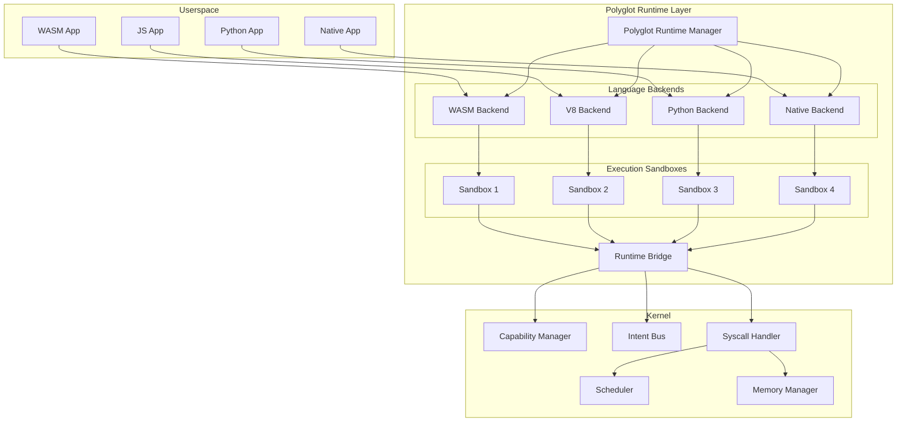

# Polyglot Kernel Design Document

## Overview

The Polyglot Kernel extends Polymera OS with a unified runtime abstraction layer that enables execution of applications written in multiple programming languages. The design builds upon the existing WASM-based skills runtime and kernel infrastructure to provide a secure, extensible, and performant multi-language execution environment.

The architecture follows a plugin-based model where language-specific backends implement a common interface, allowing new languages to be added without kernel modifications. All runtimes integrate with the existing capability-based security model, ensuring consistent security guarantees regardless of implementation language.

## Architecture



## Components and Interfaces

### 1. Polyglot Runtime Manager

The central coordinator for all language runtimes.

```rust
/// Polyglot Runtime Manager - coordinates language backends
pub struct PolyglotRuntimeManager {
    /// Registered language backends
    backends: HashMap<LanguageType, Arc<dyn LanguageBackend>>,
    /// Active execution sandboxes
    sandboxes: HashMap<SandboxId, ExecutionSandbox>,
    /// Runtime configuration
    config: RuntimeConfig,
    /// Metrics collector
    metrics: Arc<RuntimeMetrics>,
}

impl PolyglotRuntimeManager {
    /// Register a new language backend
    pub fn register_backend(&mut self, backend: Arc<dyn LanguageBackend>) -> Result<(), RuntimeError>;
    
    /// Create a new execution sandbox for an application
    pub fn create_sandbox(&mut self, manifest: &AppManifest) -> Result<SandboxId, RuntimeError>;
    
    /// Execute an application in its sandbox
    pub fn execute(&self, sandbox_id: SandboxId, entry_point: &str) -> Result<ExecutionResult, RuntimeError>;
    
    /// Terminate a sandbox and cleanup resources
    pub fn terminate_sandbox(&mut self, sandbox_id: SandboxId) -> Result<ResourceUsage, RuntimeError>;
    
    /// Get runtime statistics
    pub fn get_stats(&self) -> RuntimeStats;
}
```

### 2. Language Backend Interface

The trait that all language runtimes must implement.

```rust
/// Language backend trait - implemented by each language runtime
pub trait LanguageBackend: Send + Sync {
    /// Get the language type this backend supports
    fn language_type(&self) -> LanguageType;
    
    /// Validate that the backend implements all required features
    fn validate(&self) -> Result<(), ValidationError>;
    
    /// Load application code into the runtime
    fn load(&self, code: &[u8], manifest: &AppManifest) -> Result<LoadedModule, RuntimeError>;
    
    /// Execute a function in the loaded module
    fn execute(&self, module: &LoadedModule, function: &str, args: &[Value]) -> Result<Value, RuntimeError>;
    
    /// Get memory usage of a loaded module
    fn memory_usage(&self, module: &LoadedModule) -> usize;
    
    /// Cleanup resources for a module
    fn unload(&self, module: LoadedModule) -> Result<(), RuntimeError>;
    
    /// Get backend-specific debug information
    fn debug_info(&self, module: &LoadedModule) -> DebugInfo;
}

/// Supported language types
#[derive(Debug, Clone, Copy, PartialEq, Eq, Hash)]
pub enum LanguageType {
    Wasm,
    JavaScript,
    Python,
    Lua,
    Native,
}
```

### 3. Execution Sandbox

Isolated execution environment with resource limits.

```rust
/// Execution sandbox - isolated environment for application execution
pub struct ExecutionSandbox {
    /// Unique sandbox identifier
    id: SandboxId,
    /// Language backend for this sandbox
    backend: Arc<dyn LanguageBackend>,
    /// Loaded application module
    module: LoadedModule,
    /// Resource limits
    limits: ResourceLimits,
    /// Current resource usage
    usage: ResourceUsage,
    /// Capability tokens held by this sandbox
    capabilities: Vec<CapabilityToken>,
    /// Sandbox state
    state: SandboxState,
    /// Creation timestamp
    created_at: u64,
}

/// Resource limits for a sandbox
#[derive(Debug, Clone)]
pub struct ResourceLimits {
    /// Maximum memory in bytes
    pub max_memory_bytes: usize,
    /// Maximum CPU time in milliseconds
    pub max_cpu_time_ms: u64,
    /// Maximum file descriptors
    pub max_file_descriptors: u32,
    /// Maximum network connections
    pub max_network_connections: u32,
}

/// Current resource usage
#[derive(Debug, Clone, Default)]
pub struct ResourceUsage {
    /// Current memory usage in bytes
    pub memory_bytes: usize,
    /// Cumulative CPU time in milliseconds
    pub cpu_time_ms: u64,
    /// Open file descriptors
    pub file_descriptors: u32,
    /// Active network connections
    pub network_connections: u32,
    /// Syscall count
    pub syscall_count: u64,
}
```

### 4. Runtime Bridge

Translates between language-specific APIs and kernel syscalls.

```rust
/// Runtime bridge - translates between language APIs and kernel syscalls
pub struct RuntimeBridge {
    /// Capability manager reference
    cap_manager: Arc<CapabilityManager>,
    /// Intent bus reference
    intent_bus: Arc<IntentBus>,
    /// Syscall handler reference
    syscall_handler: Arc<SyscallHandler>,
}

impl RuntimeBridge {
    /// Verify capability for an operation
    pub fn verify_capability(&self, token: &CapabilityToken, operation: Operation) -> Result<(), SecurityError>;
    
    /// Send message to intent bus
    pub fn send_message(&self, sandbox_id: SandboxId, message: &Message) -> Result<(), IpcError>;
    
    /// Receive message from intent bus
    pub fn receive_message(&self, sandbox_id: SandboxId, timeout_ms: u64) -> Result<Option<Message>, IpcError>;
    
    /// Execute syscall on behalf of sandbox
    pub fn syscall(&self, sandbox_id: SandboxId, syscall: Syscall) -> Result<SyscallResult, SyscallError>;
    
    /// Serialize value to CBOR for IPC
    pub fn serialize_cbor(&self, value: &Value) -> Result<Vec<u8>, SerializationError>;
    
    /// Deserialize CBOR to value
    pub fn deserialize_cbor(&self, data: &[u8]) -> Result<Value, SerializationError>;
}
```

### 5. Backend Registry

Manages discovery and registration of language backends.

```rust
/// Backend registry - discovers and manages language backends
pub struct BackendRegistry {
    /// Path to runtime plugins directory
    plugins_dir: PathBuf,
    /// Registered backends
    backends: HashMap<LanguageType, BackendInfo>,
}

/// Information about a registered backend
pub struct BackendInfo {
    /// Backend instance
    pub backend: Arc<dyn LanguageBackend>,
    /// Backend version
    pub version: String,
    /// Required interface methods
    pub capabilities: Vec<String>,
    /// Load timestamp
    pub loaded_at: u64,
}

impl BackendRegistry {
    /// Discover backends from plugins directory
    pub fn discover(&mut self) -> Result<Vec<LanguageType>, RegistryError>;
    
    /// Register a backend manually
    pub fn register(&mut self, backend: Arc<dyn LanguageBackend>) -> Result<(), RegistryError>;
    
    /// Get backend for language type
    pub fn get(&self, language: LanguageType) -> Option<Arc<dyn LanguageBackend>>;
    
    /// List all registered backends
    pub fn list(&self) -> Vec<&BackendInfo>;
}
```

## Data Models

### Application Manifest

```rust
/// Application manifest - describes an application's requirements
#[derive(Debug, Clone, Serialize, Deserialize)]
pub struct AppManifest {
    /// Application name
    pub name: String,
    /// Application version
    pub version: String,
    /// Language type
    pub language: LanguageType,
    /// Entry point function
    pub entry_point: String,
    /// Required capabilities
    pub capabilities: Vec<CapabilityRequest>,
    /// Resource requirements
    pub resources: ResourceRequirements,
    /// Dependencies
    pub dependencies: Vec<Dependency>,
}

/// Capability request in manifest
#[derive(Debug, Clone, Serialize, Deserialize)]
pub struct CapabilityRequest {
    /// Capability type
    pub capability_type: String,
    /// Resource path (if applicable)
    pub resource: Option<String>,
    /// Required permissions
    pub permissions: Vec<String>,
}

/// Resource requirements
#[derive(Debug, Clone, Serialize, Deserialize)]
pub struct ResourceRequirements {
    /// Minimum memory in bytes
    pub min_memory_bytes: usize,
    /// Maximum memory in bytes
    pub max_memory_bytes: usize,
    /// Expected CPU usage (0.0-1.0)
    pub cpu_fraction: f32,
}
```

### Message Format

```rust
/// IPC message format
#[derive(Debug, Clone, Serialize, Deserialize)]
pub struct Message {
    /// Message ID
    pub id: u64,
    /// Source sandbox ID
    pub source: SandboxId,
    /// Destination (topic or sandbox ID)
    pub destination: Destination,
    /// Message type
    pub message_type: String,
    /// Payload (CBOR-encoded)
    pub payload: Vec<u8>,
    /// Timestamp
    pub timestamp: u64,
}

/// Message destination
#[derive(Debug, Clone, Serialize, Deserialize)]
pub enum Destination {
    /// Direct to sandbox
    Sandbox(SandboxId),
    /// Publish to topic
    Topic(String),
    /// Broadcast to all
    Broadcast,
}
```

### Debug Information

```rust
/// Debug information for a running application
#[derive(Debug, Clone)]
pub struct DebugInfo {
    /// Stack frames
    pub stack_frames: Vec<StackFrame>,
    /// Local variables
    pub locals: HashMap<String, Value>,
    /// Global variables
    pub globals: HashMap<String, Value>,
    /// Memory regions
    pub memory_regions: Vec<MemoryRegion>,
}

/// Stack frame information
#[derive(Debug, Clone)]
pub struct StackFrame {
    /// Function name
    pub function: String,
    /// Source file (if available)
    pub file: Option<String>,
    /// Line number (if available)
    pub line: Option<u32>,
    /// Instruction pointer
    pub ip: u64,
}

/// Memory region information
#[derive(Debug, Clone)]
pub struct MemoryRegion {
    /// Start address
    pub start: u64,
    /// Size in bytes
    pub size: usize,
    /// Permissions (read/write/execute)
    pub permissions: u8,
    /// Region name
    pub name: String,
}
```


## Correctness Properties

*A property is a characteristic or behavior that should hold true across all valid executions of a system-essentially, a formal statement about what the system should do. Properties serve as the bridge between human-readable specifications and machine-verifiable correctness guarantees.*

Based on the acceptance criteria analysis, the following correctness properties must be verified:

### Property 1: Language Detection Consistency
*For any* application manifest with a valid language type, the Polyglot_Runtime shall always select the same Language_Backend for that language type.
**Validates: Requirements 1.1**

### Property 2: Sandbox Initialization Invariant
*For any* Language_Backend load operation, the resulting Execution_Sandbox shall have resource limits that match the configured defaults or the manifest-specified limits.
**Validates: Requirements 1.2**

### Property 3: Syscall Translation Validity
*For any* kernel service request from an application, the Runtime_Bridge shall produce a syscall that is valid according to the syscall schema.
**Validates: Requirements 1.3**

### Property 4: Unsupported Language Error Completeness
*For any* language type not registered with the Polyglot_Runtime, the error response shall contain the exact language identifier that was requested.
**Validates: Requirements 1.4**

### Property 5: Memory Limit Enforcement
*For any* Execution_Sandbox with a configured memory limit, all memory allocation attempts that would exceed the limit shall be rejected.
**Validates: Requirements 2.1**

### Property 6: Configuration Isolation
*For any* runtime configuration change, existing Execution_Sandbox instances shall retain their original configuration while new instances shall use the updated configuration.
**Validates: Requirements 2.3**

### Property 7: File Descriptor Limit Enforcement
*For any* Execution_Sandbox with a configured file descriptor limit, attempts to open file descriptors beyond the limit shall fail.
**Validates: Requirements 2.4**

### Property 8: Capability Verification Consistency
*For any* privileged operation and Capability_Token pair, the Runtime_Bridge shall return the same verification result for identical inputs.
**Validates: Requirements 3.1**

### Property 9: Token Revocation Propagation
*For any* revoked Capability_Token, all subsequent capability checks using that token shall fail across all Language_Backends.
**Validates: Requirements 3.2**

### Property 10: Capability Denial Logging
*For any* resource access attempt without proper capabilities, the Execution_Sandbox shall deny the request and create a log entry containing the sandbox ID and requested resource.
**Validates: Requirements 3.3**

### Property 11: Message Serialization Round-Trip
*For any* valid Message, serializing to CBOR and deserializing back shall produce an equivalent Message with identical payload bytes.
**Validates: Requirements 3.4, 4.1, 4.2, 4.3**

### Property 12: Deserialization Error Completeness
*For any* malformed CBOR data, the deserialization error shall contain a description of the failure reason.
**Validates: Requirements 4.4**

### Property 13: Backend Validation Completeness
*For any* Language_Backend that fails validation, the error shall list all missing required interface methods.
**Validates: Requirements 5.1, 5.2**

### Property 14: Fault Isolation
*For any* Language_Backend crash, all other registered backends shall remain operational and their sandboxes shall continue executing.
**Validates: Requirements 5.4**

### Property 15: Crash Dump Completeness
*For any* application crash, the captured crash dump shall contain at least one stack frame and the register state.
**Validates: Requirements 6.2**

### Property 16: Syscall Tracing Completeness
*For any* sandbox with tracing enabled, every syscall invocation shall produce a corresponding trace event.
**Validates: Requirements 6.3**

### Property 17: Memory Inspection Read-Only
*For any* memory inspection request, the Execution_Sandbox shall allow reads but reject any write attempts.
**Validates: Requirements 6.4**

### Property 18: Metrics Completeness
*For any* metrics query, the response shall contain memory_bytes, cpu_time_ms, and syscall_count for each active Language_Backend.
**Validates: Requirements 7.1**

### Property 19: Termination Statistics Recording
*For any* Execution_Sandbox termination, the final resource usage statistics shall be recorded before the sandbox is destroyed.
**Validates: Requirements 7.2**

### Property 20: Threshold Warning Emission
*For any* resource usage that exceeds a configured threshold, a warning event shall be emitted to the system log.
**Validates: Requirements 7.3**

### Property 21: Timestamp Precision
*For any* resource usage tracking, timestamps shall have at least millisecond precision (difference between consecutive timestamps shall be measurable in milliseconds).
**Validates: Requirements 7.4**

## Error Handling

### Error Types

```rust
/// Polyglot runtime errors
#[derive(Debug, Clone)]
pub enum RuntimeError {
    /// Language backend not found
    BackendNotFound(LanguageType),
    /// Backend validation failed
    BackendValidationFailed { 
        language: LanguageType, 
        missing_methods: Vec<String> 
    },
    /// Sandbox creation failed
    SandboxCreationFailed(String),
    /// Resource limit exceeded
    ResourceLimitExceeded { 
        resource: ResourceType, 
        limit: u64, 
        requested: u64 
    },
    /// Capability verification failed
    CapabilityDenied { 
        operation: String, 
        reason: String 
    },
    /// Serialization error
    SerializationError(String),
    /// Deserialization error
    DeserializationError { 
        offset: usize, 
        reason: String 
    },
    /// Backend crashed
    BackendCrashed { 
        language: LanguageType, 
        reason: String 
    },
    /// Syscall failed
    SyscallFailed { 
        syscall: String, 
        error_code: i32 
    },
}

/// Resource types for limit errors
#[derive(Debug, Clone, Copy)]
pub enum ResourceType {
    Memory,
    CpuTime,
    FileDescriptors,
    NetworkConnections,
}
```

### Error Recovery Strategies

1. **Backend Crash Recovery**: When a backend crashes, the runtime manager:
   - Terminates all sandboxes using that backend
   - Attempts to reload the backend
   - Notifies affected applications via the intent bus

2. **Resource Exhaustion**: When resources are exhausted:
   - Deny the allocation request
   - Log the denial with sandbox ID and resource type
   - Optionally trigger garbage collection in the backend

3. **Capability Revocation**: When a capability is revoked:
   - Immediately invalidate cached permissions
   - Fail any in-flight operations using the revoked capability
   - Log the revocation event

## Testing Strategy

### Dual Testing Approach

The Polyglot Kernel will use both unit tests and property-based tests to ensure correctness:

- **Unit tests** verify specific examples, edge cases, and error conditions
- **Property-based tests** verify universal properties that should hold across all inputs

### Property-Based Testing Framework

The implementation will use the `proptest` crate for Rust property-based testing. Each property test will:
- Run a minimum of 100 iterations
- Be tagged with a comment referencing the correctness property from this design document
- Use the format: `**Feature: polyglot-kernel, Property {number}: {property_text}**`

### Test Categories

1. **Language Backend Tests**
   - Backend registration and validation
   - Module loading and execution
   - Resource tracking accuracy

2. **Sandbox Tests**
   - Resource limit enforcement
   - Capability verification
   - Isolation between sandboxes

3. **Runtime Bridge Tests**
   - Syscall translation correctness
   - Message serialization round-trip
   - Capability token handling

4. **Integration Tests**
   - Cross-language communication
   - Backend crash recovery
   - Configuration hot-reload

### Example Property Test Structure

```rust
use proptest::prelude::*;

proptest! {
    /// **Feature: polyglot-kernel, Property 11: Message Serialization Round-Trip**
    #[test]
    fn message_round_trip(message in any_valid_message()) {
        let bridge = RuntimeBridge::new();
        let serialized = bridge.serialize_cbor(&message)?;
        let deserialized = bridge.deserialize_cbor(&serialized)?;
        prop_assert_eq!(message.payload, deserialized.payload);
        prop_assert_eq!(message.id, deserialized.id);
    }
    
    /// **Feature: polyglot-kernel, Property 5: Memory Limit Enforcement**
    #[test]
    fn memory_limit_enforced(
        limit in 1024usize..1024*1024,
        allocation in 1usize..2*1024*1024
    ) {
        let sandbox = create_sandbox_with_memory_limit(limit);
        let result = sandbox.allocate(allocation);
        if allocation > limit {
            prop_assert!(result.is_err());
        } else {
            prop_assert!(result.is_ok());
        }
    }
}
```

### Test Data Generators

```rust
/// Generate arbitrary valid messages
fn any_valid_message() -> impl Strategy<Value = Message> {
    (
        any::<u64>(),                    // id
        any_sandbox_id(),                // source
        any_destination(),               // destination
        "[a-z]{1,32}",                   // message_type
        prop::collection::vec(any::<u8>(), 0..1024), // payload
        any::<u64>(),                    // timestamp
    ).prop_map(|(id, source, destination, message_type, payload, timestamp)| {
        Message { id, source, destination, message_type, payload, timestamp }
    })
}

/// Generate arbitrary capability tokens
fn any_capability_token() -> impl Strategy<Value = CapabilityToken> {
    // Implementation details...
}
```
