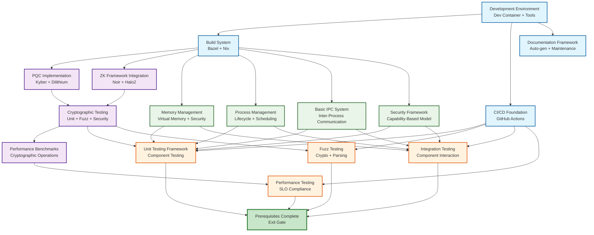

# Polymera OS Design Document

## 1. System Architecture

### 1.1 High-Level Architecture
```
┌─────────────────────────────────────────────────────────────────┐
│                        User Applications                        │
│  ┌─────────────┐ ┌─────────────┐ ┌─────────────┐ ┌──────────┐ │
│  │   WASI App  │ │ CPython App │ │   JVM App   │ │ CLR App  │ │
│  └─────────────┘ └─────────────┘ └─────────────┘ └──────────┘ │
├─────────────────────────────────────────────────────────────────┤
│                        Runtime Layer                           │
│  ┌─────────────┐ ┌─────────────┐ ┌─────────────┐ ┌──────────┐ │
│  │  WASI Host  │ │Python Bridge│ │ JVM Bridge  │ │CLR Bridge│ │
│  └─────────────┘ └─────────────┘ └─────────────┘ └──────────┘ │
├─────────────────────────────────────────────────────────────────┤
│                        Service Layer                           │
│  ┌─────────┐ ┌─────────┐ ┌─────────┐ ┌─────────┐ ┌─────────┐ │
│  │DeviceKit│ │PolyAudio│ │ PolyNet │ │KeyVault │ │   NGFS  │ │
│  └─────────┘ └─────────┘ └─────────┘ └─────────┘ └─────────┘ │
│  ┌─────────┐ ┌─────────┐ ┌─────────┐ ┌─────────┐             │
│  │PolyImage│ │Attestatn│ │ Wallet  │ │PolySync │             │
│  └─────────┘ └─────────┘ └─────────┘ └─────────┘             │
├─────────────────────────────────────────────────────────────────┤
│                        Kernel Layer                            │
│  ┌─────────────────┐ ┌─────────────────┐ ┌─────────────────┐ │
│  │   PolymeraCore  │ │     PolyBus     │ │   PolyMemory    │ │
│  │   (Microkernel) │ │   (IPC Bus)     │ │ (Memory Mgmt)   │ │
│  └─────────────────┘ └─────────────────┘ └─────────────────┘ │
├─────────────────────────────────────────────────────────────────┤
│                    Hardware Abstraction                        │
│  ┌─────────┐ ┌─────────┐ ┌─────────┐ ┌─────────┐ ┌─────────┐ │
│  │Secure   │ │   TPM   │ │ Quantum │ │  Crypto │ │  Memory │ │
│  │ Boot    │ │         │ │   RNG   │ │ Engine  │ │  Mgmt   │ │
│  └─────────┘ └─────────┘ └─────────┘ └─────────┘ └─────────┘ │
└─────────────────────────────────────────────────────────────────┘
```

### 1.2 Component Relationships
- **Vertical Communication**: Applications → Runtime → Services → Kernel → Hardware
- **Horizontal Communication**: Services communicate via PolyBus IPC
- **Security Boundaries**: Each layer has defined security domains and capabilities

## 2. Core Components

### 2.1 PolymeraCore (Microkernel)
**Purpose**: Minimal trusted computing base providing core system services

**Key Responsibilities**:
- Process and thread management
- Memory management and protection
- Inter-process communication (IPC)
- Device driver framework
- Security policy enforcement

**Architecture**:
```rust
pub struct PolymeraCore {
    process_manager: ProcessManager,
    memory_manager: MemoryManager,
    ipc_manager: IPCManager,
    device_manager: DeviceManager,
    security_manager: SecurityManager,
}

impl PolymeraCore {
    pub fn init() -> Result<Self, KernelError> {
        // Initialize core subsystems
    }

    pub fn create_process(&mut self, config: ProcessConfig) -> Result<ProcessId, KernelError> {
        // Create new process with security context
    }

    pub fn allocate_memory(&mut self, request: MemoryRequest) -> Result<MemoryRegion, KernelError> {
        // Allocate memory with security constraints
    }
}
```

**Security Model**:
- Capability-based access control
- Memory isolation between processes
- Cryptographic verification of all operations
- Side-channel resistance

### 2.2 PolyBus (IPC System)
**Purpose**: High-performance, secure inter-process communication

**Design Principles**:
- Zero-copy message passing
- Cryptographic message integrity
- Deterministic latency guarantees
- Support for both synchronous and asynchronous communication

**API Design**:
```protobuf
syntax = "proto3";

package polymera.ipc;

message IPCMessage {
  uint64 message_id = 1;
  bytes payload = 2;
  bytes signature = 3;
  uint64 timestamp = 4;
  repeated string capabilities = 5;
}

service PolyBusService {
  rpc SendMessage(IPCMessage) returns (IPCResponse);
  rpc ReceiveMessage(ReceiveRequest) returns (IPCMessage);
  rpc Subscribe(SubscriptionRequest) returns (stream IPCMessage);
}
```

**Performance Characteristics**:
- Latency: <1ms for local communication
- Throughput: >1GB/s for bulk transfers
- Deterministic: ±5% timing variance

### 2.3 PolyMemory (Memory Management)
**Purpose**: Secure, deterministic memory allocation and management

**Features**:
- Cryptographic memory protection
- Deterministic allocation patterns
- Memory isolation and sandboxing
- Secure memory deallocation

**Memory Layout**:
```
┌─────────────────────────────────────────────────────────────┐
│                    Virtual Memory Space                     │
├─────────────────────────────────────────────────────────────┤
│  Kernel Space (0x80000000 - 0xFFFFFFFF)                   │
│  ┌─────────────┐ ┌─────────────┐ ┌─────────────┐         │
│  │   Kernel    │ │   Drivers   │ │   Security  │         │
│  │   Code      │ │             │ │   Modules   │         │
│  └─────────────┘ └─────────────┘ └─────────────┘         │
├─────────────────────────────────────────────────────────────┤
│  User Space (0x00000000 - 0x7FFFFFFF)                     │
│  ┌─────────┐ ┌─────────┐ ┌─────────┐ ┌─────────┐         │
│  │Process 1│ │Process 2│ │Process 3│ │Process 4│         │
│  │Memory   │ │Memory   │ │Memory   │ │Memory   │         │
│  └─────────┘ └─────────┘ └─────────┘ └─────────┘         │
└─────────────────────────────────────────────────────────────┘
```

## 3. Service Layer Components

### 3.1 DeviceKit
**Purpose**: Unified device management and abstraction

**Capabilities**:
- Hardware abstraction layer
- Device driver framework
- Power management
- Security policy enforcement

**Device Types**:
- Storage devices (NVMe, SATA, USB)
- Network interfaces (Ethernet, WiFi, Cellular)
- Audio devices (speakers, microphones, codecs)
- Input devices (keyboard, mouse, touch)

### 3.2 PolyAudio
**Purpose**: Low-latency, secure audio processing

**Features**:
- Real-time audio processing
- Cryptographic audio integrity
- Privacy-preserving audio analysis
- Multi-channel audio support

**Performance Targets**:
- Latency: <5ms end-to-end
- Sample Rate: Up to 192kHz
- Bit Depth: 16/24/32-bit support

### 3.3 PolyNet
**Purpose**: Secure networking with quantum-resistant cryptography

**Protocols**:
- TCP/IP with PQC encryption
- QUIC for low-latency communication
- WireGuard for VPN functionality
- DNS over HTTPS (DoH)

**Security Features**:
- Post-quantum key exchange (CRYSTALS-Kyber)
- Quantum-resistant signatures (CRYSTALS-Dilithium)
- Zero-knowledge network proofs
- Traffic analysis resistance

### 3.4 KeyVault
**Purpose**: Secure key and credential management

**Capabilities**:
- Hardware security module (HSM) integration
- PQC key generation and storage
- Zero-knowledge credential proofs
- Secure key backup and recovery

**Key Types**:
- CRYSTALS-Kyber keys (KEM)
- CRYSTALS-Dilithium keys (signatures)
- AES-256 keys (symmetric)
- Elliptic curve keys (legacy compatibility)

### 3.5 NGFS (Next-Generation File System)
**Purpose**: Secure, verifiable file storage

**Features**:
- Cryptographic file integrity
- Zero-knowledge file access proofs
- Deterministic performance
- Secure file sharing

**File Operations**:
- Read/Write with integrity verification
- Atomic operations
- Secure deletion
- Version control with cryptographic hashes

### 3.6 PolyImage
**Purpose**: Secure image and video processing

**Capabilities**:
- Hardware-accelerated processing
- Privacy-preserving image analysis
- Cryptographic watermarking
- Secure image sharing

**Supported Formats**:
- Images: JPEG, PNG, WebP, AVIF
- Video: H.264, H.265, AV1
- Raw formats: RAW, DNG

### 3.7 Attestation Service
**Purpose**: Cryptographic system verification

**Attestation Types**:
- Boot integrity verification
- Runtime integrity checks
- Service authenticity verification
- Hardware security verification

**Verification Process**:
1. Collect system state measurements
2. Generate cryptographic attestation report
3. Verify against known good values
4. Issue attestation certificate

### 3.8 Wallet Service
**Purpose**: Secure digital asset management

**Features**:
- Multi-signature support
- Hardware wallet integration
- Zero-knowledge transaction proofs
- Secure backup and recovery

**Asset Types**:
- Cryptocurrencies
- Digital certificates
- Identity credentials
- Access tokens

## 4. Runtime Layer

### 4.1 WASI Host
**Purpose**: WebAssembly System Interface implementation

**Capabilities**:
- WASI 0.2+ compliance
- Secure sandboxing
- Performance optimization
- Native system call translation

**Security Model**:
- Capability-based access control
- Resource limits and quotas
- Side-channel resistance
- Memory isolation

### 4.2 Language Bridges

#### CPython Bridge
**Purpose**: Python runtime integration

**Features**:
- Python 3.11+ support
- Native extension support
- Performance optimization
- Security sandboxing

#### JVM Bridge
**Purpose**: Java Virtual Machine integration

**Features**:
- OpenJDK 17+ support
- Native method integration
- Memory management optimization
- Security policy enforcement

#### CLR Bridge
**Purpose**: .NET Common Language Runtime integration

**Features**:
- .NET 8+ support
- Native interop
- Performance optimization
- Security isolation

## 5. User Interface Layer

### 5.1 Spectra Compositor
**Purpose**: Modern, secure display compositor

**Features**:
- Wayland protocol support
- Hardware acceleration
- Security isolation
- Performance optimization

**Compositor Architecture**:
```
┌─────────────────────────────────────────────────────────────┐
│                    Spectra Compositor                       │
├─────────────────────────────────────────────────────────────┤
│  ┌─────────────┐ ┌─────────────┐ ┌─────────────┐         │
│  │   Wayland   │ │   Vulkan    │ │   Security  │         │
│  │   Protocol  │ │   Backend   │ │   Manager   │         │
│  └─────────────┘ └─────────────┘ └─────────────┘         │
├─────────────────────────────────────────────────────────────┤
│  ┌─────────────┐ ┌─────────────┐ ┌─────────────┐         │
│  │   Display   │ │   Input     │ │   Window    │         │
│  │   Manager   │ │   Handler   │ │   Manager   │         │
│  └─────────────┘ └─────────────┘ └─────────────┘         │
└─────────────────────────────────────────────────────────────┘
```

### 5.2 OmniPrompt+
**Purpose**: Advanced command-line interface

**Features**:
- AI-powered command suggestions
- Natural language processing
- Context-aware completions
- Security policy integration

## 6. Tooling & Infrastructure

### 6.1 Build System (Bazel + Nix)
**Purpose**: Reproducible, secure builds

**Features**:
- Deterministic builds
- Cryptographic verification
- Dependency management
- Multi-language support

**Build Pipeline**:
1. Source code verification
2. Dependency resolution
3. Compilation and linking
4. Cryptographic signing
5. Artifact verification

### 6.2 CI/CD Pipeline
**Purpose**: Automated testing and deployment

**Components**:
- GitHub Actions workflows
- Automated testing
- Security scanning
- Performance benchmarking
- Deployment automation

### 6.3 Security Infrastructure
**Purpose**: Comprehensive security management

**Components**:
- Sigstore for artifact signing
- SBOM generation and verification
- Vulnerability scanning
- Security policy enforcement

## 7. API Design Principles

### 7.1 Interface Design
- **Consistency**: Uniform API patterns across all services
- **Security**: All APIs require appropriate capabilities
- **Performance**: APIs designed for minimal overhead
- **Compatibility**: Backward compatibility when possible

### 7.2 Data Formats
- **Protocol Buffers**: For high-performance serialization
- **JSON Schema**: For human-readable configuration
- **Binary Formats**: For performance-critical operations
- **Cryptographic Signatures**: For all external communications

### 7.3 Error Handling
- **Deterministic**: Consistent error responses
- **Secure**: No information leakage in error messages
- **Actionable**: Clear guidance for error resolution
- **Logged**: Comprehensive error logging for debugging

## 8. Security Architecture

### 8.1 Threat Model
**Adversaries**:
- Malicious applications
- Compromised services
- Network attackers
- Physical attackers
- Quantum attackers

**Attack Vectors**:
- Memory corruption
- Side-channel attacks
- Network interception
- Physical tampering
- Quantum cryptanalysis

### 8.2 Defense Mechanisms
- **Memory Safety**: Rust-based implementation
- **Cryptographic Protection**: PQC + ZK integration
- **Isolation**: Process and service isolation
- **Verification**: Cryptographic attestation
- **Monitoring**: Continuous security monitoring

### 8.3 Security Policies
- **Principle of Least Privilege**: Minimal required access
- **Defense in Depth**: Multiple security layers
- **Fail Secure**: Secure default configurations
- **Continuous Verification**: Ongoing security validation

## 9. Performance Architecture

### 9.1 Performance Budgets
- **Kernel Operations**: <100μs
- **Service Calls**: <1ms
- **Application Startup**: <10ms
- **Memory Operations**: <50μs
- **Network Operations**: <5ms

### 9.2 Optimization Strategies
- **Zero-Copy**: Minimize data copying
- **Batching**: Group operations for efficiency
- **Caching**: Intelligent caching strategies
- **Parallelization**: Concurrent execution where possible
- **Hardware Acceleration**: GPU and specialized hardware

### 9.3 Monitoring & Metrics
- **Real-time Monitoring**: Continuous performance tracking
- **Performance Counters**: Detailed operation metrics
- **Alerting**: Performance threshold alerts
- **Trend Analysis**: Long-term performance trends

## 10. Deployment Architecture

### 10.1 Container Strategy
- **Service Containers**: Individual service isolation
- **Security Containers**: Enhanced security isolation
- **Performance Containers**: Optimized for performance
- **Development Containers**: Development environment isolation

### 10.2 Orchestration
- **Kubernetes**: Container orchestration
- **Service Mesh**: Inter-service communication
- **Load Balancing**: Traffic distribution
- **Auto-scaling**: Dynamic resource allocation

### 10.3 Infrastructure as Code
- **Terraform**: Infrastructure provisioning
- **Ansible**: Configuration management
- **Helm Charts**: Kubernetes application packaging
- **GitOps**: Infrastructure version control

---

*This design document provides the technical foundation for Polymera OS implementation. All components must adhere to the specified interfaces and security requirements.*

## 11. Prerequisites Phase Dependency Graph

### 11.1 Module Dependencies Overview
The Prerequisites Phase establishes the foundational dependencies required before the main Polymera OS system can be implemented. The following Mermaid diagram shows the dependency relationships between prerequisite modules.

### 11.2 Prerequisites Dependency Graph



### 11.3 Dependency Levels and Order

#### 11.3.1 Level 0: Foundation Infrastructure
**Dependencies**: None (External tools and configuration)
**Components**:
- **Development Environment**: Dev container with all required tools
- **Build System**: Bazel + Nix integration
- **CI/CD Foundation**: GitHub Actions workflows
- **Documentation Framework**: Automated documentation generation

**Implementation Order**: Parallel development possible
**Timeline**: 2-3 weeks

#### 11.3.2 Level 1: Cryptographic Primitives
**Dependencies**: Build System (Level 0)
**Components**:
- **PQC Implementation**: CRYSTALS-Kyber and CRYSTALS-Dilithium
- **ZK Framework Integration**: Noir and Halo2
- **Cryptographic Testing**: Comprehensive test suites
- **Performance Benchmarks**: Baseline measurements

**Implementation Order**: Sequential (PQC → ZK → Testing → Benchmarks)
**Timeline**: 4-6 weeks

#### 11.3.3 Level 2: Kernel Foundation
**Dependencies**: Build System (Level 0)
**Components**:
- **Memory Management**: Virtual memory with security constraints
- **Process Management**: Process lifecycle and scheduling
- **Basic IPC System**: Inter-process communication
- **Security Framework**: Capability-based security model

**Implementation Order**: Parallel development possible
**Timeline**: 3-4 weeks

#### 11.3.4 Level 3: Testing Infrastructure
**Dependencies**: CI/CD Foundation (Level 0), Cryptographic Testing (Level 1)
**Components**:
- **Unit Testing Framework**: Component testing
- **Fuzz Testing**: Automated fuzz testing
- **Integration Testing**: Component interaction testing
- **Performance Testing**: SLO compliance testing

**Implementation Order**: Sequential (Unit → Fuzz → Integration → Performance)
**Timeline**: 2-3 weeks

### 11.4 Critical Path Analysis

#### 11.4.1 Critical Path
The critical path for Prerequisites Phase completion is:
1. **Foundation Infrastructure** (2-3 weeks)
2. **PQC Implementation** (2-3 weeks)
3. **Cryptographic Testing** (1-2 weeks)
4. **Testing Infrastructure** (2-3 weeks)

**Total Critical Path**: 7-11 weeks

#### 11.4.2 Parallel Development Opportunities
- **Kernel Foundation** can be developed in parallel with **Cryptographic Primitives**
- **Documentation Framework** can be developed in parallel with all other components
- **CI/CD Foundation** can be developed in parallel with **Build System**

#### 11.4.3 Risk Mitigation
- **Cryptographic Implementation**: Use reference implementations and established libraries
- **Build System Integration**: Start with minimal configuration and expand incrementally
- **Testing Framework**: Begin with basic testing and enhance progressively

### 11.5 Resource Requirements

#### 11.5.1 Development Team
- **1 Senior Rust Developer**: Cryptographic primitives and kernel foundation
- **1 Senior Systems Developer**: Build system and testing infrastructure
- **1 DevOps Engineer**: CI/CD and development environment
- **1 Security Engineer**: Cryptographic validation and security testing

#### 11.5.2 Infrastructure Requirements
- **Development Environment**: High-performance workstations with 32GB+ RAM
- **CI/CD Pipeline**: GitHub Actions with self-hosted runners for performance testing
- **Testing Infrastructure**: Dedicated testing environment for fuzz and performance testing
- **Documentation**: Automated documentation generation and hosting

### 11.6 Success Validation

#### 11.6.1 Technical Validation
- **Build Success**: All components build successfully on multiple platforms
- **Test Coverage**: >90% code coverage across all components
- **Performance Compliance**: All SLOs met for basic operations
- **Security Validation**: Zero critical vulnerabilities

#### 11.6.2 Process Validation
- **Development Velocity**: Consistent progress toward milestones
- **Code Quality**: High-quality, well-tested code
- **Documentation**: Comprehensive and up-to-date documentation
- **Community Engagement**: Active contributor participation

---

*The Prerequisites Phase establishes the foundation for all subsequent Polymera OS development. All dependencies must be satisfied before proceeding to the main system implementation.*

## 12. Repository Hygiene & Governance Design

### 12.1 Governance File Structure
The repository governance system requires the following file structure to ensure proper OSS posture, contribution model, and code quality:

```
polymera-os/
├── LICENSE                           # Apache 2.0 license
├── CODE_OF_CONDUCT.md               # Community behavior standards
├── CONTRIBUTING.md                  # Contribution guidelines
├── SECURITY.md                      # Security policy and reporting
├── .github/
│   ├── ISSUE_TEMPLATE/             # Issue templates
│   │   ├── bug_report.yml          # Bug report template
│   │   ├── feature_request.yml     # Feature request template
│   │   ├── security_report.yml     # Security issue template
│   │   └── documentation.yml       # Documentation issue template
│   ├── PULL_REQUEST_TEMPLATE.md    # PR template
│   ├── CODEOWNERS                  # Code ownership rules
│   └── workflows/
│       ├── governance.yml          # Governance CI checks
│       └── lint.yml                # Code quality and linting CI
├── .editorconfig                    # Editor configuration
├── .commitlintrc.js                # Commit message validation
├── .conventional-changelog/        # Conventional changelog config
├── .pre-commit-config.yaml         # Pre-commit hooks configuration
├── rustfmt.toml                    # Rust formatting configuration
├── pyproject.toml                  # Python formatting and linting config
├── .eslintrc.js                    # TypeScript/JavaScript linting config
├── .prettierrc                     # Code formatting configuration
└── docs/
    └── GOVERNANCE.md               # Detailed governance documentation
```

## 13. Formatting & Lint Gates Design

### 13.1 Pre-commit Hook Architecture
The formatting and lint gates use a multi-stage pre-commit hook system:

1. **General File Checks**: Trailing whitespace, file endings, YAML/JSON syntax
2. **Language-Specific Formatting**: rustfmt, black, prettier, shfmt
3. **Language-Specific Linting**: clippy, ruff, eslint, shellcheck
4. **Documentation Linting**: markdownlint, YAML validation

### 13.2 CI Lint Job Architecture
The dedicated lint CI job runs in parallel with other CI jobs:

1. **Rust Linting**: rustfmt + clippy with strict rules
2. **Python Linting**: black + ruff with strict rules
3. **TypeScript Linting**: prettier + eslint with strict rules
4. **Shell Linting**: shfmt + shellcheck
5. **Documentation Linting**: markdownlint + YAML/JSON validation
6. **Pre-commit Validation**: Ensures hooks are operational
7. **Bazel Integration**: Build system lint target verification

### 13.3 Bazel Integration
Lint targets are integrated into the Bazel build system:

- **lint-rust**: Rust formatting and linting
- **lint-python**: Python formatting and linting
- **lint-typescript**: TypeScript formatting and linting
- **lint-shell**: Shell script formatting and linting
- **lint-all**: Combined lint target for all languages

### 13.4 Enforcement Strategy
- **Pre-commit**: Blocks commits with formatting/linting errors
- **CI Pipeline**: Lint job must pass before merge
- **Build System**: Bazel lint targets integrated into build process
- **Language Compliance**: Enforces Polymera OS language requirements

### 12.2 Required Governance Files

#### 12.2.1 LICENSE File
**Purpose**: Define project licensing and intellectual property terms
**Content**: Apache License 2.0 with Polymera OS copyright notice
**Requirements**: Must be present and valid for all builds
**CI Gate**: Build fails if LICENSE file is missing or invalid

#### 12.2.2 CODE_OF_CONDUCT.md
**Purpose**: Define community behavior standards and expectations
**Content**: Contributor Covenant Code of Conduct 2.0
**Requirements**: All contributors must follow these standards
**CI Gate**: No specific CI gate, but enforced by community

#### 12.2.3 CONTRIBUTING.md
**Purpose**: Guide contributors through the contribution process
**Content**: Detailed contribution workflow and standards
**Requirements**: Must be comprehensive and up-to-date
**CI Gate**: Documentation validation in CI pipeline

#### 12.2.4 SECURITY.md
**Purpose**: Define security policy and reporting procedures
**Content**: Security contact, disclosure timeline, and process
**Requirements**: Must include security@polymera-os.org contact
**CI Gate**: Security policy validation in CI pipeline

### 12.3 GitHub Templates & Configuration

#### 12.3.1 Issue Templates
**Purpose**: Standardize issue reporting and tracking
**Templates Required**:
- **Bug Report**: Standardized bug reporting format
- **Feature Request**: Feature request template with requirements
- **Security Report**: Security issue reporting template
- **Documentation**: Documentation improvement requests

**CI Gate**: All issues must use appropriate template

#### 12.3.2 Pull Request Template
**Purpose**: Ensure PRs contain required information
**Content**:
- Description of changes
- Related issue numbers
- Testing performed
- Documentation updates
- Breaking changes
- Checklist for requirements

**CI Gate**: PR validation checks template compliance

#### 12.3.3 CODEOWNERS
**Purpose**: Define code ownership and review requirements
**Content**: File path patterns with owner teams
**Requirements**: All code paths must have defined owners
**CI Gate**: Build fails if CODEOWNERS is incomplete

### 12.4 Editor & Development Configuration

#### 12.4.1 .editorconfig
**Purpose**: Ensure consistent code formatting across editors
**Content**: Language-specific formatting rules
**Languages**: Rust, C++, TypeScript, Python, Markdown
**CI Gate**: Code formatting validation in CI

#### 12.4.2 .commitlintrc.js
**Purpose**: Validate commit message format
**Configuration**: Conventional commits with Polymera OS scopes
**Rules**: Strict validation of commit format
**CI Gate**: Build fails if commit message format is invalid

#### 12.4.3 .conventional-changelog/
**Purpose**: Generate conventional changelog
**Configuration**: Changelog generation rules
**Output**: Automated changelog for releases
**CI Gate**: Changelog generation in release workflow

### 12.5 CI Gates for Governance

#### 12.5.1 License Header Validation
**Purpose**: Ensure all source files have proper license headers
**Implementation**: Automated check for license header presence
**Scope**: All source code files (Rust, C++, TypeScript, Python)
**CI Gate**: Build fails if any source file lacks license header

#### 12.5.2 Conventional Commit Validation
**Purpose**: Enforce conventional commit message format
**Implementation**: commitlint integration with GitHub Actions
**Rules**: Strict conventional commit format with scope validation
**CI Gate**: Build fails if commit message format is invalid

#### 12.5.3 Code Ownership Validation
**Purpose**: Ensure all code paths have defined owners
**Implementation**: Automated CODEOWNERS validation
**Scope**: All repository paths must have owners
**CI Gate**: Build fails if CODEOWNERS coverage is incomplete

#### 12.5.4 Documentation Validation
**Purpose**: Ensure governance documentation is complete
**Implementation**: Automated documentation validation
**Scope**: All required governance files present and valid
**CI Gate**: Build fails if governance documentation is incomplete

### 12.6 Governance Workflow Integration

#### 12.6.1 Pre-commit Hooks
**Purpose**: Catch governance violations before commit
**Hooks**:
- License header validation
- Conventional commit format check
- Editor configuration validation
- Basic code formatting check

**Integration**: Git hooks with local validation

#### 12.6.2 Pull Request Checks
**Purpose**: Validate governance compliance in PRs
**Checks**:
- License header presence
- Conventional commit format
- CODEOWNERS coverage
- Template compliance
- Documentation updates

**CI Gate**: PR cannot be merged if any check fails

#### 12.6.3 Release Validation
**Purpose**: Ensure governance compliance for releases
**Validation**:
- All governance files present
- License headers in all source files
- Conventional commit history
- Security policy compliance
- Documentation completeness

**CI Gate**: Release workflow fails if validation fails

### 12.7 Governance Monitoring & Reporting

#### 12.7.1 Compliance Dashboard
**Purpose**: Monitor governance compliance metrics
**Metrics**:
- License header coverage percentage
- Conventional commit compliance rate
- CODEOWNERS coverage percentage
- Documentation completeness score
- Security policy compliance

**Reporting**: Automated reports in CI pipeline

#### 12.7.2 Governance Alerts
**Purpose**: Alert maintainers to governance violations
**Triggers**:
- Missing license headers
- Invalid commit messages
- Incomplete CODEOWNERS
- Missing governance files
- Security policy violations

**Delivery**: GitHub notifications and CI failure reports

#### 12.7.3 Compliance Reports
**Purpose**: Generate governance compliance reports
**Frequency**: Weekly automated reports
**Content**: Compliance metrics and violation details
**Audience**: Project maintainers and community

### 12.8 Governance File Templates

#### 12.8.1 License Header Template
```rust
// Copyright 2024 Polymera OS Contributors
//
// Licensed under the Apache License, Version 2.0 (the "License");
// you may not use this file except in compliance with the License.
// You may obtain a copy of the License at
//
//     http://www.apache.org/licenses/LICENSE-2.0
//
// Unless required by applicable law or agreed to in writing, software
// distributed under the License is distributed on an "AS IS" BASIS,
// WITHOUT WARRANTIES OR CONDITIONS OF ANY KIND, either express or implied.
// See the License for the specific language governing permissions and
// limitations under the License.
```

#### 12.8.2 Conventional Commit Template
```
<type>[optional scope]: <description>

[optional body]

[optional footer(s)]

Examples:
feat(kernel): implement basic process management
fix(crypto): resolve memory leak in Kyber implementation
docs(api): add comprehensive API documentation
chore(ci): update GitHub Actions workflow
```

#### 12.8.3 CODEOWNERS Template
```
# Global owners - Core team leads
* @polymera-core-team

# Component-specific ownership
/kernel/ @kernel-team
/services/ @services-team
/runtime/ @runtime-team
/ui/ @ui-team
/tooling/ @tooling-team

# File type ownership
*.rs @rust-team
*.cpp @cpp-team
*.ts @typescript-team
*.py @python-team
*.md @docs-team
```

---

*Repository governance design ensures Polymera OS maintains high standards and community engagement. All governance requirements must be satisfied before code can be merged or released.*
