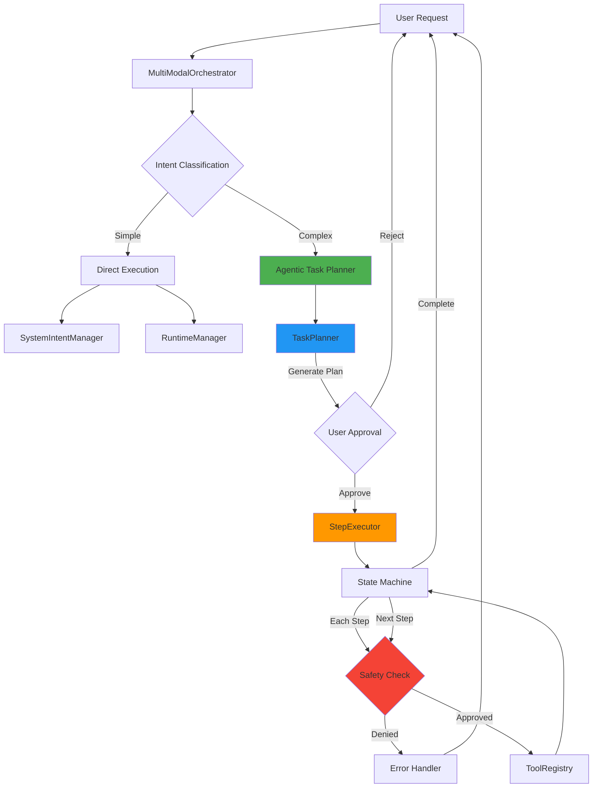
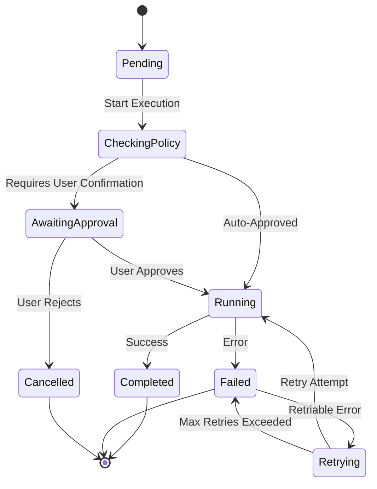

# Agentic Task Planner - System Architecture Design

## Executive Summary

This document defines the architecture for Polymera OS's autonomous Agentic Task Planner, transforming the AI Core from handling one-shot commands to executing multi-step workflows with user oversight and safety guarantees.

## 1. Problem Statement

### Current State
- **Orchestrator** routes user inputs to either system intents or generic LLM queries
- **PromptRouter** classifies intents using keyword matching
- **SystemIntentManager** executes single system actions
- **ToolRegistry** manages individual tool invocations
- **Limitation**: The system can only handle atomic, single-step commands like "Turn on Bluetooth" or "Open Settings"

### Gap Analysis
The OS cannot handle complex, multi-step workflows such as:
- "Organize my files" → requires listing, categorizing, moving multiple files
- "Backup my documents to USB" → requires scanning, compressing, device detection, transfer verification
- "Prepare my laptop for presentation" → requires brightness adjustment, WiFi settings, volume control, do-not-disturb mode

### Required Capabilities
1. **Task Decomposition**: Break complex intents into sequenced sub-tasks
2. **State Management**: Track progress through multi-step workflows
3. **User Approval**: Pause for confirmation before destructive operations
4. **Safety Rails**: Enforce capability-based access control at each step
5. **Failure Recovery**: Handle partial failures gracefully

---

## 2. Architecture Overview



### Component Responsibilities

| Component | Responsibility |
|-----------|---------------|
| **TaskPlanner** | LLM-based plan generation, decomposition logic, structured output parsing |
| **StepExecutor** | State machine implementation, step-by-step execution loop, checkpoint management |
| **PolicyEnforcer** | Capability validation, destructive action detection, user approval flow |
| **Orchestrator** | Intent complexity classification, routing to Agentic vs Direct paths |

---

## 3. TaskPlanner Design

### 3.1 Core Responsibilities
- Accept complex user intent as natural language input
- Decompose intent into structured list of executable steps
- Validate plan completeness and logical ordering
- Return `Vec<TaskStep>` for execution

### 3.2 Data Structures

```rust
/// A single step in a multi-step task plan
#[derive(Debug, Clone, Serialize, Deserialize)]
pub struct TaskStep {
    /// Unique step identifier
    pub step_id: String,
    
    /// Human-readable description
    pub description: String,
    
    /// Tool to invoke for this step
    pub tool_name: String,
    
    /// Tool parameters (JSON)
    pub parameters: serde_json::Value,
    
    /// Required capabilities for this step
    pub required_capabilities: Vec<String>,
    
    /// Whether this step requires user confirmation
    pub requires_approval: bool,
    
    /// Whether this step is destructive (delete, move, modify)
    pub is_destructive: bool,
    
    /// Step dependencies (must complete before this step)
    pub depends_on: Vec<String>,
    
    /// Estimated execution time in seconds
    pub estimated_time_secs: u64,
}

/// Complete task plan
#[derive(Debug, Clone, Serialize, Deserialize)]
pub struct TaskPlan {
    /// Plan identifier
    pub plan_id: String,
    
    /// Original user intent
    pub original_intent: String,
    
    /// List of steps to execute
    pub steps: Vec<TaskStep>,
    
    /// Total estimated time
    pub total_estimated_time_secs: u64,
    
    /// Plan metadata
    pub metadata: HashMap<String, serde_json::Value>,
    
    /// Timestamp of plan creation
    pub created_at: String,
}
```

### 3.3 LLM Prompt Strategy

The TaskPlanner will use a specialized prompt template:

**Key Requirements:**
1. Output must be valid JSON matching `TaskPlan` schema
2. Steps must be ordered by dependencies
3. Destructive operations must be flagged
4. Each step must map to a known tool in the ToolRegistry

**Prompt Structure:**
```handlebars
You are the Task Planning Engine for Polymera OS. Your role is to decompose complex user intents into structured, executable task plans.

Available Tools:
{{tool_registry_listing}}

User Intent: {{user_intent}}

Context:
- User ID: {{user_id}}
- Session ID: {{session_id}}
- Current timestamp: {{timestamp}}

Instructions:
1. Analyze the user intent and identify all required sub-tasks
2. For each sub-task, select the appropriate tool from the available tools
3. Determine the logical ordering based on dependencies
4. Flag any destructive operations (delete, move, overwrite)
5. Estimate execution time for each step

Output Format (JSON):
{
  "plan_id": "unique-uuid",
  "original_intent": "user's original request",
  "steps": [
    {
      "step_id": "step-001",
      "description": "Clear description of what this step does",
      "tool_name": "tool_from_registry",
      "parameters": { /* tool-specific params */ },
      "required_capabilities": ["cap1", "cap2"],
      "requires_approval": false,
      "is_destructive": false,
      "depends_on": [],
      "estimated_time_secs": 5
    }
  ],
  "total_estimated_time_secs": 30,
  "metadata": {}
}

CRITICAL: Output ONLY valid JSON. No explanations or commentary.
```

### 3.4 Plan Validation

Before returning a plan, the TaskPlanner must validate:

```rust
impl TaskPlanner {
    fn validate_plan(&self, plan: &TaskPlan) -> Result<()> {
        // 1. Check all tools exist in registry
        for step in &plan.steps {
            if !self.tool_registry.has_tool(&step.tool_name).await {
                return Err(AiCoreError::InvalidPlan(
                    format!("Unknown tool: {}", step.tool_name)
                ));
            }
        }
        
        // 2. Validate dependency graph (no cycles)
        self.validate_dependencies(&plan.steps)?;
        
        // 3. Ensure parameters match tool schema
        for step in &plan.steps {
            self.tool_registry
                .validate_parameters(&step.tool_name, &step.parameters)
                .await?;
        }
        
        // 4. Check for permission escalation
        self.validate_capability_flow(&plan.steps)?;
        
        Ok(())
    }
}
```

---

## 4. StepExecutor Design

### 4.1 State Machine

Each step progresses through the following states:



### 4.2 Data Structures

```rust
/// Step execution state
#[derive(Debug, Clone, Serialize, Deserialize, PartialEq, Eq)]
pub enum StepState {
    Pending,
    CheckingPolicy,
    AwaitingApproval,
    Running,
    Completed,
    Failed,
    Cancelled,
    Retrying,
}

/// Step execution context
#[derive(Debug, Clone)]
pub struct StepExecutionContext {
    /// Current step
    pub step: TaskStep,
    
    /// Current state
    pub state: StepState,
    
    /// User context
    pub user_context: SystemActionContext,
    
    /// Execution start time
    pub started_at: Option<SystemTime>,
    
    /// Execution end time
    pub completed_at: Option<SystemTime>,
    
    /// Execution result
    pub result: Option<ToolResult>,
    
    /// Error message (if failed)
    pub error: Option<String>,
    
    /// Retry count
    pub retry_count: u32,
}

/// Overall task execution state
#[derive(Debug, Clone)]
pub struct TaskExecutionState {
    /// Plan being executed
    pub plan: TaskPlan,
    
    /// Execution contexts for all steps
    pub step_contexts: HashMap<String, StepExecutionContext>,
    
    /// Currently executing step ID
    pub current_step_id: Option<String>,
    
    /// Execution start time
    pub started_at: SystemTime,
    
    /// Execution end time
    pub completed_at: Option<SystemTime>,
    
    /// Number of completed steps
    pub completed_steps: usize,
    
    /// Number of failed steps
    pub failed_steps: usize,
    
    /// User approval channel
    pub approval_tx: Option<oneshot::Sender<bool>>,
}
```

### 4.3 Execution Algorithm

```rust
impl StepExecutor {
    pub async fn execute_plan(
        &self, 
        plan: TaskPlan,
        user_context: SystemActionContext
    ) -> Result<Vec<StepExecutionContext>> {
        // Initialize execution state
        let mut state = self.initialize_execution_state(plan, user_context);
        
        // Build dependency graph
        let dependency_graph = self.build_dependency_graph(&state.plan)?;
        
        // Execute steps in topological order
        for step_id in dependency_graph.topological_sort() {
            let step = state.plan.steps.iter()
                .find(|s| s.step_id == step_id)
                .unwrap();
            
            // Wait for dependencies to complete
            self.await_dependencies(step, &state).await?;
            
            // Execute step with state machine
            let result = self.execute_step(step, &mut state).await;
            
            match result {
                Ok(_) => {
                    state.completed_steps += 1;
                }
                Err(e) => {
                    state.failed_steps += 1;
                    
                    // Check if we should continue or abort
                    if step.is_destructive {
                        // Abort on destructive step failure
                        return Err(e);
                    } else {
                        warn!("Non-critical step failed: {}", e);
                        // Continue to next step
                    }
                }
            }
        }
        
        // Return final execution contexts
        Ok(state.step_contexts.values().cloned().collect())
    }
    
    async fn execute_step(
        &self,
        step: &TaskStep,
        state: &mut TaskExecutionState
    ) -> Result<ToolResult> {
        let mut context = StepExecutionContext {
            step: step.clone(),
            state: StepState::Pending,
            user_context: state.user_context.clone(),
            started_at: None,
            completed_at: None,
            result: None,
            error: None,
            retry_count: 0,
        };
        
        // Transition to CheckingPolicy
        context.state = StepState::CheckingPolicy;
        
        // Safety check
        let policy_result = self.policy_enforcer
            .check_step_execution(&step, &context.user_context)
            .await?;
        
        if !policy_result.allowed {
            context.state = StepState::Failed;
            context.error = Some(policy_result.reason);
            return Err(AiCoreError::PolicyDenied(policy_result.reason));
        }
        
        // Check if approval required
        if step.requires_approval || step.is_destructive {
            context.state = StepState::AwaitingApproval;
            
            let approved = self.request_user_approval(step).await?;
            
            if !approved {
                context.state = StepState::Cancelled;
                return Err(AiCoreError::UserCancelled(
                    "User rejected step execution".to_string()
                ));
            }
        }
        
        // Execute with retry logic
        context.state = StepState::Running;
        context.started_at = Some(SystemTime::now());
        
        let mut last_error = None;
        let max_retries = if step.is_destructive { 0 } else { 2 };
        
        for attempt in 0..=max_retries {
            context.retry_count = attempt;
            
            match self.execute_tool_invocation(step, &context.user_context).await {
                Ok(result) => {
                    context.state = StepState::Completed;
                    context.completed_at = Some(SystemTime::now());
                    context.result = Some(result.clone());
                    
                    state.step_contexts.insert(step.step_id.clone(), context);
                    return Ok(result);
                }
                Err(e) => {
                    last_error = Some(e);
                    
                    if attempt < max_retries {
                        context.state = StepState::Retrying;
                        tokio::time::sleep(Duration::from_secs(2)).await;
                    }
                }
            }
        }
        
        // All retries exhausted
        context.state = StepState::Failed;
        context.completed_at = Some(SystemTime::now());
        context.error = Some(format!("{:?}", last_error));
        
        state.step_contexts.insert(step.step_id.clone(), context);
        Err(last_error.unwrap())
    }
    
    async fn execute_tool_invocation(
        &self,
        step: &TaskStep,
        user_context: &SystemActionContext
    ) -> Result<ToolResult> {
        let tool_request = ToolCallRequest {
            tool_name: step.tool_name.clone(),
            parameters: step.parameters.clone(),
            cap_token: user_context.cap_token.clone(),
            timeout_ms: Some(step.estimated_time_secs * 1000),
            ..Default::default()
        };
        
        self.tool_registry.execute_tool(&tool_request).await
    }
}
```

---

## 5. Safety Rails: PolicyEnforcer

> **Note**: The user mentioned a PolicyEnforcer from "Phase 5.8", but this component was not found in the current codebase. We'll design it as a new component integrated with the existing CapTokenManager.

### 5.1 Design Principles

1. **Least Privilege**: Each step can only access capabilities explicitly granted
2. **Destructive Action Protection**: Delete/move/overwrite operations require explicit approval
3. **Resource Limits**: Enforce quotas on file sizes, operation counts
4. **Audit Trail**: Log all policy decisions for security review

### 5.2 Implementation

```rust
/// Policy enforcement result
#[derive(Debug, Clone)]
pub struct PolicyCheckResult {
    /// Whether action is allowed
    pub allowed: bool,
    
    /// Requires user approval
    pub requires_approval: bool,
    
    /// Reason for decision
    pub reason: String,
    
    /// Matched policy rules
    pub matched_rules: Vec<String>,
}

/// Policy enforcer for agentic operations
pub struct PolicyEnforcer {
    cap_token_manager: Arc<CapTokenManager>,
    destructive_patterns: Vec<String>,
    max_file_size_bytes: u64,
    max_operations_per_plan: usize,
}

impl PolicyEnforcer {
    pub async fn check_step_execution(
        &self,
        step: &TaskStep,
        context: &SystemActionContext
    ) -> Result<PolicyCheckResult> {
        let mut result = PolicyCheckResult {
            allowed: true,
            requires_approval: false,
            reason: String::new(),
            matched_rules: Vec::new(),
        };
        
        // 1. Check capabilities
        if !step.required_capabilities.is_empty() {
            if let Some(cap_token_str) = &context.cap_token {
                let cap_token = serde_json::from_str::<CapToken>(cap_token_str)?;
                
                for required_cap in &step.required_capabilities {
                    let cap_check = self.cap_token_manager
                        .check_capability(&cap_token, "agent", "execute")
                        .await?;
                    
                    if !cap_check.granted {
                        result.allowed = false;
                        result.reason = format!(
                            "Missing capability: {}",
                            required_cap
                        );
                        return Ok(result);
                    }
                }
            } else {
                result.allowed = false;
                result.reason = "No capability token provided".to_string();
                return Ok(result);
            }
        }
        
        // 2. Check if destructive
        if step.is_destructive {
            result.requires_approval = true;
            result.matched_rules.push("destructive_action_rule".to_string());
        }
        
        // 3. Check parameters for dangerous patterns
        if self.contains_dangerous_pattern(&step.parameters) {
            result.requires_approval = true;
            result.matched_rules.push("dangerous_pattern_rule".to_string());
        }
        
        // 4. Resource limits
        if let Some(file_size) = self.extract_file_size(&step.parameters) {
            if file_size > self.max_file_size_bytes {
                result.allowed = false;
                result.reason = format!(
                    "File size {} exceeds limit {}",
                    file_size,
                    self.max_file_size_bytes
                );
                return Ok(result);
            }
        }
        
        Ok(result)
    }
    
    fn contains_dangerous_pattern(&self, params: &serde_json::Value) -> bool {
        let params_str = params.to_string().to_lowercase();
        
        for pattern in &self.destructive_patterns {
            if params_str.contains(pattern) {
                return true;
            }
        }
        
        false
    }
}
```

---

## 6. Orchestrator Integration

### 6.1 Intent Complexity Classification

The Orchestrator needs a new classifier to distinguish simple vs complex intents:

```rust
impl PromptRouter {
    pub fn detect_intent(&self, request: &ChatRequest) -> Intent {
        // Existing logic...
        
        // NEW: Check for complexity indicators
        if self.is_complex_intent(&request.message) {
            return Intent::ComplexWorkflow;
        }
        
        // Existing simple intent detection...
    }
    
    fn is_complex_intent(&self, message: &str) -> bool {
        // Indicators of multi-step workflow:
        let complexity_keywords = [
            "organize", "backup", "prepare", "setup", "migrate",
            "sync", "batch", "all", "multiple", "every"
        ];
        
        // Check for conjunction words indicating multiple actions
        let conjunction_words = ["and then", "after that", "next", "finally"];
        
        let has_complexity_keyword = complexity_keywords.iter()
            .any(|kw| message.to_lowercase().contains(kw));
        
        let has_conjunction = conjunction_words.iter()
            .any(|cw| message.to_lowercase().contains(cw));
        
        has_complexity_keyword || has_conjunction
    }
}

// Add new Intent variant
pub enum Intent {
    // Existing variants...
    ComplexWorkflow,  // NEW
}
```

### 6.2 Routing Logic Update

```rust
impl MultiModalOrchestrator {
    async fn handle_text_input(&self, request: ChatRequest, ...) -> Result<()> {
        let intent = self.prompt_router.detect_intent(&request);
        
        let response_result = match intent {
            // NEW: Route complex workflows to TaskPlanner
            Intent::ComplexWorkflow => {
                self.process_complex_workflow(&request, &session_id).await
            }
            
            // Existing routes...
            Intent::SystemControl(_) | ... => {
                self.process_system_intent(&request, &intent, &session_id).await
            }
            _ => {
                self.process_generic_query(&request, &intent).await
            }
        };
        
        // Send response...
    }
    
    async fn process_complex_workflow(
        &self,
        request: &ChatRequest,
        session_id: &str
    ) -> Result<AiCoreMessage> {
        // 1. Generate plan
        let plan = self.task_planner.generate_plan(
            &request.message,
            &SystemActionContext {
                user_id: "default_user".to_string(),
                session_id: session_id.to_string(),
                cap_token: request.metadata
                    .as_ref()
                    .and_then(|m| m.get("cap_token"))
                    .map(|v| v.to_string()),
                metadata: HashMap::new(),
            }
        ).await?;
        
        // 2. Request user approval for plan
        let plan_json = serde_json::to_string_pretty(&plan)?;
        let approval_message = format!(
            "I've created a plan to accomplish your request:\n\n{}\n\nApprove execution? (yes/no)",
            plan_json
        );
        
        // NOTE: In real implementation, this would send message to user
        // and await their response via a channel
        
        // 3. Execute plan (assuming approved)
        let context = SystemActionContext {
            user_id: "default_user".to_string(),
            session_id: session_id.to_string(),
            cap_token: None,
            metadata: HashMap::new(),
        };
        
        let results = self.step_executor.execute_plan(plan.clone(), context).await?;
        
        // 4. Build response
        let summary = self.summarize_execution_results(&plan, &results);
        
        Ok(AiCoreMessage::ChatResponse(ChatResponse {
            message: summary,
            tool_calls: vec![],
            ..Default::default()
        }))
    }
}
```

---

## 7. Verification Plan

### 7.1 Unit Tests

**File**: `services/ai_core/src/agent/planner_test.rs`
```bash
# Run planner tests
cargo test --package ai_core --lib agent::planner::tests
```

**Test Cases**:
1. Plan generation from simple intent
2. Plan validation (unknown tools, cyclic dependencies)
3. LLM response parsing (valid JSON vs malformed)
4. Tool parameter validation

---

**File**: `services/ai_core/src/agent/executor_test.rs`
```bash
# Run executor tests
cargo test --package ai_core --lib agent::executor::tests
```

**Test Cases**:
1. State transitions (Pending → Running → Completed)
2. Dependency resolution
3. Retry logic on transient failures
4. User approval flow (mock approval channel)
5. Destructive action blocking

---

### 7.2 Integration Tests

**File**: `services/ai_core/tests/agent_integration_test.rs`
```bash
# Run integration tests
cargo test --package ai_core --test agent_integration_test
```

**Test Scenarios**:
1. End-to-end workflow execution with mock tools
2. PolicyEnforcer integration with CapTokenManager
3. Orchestrator routing to TaskPlanner
4. Partial failure handling (step 2 of 5 fails)

---

### 7.3 Manual Verification

1. **Complex Intent Test**:
   ```bash
   # Send complex intent to AI Core via IPC
   echo "Organize my downloads folder by file type" | \
       cargo run --bin ai_core_cli
   ```
   **Expected**: User sees generated plan, approves, files are moved

2. **Safety Rails Test**:
   ```bash
   # Send destructive intent without capability token
   echo "Delete all files in /tmp" | \
       cargo run --bin ai_core_cli
   ```
   **Expected**: Plan generation succeeds, execution blocked by PolicyEnforcer

3. **User Approval Test**:
   ```bash
   # Send intent requiring approval
   echo "Backup my documents to /mnt/usb" | \
       cargo run --bin ai_core_cli
   ```
   **Expected**: Execution pauses before file operations, user prompted

---

## 8. Implementation Checklist

- [ ] Create `services/ai_core/src/agent/mod.rs`
- [ ] Implement `services/ai_core/src/agent/planner.rs`
  - [ ] TaskStep and TaskPlan structs
  - [ ] TaskPlanner struct with LLM integration
  - [ ] Plan validation logic
  - [ ] Dependency graph utilities
- [ ] Implement `services/ai_core/src/agent/executor.rs`
  - [ ] StepState enum and state machine
  - [ ] StepExecutionContext and TaskExecutionState
  - [ ] StepExecutor with execute_plan logic
  - [ ] Retry and approval mechanisms
- [ ] Implement `services/ai_core/src/agent/policy.rs`
  - [ ] PolicyEnforcer struct
  - [ ] Capability checking integration
  - [ ] Destructive action detection
  - [ ] Resource limit enforcement
- [ ] Update `services/ai_core/src/router.rs`
  - [ ] Add Intent::ComplexWorkflow variant
  - [ ] Implement is_complex_intent classifier
- [ ] Update `services/ai_core/src/orchestrator.rs`
  - [ ] Add process_complex_workflow method
  - [ ] Integrate TaskPlanner and StepExecutor
  - [ ] Add approval flow communication
- [ ] Write tests (unit + integration)
- [ ] Compile and verify

---

## 9. Risk Mitigation

| Risk | Mitigation Strategy |
|------|---------------------|
| **LLM generates invalid plans** | Strict JSON schema validation, fallback to error response |
| **Infinite loops in dependencies** | Topological sort with cycle detection |
| **User forgets approval prompt** | Timeout after 5 minutes, auto-reject with notification |
| **Destructive action executed without approval** | Double-check in PolicyEnforcer, require explicit flag |
| **Plan execution hangs** | Per-step timeout, overall plan timeout (10 minutes default) |

---

## 10. Future Enhancements

1. **Parallel Execution**: Execute independent steps concurrently
2. **Rollback Support**: Inverse operations for failed destructive steps
3. **Plan Templates**: Pre-defined plans for common workflows
4. **Progress Streaming**: Real-time updates to user during execution
5. **Machine Learning**: Learn from user approvals/rejections to improve plan generation

---

## Appendix A: File Structure

```
services/ai_core/src/agent/
├── mod.rs               # Public module interface
├── planner.rs           # TaskPlanner implementation
├── executor.rs          # StepExecutor implementation
├── policy.rs            # PolicyEnforcer implementation
└── tests/
    ├── planner_test.rs
    ├── executor_test.rs
    └── policy_test.rs
```

---

**Document Version**: 1.0  
**Author**: Agentic AI Architect  
**Date**: 2024-11-24  
**Status**: Awaiting User Review
