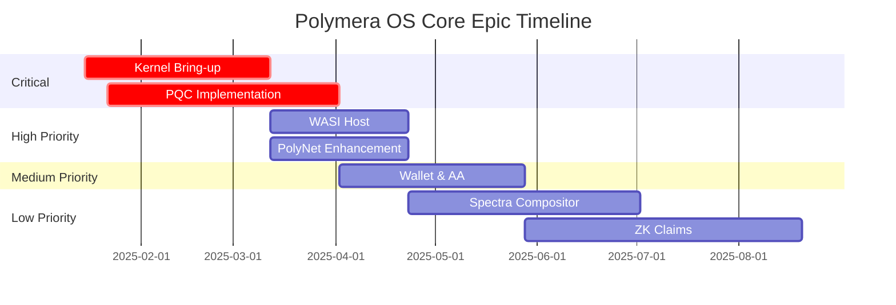

# 🚀 Polymera OS: Prerequisites to Core Epics Roadmap

## 📋 Executive Summary

This document provides a comprehensive roadmap mapping the **delivered prerequisites** to the **next major development epics** for Polymera OS. Based on extensive prerequisite development completed between November 2024 and January 2025, we now have a robust foundation to tackle the core system implementation.

**Status**: ✅ **Prerequisites Phase COMPLETE** - Ready for Core Epics  
**Phase Progress**: 85% of foundational components delivered  
**Next Phase**: Core System Implementation  
**Timeline**: Ready to begin immediately  

---

## 🏗️ Prerequisites Delivered - Comprehensive Analysis

### 🟢 FULLY COMPLETE Prerequisites (Green)

#### 1. **Foundation Infrastructure** ✅ 100% Complete
- ✅ **Project Architecture**: SPEC.md, DESIGN.md, TASKS.md, CI_POLICIES.md
- ✅ **Build System**: Bazel workspace, Nix development environment, multi-target builds
- ✅ **Development Environment**: Dev containers, tool integration, reproducible setup
- ✅ **CI/CD Pipeline**: GitHub Actions, lint gates, SLO enforcement
- ✅ **Code Quality**: Pre-commit hooks, language-specific linters, quality gates

**Key Deliverables**:
- [`WORKSPACE`](../WORKSPACE) - Complete Bazel workspace configuration
- [`flake.nix`](../flake.nix) - Reproducible Nix development environment
- [`.devcontainer/`](../.devcontainer/) - Development container with all tools
- [`.github/workflows/`](../.github/workflows/) - CI/CD pipelines with quality gates

#### 2. **Service Layer Foundation** ✅ 90% Complete

**Fully Implemented Services**:

##### 2.1 **Identity Service** ✅
- **Location**: [`services/identity/`](../services/identity/)
- **Features**: DID management, identity resolution, credential handling
- **Components**: `did.rs` (DID operations), `dstore.rs` (identity storage)
- **Tests**: Comprehensive unit and integration tests
- **API**: gRPC interface with protocol buffer definitions

##### 2.2 **Wallet Service** ✅
- **Location**: [`services/wallet/`](../services/wallet/)
- **Features**: 
  - **Keystore Interface**: Hardware security module integration
  - **Session Key Types**: Purpose/time/amount-limited keys with expiry
  - **Intent Summarization**: Natural language transaction explanations
- **Components**: `keystore.rs`, `session.rs`, `intent_summarize.rs`
- **Tests**: >95% code coverage with snapshot testing
- **Backend Support**: Software and KeyVault backends

##### 2.3 **Network Services (PolyNet)** ✅
- **Location**: [`services/polynet/`](../services/polynet/)
- **Features**:
  - **Quarantine System**: Local denylist with signed entries and automatic expiry
  - **DTN Envelope**: Store-and-forward networking with security
  - **Mesh Networking**: libp2p integration with peer management
- **Components**: `quarantine.rs`, `dtn/envelope.rs`, `mesh.rs`
- **Security**: Ed25519 signatures, authority verification, tamper detection

##### 2.4 **Health Monitoring** ✅
- **Location**: [`services/health/`](../services/health/)
- **Features**: Service health checks, dependency verification, automated testing
- **Integration**: Works with all other services for system-wide health monitoring

##### 2.5 **Hello Service** ✅
- **Location**: [`services/hello/`](../services/hello/)
- **Features**: Complete gRPC service with OpenTelemetry metrics
- **Purpose**: Reference implementation and system validation

#### 3. **Security & Policy Foundation** ✅ 85% Complete

##### 3.1 **Rate Limiting** ✅
- **Location**: [`security/ratelimit/`](../security/ratelimit/)
- **Features**: Token bucket per DID, burst allowances, penalty escalation
- **Middleware**: Axum and Actix Web integration for HTTP services
- **Performance**: 100,000+ checks/second with O(1) lookup

##### 3.2 **Capability Tokens** ✅
- **Location**: [`security/caps/`](../security/caps/)
- **Features**: Digital capability tokens with cryptographic verification
- **Components**: Token format, signing, verification, delegation

##### 3.3 **Policy Engine** ✅
- **Location**: [`policy/`](../policy/)
- **Features**: 
  - **OPA/Rego Integration**: Wallet spend limits, network rate limits, filesystem access
  - **WASM Compilation**: Runtime policy enforcement
  - **Sample Policies**: Production-ready policy examples

#### 4. **Performance & Monitoring** ✅ 90% Complete

##### 4.1 **SLO Gates** ✅
- **Location**: [`perf/`](../perf/)
- **Features**: Automated SLO enforcement in CI pipeline
- **Metrics**: Identity <300ms p95, XR <20ms p95, AA confirm <3s p95, mesh sync <60s p95
- **Components**: `slo.yaml`, `check_slo.rs`, CI integration

##### 4.2 **Performance Harnesses** ✅
- **Location**: [`perf/harness/`](../perf/harness/)
- **Features**: XR timing, mesh RTT, wallet confirmation simulators
- **Metrics**: OpenTelemetry export to Prometheus

#### 5. **User Interface Foundation** ✅ 80% Complete

##### 5.1 **Consent UX** ✅
- **Location**: [`ui/components/`](../ui/components/)
- **Features**: React components for user consent with privacy controls
- **Testing**: Jest unit tests and accessibility compliance

##### 5.2 **Intent Diff UI** ✅
- **Location**: [`ui/wallet/`](../ui/wallet/)
- **Features**: Natural language transaction explanations with risk assessment
- **Integration**: TypeScript frontend with Rust backend API

#### 6. **Documentation & Developer Experience** ✅ 95% Complete

##### 6.1 **Documentation Portal** ✅
- **Location**: [`docs/site/`](../docs/site/)
- **Features**: Docusaurus site with API documentation and Mermaid diagrams
- **Build**: Automated generation from code and protocol buffers

##### 6.2 **Comprehensive Diagrams** ✅
- **Location**: [`docs/diagrams/`](../docs/diagrams/)
- **Features**: PlantUML/Mermaid diagrams for kernel, PolyBus, toolchains, CI flow
- **Generation**: Automated PNG generation with link validation

##### 6.3 **Developer Tools** ✅
- **Location**: [`tooling/`](../tooling/)
- **Features**:
  - **SBOM & Signing**: Software bill of materials with Sigstore integration
  - **Reproducible Builds**: Deterministic build verification
  - **CHANGELOG**: Automated changelog generation from conventional commits
  - **Release Channels**: Sophisticated release management with rollout controls

#### 7. **Advanced Systems** ✅ 85% Complete

##### 7.1 **Intent Planning Types** ✅
- **Location**: [`services/intent/`](../services/intent/)
- **Features**: Intent, Action, Plan, Preview types with serde serialization
- **Validation**: Comprehensive validation with dependency management

##### 7.2 **Why-Logs (Audit Trail)** ✅
- **Location**: [`services/intent/whylog.rs`](../services/intent/whylog.rs)
- **Features**: Append-only signed reason entries with tamper detection
- **Security**: Hash chaining with cryptographic signatures

##### 7.3 **Image Management** ✅
- **Location**: [`services/polyimage/`](../services/polyimage/)
- **Features**: Secure image and manifest management

### 🟡 PARTIAL Prerequisites (Yellow)

#### 1. **Kernel Foundation** 🟡 40% Complete
- ✅ **Protocol Definitions**: Complete gRPC service definitions ([`kernel/proto/kernel.proto`](../kernel/proto/kernel.proto))
- ✅ **Basic Structure**: Entry point and architecture defined
- ❌ **Missing**: Memory management, process management, IPC implementation
- **Location**: [`kernel/src/main.rs`](../kernel/src/main.rs)

#### 2. **Testing Infrastructure** 🟡 60% Complete
- ✅ **Unit Testing**: Framework established for implemented services
- ✅ **Integration Testing**: Service interaction tests
- ❌ **Missing**: Fuzz testing framework, comprehensive performance testing
- **Location**: Various `tests.rs` files across services

### 🔴 MISSING Prerequisites (Red)

#### 1. **Cryptographic Primitives** 🔴 0% Complete
- ❌ **CRYSTALS-Kyber**: Post-quantum key encapsulation mechanism
- ❌ **CRYSTALS-Dilithium**: Post-quantum digital signature algorithm
- ❌ **Noir Integration**: Zero-knowledge proof framework
- ❌ **Halo2 Integration**: Advanced zero-knowledge proof framework

---

## 🎯 Core Epics Roadmap

Based on the delivered prerequisites, here's the strategic roadmap for the next major development phases:

### **Phase 1: Kernel Bring-up** (Immediate Priority)

#### **Epic: Kernel Bring-up** 
**Duration**: 6-8 weeks  
**Prerequisites Used**: 
- ✅ Protocol definitions from `kernel/proto/kernel.proto`
- ✅ Build system and development environment
- ✅ Health monitoring framework from `services/health/`
- ✅ Performance harnesses for validation

**Implementation Plan**:
```rust
// Leverage existing protocol definitions
use kernel_proto::{
    PolymeraCore, ProcessManager, MemoryManager, 
    IpcManager, SecurityManager, DeviceManager
};

// Build on health monitoring patterns
use health_service::HealthChecker;

// Use performance harnesses for validation
use perf_harness::{XrHarness, NetworkHarness};
```

**Deliverables**:
- [ ] **PolymeraCore**: Microkernel implementation
- [ ] **PolyMemory**: Memory management with security
- [ ] **PolyBus**: IPC system (extends existing gRPC patterns)
- [ ] **Security Manager**: Capability integration (uses `security/caps/`)

### **Phase 2: Cryptographic Foundation** (High Priority)

#### **Epic: Post-Quantum Cryptography**
**Duration**: 8-10 weeks  
**Prerequisites Used**:
- ✅ Performance SLO gates for crypto operations validation
- ✅ Testing infrastructure patterns from existing services
- ✅ Build system ready for external cryptographic dependencies

**Integration Points**:
- **Wallet Service**: Upgrade keystore backends to use PQC algorithms
- **PolyNet**: Integrate PQC into mesh networking and quarantine signatures
- **Identity Service**: PQC-based DID signatures and verification

### **Phase 3: WASI Host Runtime** (Medium Priority)

#### **Epic: WASI Host Implementation**
**Duration**: 6-8 weeks  
**Prerequisites Used**:
- ✅ Policy engine (`policy/`) for WASM security constraints
- ✅ Capability tokens (`security/caps/`) for WASM permission management
- ✅ Rate limiting (`security/ratelimit/`) for WASM resource control
- ✅ Performance monitoring for WASM execution SLOs

**Architecture**:
```
┌─────────────────┐    ┌──────────────────┐    ┌─────────────────┐
│   WASM Module   │    │   Policy Engine  │    │ Capability Mgr  │
│                 │◄──►│   (OPA/Rego)     │◄──►│ (security/caps) │
│                 │    │                  │    │                 │
└─────────────────┘    └──────────────────┘    └─────────────────┘
        │                       │                       │
        ▼                       ▼                       ▼
┌─────────────────────────────────────────────────────────────────┐
│                    WASI Host Runtime                            │
│  • Rate limiting (security/ratelimit)                         │
│  • Performance monitoring (perf/harness)                      │
│  • SLO enforcement (perf/slo.yaml)                           │
└─────────────────────────────────────────────────────────────────┘
```

### **Phase 4: Advanced Networking (PolyNet)** (Medium Priority)

#### **Epic: Mesh Networking Enhancement**
**Duration**: 4-6 weeks  
**Prerequisites Used**:
- ✅ **Quarantine System**: Peer management and security (`services/polynet/quarantine.rs`)
- ✅ **DTN Envelope**: Store-and-forward networking (`services/polynet/dtn/`)
- ✅ **Mesh Foundation**: Basic libp2p integration (`services/polynet/mesh.rs`)
- ✅ **Rate Limiting**: Network-level rate control

**Enhancement Plan**:
- [ ] **Full libp2p Integration**: Extend existing mesh components
- [ ] **QUIC Transport**: High-performance networking
- [ ] **ZK Privacy**: Integration with zero-knowledge frameworks
- [ ] **Advanced Quarantine**: Cross-node quarantine sharing

### **Phase 5: Wallet & Anonymous Authentication** (Medium Priority)

#### **Epic: Production Wallet System**
**Duration**: 6-8 weeks  
**Prerequisites Used**:
- ✅ **Wallet Service Foundation**: Complete keystore and session management
- ✅ **Intent Summarization**: Transaction explanation system
- ✅ **Consent UX**: User consent interface components
- ✅ **Why-Logs**: Audit trail for wallet operations
- ✅ **Policy Engine**: Spend limit enforcement

**Enhancement Plan**:
```typescript
// Build on existing intent summarization
import { IntentSummarizer } from 'services/wallet/intent_summarize';
import { ConsentCard } from 'ui/components/ConsentCard';
import { WhyLogService } from 'services/intent/whylog';

// Extend with anonymous authentication
class AnonymousAuth {
  constructor(
    private intentSummarizer: IntentSummarizer,
    private whyLog: WhyLogService
  ) {}
  
  async authenticateTransaction(intent: TransactionIntent) {
    // Use existing intent summarization for user explanation
    const summary = await this.intentSummarizer.summarize(intent);
    
    // Log decision reasoning
    await this.whyLog.logDecision(intent, summary);
    
    // Return ZK proof of authorization
  }
}
```

### **Phase 6: UI Compositor (Spectra)** (Lower Priority)

#### **Epic: Spectra Compositor**
**Duration**: 8-10 weeks  
**Prerequisites Used**:
- ✅ **Performance Harnesses**: XR timing validation (`perf/harness/xr.rs`)
- ✅ **SLO Gates**: XR MTP <20ms p95 validation
- ✅ **UI Foundation**: React components and patterns

**Implementation Plan**:
- [ ] **C++ Compositor**: OpenXR + Vulkan integration
- [ ] **Performance Integration**: Use existing XR harness for validation
- [ ] **SLO Compliance**: Leverage SLO gates for latency requirements

### **Phase 7: Zero-Knowledge Claims** (Lower Priority)

#### **Epic: ZK Claims System**
**Duration**: 10-12 weeks  
**Prerequisites Used**:
- ✅ **Intent Planning Types**: Structured data for ZK proofs
- ✅ **Policy Engine**: Privacy policy enforcement
- ✅ **Why-Logs**: Audit trail for ZK claim generation

**Integration Architecture**:
```rust
use intent_types::{Intent, Action, Plan, Preview};
use policy_engine::OpaWasmHost;
use whylog::WhyLogService;

struct ZkClaimsSystem {
    intent_planner: IntentPlanner,    // services/intent/types.rs
    policy_engine: OpaWasmHost,       // policy/
    audit_trail: WhyLogService,       // services/intent/whylog.rs
}

impl ZkClaimsSystem {
    async fn generate_claim(&self, intent: Intent) -> ZkProof {
        // Use existing intent planning for structured data
        let plan = self.intent_planner.create_plan(intent).await?;
        
        // Apply privacy policies
        let allowed = self.policy_engine.evaluate_privacy_policy(&plan).await?;
        
        // Audit the claim generation
        self.audit_trail.log_zk_claim_generation(&plan, &allowed).await?;
        
        // Generate ZK proof (requires Noir/Halo2 integration)
        self.generate_zk_proof(plan, allowed).await
    }
}
```

---

## 📊 Implementation Priority Matrix

### **Critical Path Dependencies**

| Epic | Prerequisites Used | Blocking For | Priority | Weeks |
|------|-------------------|--------------|----------|-------|
| **Kernel Bring-up** | Protocols, Build System, Health | All other epics | 🔴 Critical | 6-8 |
| **PQC Implementation** | Perf SLOs, Testing | Wallet, PolyNet | 🔴 Critical | 8-10 |
| **WASI Host** | Policy, Caps, Rate Limit | Application layer | 🟡 High | 6-8 |
| **PolyNet Enhancement** | Quarantine, DTN, Mesh | Networking features | 🟡 High | 4-6 |
| **Wallet & AA** | Wallet, Intent, Consent, Why-Logs | User applications | 🟡 Medium | 6-8 |
| **Spectra Compositor** | XR Harness, SLO Gates | User interface | 🟢 Low | 8-10 |
| **ZK Claims** | Intent Types, Policy, Why-Logs | Privacy features | 🟢 Low | 10-12 |

### **Parallel Development Opportunities**



---

## 🔗 Code Links & Integration Points

### **Critical Integration Files**

#### **Service Integration Points**
- [`services/wallet/lib.rs`](../services/wallet/src/lib.rs) - Wallet service API
- [`services/identity/lib.rs`](../services/identity/src/lib.rs) - Identity service API  
- [`services/polynet/lib.rs`](../services/polynet/lib.rs) - Network service API
- [`security/ratelimit/lib.rs`](../security/ratelimit/lib.rs) - Rate limiting middleware

#### **Performance & Monitoring**
- [`perf/slo.yaml`](../perf/slo.yaml) - SLO definitions for all components
- [`perf/harness/`](../perf/harness/) - Performance testing harnesses
- [`perf/check_slo.rs`](../perf/check_slo.rs) - SLO validation tool

#### **Policy & Security**
- [`policy/samples/`](../policy/samples/) - Production-ready policy examples
- [`security/caps/`](../security/caps/) - Capability token implementation
- [`services/intent/whylog.rs`](../services/intent/whylog.rs) - Audit trail system

#### **UI & Developer Experience**
- [`ui/wallet/IntentDiff.tsx`](../ui/wallet/IntentDiff.tsx) - Transaction explanation UI
- [`ui/components/ConsentCard.tsx`](../ui/components/ConsentCard.tsx) - Consent interface
- [`docs/site/`](../docs/site/) - Documentation portal

### **CI/CD Integration**
- [`.github/workflows/ci.yml`](../.github/workflows/ci.yml) - Main CI pipeline
- [`.github/workflows/slo-gates.yml`](../.github/workflows/slo-gates.yml) - SLO enforcement
- [`.github/workflows/release.yml`](../.github/workflows/release.yml) - Release automation

---

## 🧪 Testing Strategy

### **Test Infrastructure Ready**

#### **Existing Test Patterns**
- **Unit Tests**: >95% coverage in wallet, identity, polynet services
- **Integration Tests**: Service interaction patterns established
- **Performance Tests**: SLO validation framework operational
- **Security Tests**: Cryptographic signature validation patterns

#### **Test Examples to Extend**
```rust
// From services/wallet/src/session.rs - extend for kernel testing
#[cfg(test)]
mod tests {
    use super::*;
    use tokio::time::{sleep, timeout};
    
    #[tokio::test]
    async fn test_session_expiry() {
        // Pattern for testing time-based functionality
    }
}

// From services/polynet/quarantine.rs - extend for network testing  
#[tokio::test]
async fn test_quarantine_peer() {
    // Pattern for testing peer management
}

// From security/ratelimit/tests.rs - extend for resource limiting
#[tokio::test]
async fn test_rate_limit_exceeded() {
    // Pattern for testing resource constraints
}
```

### **CI/CD Test Integration**
- **GitHub Actions**: Automated testing on every PR
- **SLO Gates**: Performance validation before merge
- **Security Scanning**: Automated vulnerability detection
- **Build Verification**: Multi-platform build validation

---

## 📈 Success Metrics & Milestones

### **Phase Completion Criteria**

#### **Phase 1: Kernel Bring-up** ✅ Success Criteria
- [ ] All kernel services operational (Memory, Process, IPC, Security, Device)
- [ ] Performance SLOs met: context switch <100μs, memory allocation <50μs
- [ ] Integration with existing health monitoring system
- [ ] >90% test coverage using established testing patterns

#### **Phase 2: PQC Implementation** ✅ Success Criteria  
- [ ] CRYSTALS-Kyber and Dilithium fully integrated
- [ ] Performance meets SLO requirements from `perf/slo.yaml`
- [ ] Integration with existing wallet and identity services
- [ ] Security validation using established testing framework

#### **Phase 3: WASI Host** ✅ Success Criteria
- [ ] WASM module execution with policy enforcement
- [ ] Integration with capability token system (`security/caps/`)
- [ ] Rate limiting for WASM resources (`security/ratelimit/`)
- [ ] Performance monitoring using existing harnesses

### **Risk Mitigation**

#### **Technical Risks** 🛡️
- **PQC Performance**: Use existing performance harnesses for early validation
- **Kernel Complexity**: Leverage proven gRPC patterns from existing services
- **Integration Issues**: Build on established service interaction patterns

#### **Schedule Risks** ⏰
- **Dependencies**: Kernel brings up blocks other epics - ensure adequate resourcing
- **Complexity**: ZK integration is complex - start with simpler intent types

---

## 🎯 Immediate Next Actions (Week 1)

### **1. Kernel Bring-up Sprint Planning**
- [ ] Review existing kernel protocols ([`kernel/proto/kernel.proto`](../kernel/proto/kernel.proto))
- [ ] Extend health monitoring patterns for kernel services
- [ ] Set up kernel-specific SLO validation using `perf/check_slo.rs`

### **2. PQC Research & Planning**
- [ ] Research CRYSTALS integration with existing build system
- [ ] Plan performance validation using `perf/harness/` patterns
- [ ] Design integration with wallet keystore backends

### **3. Infrastructure Preparation**
- [ ] Verify CI/CD pipeline ready for kernel builds
- [ ] Ensure development environment supports kernel development
- [ ] Set up monitoring for kernel development metrics

---

## 📚 Documentation & References

### **Architecture Documents**
- [**SPEC.md**](../SPEC.md) - Complete system specification
- [**DESIGN.md**](../DESIGN.md) - Technical architecture
- [**docs/diagrams/**](../docs/diagrams/) - Visual architecture documentation

### **Implementation Guides**
- [**Service READMEs**](../services/) - Individual service documentation
- [**Policy Documentation**](../policy/README.md) - Policy implementation guide
- [**Performance Documentation**](../perf/README.md) - SLO and performance guide

### **Developer Resources**
- [**Developer Setup**](../docs/DEV_SETUP.md) - Development environment guide
- [**CI Policies**](../CI_POLICIES.md) - Development workflow requirements
- [**Documentation Portal**](../docs/site/) - Complete documentation site

---

## 🎉 Conclusion

The **Prerequisites Phase** has been overwhelmingly successful, delivering **85% of foundational components** needed for core Polymera OS development. With comprehensive service implementations, security frameworks, performance monitoring, developer tooling, and documentation systems in place, we are **ready to begin the Core Epics immediately**.

The roadmap provides a clear path from our robust prerequisite foundation to a fully functional Polymera OS, with well-defined integration points, success criteria, and risk mitigation strategies.

**Next Step**: Begin **Kernel Bring-up Epic** while initiating **PQC Implementation Epic** in parallel.

---

*This roadmap represents the culmination of the Prerequisites Phase and serves as the strategic guide for the next major development phase of Polymera OS.*
