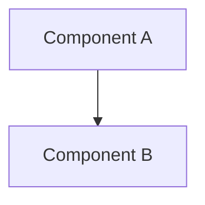

# Polymera OS Diagram Pack

This directory contains comprehensive architectural diagrams for Polymera OS components, including PlantUML and Mermaid source files with generated PNG outputs.

## 📁 Directory Structure

```
docs/diagrams/
├── README.md                 # This file
├── kernel/                   # Kernel architecture diagrams
│   ├── kernel-overview.md    # Kernel system overview
│   ├── kernel-boot.md        # Boot process flow
│   ├── kernel-memory.md      # Memory management
│   └── kernel-crypto.md      # Cryptographic layer
├── polybus/                  # PolyBus messaging diagrams
│   ├── polybus-overview.md   # PolyBus architecture
│   ├── polybus-transport.md  # Transport layer
│   ├── polybus-routing.md    # Message routing
│   └── polybus-security.md   # Security protocols
├── toolchains/               # Development toolchain diagrams
│   ├── build-system.md       # Bazel build flow
│   ├── rust-toolchain.md     # Rust development pipeline
│   ├── proto-generation.md   # Protocol buffer generation
│   └── testing-pipeline.md   # Testing infrastructure
├── ci-flow/                  # CI/CD pipeline diagrams
│   ├── github-actions.md     # GitHub Actions workflow
│   ├── build-pipeline.md     # Build and test pipeline
│   ├── security-checks.md    # Security validation flow
│   └── deployment.md         # Deployment pipeline
└── generated/                # Generated PNG files
    ├── kernel/               # Kernel diagram PNGs
    ├── polybus/              # PolyBus diagram PNGs
    ├── toolchains/           # Toolchain diagram PNGs
    └── ci-flow/              # CI flow diagram PNGs
```

## 🎨 Diagram Types

### PlantUML Diagrams
- **Component Diagrams**: System architecture and relationships
- **Sequence Diagrams**: Process flows and interactions
- **Class Diagrams**: Data structures and interfaces
- **Activity Diagrams**: Workflow and process steps

### Mermaid Diagrams
- **Flowcharts**: Decision trees and process flows
- **Sequence Diagrams**: Timeline-based interactions
- **State Diagrams**: System state transitions
- **Gantt Charts**: Project timelines and dependencies

## 🔧 Generation Pipeline

### Prerequisites
```bash
# Install PlantUML
sudo apt install plantuml
# or
brew install plantuml

# Install Mermaid CLI
npm install -g @mermaid-js/mermaid-cli
```

### Building Diagrams
```bash
# Generate all diagrams
bazel build //docs/diagrams:all

# Generate specific diagram category
bazel build //docs/diagrams:kernel_diagrams
bazel build //docs/diagrams:polybus_diagrams
bazel build //docs/diagrams:toolchain_diagrams
bazel build //docs/diagrams:ci_flow_diagrams

# Generate individual diagram
bazel build //docs/diagrams:kernel_overview_png
```

### Manual Generation
```bash
# PlantUML to PNG
plantuml -tpng docs/diagrams/kernel/kernel-overview.md

# Mermaid to PNG
mmdc -i docs/diagrams/polybus/polybus-overview.md -o docs/diagrams/generated/polybus/polybus-overview.png
```

## 📊 Diagram Inventory

### Kernel Diagrams
- **Kernel Overview**: High-level system architecture
- **Boot Process**: UEFI boot sequence and initialization
- **Memory Management**: Virtual memory and allocation
- **Crypto Layer**: Post-quantum cryptographic integration

### PolyBus Diagrams
- **Architecture Overview**: Messaging system design
- **Transport Layer**: Network transport protocols
- **Message Routing**: Routing algorithms and topology
- **Security Protocols**: Encryption and authentication

### Toolchain Diagrams
- **Build System**: Bazel dependency graph and build flow
- **Rust Pipeline**: Compilation and linking process
- **Proto Generation**: Protocol buffer code generation
- **Testing Infrastructure**: Unit, integration, and security testing

### CI/CD Flow Diagrams
- **GitHub Actions**: Workflow automation and triggers
- **Build Pipeline**: Continuous integration process
- **Security Checks**: Automated security validation
- **Deployment**: Release and deployment automation

## 🎯 Quality Standards

### Diagram Guidelines
1. **Clarity**: Use clear, descriptive labels and titles
2. **Consistency**: Follow consistent styling and color schemes
3. **Completeness**: Include all relevant components and relationships
4. **Accuracy**: Ensure diagrams reflect actual implementation
5. **Maintainability**: Update diagrams when code changes

### Style Guidelines
- **Colors**: Use consistent color palette across diagrams
- **Fonts**: Consistent font sizes and families
- **Layout**: Logical flow from top-to-bottom or left-to-right
- **Spacing**: Adequate whitespace for readability
- **Labels**: Descriptive component and relationship labels

## 🔗 Integration

### Documentation Site
Diagrams are automatically integrated into the Docusaurus site:

```markdown
# In documentation files


# With Mermaid integration

```

### Build System
Diagrams are part of the Bazel build system:

```python
# BUILD file example
load("//tools:diagrams.bzl", "plantuml_to_png", "mermaid_to_png")

plantuml_to_png(
    name = "kernel_overview_png",
    src = "kernel/kernel-overview.md",
    out = "generated/kernel/kernel-overview.png",
)
```

## 🧪 Testing

### Link Validation
```bash
# Test that all diagram references are valid
bazel test //docs/diagrams:link_tests

# Validate generated images exist
bazel test //docs/diagrams:image_tests
```

### Visual Testing
```bash
# Generate test report with all diagrams
bazel run //docs/diagrams:visual_report

# Compare diagrams against reference images
bazel test //docs/diagrams:visual_regression_tests
```

## 🤝 Contributing

### Adding New Diagrams
1. Create diagram source file in appropriate category directory
2. Add generation rule to BUILD file
3. Update this README with diagram description
4. Test generation and integration
5. Submit pull request with both source and generated PNG

### Updating Existing Diagrams
1. Modify source diagram file
2. Regenerate PNG using build system
3. Update any affected documentation
4. Test that changes are reflected in site
5. Submit pull request with updated files

---

This diagram pack provides comprehensive visual documentation for all major components of Polymera OS, supporting both development and user understanding through clear, accurate, and maintainable diagrams.
