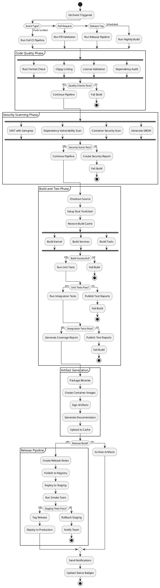
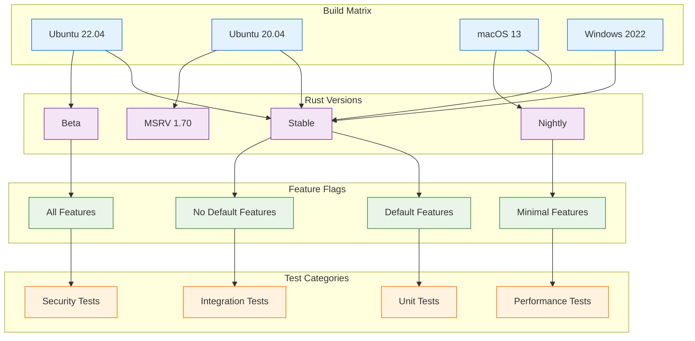
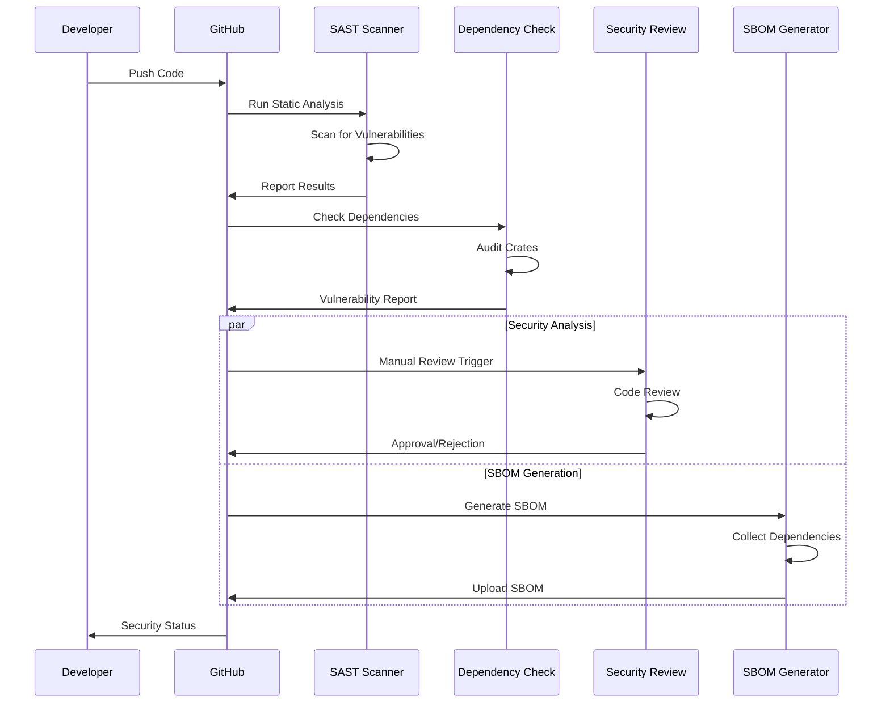
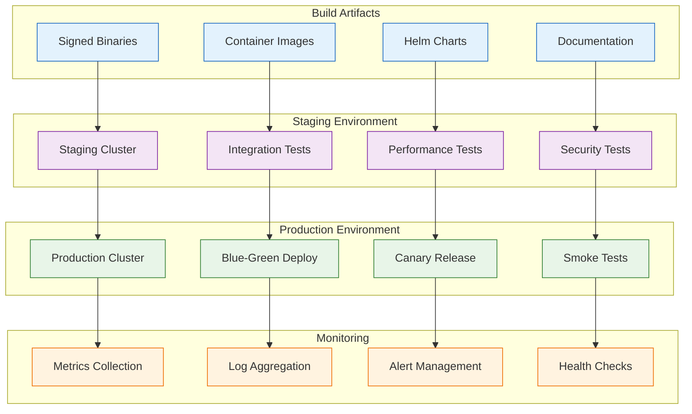
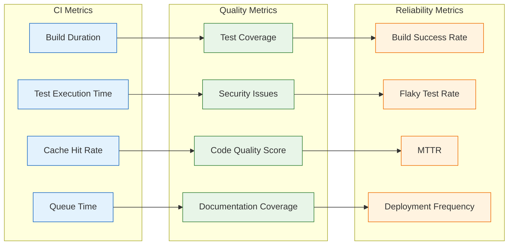

# GitHub Actions CI Flow Diagram

## Mermaid Workflow Overview

```mermaid
graph TB
    subgraph "Trigger Events"
        A[Push to Main]
        B[Pull Request]
        C[Release Tag]
        D[Scheduled Build]
    end
    
    subgraph "Workflow Jobs"
        E[Code Quality]
        F[Security Scan]
        G[Build & Test]
        H[Integration Tests]
        I[Release Build]
    end
    
    subgraph "Quality Checks"
        J[Linting]
        K[Format Check]
        L[Dependency Audit]
        M[License Check]
    end
    
    subgraph "Security Validation"
        N[SAST Scan]
        O[Dependency Scan]
        P[Container Scan]
        Q[SBOM Generation]
    end
    
    subgraph "Build Pipeline"
        R[Compile]
        S[Unit Tests]
        T[Package]
        U[Sign Artifacts]
    end
    
    subgraph "Deployment"
        V[Staging Deploy]
        W[Integration Tests]
        X[Production Deploy]
        Y[Smoke Tests]
    end
    
    %% Triggers to Jobs
    A --> E
    B --> F
    C --> G
    D --> H
    
    A --> I
    C --> I
    
    %% Jobs to Checks
    E --> J
    E --> K
    E --> L
    E --> M
    
    %% Security Jobs
    F --> N
    F --> O
    F --> P
    F --> Q
    
    %% Build Jobs
    G --> R
    G --> S
    G --> T
    G --> U
    
    %% Integration and Deployment
    H --> V
    I --> W
    V --> X
    W --> Y
    
    classDef trigger fill:#e3f2fd,stroke:#1565c0,stroke-width:2px
    classDef workflow fill:#f3e5f5,stroke:#7b1fa2,stroke-width:2px
    classDef quality fill:#e8f5e8,stroke:#2e7d32,stroke-width:2px
    classDef security fill:#fff3e0,stroke:#ef6c00,stroke-width:2px
    classDef build fill:#fce4ec,stroke:#c2185b,stroke-width:2px
    classDef deploy fill:#f1f8e9,stroke:#558b2f,stroke-width:2px
    
    class A,B,C,D trigger
    class E,F,G,H,I workflow
    class J,K,L,M quality
    class N,O,P,Q security
    class R,S,T,U build
    class V,W,X,Y deploy
```



## PlantUML Activity Diagram



## Workflow Matrix Strategy



## Security Pipeline



## Deployment Pipeline



## GitHub Actions Configuration

### Main CI Workflow
```yaml
# .github/workflows/ci.yml
name: CI

on:
  push:
    branches: [ main, develop ]
  pull_request:
    branches: [ main ]
  schedule:
    - cron: '0 0 * * *'  # Daily build

env:
  CARGO_TERM_COLOR: always
  RUST_BACKTRACE: 1

jobs:
  check:
    name: Check
    runs-on: ubuntu-latest
    steps:
      - uses: actions/checkout@v4
      - uses: dtolnay/rust-toolchain@stable
      - uses: Swatinem/rust-cache@v2
      - run: cargo check --all-targets --all-features

  test:
    name: Test Suite
    runs-on: ${{ matrix.os }}
    strategy:
      matrix:
        os: [ubuntu-latest, windows-latest, macos-latest]
        rust: [stable, beta]
        include:
          - os: ubuntu-latest
            rust: nightly
    steps:
      - uses: actions/checkout@v4
      - uses: dtolnay/rust-toolchain@${{ matrix.rust }}
      - uses: Swatinem/rust-cache@v2
      - run: cargo test --all-features

  security:
    name: Security Audit
    runs-on: ubuntu-latest
    steps:
      - uses: actions/checkout@v4
      - uses: rustsec/audit-check@v1.4.1
        with:
          token: ${{ secrets.GITHUB_TOKEN }}

  coverage:
    name: Coverage
    runs-on: ubuntu-latest
    steps:
      - uses: actions/checkout@v4
      - uses: dtolnay/rust-toolchain@stable
        with:
          components: llvm-tools-preview
      - uses: taiki-e/install-action@cargo-llvm-cov
      - run: cargo llvm-cov --all-features --workspace --lcov --output-path lcov.info
      - uses: codecov/codecov-action@v3
        with:
          file: lcov.info
```

### Release Workflow
```yaml
# .github/workflows/release.yml
name: Release

on:
  push:
    tags:
      - 'v*'

jobs:
  build:
    name: Build Release
    runs-on: ${{ matrix.os }}
    strategy:
      matrix:
        include:
          - os: ubuntu-latest
            target: x86_64-unknown-linux-gnu
          - os: windows-latest
            target: x86_64-pc-windows-msvc
          - os: macos-latest
            target: x86_64-apple-darwin
          - os: macos-latest
            target: aarch64-apple-darwin
    
    steps:
      - uses: actions/checkout@v4
      - uses: dtolnay/rust-toolchain@stable
        with:
          targets: ${{ matrix.target }}
      - run: cargo build --release --target ${{ matrix.target }}
      - uses: actions/upload-artifact@v3
        with:
          name: ${{ matrix.target }}
          path: target/${{ matrix.target }}/release/

  release:
    name: Create Release
    runs-on: ubuntu-latest
    needs: build
    steps:
      - uses: actions/checkout@v4
      - uses: actions/download-artifact@v3
      - uses: softprops/action-gh-release@v1
        with:
          files: |
            **/*
          generate_release_notes: true
```

### Security Workflow
```yaml
# .github/workflows/security.yml
name: Security

on:
  push:
    branches: [ main ]
  pull_request:
    branches: [ main ]
  schedule:
    - cron: '0 12 * * *'

jobs:
  sast:
    name: Static Analysis
    runs-on: ubuntu-latest
    steps:
      - uses: actions/checkout@v4
      - uses: returntocorp/semgrep-action@v1
        with:
          config: auto

  dependency-check:
    name: Dependency Vulnerability Scan
    runs-on: ubuntu-latest
    steps:
      - uses: actions/checkout@v4
      - uses: rustsec/audit-check@v1.4.1

  container-scan:
    name: Container Security Scan
    runs-on: ubuntu-latest
    steps:
      - uses: actions/checkout@v4
      - name: Build image
        run: docker build -t polymera-os:${{ github.sha }} .
      - name: Run Trivy vulnerability scanner
        uses: aquasecurity/trivy-action@master
        with:
          image-ref: 'polymera-os:${{ github.sha }}'
          format: 'sarif'
          output: 'trivy-results.sarif'
      - name: Upload Trivy scan results
        uses: github/codeql-action/upload-sarif@v2
        with:
          sarif_file: 'trivy-results.sarif'

  sbom:
    name: Generate SBOM
    runs-on: ubuntu-latest
    steps:
      - uses: actions/checkout@v4
      - uses: anchore/sbom-action@v0
        with:
          path: .
          format: spdx-json
```

## Performance Monitoring

### Build Performance Metrics


### Target SLOs
- **Build Time**: < 10 minutes for full CI pipeline
- **Test Coverage**: > 80% line coverage
- **Security Scan**: Zero high-severity vulnerabilities
- **Build Success Rate**: > 95% on main branch
- **Deployment Frequency**: Multiple times per day
- **MTTR**: < 1 hour for critical issues

---

This GitHub Actions CI flow diagram illustrates the comprehensive continuous integration and deployment pipeline for Polymera OS, including code quality checks, security scanning, build automation, testing, and deployment processes with proper monitoring and observability.
