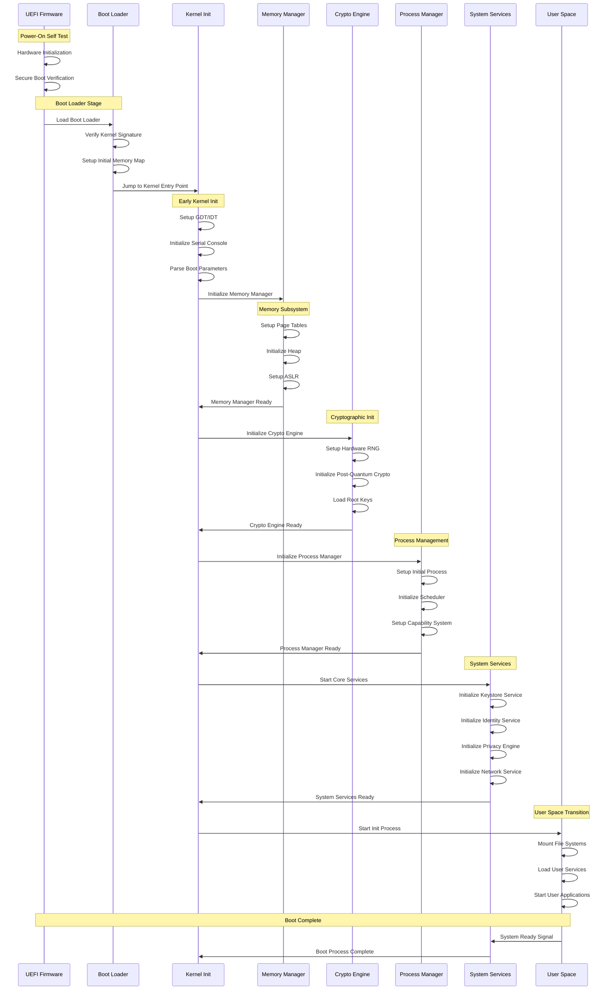
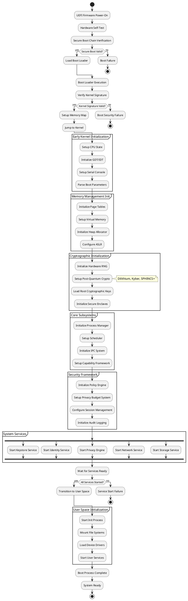
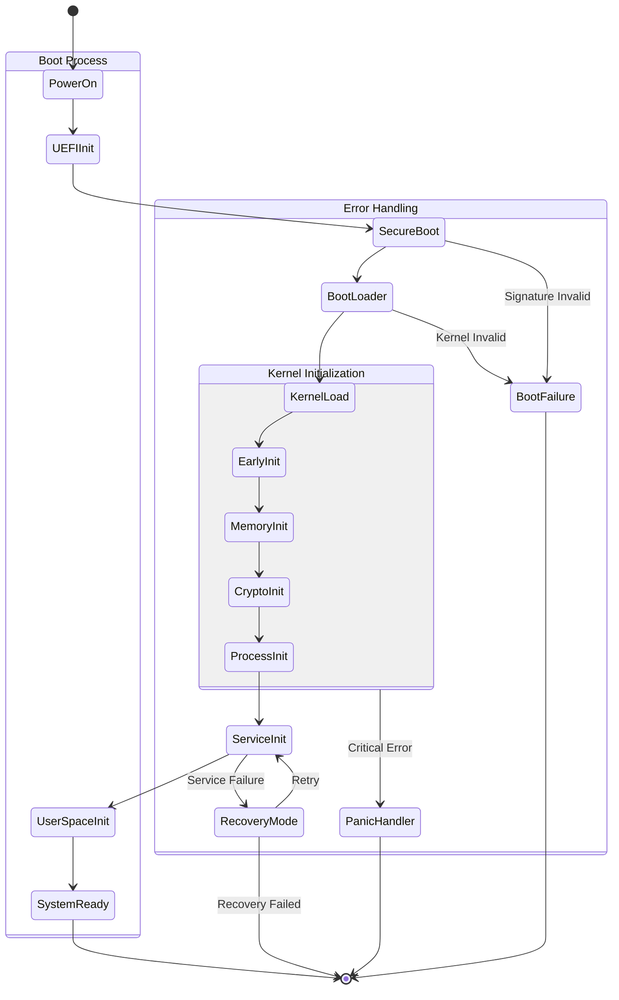
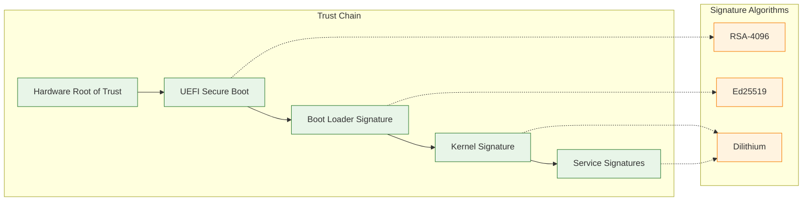
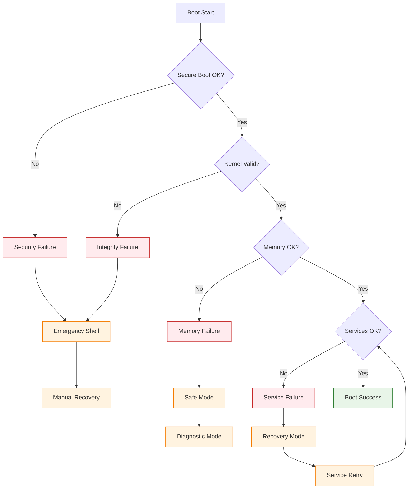

# Kernel Boot Process Diagram

## Mermaid Sequence Diagram



## PlantUML Activity Diagram



## Boot Process State Diagram



## Boot Timeline

```mermaid
gantt
    title Polymera OS Boot Timeline
    dateFormat X
    axisFormat %Ss
    
    section Hardware
    UEFI Firmware           :uefi, 0, 2000
    Hardware Init           :hw, 0, 1500
    Secure Boot             :secboot, 1500, 500
    
    section Boot Loader
    Load Kernel             :bootload, 2000, 800
    Verify Signature        :verify, 2000, 600
    Memory Setup            :memsetup, 2600, 200
    
    section Kernel Core
    Early Init              :earlyinit, 2800, 400
    Memory Manager          :memmgr, 3200, 600
    Crypto Engine           :crypto, 3800, 800
    Process Manager         :procmgr, 4600, 400
    
    section Services
    Core Services           :services, 5000, 1200
    Network Stack           :network, 5200, 1000
    Storage Layer           :storage, 5400, 800
    Security Framework      :security, 5000, 1500
    
    section User Space
    Init Process            :init, 6200, 400
    File Systems            :fs, 6600, 600
    User Services           :userservices, 7200, 800
    Applications            :apps, 8000, 1000
```



## Boot Configuration

### UEFI Variables
```yaml
# Boot configuration stored in UEFI variables
PolymeraBootConfig:
  SecureBootEnabled: true
  KernelPath: "/EFI/polymera/kernel.efi"
  KernelArgs: "console=ttyS0,115200 quiet"
  MemoryEncryption: true
  PostQuantumBoot: true
  DebugMode: false
```

### Kernel Command Line
```bash
# Example kernel command line parameters
polymera_kernel \
  console=ttyS0,115200 \
  mem=4G \
  crypto.pq_enabled=1 \
  privacy.budget_mode=strict \
  network.mesh_enabled=1 \
  debug.level=info \
  init=/sbin/polymera_init
```

### Boot Verification Chain



## Security Checkpoints

### Boot-time Security Validations

1. **Hardware Verification**
   - TPM presence and configuration
   - Secure boot status
   - Memory encryption support
   - Hardware random number generator

2. **Cryptographic Validation**
   - Boot loader signature verification
   - Kernel signature verification
   - Post-quantum algorithm availability
   - Key store integrity

3. **System Configuration**
   - Memory layout validation
   - Process isolation setup
   - Capability system initialization
   - Privacy budget configuration

4. **Service Validation**
   - Service signature verification
   - Configuration integrity
   - Inter-service authentication
   - Policy engine validation

## Error Handling and Recovery

### Boot Failure Modes



### Recovery Mechanisms

- **Emergency Shell**: Minimal shell for manual recovery
- **Safe Mode**: Boot with minimal services
- **Recovery Mode**: Automatic service restart and repair
- **Rollback**: Revert to previous known-good configuration
- **Factory Reset**: Return to default configuration

---

This boot process diagram shows the complete initialization sequence of Polymera OS, from hardware power-on through user space readiness, including security checkpoints and error handling mechanisms.
