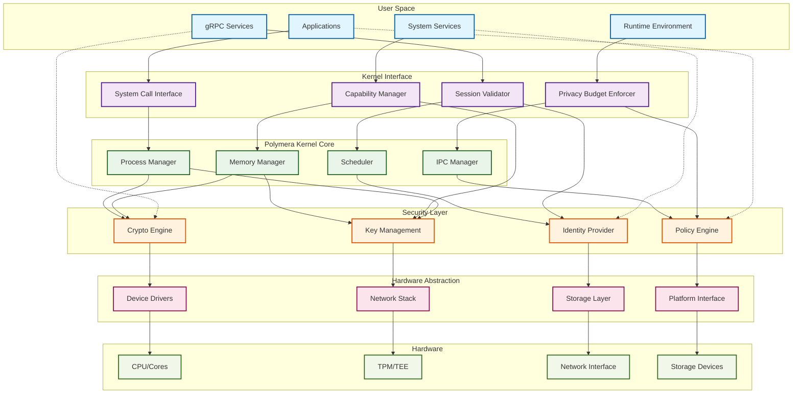
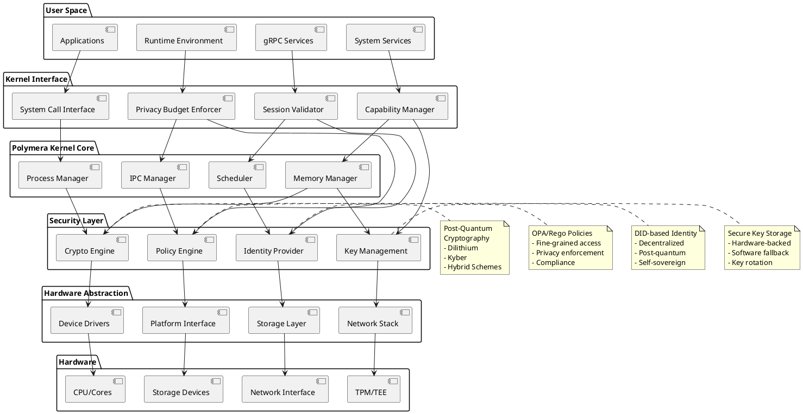

# Kernel Overview Diagram

## Mermaid Diagram

## PlantUML Component Diagram

## Architecture Description

### Layer Responsibilities

#### User Space
- **Applications**: End-user applications and utilities
- **System Services**: Core system services (keystore, identity, privacy)
- **gRPC Services**: Network-accessible service interfaces
- **Runtime Environment**: Language runtimes and execution environments

#### Kernel Interface
- **System Call Interface**: Traditional system call entry points
- **Capability Manager**: Capability-based access control
- **Session Validator**: Session key validation and enforcement
- **Privacy Budget Enforcer**: Differential privacy budget management

#### Polymera Kernel Core
- **Process Manager**: Process lifecycle and isolation
- **Memory Manager**: Virtual memory and allocation
- **Scheduler**: Process and thread scheduling
- **IPC Manager**: Inter-process communication

#### Security Layer
- **Crypto Engine**: Post-quantum cryptographic operations
- **Key Management**: Secure key storage and lifecycle
- **Identity Provider**: DID-based identity management
- **Policy Engine**: Policy evaluation and enforcement

#### Hardware Abstraction
- **Device Drivers**: Hardware device interfaces
- **Network Stack**: Network protocol implementation
- **Storage Layer**: File system and storage abstraction
- **Platform Interface**: Platform-specific functionality

#### Hardware
- **CPU/Cores**: Physical processing units
- **TPM/TEE**: Trusted Platform Module and Trusted Execution Environment
- **Network Interface**: Physical network adapters
- **Storage Devices**: Physical storage media

### Key Design Principles

1. **Layered Architecture**: Clear separation of concerns across layers
2. **Security by Design**: Security integrated at every layer
3. **Zero Trust**: All components verify trust explicitly
4. **Post-Quantum Ready**: Cryptographic algorithms resistant to quantum attacks
5. **Privacy Preserving**: Built-in differential privacy and budget management
6. **Capability-Based**: Fine-grained access control using capabilities
7. **Deterministic**: Reproducible execution for verification
8. **Modular**: Loosely coupled components for maintainability

### Security Boundaries

- **User/Kernel Boundary**: Traditional privilege separation
- **Capability Boundary**: Capability-based access control
- **Process Isolation**: Hardware-enforced process boundaries
- **Cryptographic Boundary**: Cryptographically enforced data protection
- **Hardware Boundary**: Hardware security module integration

### Performance Characteristics

- **Low Latency**: Optimized for real-time and interactive workloads
- **High Throughput**: Efficient batch processing capabilities
- **Memory Efficient**: Minimal memory footprint and optimized allocation
- **Network Optimized**: Efficient mesh networking and DTN protocols
- **Storage Optimized**: Encrypted storage with minimal overhead

---

This diagram represents the high-level architecture of the Polymera OS kernel, showing the interaction between different layers and the flow of control and data through the system.
