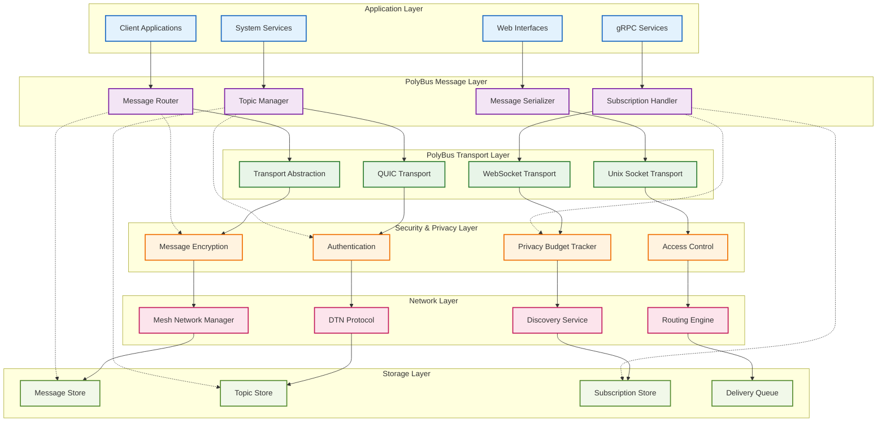
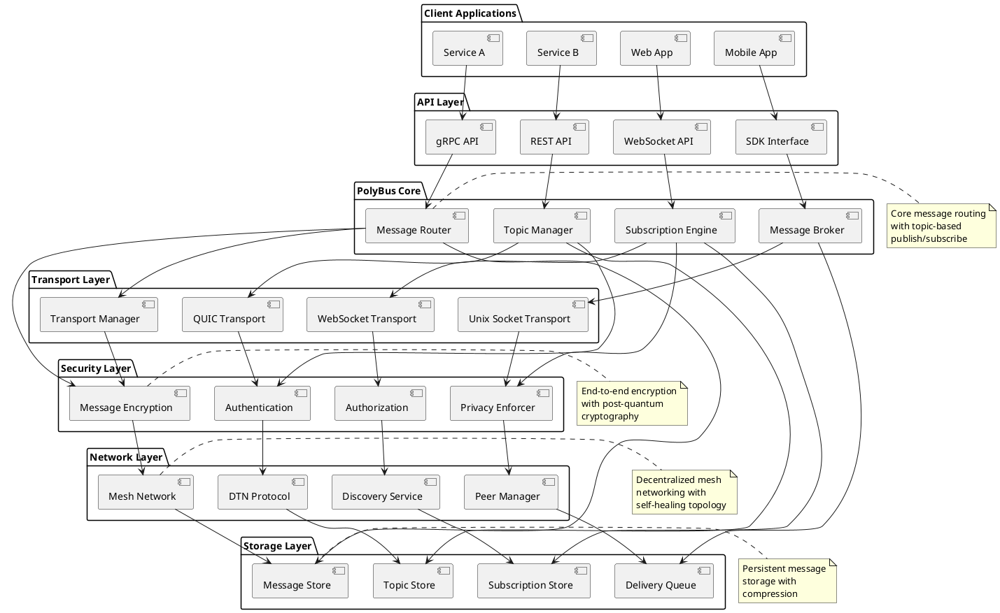
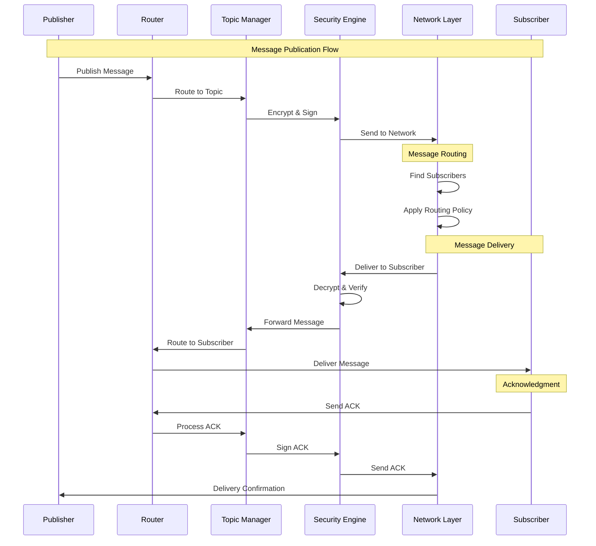
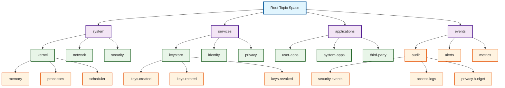
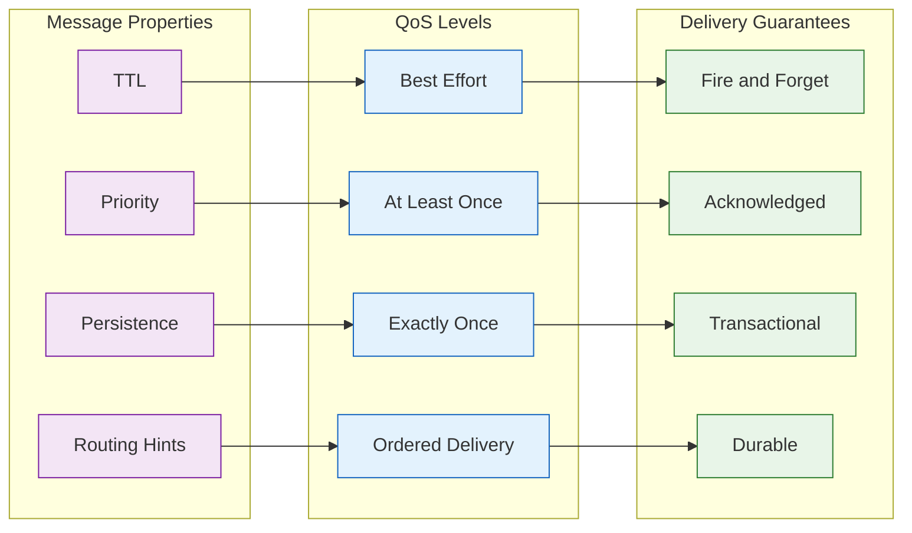
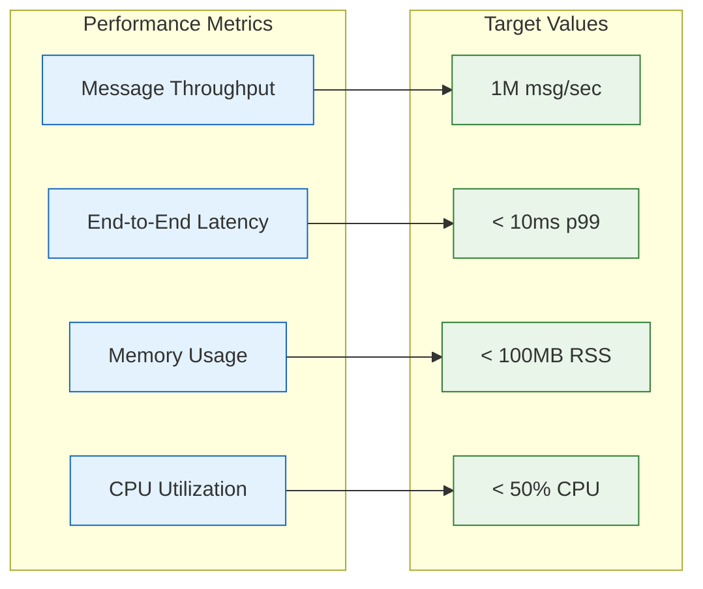

# PolyBus Overview Diagram

## Mermaid Architecture Diagram



## PlantUML Component Diagram



## PolyBus Message Flow



## Topic Hierarchy



## PolyBus Quality of Service



## PolyBus Configuration

### Transport Configuration
```yaml
# PolyBus transport configuration
transports:
  quic:
    enabled: true
    bind_address: "0.0.0.0:4001"
    max_connections: 1000
    idle_timeout: "30s"
    keep_alive: "10s"
    
  websocket:
    enabled: true
    bind_address: "0.0.0.0:8080"
    path: "/polybus/ws"
    compression: true
    
  unix_socket:
    enabled: true
    socket_path: "/var/run/polybus.sock"
    permissions: "0660"

security:
  encryption: "chacha20poly1305"
  signature: "dilithium3"
  key_exchange: "kyber768"
  
routing:
  strategy: "mesh"
  max_hops: 10
  cache_size: 10000
  cleanup_interval: "5m"

storage:
  backend: "sled"
  path: "/var/lib/polybus"
  max_message_size: "64MB"
  retention_policy: "7d"
```

### Topic Configuration
```yaml
# Topic management configuration
topics:
  default_retention: "24h"
  max_subscribers: 1000
  message_ordering: true
  compression: "lz4"
  
  policies:
    "system.**":
      retention: "30d"
      priority: "high"
      encryption: "required"
      
    "services.**":
      retention: "7d"
      priority: "normal"
      replication: 3
      
    "events.audit.**":
      retention: "1y"
      priority: "high"
      immutable: true
```

## Performance Characteristics

### Throughput and Latency


## Monitoring and Observability

### Metrics Collection
- **Message Rates**: Published, delivered, failed messages per second
- **Latency Distribution**: P50, P95, P99 end-to-end latency
- **Resource Usage**: Memory, CPU, network bandwidth utilization
- **Error Rates**: Failed deliveries, timeouts, authentication failures

### Health Checks
- **Transport Health**: Connection status and performance
- **Storage Health**: Disk usage and write performance
- **Network Health**: Peer connectivity and routing efficiency
- **Security Health**: Certificate validity and encryption status

---

This PolyBus overview diagram illustrates the complete messaging infrastructure for Polymera OS, showing how components communicate through a secure, privacy-preserving, and high-performance message bus with support for mesh networking and delay-tolerant protocols.
