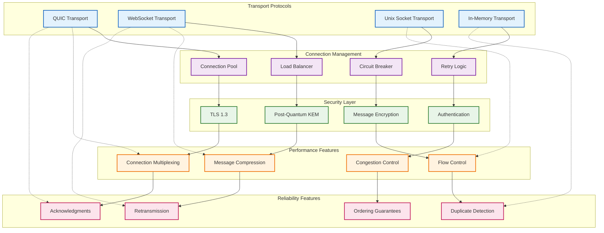
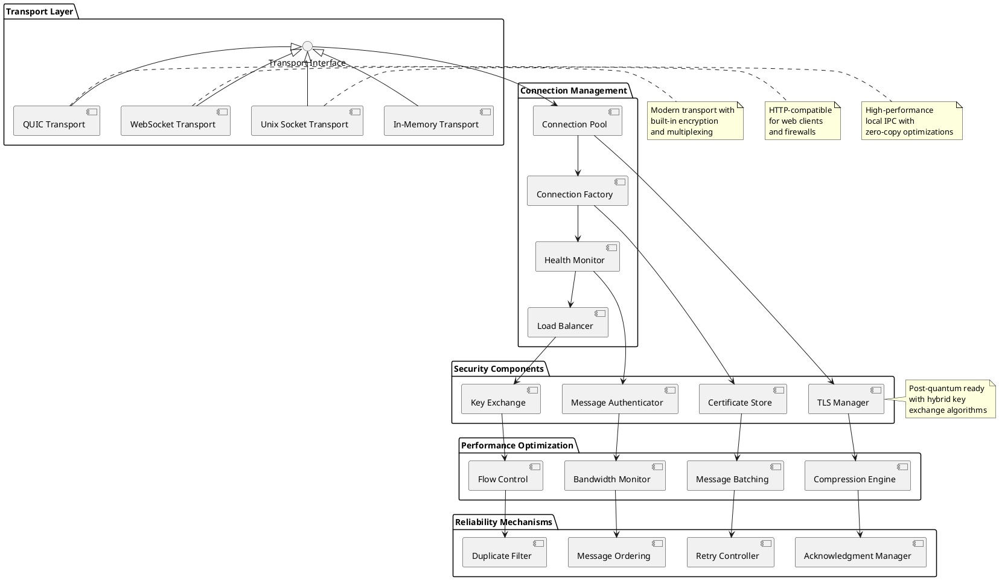
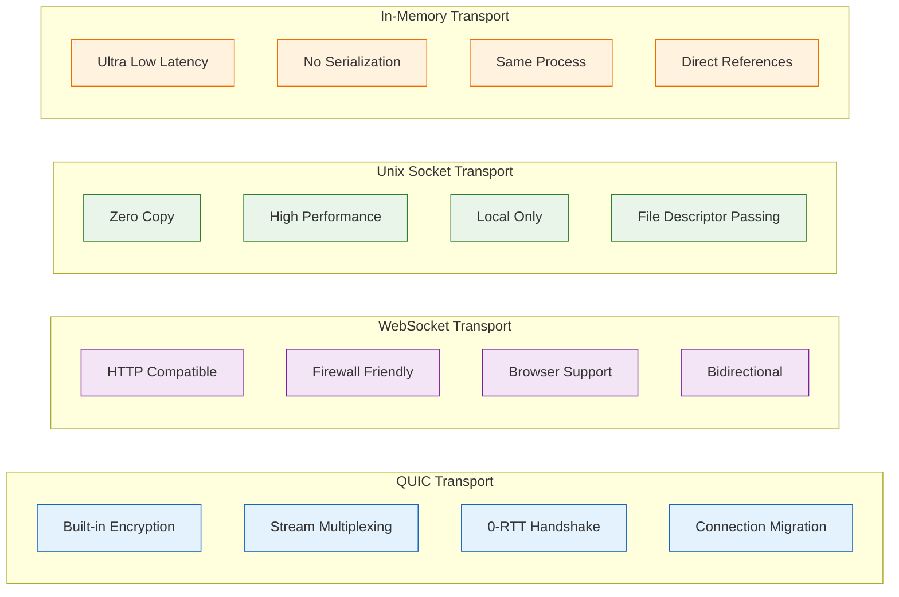
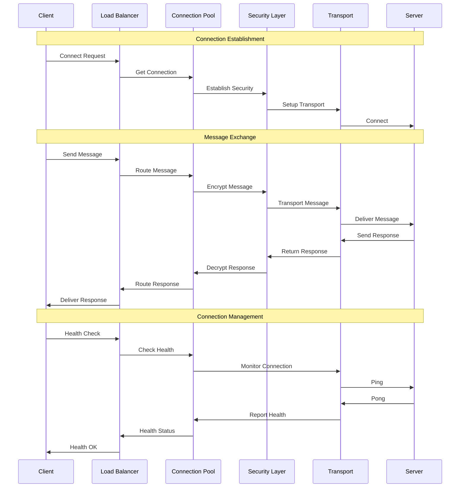
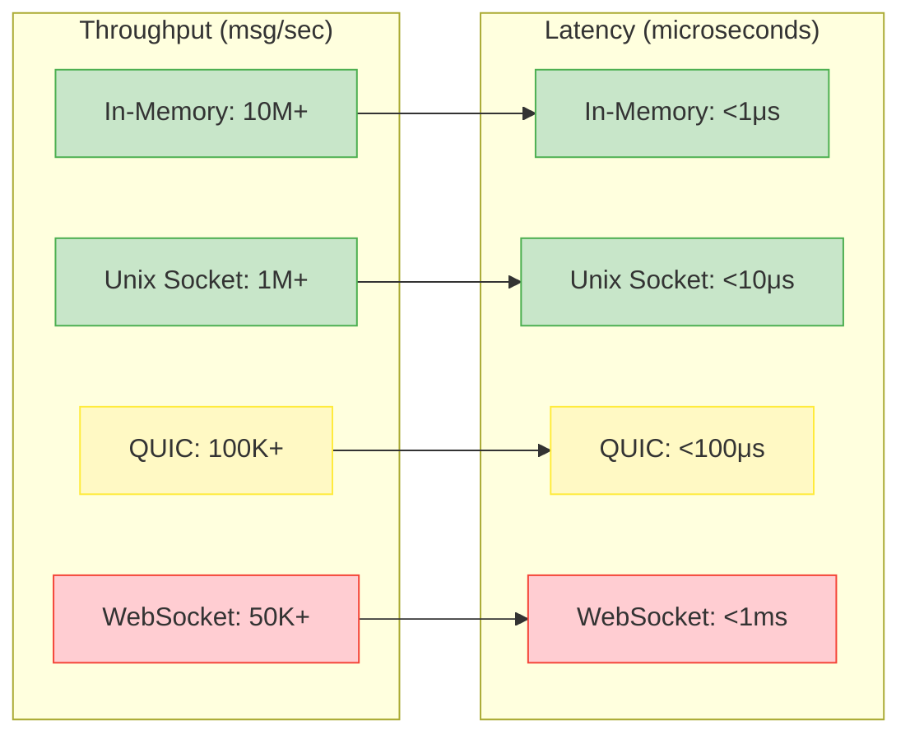
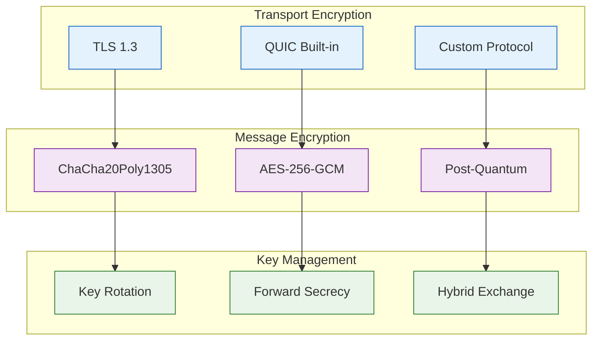
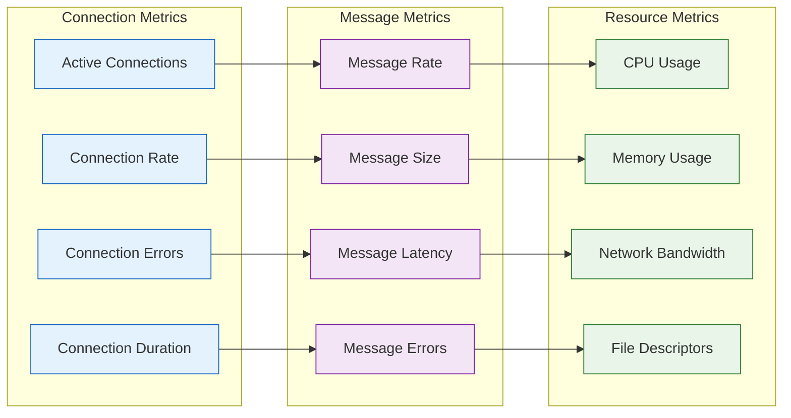

# PolyBus Transport Layer Diagram

## Mermaid Transport Architecture



## PlantUML Transport Components



## Transport Protocol Comparison



## Message Flow Sequence



## Transport Configuration

### QUIC Transport Settings
```yaml
# QUIC transport configuration
quic:
  enabled: true
  bind_address: "0.0.0.0:4001"
  max_connections: 10000
  max_streams_per_connection: 1000
  idle_timeout: "30s"
  keep_alive_interval: "10s"
  initial_rtt: "100ms"
  max_packet_size: 1200
  
  # Post-quantum configuration
  post_quantum:
    enabled: true
    hybrid_mode: true
    algorithms:
      - "kyber768"
      - "x25519"
  
  # Performance tuning
  performance:
    send_buffer_size: "1MB"
    recv_buffer_size: "1MB"
    max_bandwidth: "1Gbps"
    congestion_control: "bbr"
```

### WebSocket Transport Settings
```yaml
# WebSocket transport configuration
websocket:
  enabled: true
  bind_address: "0.0.0.0:8080"
  path: "/polybus/ws"
  max_connections: 5000
  compression: true
  compression_level: 6
  
  # TLS configuration
  tls:
    enabled: true
    cert_file: "/etc/ssl/certs/polybus.crt"
    key_file: "/etc/ssl/private/polybus.key"
    min_version: "1.3"
    
  # Message limits
  limits:
    max_message_size: "16MB"
    max_frame_size: "1MB"
    ping_interval: "30s"
    pong_timeout: "10s"
```

### Unix Socket Transport Settings
```yaml
# Unix socket transport configuration
unix_socket:
  enabled: true
  socket_path: "/var/run/polybus/transport.sock"
  permissions: "0660"
  owner: "polybus"
  group: "polybus"
  
  # Performance optimizations
  performance:
    zero_copy: true
    buffer_size: "64KB"
    batch_size: 100
    
  # Security
  security:
    peer_credentials: true
    selinux_context: "system_u:system_r:polybus_t:s0"
```

## Performance Characteristics

### Throughput Comparison


### Scalability Metrics
- **QUIC Transport**: 10K+ concurrent connections, 1M+ messages/sec
- **WebSocket Transport**: 5K+ concurrent connections, 500K+ messages/sec  
- **Unix Socket Transport**: 1K+ concurrent connections, 10M+ messages/sec
- **In-Memory Transport**: Unlimited connections, 100M+ messages/sec

## Security Features

### Encryption Layers


### Authentication Methods
- **Mutual TLS**: Certificate-based authentication
- **Session Keys**: Purpose-bound session authentication
- **API Keys**: Service-to-service authentication
- **DID Authentication**: Decentralized identity verification

## Monitoring and Observability

### Transport Metrics


### Health Checks
- **Transport Health**: Connection status and performance
- **Security Health**: Certificate validity and encryption status
- **Performance Health**: Latency and throughput monitoring
- **Resource Health**: Memory, CPU, and network utilization

---

This transport layer diagram shows the comprehensive networking infrastructure for PolyBus, including multiple transport protocols, security features, performance optimizations, and reliability mechanisms that enable secure, high-performance messaging across Polymera OS components.
