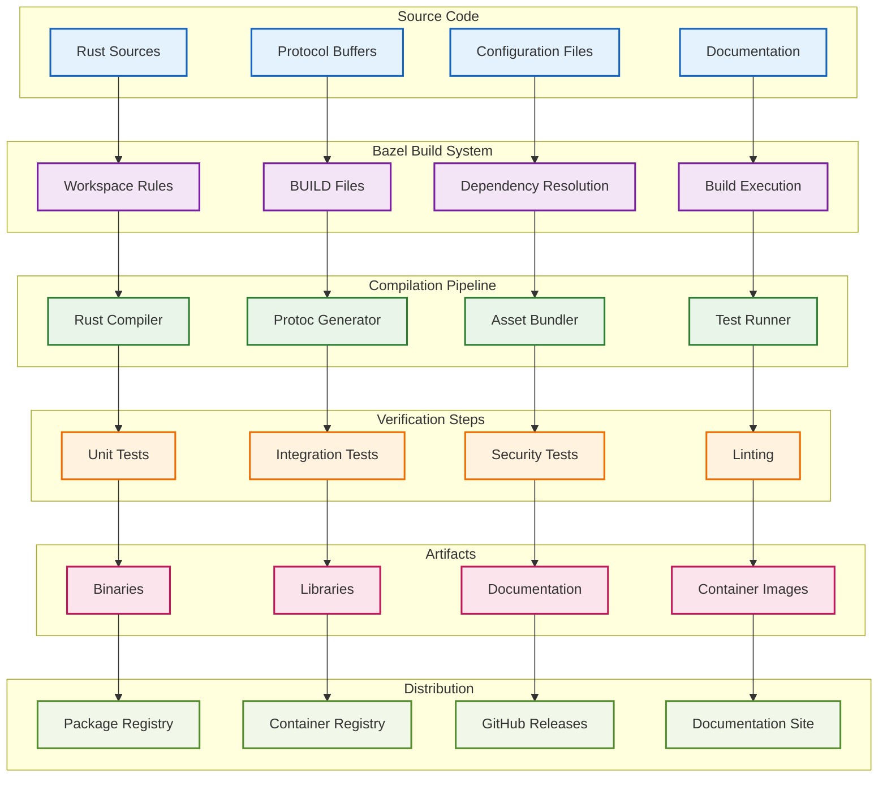
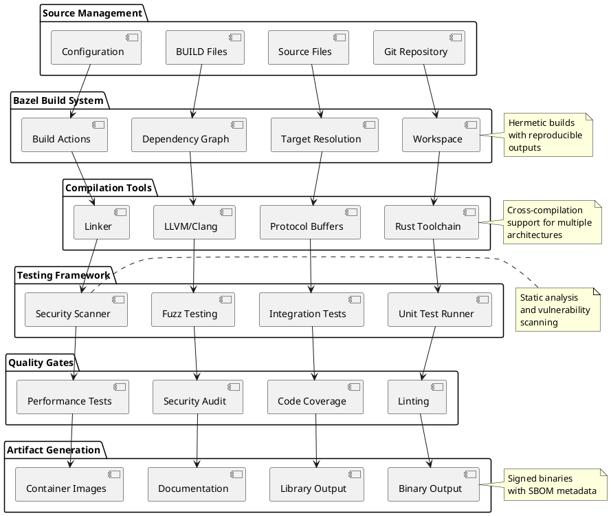
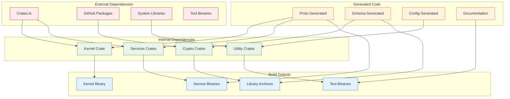
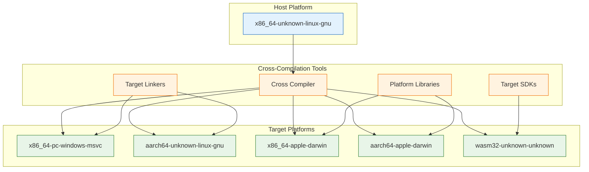
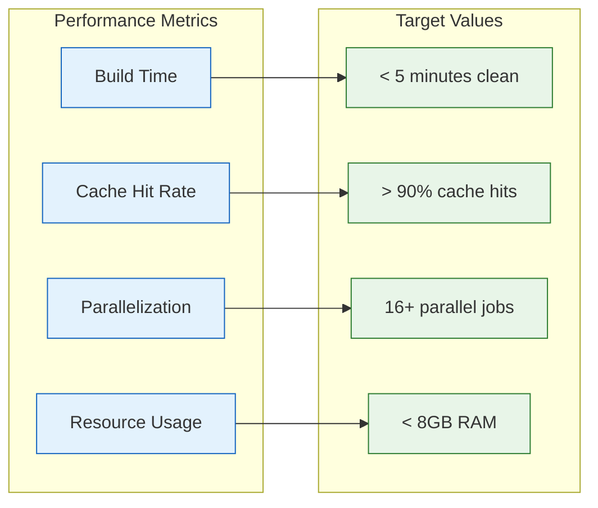
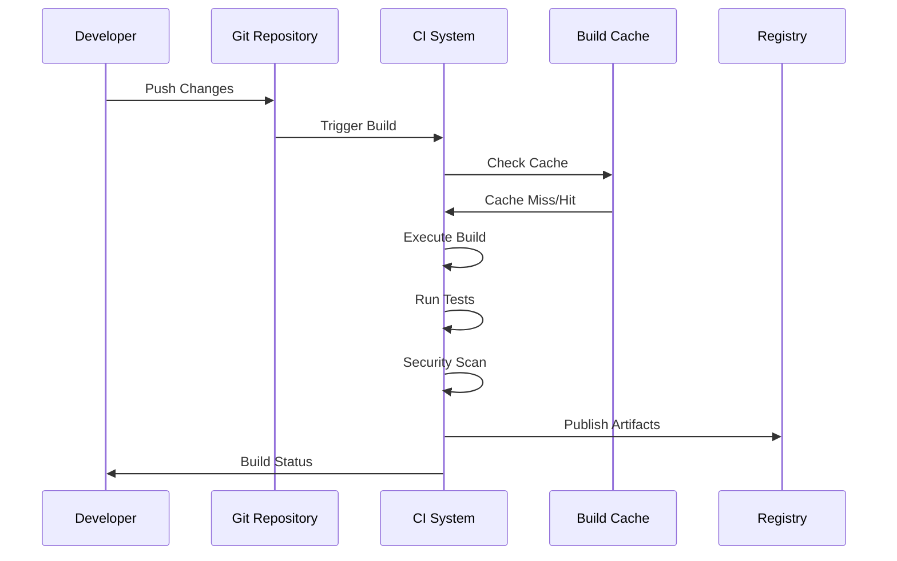

# Build System Diagram

## Mermaid Build Flow



## PlantUML Build Process



## Dependency Graph



## Build Configuration

### Workspace Configuration
```python
# WORKSPACE file
workspace(name = "polymera_os")

# Rust rules
load("@bazel_tools//tools/build_defs/repo:http.bzl", "http_archive")

http_archive(
    name = "rules_rust",
    sha256 = "...",
    urls = ["https://github.com/bazelbuild/rules_rust/releases/..."],
)

load("@rules_rust//rust:repositories.bzl", "rules_rust_dependencies", "rust_register_toolchains")
rules_rust_dependencies()

rust_register_toolchains(
    edition = "2021",
    versions = ["1.70.0"],
)

# Protocol buffer rules
http_archive(
    name = "rules_proto",
    sha256 = "...",
    urls = ["https://github.com/bazelbuild/rules_proto/releases/..."],
)

# Container rules
http_archive(
    name = "rules_oci",
    sha256 = "...",
    urls = ["https://github.com/bazel-contrib/rules_oci/releases/..."],
)
```

### BUILD File Example
```python
# services/keystore/BUILD

load("@rules_rust//rust:defs.bzl", "rust_binary", "rust_library", "rust_test")
load("@rules_proto//proto:defs.bzl", "proto_library")

proto_library(
    name = "keystore_proto",
    srcs = ["keystore.proto"],
    deps = ["//proto:common_proto"],
)

rust_library(
    name = "keystore_lib",
    srcs = glob(["src/**/*.rs"]),
    deps = [
        ":keystore_proto",
        "//crypto:crypto_lib",
        "@crates//:tokio",
        "@crates//:serde",
        "@crates//:tracing",
    ],
    proc_macro_deps = [
        "@crates//:serde_derive",
    ],
)

rust_binary(
    name = "keystore_service",
    srcs = ["src/main.rs"],
    deps = [":keystore_lib"],
)

rust_test(
    name = "keystore_tests",
    crate = ":keystore_lib",
    deps = [
        "@crates//:tokio-test",
        "@crates//:tempfile",
    ],
)

# Fuzz testing
rust_binary(
    name = "keystore_fuzz",
    srcs = ["fuzz/fuzz_targets/keystore.rs"],
    deps = [
        ":keystore_lib",
        "@crates//:libfuzzer-sys",
    ],
)
```

## Build Targets

```mermaid
graph LR
    subgraph "Core Targets"
        A[//kernel:polymera_kernel]
        B[//services:all]
        C[//crypto:crypto_lib]
        D[//proto:all_protos]
    end
    
    subgraph "Service Targets"
        E[//services/keystore:keystore_service]
        F[//services/identity:identity_service]
        G[//services/privacy:privacy_service]
        H[//services/network:network_service]
    end
    
    subgraph "Test Targets"
        I[//...:unit_tests]
        J[//...:integration_tests]
        K[//...:fuzz_tests]
        L[//...:security_tests]
    end
    
    subgraph "Distribution Targets"
        M[//dist:container_images]
        N[//dist:release_artifacts]
        O[//docs:documentation_site]
        P[//tools:developer_tools]
    end
    
    A --> E
    B --> F
    C --> G
    D --> H
    
    E --> I
    F --> J
    G --> K
    H --> L
    
    I --> M
    J --> N
    K --> O
    L --> P
    
    classDef core fill:#e3f2fd,stroke:#1565c0
    classDef services fill:#f3e5f5,stroke:#7b1fa2
    classDef tests fill:#e8f5e8,stroke:#2e7d32
    classDef distribution fill:#fff3e0,stroke:#ef6c00
    
    class A,B,C,D core
    class E,F,G,H services
    class I,J,K,L tests
    class M,N,O,P distribution
```

## Cross-Compilation Support



## Build Performance

### Build Metrics


### Cache Strategy
- **Local Cache**: Build outputs cached locally for faster rebuilds
- **Remote Cache**: Shared cache across development team
- **Content Addressing**: Hermetic builds with content-based caching
- **Incremental Builds**: Only rebuild changed components

## Continuous Integration

### Build Pipeline


### Quality Gates
1. **Compilation**: All targets must compile successfully
2. **Unit Tests**: All unit tests must pass
3. **Integration Tests**: Integration test suite must pass
4. **Security Scan**: No high-severity security issues
5. **Linting**: Code style and quality checks
6. **Coverage**: Minimum code coverage thresholds

---

This build system diagram shows the comprehensive Bazel-based build infrastructure for Polymera OS, including source management, compilation pipelines, testing frameworks, and artifact generation with support for cross-platform builds and continuous integration.
