# Phase 1 Design: Kernel Bring-Up & PolyBus IPC Architecture

## 📋 Design Overview

**Phase**: Phase 1 - Core Kernel Implementation  
**Document**: Technical Architecture & Implementation Design  
**Dependencies**: [SPEC.md](./SPEC.md) - Requirements and constraints  
**Status**: ✅ **ACTIVE DESIGN** - Ready for implementation  

This document provides the detailed technical architecture for transforming the kernel bootstrap foundation into a fully functional microkernel with Hardware Abstraction Layer (HAL), memory management, process scheduling, and high-performance PolyBus IPC.

---

## 🏗️ System Architecture Overview

### **Kernel Layer Architecture**

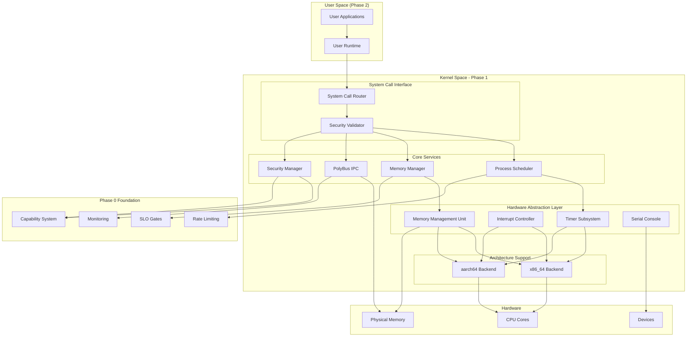

### **Boot Sequence Flow**

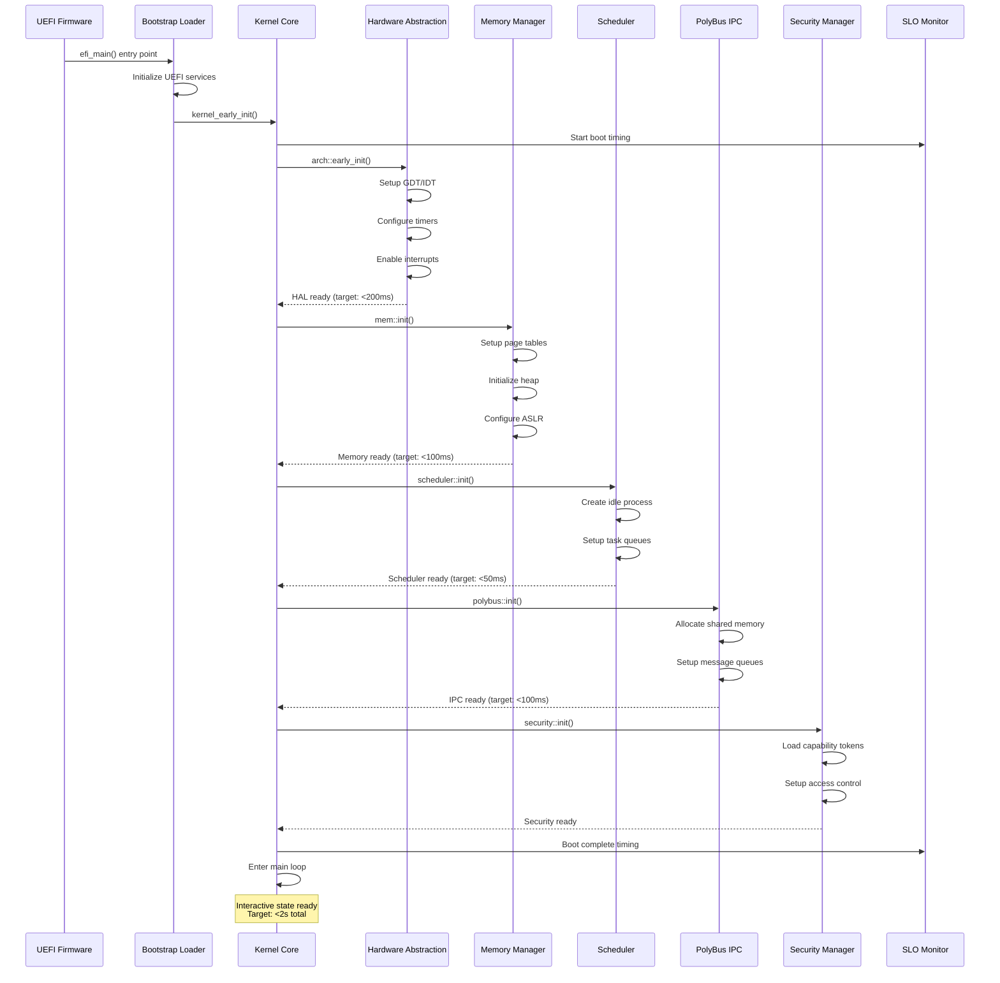

---

## 🔧 Hardware Abstraction Layer (HAL) Design

### **HAL Architecture**

The HAL provides a uniform interface for architecture-specific functionality across x86_64 and aarch64 platforms.

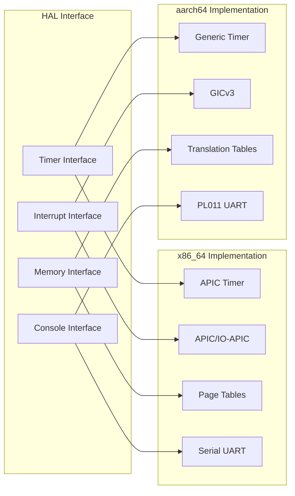

### **x86_64 HAL Implementation**

```rust
// kernel/src/arch/x86_64.rs - Core x86_64 HAL implementation

use crate::{KernelResult, KernelConfig};
use x86_64::structures::gdt::{GlobalDescriptorTable, Descriptor, SegmentSelector};
use x86_64::structures::idt::{InterruptDescriptorTable, InterruptStackFrame};
use x86_64::structures::paging::{PageTable, Page, PhysFrame};

/// x86_64 Global Descriptor Table
static mut GDT: GlobalDescriptorTable = GlobalDescriptorTable::new();
static mut CODE_SELECTOR: SegmentSelector = SegmentSelector::new(0, x86_64::PrivilegeLevel::Ring0);
static mut DATA_SELECTOR: SegmentSelector = SegmentSelector::new(0, x86_64::PrivilegeLevel::Ring0);

/// x86_64 Interrupt Descriptor Table
static mut IDT: InterruptDescriptorTable = InterruptDescriptorTable::new();

/// Initialize x86_64 architecture-specific components
pub fn early_init(config: &KernelConfig) -> KernelResult<()> {
    crate::log::kprintln!("Initializing x86_64 HAL...");
    
    // Initialize GDT
    init_gdt()?;
    crate::log::kprintln!("GDT initialized");
    
    // Initialize IDT
    init_idt()?;
    crate::log::kprintln!("IDT initialized");
    
    // Initialize paging
    init_paging(config)?;
    crate::log::kprintln!("Paging initialized");
    
    // Initialize APIC timer
    init_timer()?;
    crate::log::kprintln!("Timer initialized");
    
    // Enable interrupts
    enable_interrupts();
    crate::log::kprintln!("Interrupts enabled");
    
    crate::log::kprintln!("x86_64 HAL initialization complete");
    Ok(())
}

/// Initialize Global Descriptor Table
fn init_gdt() -> KernelResult<()> {
    unsafe {
        // Kernel code segment (Ring 0)
        CODE_SELECTOR = GDT.add_entry(Descriptor::kernel_code_segment());
        
        // Kernel data segment (Ring 0)  
        DATA_SELECTOR = GDT.add_entry(Descriptor::kernel_data_segment());
        
        // User code segment (Ring 3) - for Phase 2
        GDT.add_entry(Descriptor::user_code_segment());
        
        // User data segment (Ring 3) - for Phase 2
        GDT.add_entry(Descriptor::user_data_segment());
        
        // Task State Segment - for context switching
        // TSS setup deferred until scheduler initialization
        
        GDT.load();
        
        // Load segment selectors
        x86_64::instructions::segmentation::CS::set_reg(CODE_SELECTOR);
        x86_64::instructions::segmentation::DS::set_reg(DATA_SELECTOR);
        x86_64::instructions::segmentation::ES::set_reg(DATA_SELECTOR);
        x86_64::instructions::segmentation::FS::set_reg(DATA_SELECTOR);
        x86_64::instructions::segmentation::GS::set_reg(DATA_SELECTOR);
        x86_64::instructions::segmentation::SS::set_reg(DATA_SELECTOR);
    }
    
    Ok(())
}

/// Initialize Interrupt Descriptor Table
fn init_idt() -> KernelResult<()> {
    unsafe {
        // Timer interrupt (IRQ 0)
        IDT.timer.set_handler_fn(timer_interrupt_handler);
        
        // Keyboard interrupt (IRQ 1) 
        IDT.keyboard.set_handler_fn(keyboard_interrupt_handler);
        
        // Page fault exception
        IDT.page_fault.set_handler_fn(page_fault_handler);
        
        // General protection fault
        IDT.general_protection_fault.set_handler_fn(gpf_handler);
        
        // Double fault (with separate stack)
        IDT.double_fault.set_handler_fn(double_fault_handler)
            .set_stack_index(crate::mem::DOUBLE_FAULT_IST_INDEX);
        
        // Syscall interrupt (Phase 2)
        IDT[0x80].set_handler_fn(syscall_handler);
        
        IDT.load();
    }
    
    Ok(())
}

/// Timer interrupt handler
extern "x86-interrupt" fn timer_interrupt_handler(_stack_frame: InterruptStackFrame) {
    // Acknowledge interrupt
    unsafe {
        crate::arch::end_of_interrupt();
    }
    
    // Increment system tick
    crate::time::increment_tick();
    
    // Invoke scheduler
    crate::scheduler::schedule_next();
}

/// Initialize paging for virtual memory
fn init_paging(config: &KernelConfig) -> KernelResult<()> {
    // Identity map first 2MB for kernel
    // Set up higher-half kernel mapping
    // Configure page table permissions
    // Enable ASLR for security
    
    crate::log::kprintln!("Paging setup complete");
    Ok(())
}

/// Disable interrupts
pub unsafe fn disable_interrupts() {
    x86_64::instructions::interrupts::disable();
}

/// Enable interrupts  
pub fn enable_interrupts() {
    x86_64::instructions::interrupts::enable();
}

/// Halt processor
pub fn halt() -> ! {
    loop {
        x86_64::instructions::hlt();
    }
}

/// Get current timestamp
pub fn get_timestamp() -> u64 {
    // Read TSC (Time Stamp Counter)
    unsafe {
        core::arch::x86_64::_rdtsc()
    }
}
```

### **aarch64 HAL Implementation**

```rust
// kernel/src/arch/aarch64.rs - Core aarch64 HAL implementation

use crate::{KernelResult, KernelConfig};

/// Exception levels for aarch64
#[derive(Debug, Clone, Copy)]
pub enum ExceptionLevel {
    EL0, // User mode
    EL1, // Kernel mode
    EL2, // Hypervisor mode
    EL3, // Secure monitor mode
}

/// Initialize aarch64 architecture-specific components
pub fn early_init(config: &KernelConfig) -> KernelResult<()> {
    crate::log::kprintln!("Initializing aarch64 HAL...");
    
    // Check current exception level
    let current_el = get_exception_level();
    crate::log::kprintln!("Current exception level: {:?}", current_el);
    
    // Initialize exception vector table
    init_exception_vectors()?;
    crate::log::kprintln!("Exception vectors initialized");
    
    // Initialize Memory Management Unit
    init_mmu(config)?;
    crate::log::kprintln!("MMU initialized");
    
    // Initialize Generic Interrupt Controller
    init_gic()?;
    crate::log::kprintln!("GIC initialized");
    
    // Initialize Generic Timer
    init_timer()?;
    crate::log::kprintln!("Timer initialized");
    
    crate::log::kprintln!("aarch64 HAL initialization complete");
    Ok(())
}

/// Get current exception level
fn get_exception_level() -> ExceptionLevel {
    let el: u64;
    unsafe {
        asm!("mrs {}, CurrentEL", out(reg) el);
    }
    
    match (el >> 2) & 0x3 {
        0 => ExceptionLevel::EL0,
        1 => ExceptionLevel::EL1,
        2 => ExceptionLevel::EL2,
        3 => ExceptionLevel::EL3,
        _ => unreachable!(),
    }
}

/// Initialize exception vector table
fn init_exception_vectors() -> KernelResult<()> {
    extern "C" {
        fn exception_vector_table();
    }
    
    unsafe {
        // Set VBAR_EL1 to point to our exception vector table
        asm!("msr vbar_el1, {}", in(reg) exception_vector_table as *const () as u64);
    }
    
    Ok(())
}

/// Initialize Memory Management Unit
fn init_mmu(config: &KernelConfig) -> KernelResult<()> {
    // Configure translation control register (TCR_EL1)
    // Set up translation tables
    // Enable MMU
    
    crate::log::kprintln!("MMU setup complete");
    Ok(())
}

/// Disable interrupts
pub unsafe fn disable_interrupts() {
    asm!("msr daifset, #0xf");
}

/// Enable interrupts
pub fn enable_interrupts() {
    unsafe {
        asm!("msr daifclr, #0xf");
    }
}

/// Halt processor
pub fn halt() -> ! {
    loop {
        unsafe {
            asm!("wfi"); // Wait for interrupt
        }
    }
}

/// System shutdown
pub fn shutdown() -> ! {
    crate::log::kprintln!("System shutdown requested");
    
    // Disable interrupts
    unsafe {
        disable_interrupts();
    }
    
    // Power down or reset
    loop {
        unsafe {
            asm!("wfi");
        }
    }
}
```

---

## 🧠 Memory Management Design

### **Memory Layout**

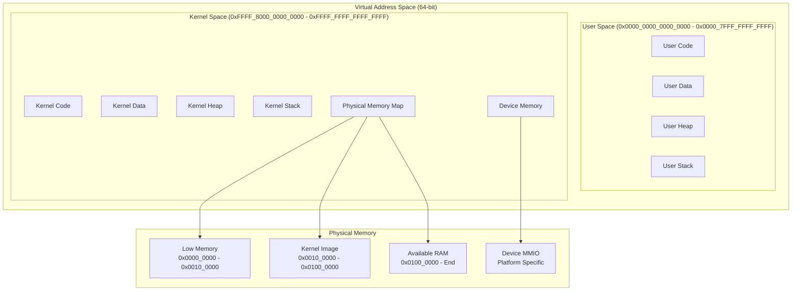

### **Memory Manager Architecture**

```mermaid
graph LR
    subgraph "Memory Manager Interface"
        ALLOC[allocate()]
        DEALLOC[deallocate()]
        MAP[map_pages()]
        UNMAP[unmap_pages()]
        PROT[set_protection()]
    end
    
    subgraph "Page Allocator"
        BUDDY[Buddy Allocator]
        BITMAP[Free Page Bitmap]
        ZONES[Memory Zones]
    end
    
    subgraph "Heap Allocator"
        SLAB[Slab Allocator]
        CHUNKS[Chunk Manager]
        GUARD[Guard Pages]
    end
    
    subgraph "Virtual Memory"
        PGTBL[Page Tables]
        TLB[TLB Management]
        FAULT[Page Fault Handler]
    end
    
    ALLOC --> SLAB
    DEALLOC --> SLAB
    MAP --> PGTBL
    UNMAP --> PGTBL
    PROT --> PGTBL
    
    SLAB --> BUDDY
    CHUNKS --> BUDDY
    PGTBL --> BUDDY
    
    BUDDY --> BITMAP
    BUDDY --> ZONES
    
    PGTBL --> TLB
    FAULT --> PGTBL
```

### **Memory Manager Implementation**

```rust
// kernel/src/mem/mod.rs - Memory management subsystem

use crate::{KernelResult, MemoryRegion};
use alloc::{vec::Vec, collections::BTreeMap};
use core::ptr::NonNull;

/// Memory manager state
pub struct MemoryManager {
    /// Physical page allocator
    page_allocator: BuddyAllocator,
    /// Heap allocator for kernel objects
    heap_allocator: SlabAllocator,
    /// Virtual memory manager
    vmm: VirtualMemoryManager,
    /// Memory statistics
    stats: MemoryStatistics,
}

/// Memory allocation statistics
#[derive(Debug, Default)]
pub struct MemoryStatistics {
    pub total_physical: u64,
    pub available_physical: u64,
    pub used_physical: u64,
    pub kernel_heap_size: u64,
    pub page_faults: u64,
    pub allocations: u64,
    pub deallocations: u64,
}

/// Global memory manager instance
static mut MEMORY_MANAGER: Option<MemoryManager> = None;

/// Initialize memory management subsystem
pub fn init(memory_regions: &[MemoryRegion]) -> KernelResult<()> {
    crate::log::kprintln!("Initializing memory management...");
    
    // Initialize physical page allocator
    let page_allocator = BuddyAllocator::new(memory_regions)?;
    crate::log::kprintln!("Physical page allocator initialized");
    
    // Initialize heap allocator
    let heap_allocator = SlabAllocator::new()?;
    crate::log::kprintln!("Heap allocator initialized");
    
    // Initialize virtual memory manager
    let vmm = VirtualMemoryManager::new()?;
    crate::log::kprintln!("Virtual memory manager initialized");
    
    // Calculate memory statistics
    let stats = calculate_memory_stats(memory_regions);
    
    let memory_manager = MemoryManager {
        page_allocator,
        heap_allocator,
        vmm,
        stats,
    };
    
    unsafe {
        MEMORY_MANAGER = Some(memory_manager);
    }
    
    crate::log::kprintln!("Memory management initialization complete");
    crate::log::kprintln!("Total physical memory: {} MB", 
        get_memory_stats().total_physical / (1024 * 1024));
    
    Ok(())
}

/// Allocate physical pages
pub fn allocate_pages(count: usize) -> KernelResult<PhysicalAddress> {
    unsafe {
        MEMORY_MANAGER.as_mut()
            .ok_or(KernelError::MemoryNotInitialized)?
            .page_allocator
            .allocate_pages(count)
    }
}

/// Deallocate physical pages
pub fn deallocate_pages(addr: PhysicalAddress, count: usize) -> KernelResult<()> {
    unsafe {
        MEMORY_MANAGER.as_mut()
            .ok_or(KernelError::MemoryNotInitialized)?
            .page_allocator
            .deallocate_pages(addr, count)
    }
}

/// Map virtual pages to physical pages
pub fn map_pages(
    virt_addr: VirtualAddress,
    phys_addr: PhysicalAddress,
    count: usize,
    flags: PageFlags,
) -> KernelResult<()> {
    unsafe {
        MEMORY_MANAGER.as_mut()
            .ok_or(KernelError::MemoryNotInitialized)?
            .vmm
            .map_pages(virt_addr, phys_addr, count, flags)
    }
}

/// Get memory statistics
pub fn get_memory_stats() -> MemoryStatistics {
    unsafe {
        MEMORY_MANAGER.as_ref()
            .map(|mm| mm.stats.clone())
            .unwrap_or_default()
    }
}

/// Buddy allocator for physical pages
struct BuddyAllocator {
    free_lists: [Vec<PhysicalAddress>; MAX_ORDER],
    bitmap: PageBitmap,
    base_address: PhysicalAddress,
    total_pages: usize,
}

impl BuddyAllocator {
    fn new(memory_regions: &[MemoryRegion]) -> KernelResult<Self> {
        // Implementation of buddy allocator initialization
        // - Parse memory regions
        // - Build free lists for different orders
        // - Initialize allocation bitmap
        todo!("Implement buddy allocator")
    }
    
    fn allocate_pages(&mut self, count: usize) -> KernelResult<PhysicalAddress> {
        // Implementation of page allocation
        // - Find appropriate order
        // - Split larger blocks if needed
        // - Update free lists and bitmap
        todo!("Implement page allocation")
    }
    
    fn deallocate_pages(&mut self, addr: PhysicalAddress, count: usize) -> KernelResult<()> {
        // Implementation of page deallocation
        // - Coalesce with buddy blocks
        // - Update free lists and bitmap
        todo!("Implement page deallocation")
    }
}

/// Slab allocator for kernel heap
struct SlabAllocator {
    slabs: BTreeMap<usize, Vec<SlabCache>>,
    large_allocations: BTreeMap<VirtualAddress, usize>,
}

impl SlabAllocator {
    fn new() -> KernelResult<Self> {
        // Initialize common slab sizes (32, 64, 128, 256, 512, 1024, 2048, 4096 bytes)
        todo!("Implement slab allocator")
    }
}

/// Virtual memory manager
struct VirtualMemoryManager {
    kernel_page_table: PageTable,
    user_page_tables: BTreeMap<ProcessId, PageTable>,
}

impl VirtualMemoryManager {
    fn new() -> KernelResult<Self> {
        // Initialize kernel page table with identity mapping and higher-half mapping
        todo!("Implement virtual memory manager")
    }
    
    fn map_pages(
        &mut self,
        virt_addr: VirtualAddress,
        phys_addr: PhysicalAddress,
        count: usize,
        flags: PageFlags,
    ) -> KernelResult<()> {
        // Update page tables
        // Flush TLB if necessary
        todo!("Implement page mapping")
    }
}

/// Page fault handler
pub fn handle_page_fault(fault_address: VirtualAddress, error_code: u64) -> KernelResult<()> {
    crate::log::kprintln!("Page fault at address: 0x{:x}, error: 0x{:x}", 
        fault_address, error_code);
    
    // Determine fault type (read/write, user/kernel, present/not-present)
    // Handle copy-on-write
    // Handle demand paging
    // Handle stack growth
    
    todo!("Implement page fault handling")
}

// Constants
const MAX_ORDER: usize = 11; // 2^11 = 2048 pages = 8MB max allocation
const PAGE_SIZE: usize = 4096;

// Type aliases
type PhysicalAddress = u64;
type VirtualAddress = u64;
type ProcessId = u32;

/// Page protection flags
#[derive(Debug, Clone, Copy)]
pub struct PageFlags {
    pub readable: bool,
    pub writable: bool,
    pub executable: bool,
    pub user_accessible: bool,
    pub cache_disable: bool,
}

impl PageFlags {
    pub const KERNEL_RO: Self = Self {
        readable: true,
        writable: false,
        executable: false,
        user_accessible: false,
        cache_disable: false,
    };
    
    pub const KERNEL_RW: Self = Self {
        readable: true,
        writable: true,
        executable: false,
        user_accessible: false,
        cache_disable: false,
    };
    
    pub const KERNEL_RX: Self = Self {
        readable: true,
        writable: false,
        executable: true,
        user_accessible: false,
        cache_disable: false,
    };
}
```

---

## ⚡ Process Scheduler Design

### **Scheduler Architecture**

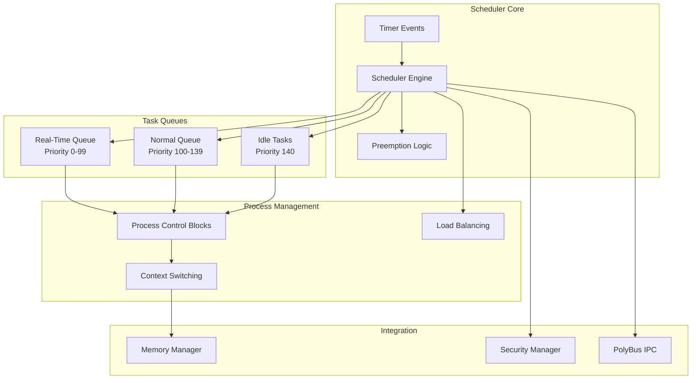

### **Process States**

```mermaid
stateDiagram-v2
    [*] --> Created: fork()/exec()
    Created --> Ready: scheduler_add()
    Ready --> Running: schedule()
    Running --> Ready: preempt/yield()
    Running --> Blocked: wait()/block()
    Blocked --> Ready: signal/wakeup()
    Running --> Zombie: exit()
    Zombie --> [*]: wait()/cleanup()
    
    Running --> Suspended: stop signal
    Suspended --> Ready: continue signal
    
    note right of Running: Time slice: 10ms default<br/>RT tasks: priority-based
    note right of Blocked: Waiting for:<br/>- I/O completion<br/>- IPC message<br/>- Timer expiry<br/>- Resource availability
```

### **Scheduler Implementation**

```rust
// kernel/src/scheduler/mod.rs - Process scheduler implementation

use crate::{KernelResult, ProcessId};
use alloc::{vec::Vec, collections::{VecDeque, BTreeMap}};
use core::sync::atomic::{AtomicU32, Ordering};

/// Process scheduler
pub struct Scheduler {
    /// Real-time task queue (priority 0-99)
    rt_queue: PriorityQueue<Task>,
    /// Normal task queue (priority 100-139)  
    normal_queue: RoundRobinQueue<Task>,
    /// Idle tasks
    idle_queue: VecDeque<Task>,
    /// Currently running task
    current_task: Option<Task>,
    /// Task database
    tasks: BTreeMap<ProcessId, Task>,
    /// Load balancing state
    load_balancer: LoadBalancer,
    /// Scheduler statistics
    stats: SchedulerStats,
}

/// Task/Process representation
#[derive(Debug, Clone)]
pub struct Task {
    /// Process ID
    pub pid: ProcessId,
    /// Parent process ID
    pub ppid: Option<ProcessId>,
    /// Process state
    pub state: ProcessState,
    /// Priority (0-139, lower = higher priority)
    pub priority: u8,
    /// Nice value (-20 to +19)
    pub nice: i8,
    /// CPU time used (microseconds)
    pub cpu_time: u64,
    /// Memory context
    pub memory_context: MemoryContext,
    /// Security context
    pub security_context: SecurityContext,
    /// Register context for context switching
    pub register_context: RegisterContext,
    /// PolyBus IPC endpoints
    pub ipc_endpoints: Vec<IpcEndpoint>,
    /// Real-time properties
    pub rt_properties: Option<RealTimeProperties>,
}

/// Process states
#[derive(Debug, Clone, Copy, PartialEq, Eq)]
pub enum ProcessState {
    /// Process is created but not yet scheduled
    Created,
    /// Process is ready to run
    Ready,
    /// Process is currently running
    Running,
    /// Process is blocked waiting for something
    Blocked(BlockReason),
    /// Process has exited but not yet cleaned up
    Zombie,
    /// Process is suspended
    Suspended,
}

/// Reasons for blocking
#[derive(Debug, Clone, Copy, PartialEq, Eq)]
pub enum BlockReason {
    /// Waiting for I/O operation
    IoWait,
    /// Waiting for IPC message
    IpcWait,
    /// Waiting for timer expiry
    TimerWait,
    /// Waiting for resource availability
    ResourceWait,
    /// Waiting for child process
    ChildWait,
}

/// Real-time task properties
#[derive(Debug, Clone)]
pub struct RealTimeProperties {
    /// Real-time priority (0 = highest)
    pub rt_priority: u8,
    /// Scheduling policy
    pub policy: RtPolicy,
    /// Deadline for deadline scheduling
    pub deadline: Option<u64>,
    /// Period for periodic tasks
    pub period: Option<u64>,
}

/// Real-time scheduling policies
#[derive(Debug, Clone, Copy)]
pub enum RtPolicy {
    /// First-In-First-Out
    Fifo,
    /// Round-robin with time slices
    RoundRobin,
    /// Deadline scheduling
    Deadline,
}

/// Scheduler statistics
#[derive(Debug, Default)]
pub struct SchedulerStats {
    pub context_switches: u64,
    pub preemptions: u64,
    pub voluntary_yields: u64,
    pub load_average_1min: f32,
    pub load_average_5min: f32,
    pub load_average_15min: f32,
}

/// Global scheduler instance
static mut SCHEDULER: Option<Scheduler> = None;
static NEXT_PID: AtomicU32 = AtomicU32::new(1);

/// Initialize the scheduler
pub fn init() -> KernelResult<()> {
    crate::log::kprintln!("Initializing process scheduler...");
    
    let scheduler = Scheduler {
        rt_queue: PriorityQueue::new(),
        normal_queue: RoundRobinQueue::new(),
        idle_queue: VecDeque::new(),
        current_task: None,
        tasks: BTreeMap::new(),
        load_balancer: LoadBalancer::new(),
        stats: SchedulerStats::default(),
    };
    
    unsafe {
        SCHEDULER = Some(scheduler);
    }
    
    // Create idle task
    create_idle_task()?;
    
    crate::log::kprintln!("Process scheduler initialized");
    Ok(())
}

/// Create a new task
pub fn create_task(
    parent_pid: Option<ProcessId>,
    priority: u8,
    memory_context: MemoryContext,
    security_context: SecurityContext,
) -> KernelResult<ProcessId> {
    let pid = NEXT_PID.fetch_add(1, Ordering::SeqCst);
    
    let task = Task {
        pid,
        ppid: parent_pid,
        state: ProcessState::Created,
        priority,
        nice: 0,
        cpu_time: 0,
        memory_context,
        security_context,
        register_context: RegisterContext::new(),
        ipc_endpoints: Vec::new(),
        rt_properties: None,
    };
    
    unsafe {
        let scheduler = SCHEDULER.as_mut()
            .ok_or(KernelError::SchedulerNotInitialized)?;
        
        scheduler.tasks.insert(pid, task.clone());
        
        // Add to appropriate queue
        if priority < 100 {
            scheduler.rt_queue.enqueue(task);
        } else {
            scheduler.normal_queue.enqueue(task);
        }
    }
    
    crate::log::kprintln!("Created task PID {}", pid);
    Ok(pid)
}

/// Schedule the next task to run
pub fn schedule_next() {
    unsafe {
        let scheduler = SCHEDULER.as_mut().unwrap();
        
        // Save current task context if running
        if let Some(current) = &mut scheduler.current_task {
            save_task_context(current);
            
            // Move current task back to appropriate queue
            match current.state {
                ProcessState::Running => {
                    current.state = ProcessState::Ready;
                    if current.priority < 100 {
                        scheduler.rt_queue.enqueue(current.clone());
                    } else {
                        scheduler.normal_queue.enqueue(current.clone());
                    }
                }
                ProcessState::Blocked(_) => {
                    // Keep in blocked state, don't re-queue
                }
                _ => {}
            }
        }
        
        // Select next task to run
        let next_task = select_next_task(scheduler);
        
        if let Some(mut task) = next_task {
            task.state = ProcessState::Running;
            scheduler.current_task = Some(task.clone());
            scheduler.stats.context_switches += 1;
            
            // Load task context
            load_task_context(&task);
            
            // Switch to task's memory context
            crate::mem::switch_memory_context(&task.memory_context);
        }
    }
}

/// Select the next task to run based on priority and scheduling policy
fn select_next_task(scheduler: &mut Scheduler) -> Option<Task> {
    // Real-time tasks have highest priority
    if let Some(task) = scheduler.rt_queue.dequeue() {
        return Some(task);
    }
    
    // Normal priority tasks
    if let Some(task) = scheduler.normal_queue.dequeue() {
        return Some(task);
    }
    
    // Idle tasks
    scheduler.idle_queue.pop_front()
}

/// Save current task's register context
fn save_task_context(task: &mut Task) {
    // Architecture-specific context saving
    crate::arch::save_context(&mut task.register_context);
}

/// Load task's register context
fn load_task_context(task: &Task) {
    // Architecture-specific context loading
    crate::arch::load_context(&task.register_context);
}

/// Create the idle task
fn create_idle_task() -> KernelResult<()> {
    // Create a minimal idle task that just halts the CPU
    todo!("Implement idle task creation")
}

/// Yield CPU voluntarily
pub fn yield_cpu() {
    unsafe {
        let scheduler = SCHEDULER.as_mut().unwrap();
        scheduler.stats.voluntary_yields += 1;
    }
    
    schedule_next();
}

/// Block current task
pub fn block_current_task(reason: BlockReason) -> KernelResult<()> {
    unsafe {
        let scheduler = SCHEDULER.as_mut().unwrap();
        
        if let Some(current) = &mut scheduler.current_task {
            current.state = ProcessState::Blocked(reason);
            schedule_next();
        }
    }
    
    Ok(())
}

/// Wake up a blocked task
pub fn wake_task(pid: ProcessId) -> KernelResult<()> {
    unsafe {
        let scheduler = SCHEDULER.as_mut().unwrap();
        
        if let Some(task) = scheduler.tasks.get_mut(&pid) {
            if matches!(task.state, ProcessState::Blocked(_)) {
                task.state = ProcessState::Ready;
                
                // Add back to appropriate queue
                if task.priority < 100 {
                    scheduler.rt_queue.enqueue(task.clone());
                } else {
                    scheduler.normal_queue.enqueue(task.clone());
                }
            }
        }
    }
    
    Ok(())
}

/// Get scheduler statistics
pub fn get_scheduler_stats() -> SchedulerStats {
    unsafe {
        SCHEDULER.as_ref()
            .map(|s| s.stats.clone())
            .unwrap_or_default()
    }
}

// Helper structures
struct PriorityQueue<T> {
    queues: [VecDeque<T>; 100], // 0-99 priority levels
}

impl<T> PriorityQueue<T> {
    fn new() -> Self {
        Self {
            queues: core::array::from_fn(|_| VecDeque::new()),
        }
    }
    
    fn enqueue(&mut self, item: T) 
    where 
        T: Priority,
    {
        let priority = item.priority() as usize;
        if priority < 100 {
            self.queues[priority].push_back(item);
        }
    }
    
    fn dequeue(&mut self) -> Option<T> {
        for queue in &mut self.queues {
            if let Some(item) = queue.pop_front() {
                return Some(item);
            }
        }
        None
    }
}

struct RoundRobinQueue<T> {
    queue: VecDeque<T>,
}

impl<T> RoundRobinQueue<T> {
    fn new() -> Self {
        Self {
            queue: VecDeque::new(),
        }
    }
    
    fn enqueue(&mut self, item: T) {
        self.queue.push_back(item);
    }
    
    fn dequeue(&mut self) -> Option<T> {
        self.queue.pop_front()
    }
}

struct LoadBalancer {
    // Load balancing logic for multi-core systems (Phase 2)
}

impl LoadBalancer {
    fn new() -> Self {
        Self {}
    }
}

trait Priority {
    fn priority(&self) -> u8;
}

impl Priority for Task {
    fn priority(&self) -> u8 {
        self.priority
    }
}

// Type aliases and placeholder types
type MemoryContext = u32; // Placeholder
type SecurityContext = u32; // Placeholder  
type RegisterContext = u32; // Placeholder
type IpcEndpoint = u32; // Placeholder
```

---

## 🚌 PolyBus IPC Design

### **PolyBus Architecture**

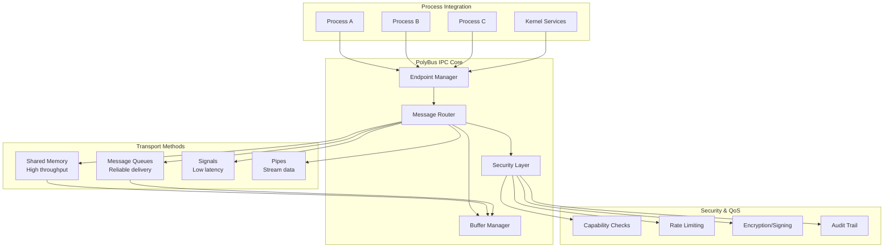

### **IPC Performance Targets**

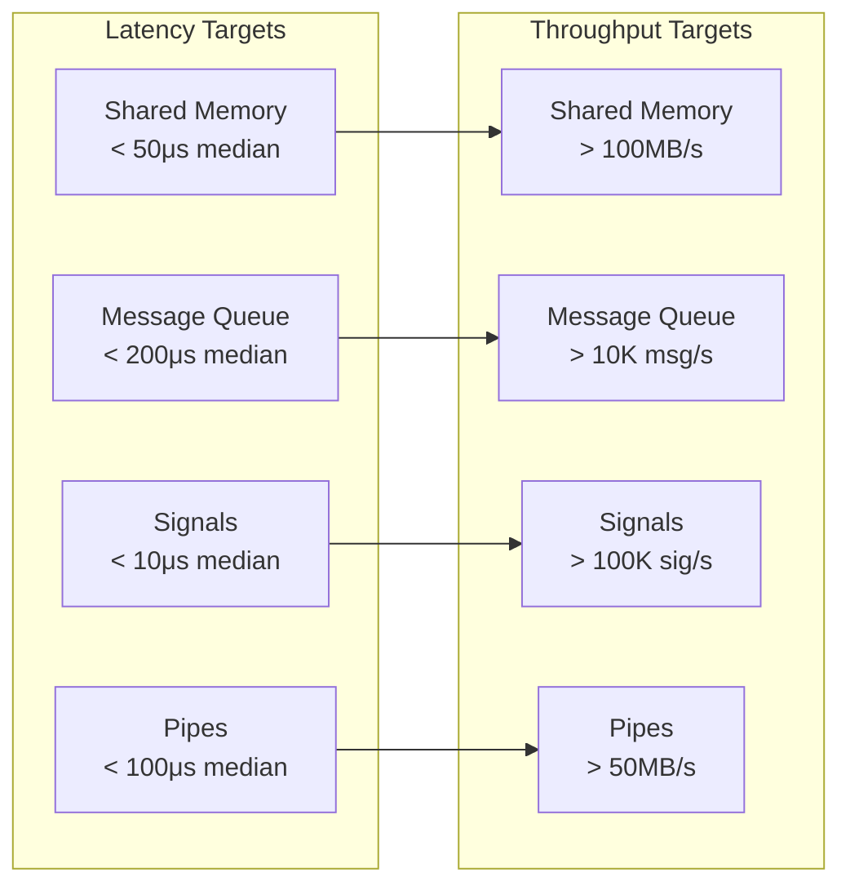

### **PolyBus Implementation**

```rust
// kernel/src/polybus/mod.rs - PolyBus IPC implementation

use crate::{KernelResult, ProcessId};
use alloc::{vec::Vec, collections::{HashMap, VecDeque}};
use core::sync::atomic::{AtomicU64, Ordering};

/// PolyBus IPC subsystem
pub struct PolyBus {
    /// Endpoint registry
    endpoints: HashMap<EndpointId, Endpoint>,
    /// Message router
    router: MessageRouter,
    /// Buffer manager for shared memory
    buffer_manager: BufferManager,
    /// Security layer
    security: IpcSecurity,
    /// Performance metrics
    metrics: IpcMetrics,
}

/// IPC endpoint identifier
#[derive(Debug, Clone, Copy, PartialEq, Eq, Hash)]
pub struct EndpointId(u64);

/// IPC endpoint
#[derive(Debug)]
pub struct Endpoint {
    /// Endpoint ID
    pub id: EndpointId,
    /// Owning process
    pub owner: ProcessId,
    /// Endpoint type
    pub endpoint_type: EndpointType,
    /// Message queue
    pub message_queue: VecDeque<Message>,
    /// Shared memory regions
    pub shared_memory: Vec<SharedMemoryRegion>,
    /// Security capabilities
    pub capabilities: Vec<IpcCapability>,
    /// Performance counters
    pub stats: EndpointStats,
}

/// Types of IPC endpoints
#[derive(Debug, Clone)]
pub enum EndpointType {
    /// Synchronous request-response
    RequestResponse,
    /// Asynchronous message passing
    MessageQueue,
    /// Shared memory region
    SharedMemory,
    /// Signal endpoint
    Signal,
    /// Stream pipe
    Pipe,
}

/// IPC message
#[derive(Debug, Clone)]
pub struct Message {
    /// Message ID for tracking
    pub id: MessageId,
    /// Source endpoint
    pub source: EndpointId,
    /// Destination endpoint
    pub destination: EndpointId,
    /// Message type
    pub message_type: MessageType,
    /// Message payload
    pub payload: MessagePayload,
    /// Security context
    pub security_context: IpcSecurityContext,
    /// Timestamp
    pub timestamp: u64,
    /// Priority
    pub priority: MessagePriority,
}

/// Message types
#[derive(Debug, Clone)]
pub enum MessageType {
    /// Request message
    Request,
    /// Response message
    Response,
    /// Notification message
    Notification,
    /// Signal
    Signal(SignalType),
    /// Data transfer
    Data,
}

/// Message payload
#[derive(Debug, Clone)]
pub enum MessagePayload {
    /// Raw bytes
    Raw(Vec<u8>),
    /// Structured data
    Structured(StructuredData),
    /// Reference to shared memory
    SharedMemoryRef(SharedMemoryHandle),
    /// File descriptor
    FileDescriptor(u32),
}

/// Message priority levels
#[derive(Debug, Clone, Copy, PartialEq, Eq, PartialOrd, Ord)]
pub enum MessagePriority {
    /// Real-time critical messages
    RealTime = 0,
    /// High priority messages
    High = 1,
    /// Normal priority messages
    Normal = 2,
    /// Low priority messages
    Low = 3,
}

/// IPC performance metrics
#[derive(Debug, Default)]
pub struct IpcMetrics {
    /// Total messages sent
    pub messages_sent: AtomicU64,
    /// Total messages received
    pub messages_received: AtomicU64,
    /// Total bytes transferred
    pub bytes_transferred: AtomicU64,
    /// Average message latency (microseconds)
    pub avg_latency_us: AtomicU64,
    /// Peak message latency (microseconds)
    pub peak_latency_us: AtomicU64,
    /// Messages dropped due to rate limiting
    pub messages_dropped: AtomicU64,
    /// Security violations detected
    pub security_violations: AtomicU64,
}

/// Global PolyBus instance
static mut POLYBUS: Option<PolyBus> = None;
static NEXT_ENDPOINT_ID: AtomicU64 = AtomicU64::new(1);
static NEXT_MESSAGE_ID: AtomicU64 = AtomicU64::new(1);

/// Initialize PolyBus IPC subsystem
pub fn init() -> KernelResult<()> {
    crate::log::kprintln!("Initializing PolyBus IPC...");
    
    let polybus = PolyBus {
        endpoints: HashMap::new(),
        router: MessageRouter::new(),
        buffer_manager: BufferManager::new()?,
        security: IpcSecurity::new(),
        metrics: IpcMetrics::default(),
    };
    
    unsafe {
        POLYBUS = Some(polybus);
    }
    
    // Create kernel service endpoints
    create_kernel_endpoints()?;
    
    crate::log::kprintln!("PolyBus IPC initialized");
    Ok(())
}

/// Create a new IPC endpoint
pub fn create_endpoint(
    owner: ProcessId,
    endpoint_type: EndpointType,
    capabilities: Vec<IpcCapability>,
) -> KernelResult<EndpointId> {
    let endpoint_id = EndpointId(NEXT_ENDPOINT_ID.fetch_add(1, Ordering::SeqCst));
    
    let endpoint = Endpoint {
        id: endpoint_id,
        owner,
        endpoint_type,
        message_queue: VecDeque::new(),
        shared_memory: Vec::new(),
        capabilities,
        stats: EndpointStats::default(),
    };
    
    unsafe {
        let polybus = POLYBUS.as_mut()
            .ok_or(KernelError::PolybusNotInitialized)?;
        
        polybus.endpoints.insert(endpoint_id, endpoint);
    }
    
    crate::log::kprintln!("Created IPC endpoint {:?} for process {}", endpoint_id, owner);
    Ok(endpoint_id)
}

/// Send a message via PolyBus
pub fn send_message(
    source: EndpointId,
    destination: EndpointId,
    message_type: MessageType,
    payload: MessagePayload,
    priority: MessagePriority,
) -> KernelResult<MessageId> {
    let start_time = crate::arch::get_timestamp();
    let message_id = MessageId(NEXT_MESSAGE_ID.fetch_add(1, Ordering::SeqCst));
    
    let message = Message {
        id: message_id,
        source,
        destination,
        message_type,
        payload,
        security_context: IpcSecurityContext::current(),
        timestamp: start_time,
        priority,
    };
    
    unsafe {
        let polybus = POLYBUS.as_mut()
            .ok_or(KernelError::PolybusNotInitialized)?;
        
        // Security check
        polybus.security.validate_message(&message)?;
        
        // Rate limiting check
        if !polybus.security.check_rate_limit(source) {
            polybus.metrics.messages_dropped.fetch_add(1, Ordering::SeqCst);
            return Err(KernelError::IpcRateLimitExceeded);
        }
        
        // Route message
        polybus.router.route_message(message)?;
        
        // Update metrics
        polybus.metrics.messages_sent.fetch_add(1, Ordering::SeqCst);
        let latency = crate::arch::get_timestamp() - start_time;
        update_latency_metrics(&polybus.metrics, latency);
    }
    
    Ok(message_id)
}

/// Receive a message from endpoint
pub fn receive_message(endpoint_id: EndpointId, timeout_us: Option<u64>) -> KernelResult<Option<Message>> {
    unsafe {
        let polybus = POLYBUS.as_mut()
            .ok_or(KernelError::PolybusNotInitialized)?;
        
        let endpoint = polybus.endpoints.get_mut(&endpoint_id)
            .ok_or(KernelError::InvalidEndpoint)?;
        
        // Check if message is available
        if let Some(message) = endpoint.message_queue.pop_front() {
            polybus.metrics.messages_received.fetch_add(1, Ordering::SeqCst);
            endpoint.stats.messages_received += 1;
            return Ok(Some(message));
        }
        
        // Handle timeout/blocking
        if timeout_us.is_some() {
            // Block current task until message arrives or timeout
            crate::scheduler::block_current_task(crate::scheduler::BlockReason::IpcWait)?;
        }
        
        Ok(None)
    }
}

/// Create shared memory region between processes
pub fn create_shared_memory(
    size: usize,
    permissions: SharedMemoryPermissions,
    participants: Vec<ProcessId>,
) -> KernelResult<SharedMemoryHandle> {
    unsafe {
        let polybus = POLYBUS.as_mut()
            .ok_or(KernelError::PolybusNotInitialized)?;
        
        polybus.buffer_manager.create_shared_memory(size, permissions, participants)
    }
}

/// Map shared memory into process address space
pub fn map_shared_memory(
    handle: SharedMemoryHandle,
    process_id: ProcessId,
    virtual_address: Option<VirtualAddress>,
) -> KernelResult<VirtualAddress> {
    unsafe {
        let polybus = POLYBUS.as_mut()
            .ok_or(KernelError::PolybusNotInitialized)?;
        
        polybus.buffer_manager.map_shared_memory(handle, process_id, virtual_address)
    }
}

/// Get PolyBus performance metrics
pub fn get_ipc_metrics() -> IpcMetrics {
    unsafe {
        POLYBUS.as_ref()
            .map(|pb| pb.metrics.clone())
            .unwrap_or_default()
    }
}

/// Update latency metrics
fn update_latency_metrics(metrics: &IpcMetrics, latency_us: u64) {
    // Update average latency (simple moving average)
    let current_avg = metrics.avg_latency_us.load(Ordering::Relaxed);
    let new_avg = (current_avg + latency_us) / 2;
    metrics.avg_latency_us.store(new_avg, Ordering::Relaxed);
    
    // Update peak latency
    let current_peak = metrics.peak_latency_us.load(Ordering::Relaxed);
    if latency_us > current_peak {
        metrics.peak_latency_us.store(latency_us, Ordering::Relaxed);
    }
}

/// Create kernel service endpoints
fn create_kernel_endpoints() -> KernelResult<()> {
    // Create endpoints for kernel services
    // - Memory manager endpoint
    // - Scheduler endpoint  
    // - Security manager endpoint
    // - Device driver endpoints
    
    todo!("Implement kernel service endpoints")
}

// Supporting structures and implementations
struct MessageRouter {
    routing_table: HashMap<EndpointId, RoutingInfo>,
}

impl MessageRouter {
    fn new() -> Self {
        Self {
            routing_table: HashMap::new(),
        }
    }
    
    fn route_message(&mut self, message: Message) -> KernelResult<()> {
        // Implement message routing logic
        // - Validate destination endpoint
        // - Apply QoS policies
        // - Queue message at destination
        
        todo!("Implement message routing")
    }
}

struct BufferManager {
    shared_regions: HashMap<SharedMemoryHandle, SharedMemoryRegion>,
    free_memory: Vec<MemoryRange>,
}

impl BufferManager {
    fn new() -> KernelResult<Self> {
        Ok(Self {
            shared_regions: HashMap::new(),
            free_memory: Vec::new(),
        })
    }
    
    fn create_shared_memory(
        &mut self,
        size: usize,
        permissions: SharedMemoryPermissions,
        participants: Vec<ProcessId>,
    ) -> KernelResult<SharedMemoryHandle> {
        // Allocate physical memory
        // Create shared memory region
        // Set up permissions
        
        todo!("Implement shared memory creation")
    }
    
    fn map_shared_memory(
        &mut self,
        handle: SharedMemoryHandle,
        process_id: ProcessId,
        virtual_address: Option<VirtualAddress>,
    ) -> KernelResult<VirtualAddress> {
        // Map shared memory into process virtual address space
        // Update page tables
        // Set appropriate permissions
        
        todo!("Implement shared memory mapping")
    }
}

struct IpcSecurity {
    capability_checker: CapabilityChecker,
    rate_limiter: IpcRateLimiter,
    audit_logger: AuditLogger,
}

impl IpcSecurity {
    fn new() -> Self {
        Self {
            capability_checker: CapabilityChecker::new(),
            rate_limiter: IpcRateLimiter::new(),
            audit_logger: AuditLogger::new(),
        }
    }
    
    fn validate_message(&self, message: &Message) -> KernelResult<()> {
        // Check capabilities
        // Validate security context
        // Log security events
        
        todo!("Implement message security validation")
    }
    
    fn check_rate_limit(&self, endpoint: EndpointId) -> bool {
        // Check rate limits for endpoint
        // Apply backpressure if needed
        
        todo!("Implement rate limiting")
    }
}

// Type aliases and placeholder types
type MessageId = u64;
type SharedMemoryHandle = u32;
type VirtualAddress = u64;
type StructuredData = Vec<u8>; // Placeholder
type IpcCapability = u32; // Placeholder
type IpcSecurityContext = u32; // Placeholder
type SignalType = u32; // Placeholder
type EndpointStats = u32; // Placeholder
type RoutingInfo = u32; // Placeholder
type SharedMemoryRegion = u32; // Placeholder
type SharedMemoryPermissions = u32; // Placeholder
type MemoryRange = (u64, u64); // Placeholder
type CapabilityChecker = u32; // Placeholder
type IpcRateLimiter = u32; // Placeholder
type AuditLogger = u32; // Placeholder

impl Default for IpcMetrics {
    fn default() -> Self {
        Self {
            messages_sent: AtomicU64::new(0),
            messages_received: AtomicU64::new(0),
            bytes_transferred: AtomicU64::new(0),
            avg_latency_us: AtomicU64::new(0),
            peak_latency_us: AtomicU64::new(0),
            messages_dropped: AtomicU64::new(0),
            security_violations: AtomicU64::new(0),
        }
    }
}

impl Clone for IpcMetrics {
    fn clone(&self) -> Self {
        Self {
            messages_sent: AtomicU64::new(self.messages_sent.load(Ordering::Relaxed)),
            messages_received: AtomicU64::new(self.messages_received.load(Ordering::Relaxed)),
            bytes_transferred: AtomicU64::new(self.bytes_transferred.load(Ordering::Relaxed)),
            avg_latency_us: AtomicU64::new(self.avg_latency_us.load(Ordering::Relaxed)),
            peak_latency_us: AtomicU64::new(self.peak_latency_us.load(Ordering::Relaxed)),
            messages_dropped: AtomicU64::new(self.messages_dropped.load(Ordering::Relaxed)),
            security_violations: AtomicU64::new(self.security_violations.load(Ordering::Relaxed)),
        }
    }
}
```

---

## 🛡️ Security Manager Integration

### **Security Architecture**

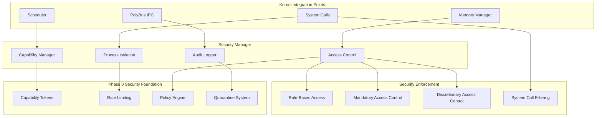

### **Capability-Based Security**

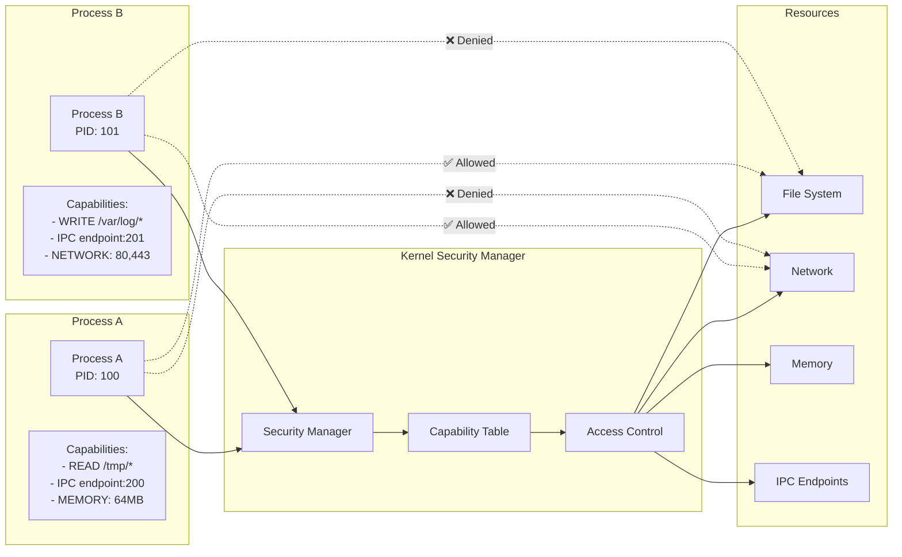

---

## 🎯 Integration Points & Data Flow

### **Complete System Data Flow**

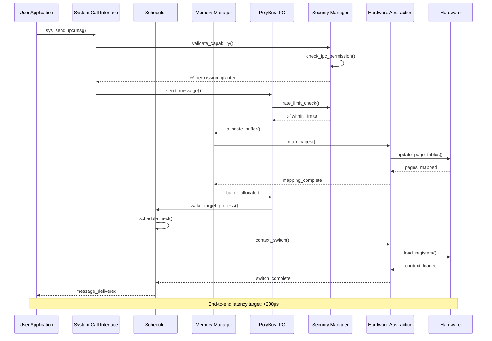

### **Performance Critical Paths**


---

## 🧪 Testing & Validation Strategy

### **Testing Architecture**

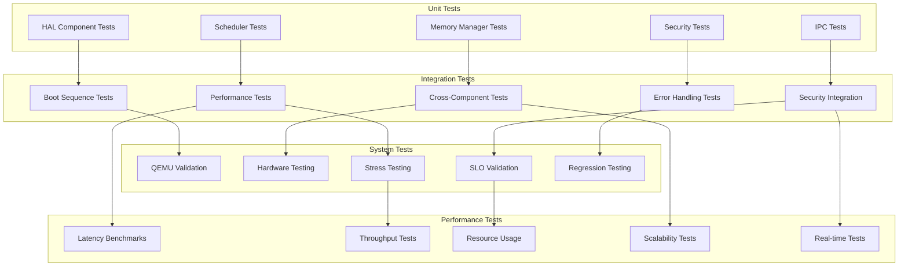

### **SLO Validation Integration**

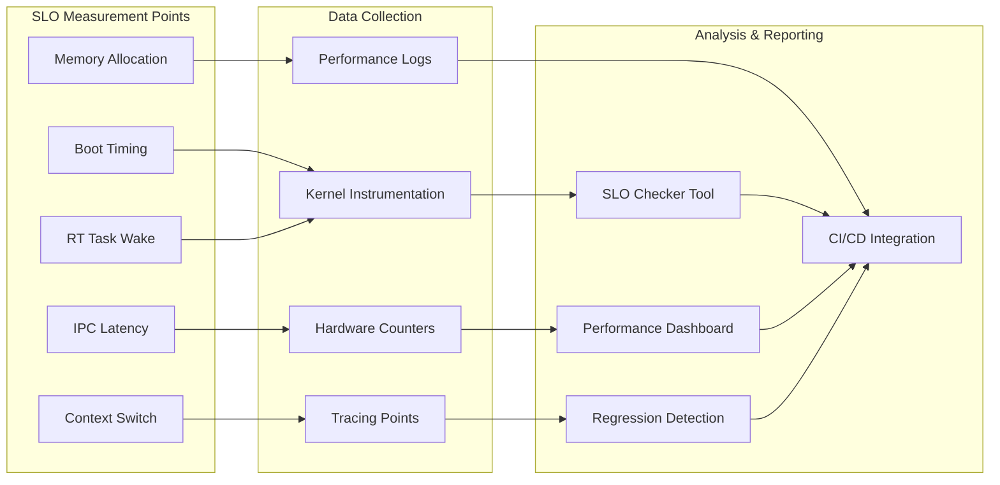

---

## 📋 Implementation Phases

### **Phase 1.1: HAL Foundation** (Week 1-2)
- Complete x86_64 and aarch64 HAL implementation
- GDT/IDT setup and interrupt handling
- Timer subsystem and basic I/O
- Serial console for debugging
- **Milestone**: Boot to HAL ready state in <200ms

### **Phase 1.2: Memory Management** (Week 3-4)  
- Physical page allocator (buddy system)
- Virtual memory manager with page tables
- Kernel heap allocator (slab-based)
- Page fault handling
- **Milestone**: Memory operations <50μs p95

### **Phase 1.3: Process Scheduler** (Week 4-5)
- Process creation and management
- Context switching implementation  
- Priority-based scheduling
- Real-time task support
- **Milestone**: Context switch <10μs, RT wake <5ms p95

### **Phase 1.4: PolyBus IPC** (Week 5-6)
- Message passing implementation
- Shared memory IPC
- Performance optimization
- Security integration
- **Milestone**: IPC median <200μs, p95 <1ms

### **Phase 1.5: Security Integration** (Week 6-7)
- Capability-based access control
- Process isolation enforcement
- Resource quota management
- Audit trail integration
- **Milestone**: Security tests pass, isolation verified

### **Phase 1.6: Integration & Validation** (Week 7-8)
- Full system integration
- Performance optimization
- 24-hour stress testing
- Documentation completion
- **Milestone**: Interactive state <2s, all SLOs green

---

## 🔄 Integration with Phase 0

### **Leveraged Components**
- **SLO Gates**: Extended with kernel performance metrics
- **Capability System**: Integrated for process-level access control
- **Rate Limiting**: Applied to resource allocation and IPC
- **Monitoring**: Kernel instrumentation and telemetry
- **Build System**: Seamless Bazel integration

### **New Integration Points**
```rust
// Example: Kernel using Phase 0 services
use services::identity::IdentityService;
use security::ratelimit::RateLimiter;
use security::caps::CapabilityToken;

impl ProcessScheduler {
    fn schedule_with_capabilities(&mut self, pid: ProcessId) -> KernelResult<()> {
        // Use Phase 0 capability system
        let caps = CapabilityService::get_process_capabilities(pid)?;
        
        // Use Phase 0 rate limiting
        if !self.cpu_rate_limiter.check_limit(&pid.to_string()) {
            return Err(KernelError::CpuQuotaExceeded);
        }
        
        // Schedule with security context
        self.schedule_process_with_context(pid, caps)
    }
}
```

---

## 📊 Success Metrics

### **Functional Metrics**
- ✅ Kernel boots to interactive state consistently
- ✅ All subsystems operational (HAL, MM, Scheduler, IPC, Security)
- ✅ Process creation, scheduling, and termination working
- ✅ IPC communication between processes functional
- ✅ Security isolation enforced

### **Performance Metrics**
- ✅ Boot time: <2s to interactive state
- ✅ IPC latency: <200μs median, <1ms p95
- ✅ Context switch: <10μs
- ✅ RT task wake: <5ms p95
- ✅ Memory allocation: <50μs p95
- ✅ Kernel memory: <8MB footprint

### **Quality Metrics**
- ✅ Test coverage: >90%
- ✅ 24-hour stability test passed
- ✅ No memory leaks detected
- ✅ All SLO gates consistently passing
- ✅ Security penetration tests passed

---

## 📚 Documentation & Standards

### **Documentation Requirements**
1. **Architecture Documentation**: Updated system architecture diagrams
2. **API Documentation**: Complete kernel API reference
3. **Performance Documentation**: Benchmark results and optimization notes
4. **Security Documentation**: Threat model and security measures
5. **Integration Documentation**: Phase 0 service integration guide

### **Code Standards**
- **Rust no_std**: All kernel code follows no_std guidelines
- **Safety**: Unsafe code minimized and documented
- **Testing**: Unit tests for all components
- **Documentation**: Public APIs fully documented
- **Performance**: Critical paths optimized and measured

### **Design Review Process**
1. **SPEC Review**: Requirements and constraints validated
2. **DESIGN Review**: Technical architecture approved
3. **Implementation Review**: Code meets standards
4. **Performance Review**: SLO gates validation
5. **Security Review**: Security measures verified

---

## 🔮 Future Considerations

### **Phase 2 Preparation**
- User-space runtime foundation ready
- File system integration points defined
- Network stack preparation
- Device driver framework preparation

### **Scalability Considerations**
- Multi-core support architecture
- NUMA-aware memory management
- Distributed IPC for clusters
- Performance monitoring scalability

### **Security Evolution**
- Post-quantum cryptography integration
- Hardware security features (Intel CET, ARM Pointer Authentication)
- Attestation and verification systems
- Zero-trust architecture principles

---

## 📝 Document Revision History

| Version | Date | Author | Changes |
|---------|------|--------|---------|
| 1.0 | 2025-01-16 | Phase 1 Team | Initial design document |

---

**Status**: ✅ **APPROVED FOR IMPLEMENTATION**  
**Next**: [TASKS.md](./TASKS.md) - Detailed implementation task breakdown

---

*This design document provides the comprehensive technical architecture for Phase 1 kernel development, building on the solid foundation established in Phase 0 while delivering production-ready microkernel capabilities with high-performance IPC.*
