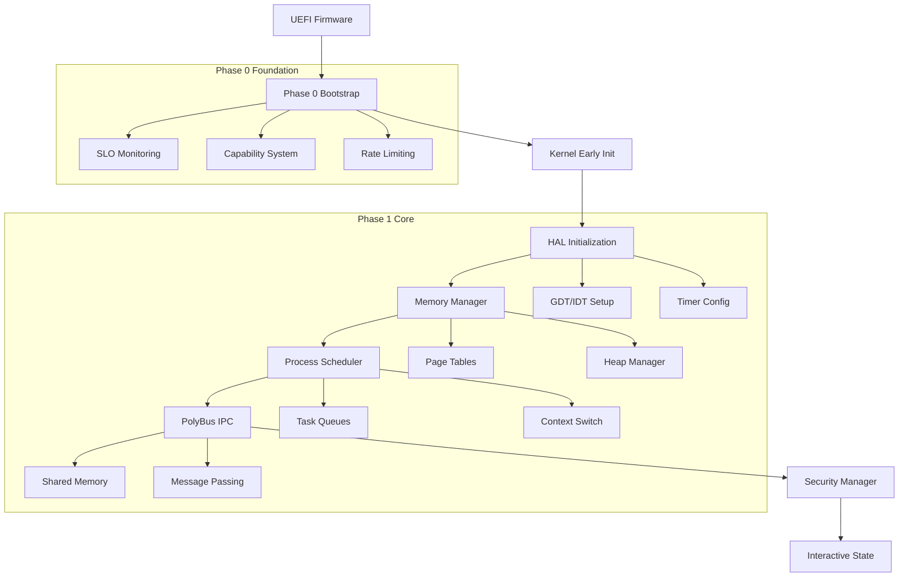

                                                                                        # Phase 1 Specification: Kernel Bring-Up & PolyBus IPC

## 📋 Executive Summary

**Phase**: Phase 1 - Core Kernel Implementation  
**Duration**: 6-8 weeks  
**Status**: ✅ **ACTIVE** - Kernel bootstrap complete, moving to core systems  
**Priority**: **CRITICAL PATH** - Foundation for all subsequent development  

**Objective**: Transform the kernel bootstrap foundation into a fully functional microkernel with Hardware Abstraction Layer (HAL), memory management, process scheduling, and high-performance IPC via PolyBus.

---

## 🎯 Scope & Goals

### **Primary Goals**
1. **Complete Kernel Bring-Up**: Transform UEFI bootstrap into fully operational kernel
2. **Hardware Abstraction Layer**: Complete x86_64 and aarch64 HAL implementation
3. **Memory Management**: Virtual memory, heap, and page management systems
4. **Process Scheduling**: Preemptive scheduler with capability-based security
5. **PolyBus IPC**: High-performance inter-process communication system
6. **Security Manager**: Capability tokens, access control, and isolation enforcement

### **Scope Boundaries**

#### **✅ In Scope**
- Complete kernel bring-up sequence (UEFI → kernel main loop)
- Hardware Abstraction Layer (HAL) for x86_64 and aarch64
- Virtual memory management with 4K page granularity
- Preemptive scheduling with round-robin and priority queues
- PolyBus IPC with shared memory and message passing
- Capability-based security model integration
- Real-time task support for XR workloads
- Performance instrumentation and SLO validation
- QEMU testing environment and CI integration

#### **❌ Out of Scope**
- File system implementation (Phase 2)
- Network stack (Phase 2) 
- Device drivers beyond basic serial/framebuffer (Phase 2)
- User-space runtime (Phase 2)
- Full POSIX compatibility (Phase 3)
- Advanced power management (Phase 3)

### **Success Criteria**
1. **Boot Success**: Kernel boots to interactive state in <2s
2. **Process Management**: Can spawn, schedule, and terminate processes
3. **IPC Performance**: PolyBus achieves <200μs median latency in QEMU
4. **Real-Time**: RT tasks wake-to-run in <5ms p95
5. **Memory Management**: Dynamic allocation/deallocation without leaks
6. **Security**: Capability tokens enforce process isolation
7. **Stability**: 24h stress test without kernel panic

---

## 🏗️ Technical Constraints

### **Architecture Constraints**
- **Target Platforms**: x86_64 (primary), aarch64 (secondary)
- **Boot Method**: UEFI-only (no legacy BIOS support)
- **Memory Model**: Virtual memory with 4K pages
- **Address Space**: 64-bit virtual addressing
- **Page Table Format**: x86_64 4-level, aarch64 4-level
- **Interrupt Model**: APIC (x86_64), GIC (aarch64)

### **Performance Constraints**
- **Memory Overhead**: Kernel <8MB RAM footprint
- **Boot Time**: <2s to interactive state
- **Context Switch**: <10μs on modern hardware
- **IPC Latency**: <200μs median, <1ms p95
- **RT Wake**: <5ms p95 for real-time tasks
- **Throughput**: >10K IPC ops/sec sustained

### **Security Constraints**
- **Capability Model**: All access through capability tokens
- **Process Isolation**: Hardware-enforced memory protection
- **Privilege Model**: Ring 0 (kernel), Ring 3 (user)
- **Stack Protection**: Guard pages and stack canaries
- **ASLR**: Address Space Layout Randomization enabled
- **Audit Trail**: All security decisions logged

### **Development Constraints**
- **Language**: Rust (no_std) for kernel, minimal inline assembly
- **Build System**: Bazel primary, Cargo for development
- **Testing**: Unit tests, integration tests, QEMU validation
- **Documentation**: SPEC → DESIGN → TASKS → CODE pattern
- **CI/CD**: All PRs must include SPEC/DESIGN deltas for kernel changes

---

## 📊 Key Performance Indicators (KPIs)

### **Boot Performance KPIs**
| Metric | Target | Measurement Method |
|--------|--------|--------------------|
| **UEFI to Kernel** | <500ms | Timestamp in boot log |
| **HAL Initialization** | <200ms | Architecture-specific timer |
| **Memory Manager Init** | <100ms | Allocation subsystem ready |
| **Scheduler Ready** | <50ms | First process scheduled |
| **PolyBus Online** | <100ms | IPC endpoint responsive |
| **Interactive State** | <2s total | Boot banner displayed |

### **Runtime Performance KPIs**
| Metric | Target | Measurement Method |
|--------|--------|--------------------|
| **Context Switch** | <10μs | Hardware timer measurement |
| **IPC Median Latency** | <200μs | PolyBus internal telemetry |
| **IPC p95 Latency** | <1ms | PolyBus internal telemetry |
| **RT Task Wake** | <5ms p95 | Real-time scheduler metrics |
| **Memory Allocation** | <50μs | Heap allocator timing |
| **Page Fault Handling** | <100μs | MMU fault handler timing |

### **Resource Utilization KPIs**
| Metric | Target | Measurement Method |
|--------|--------|--------------------|
| **Kernel Memory** | <8MB | Runtime heap analysis |
| **Context Memory** | <4KB per process | Process control block size |
| **IPC Buffer Usage** | <1MB total | PolyBus buffer allocation |
| **Page Table Memory** | <2MB typical | MMU allocation tracking |
| **CPU Utilization** | <5% idle overhead | Performance counter sampling |

### **Reliability KPIs**
| Metric | Target | Measurement Method |
|--------|--------|--------------------|
| **Uptime** | 24h stress test | Continuous operation validation |
| **Memory Leaks** | Zero detected | Valgrind-equivalent analysis |
| **Deadlock Detection** | <1s timeout | Lock ordering validation |
| **Panic Recovery** | Graceful shutdown | Error handling verification |
| **Test Coverage** | >90% | Code coverage analysis |

---

## 🚦 Service Level Objectives (SLO Gates)

### **Critical SLO Gates**
These gates MUST pass for Phase 1 completion:

#### **SLO-1: Boot Performance Gate**
```yaml
name: "phase1_boot_performance"
description: "Kernel must boot to interactive state within time limits"
metrics:
  - name: "boot_to_interactive_time"
    threshold: "2000ms"
    percentile: "p95"
    measurement: "timestamp_diff(uefi_start, interactive_ready)"
  - name: "hal_init_time" 
    threshold: "200ms"
    percentile: "p95"
    measurement: "timestamp_diff(hal_start, hal_ready)"
validation_method: "qemu_boot_test"
failure_action: "block_merge"
```

#### **SLO-2: IPC Performance Gate**
```yaml
name: "phase1_ipc_performance"
description: "PolyBus IPC must meet latency requirements"
metrics:
  - name: "ipc_median_latency"
    threshold: "200µs"
    percentile: "p50"
    measurement: "polybus_roundtrip_time"
  - name: "ipc_p95_latency"
    threshold: "1000µs" 
    percentile: "p95"
    measurement: "polybus_roundtrip_time"
  - name: "ipc_throughput"
    threshold: "10000 ops/sec"
    measurement: "polybus_ops_per_second"
validation_method: "ipc_benchmark_suite"
failure_action: "block_merge"
```

#### **SLO-3: Real-Time Performance Gate**
```yaml
name: "phase1_realtime_performance"
description: "Real-time tasks must meet wake-to-run requirements"
metrics:
  - name: "rt_wake_to_run"
    threshold: "5000µs"
    percentile: "p95"
    measurement: "timestamp_diff(rt_wake_signal, rt_task_running)"
  - name: "rt_scheduling_jitter"
    threshold: "100µs"
    percentile: "p95" 
    measurement: "rt_schedule_variance"
validation_method: "rt_benchmark_suite"
failure_action: "block_merge"
```

#### **SLO-4: Memory Management Gate**
```yaml
name: "phase1_memory_performance"
description: "Memory operations must meet performance requirements"
metrics:
  - name: "heap_allocation_time"
    threshold: "50µs"
    percentile: "p95"
    measurement: "timestamp_diff(malloc_start, malloc_complete)"
  - name: "page_fault_handling"
    threshold: "100µs"
    percentile: "p95"
    measurement: "timestamp_diff(fault_entry, fault_resolved)"
  - name: "memory_leak_detection"
    threshold: "0 bytes"
    measurement: "heap_leak_bytes_after_24h_test"
validation_method: "memory_stress_test"
failure_action: "block_merge"
```

### **Warning SLO Gates**
These gates generate warnings but don't block merges:

#### **SLO-W1: Resource Utilization Warning**
```yaml
name: "phase1_resource_utilization"
description: "Monitor resource usage for optimization opportunities"
metrics:
  - name: "kernel_memory_usage"
    threshold: "6MB"
    measurement: "kernel_heap_size_peak"
  - name: "cpu_idle_overhead"
    threshold: "3%"
    measurement: "cpu_utilization_idle_state"
validation_method: "resource_monitoring"
failure_action: "warn_only"
```

### **SLO Validation Environment**
```yaml
test_environment:
  platform: "qemu-system-x86_64"
  memory: "2GB"
  cpu_cores: "4"
  flags: ["-enable-kvm", "-cpu host", "-m 2G", "-smp 4"]
  boot_method: "uefi"
  test_duration: "24h"
  
validation_schedule:
  - trigger: "pull_request"
    tests: ["boot_performance", "ipc_performance", "rt_performance"]
  - trigger: "daily"
    tests: ["all_slo_gates", "24h_stress_test"]
  - trigger: "release"
    tests: ["full_validation_suite", "hardware_testing"]
```

---

## 🔧 Integration with Phase 0 Foundation

### **Leveraged Phase 0 Components**
Phase 1 builds directly on the comprehensive Phase 0 foundation:

#### **Build & CI Infrastructure**
- ✅ **Bazel Workspace**: Kernel targets already integrated
- ✅ **Nix Development Environment**: Rust, QEMU, debug tools ready
- ✅ **GitHub Actions CI**: Lint, build, test pipelines established
- ✅ **SLO Validation Framework**: Harnesses and gates operational

#### **Performance Monitoring**
- ✅ **SLO Gates**: Extended with Phase 1 kernel metrics
- ✅ **Performance Harnesses**: Kernel timing integration points
- ✅ **OpenTelemetry**: Kernel instrumentation framework ready
- ✅ **Prometheus Metrics**: Kernel performance data collection

#### **Security Foundation**
- ✅ **Capability Tokens**: Ready for process isolation integration
- ✅ **Rate Limiting**: Resource management for process scheduling
- ✅ **Quarantine System**: Process isolation enforcement
- ✅ **Policy Engine**: Access control decision framework

#### **Development Tooling**
- ✅ **Release Channels**: Kernel image distribution ready
- ✅ **Documentation Portal**: Phase 1 docs integration
- ✅ **Intent Diff**: Change explanation for kernel modifications
- ✅ **Why-Logs**: Audit trail for kernel decisions

### **Phase 1 Extensions to Phase 0**
```rust
// Example: Phase 1 extends Phase 0 rate limiting for process management
use security::ratelimit::{RateLimiter, TokenBucket};

impl ProcessScheduler {
    fn schedule_process(&mut self, pid: ProcessId) -> ScheduleResult<()> {
        // Leverage Phase 0 rate limiting for CPU time management
        if !self.cpu_rate_limiter.try_consume(&pid.to_string(), 1) {
            return Err(ScheduleError::CpuQuotaExceeded);
        }
        
        // Use Phase 0 capability system for privilege checks
        let caps = self.capability_manager.get_process_caps(pid)?;
        if !caps.can_schedule() {
            return Err(ScheduleError::InsufficientPrivileges);
        }
        
        self.enqueue_process(pid)
    }
}
```

---

## 🏛️ Architecture Integration

### **Kernel Layers**
```
┌─────────────────────────────────────────────────────────────────┐
│                    Phase 1 Kernel Stack                         │
├─────────────────────────────────────────────────────────────────┤
│ System Call Interface │ PolyBus IPC │ Capability Manager        │
├─────────────────────────────────────────────────────────────────┤
│ Process Scheduler     │ Memory Manager │ Security Manager         │
├─────────────────────────────────────────────────────────────────┤
│ Hardware Abstraction Layer (HAL)                                │
│ ┌─────────────┐ ┌─────────────┐ ┌─────────────┐ ┌──────────────┐ │
│ │    Timer    │ │    MMU      │ │ Interrupts  │ │   Serial     │ │
│ │   x86_64    │ │  4K Pages   │ │ APIC/GIC    │ │   Debug      │ │
│ │   aarch64   │ │  Virtual    │ │   Vectors   │ │   Console    │ │
│ └─────────────┘ └─────────────┘ └─────────────┘ └──────────────┘ │
├─────────────────────────────────────────────────────────────────┤
│ ✅ Phase 0 Foundation: Build, CI, SLO, Security, Monitoring     │
└─────────────────────────────────────────────────────────────────┘
```

### **Boot Sequence Integration**


---

## 🔬 Validation & Testing Strategy

### **Testing Pyramid**
```
                    ┌─────────────────┐
                    │  System Tests   │ ← 24h stress, hardware validation
                    │  (10% of tests) │
                ┌───┴─────────────────┴───┐
                │  Integration Tests      │ ← QEMU end-to-end, SLO validation
                │   (30% of tests)        │
            ┌───┴─────────────────────────┴───┐
            │     Unit Tests                  │ ← Component testing, mocking
            │    (60% of tests)               │
        └───────────────────────────────────────┘
```

### **Test Categories**

#### **Unit Tests** (Target: 60% of test suite)
- HAL component tests (timer, interrupts, MMU)
- Memory allocator tests (allocation, deallocation, fragmentation)
- Scheduler tests (queue management, priority handling)
- PolyBus tests (message serialization, routing)
- Security tests (capability validation, access control)

#### **Integration Tests** (Target: 30% of test suite)
- Boot sequence tests (UEFI → kernel ready)
- Cross-component tests (scheduler + memory manager)
- IPC flow tests (process communication via PolyBus)
- Performance tests (SLO gate validation)
- Security integration tests (end-to-end access control)

#### **System Tests** (Target: 10% of test suite)
- 24-hour stress tests (stability validation)
- Hardware compatibility tests (real hardware boot)
- Performance benchmarking (comparative analysis)
- Security penetration tests (exploit resistance)
- Regression tests (ensure Phase 0 integration remains intact)

### **Continuous Validation**
```yaml
# CI Pipeline Integration
pull_request_validation:
  - unit_tests: "all kernel components"
  - integration_tests: "cross-component functionality"
  - slo_gates: ["boot_performance", "ipc_performance", "rt_performance"]
  - security_tests: "capability and isolation validation"
  - documentation_check: "SPEC/DESIGN deltas required for kernel changes"

daily_validation:
  - full_test_suite: "all test categories"
  - 24h_stress_test: "stability validation"
  - performance_regression: "SLO trend analysis"
  - memory_leak_detection: "long-running validation"

release_validation:
  - hardware_testing: "physical machine validation"
  - performance_benchmarking: "comparative analysis"
  - security_audit: "penetration testing"
  - documentation_completeness: "spec compliance verification"
```

---

## 📈 Success Metrics & Milestones

### **Phase 1 Milestones**

#### **Milestone 1: HAL Complete** (Week 2)
- ✅ GDT/IDT setup for x86_64 and aarch64
- ✅ Timer subsystem operational
- ✅ Interrupt handling functional
- ✅ Serial console for debugging
- **Gate**: Boot to HAL ready in <200ms

#### **Milestone 2: Memory Manager** (Week 4)
- ✅ Virtual memory subsystem
- ✅ Page table management
- ✅ Heap allocator
- ✅ Memory leak detection
- **Gate**: Memory operations <50μs p95

#### **Milestone 3: Process Scheduler** (Week 5)
- ✅ Task creation and destruction
- ✅ Context switching
- ✅ Priority scheduling
- ✅ Real-time task support
- **Gate**: Context switch <10μs, RT wake <5ms p95

#### **Milestone 4: PolyBus IPC** (Week 6)
- ✅ Shared memory IPC
- ✅ Message passing
- ✅ Performance optimization
- ✅ Security integration
- **Gate**: IPC median <200μs, p95 <1ms

#### **Milestone 5: Security Integration** (Week 7)
- ✅ Capability-based access control
- ✅ Process isolation enforcement
- ✅ Resource quota management
- ✅ Audit trail integration
- **Gate**: Security tests pass, isolation verified

#### **Milestone 6: Full Integration** (Week 8)
- ✅ All subsystems operational
- ✅ 24-hour stress test
- ✅ SLO gates passing
- ✅ Documentation complete
- **Gate**: Interactive state <2s, all SLOs green

### **Quality Gates**
Each milestone must satisfy:
1. **Functionality**: All specified features operational
2. **Performance**: Relevant SLO gates passing
3. **Security**: Security tests passing
4. **Documentation**: SPEC/DESIGN updates complete
5. **Testing**: Test coverage >90%
6. **Integration**: Phase 0 components still functional

---

## 🚨 Risk Assessment & Mitigation

### **High-Risk Areas**

#### **Risk 1: Boot Sequence Complexity**
- **Risk**: Complex UEFI → kernel transition may exceed 2s target
- **Probability**: Medium
- **Impact**: High (blocks interactive state goal)
- **Mitigation**: 
  - Incremental boot sequence optimization
  - Early performance measurement integration
  - Fallback to simpler initialization if needed

#### **Risk 2: IPC Performance**
- **Risk**: PolyBus may not achieve <200μs median latency
- **Probability**: Medium  
- **Impact**: High (core performance requirement)
- **Mitigation**:
  - Shared memory optimization
  - Lock-free data structures
  - Assembly-optimized critical paths

#### **Risk 3: Memory Management Complexity**
- **Risk**: Virtual memory implementation complexity may cause delays
- **Probability**: Low
- **Impact**: High (foundation for all other components)
- **Mitigation**:
  - Start with simple page allocator
  - Incremental virtual memory features
  - Extensive testing framework

#### **Risk 4: Real-Time Guarantees**
- **Risk**: RT wake-to-run <5ms may be difficult in QEMU
- **Probability**: Medium
- **Impact**: Medium (XR workload support)
- **Mitigation**:
  - Hardware testing environment
  - Scheduler priority optimization
  - Interrupt latency minimization

### **Low-Risk Areas**
- **HAL Implementation**: Well-understood x86_64/aarch64 patterns
- **Security Integration**: Builds on proven Phase 0 foundation
- **Build System**: Established Bazel integration
- **Documentation**: Clear SPEC→DESIGN→TASKS pattern established

---

## 📋 Acceptance Criteria

### **Functional Acceptance**
- [ ] Kernel boots from UEFI to interactive state
- [ ] HAL supports x86_64 and aarch64 architectures
- [ ] Memory manager handles allocation/deallocation
- [ ] Process scheduler supports preemptive multitasking
- [ ] PolyBus enables inter-process communication
- [ ] Security manager enforces capability-based access control
- [ ] System remains stable under 24h stress test

### **Performance Acceptance**
- [ ] Boot to interactive state: <2s (SLO-1)
- [ ] IPC median latency: <200μs (SLO-2)
- [ ] IPC p95 latency: <1ms (SLO-2)
- [ ] RT task wake-to-run: <5ms p95 (SLO-3)
- [ ] Context switch: <10μs
- [ ] Memory allocation: <50μs p95 (SLO-4)
- [ ] Kernel memory footprint: <8MB

### **Quality Acceptance**
- [ ] Test coverage: >90%
- [ ] All SLO gates passing
- [ ] No memory leaks detected
- [ ] Security tests passing
- [ ] Documentation complete (SPEC/DESIGN/TASKS/README)
- [ ] CI pipeline green
- [ ] Phase 0 integration intact

### **Security Acceptance**
- [ ] Capability tokens enforced for all operations
- [ ] Process isolation verified
- [ ] Privilege escalation prevented
- [ ] Audit trail operational
- [ ] Resource quotas enforced
- [ ] Attack surface minimized

---

## 🔄 Phase Transition Criteria

### **Phase 1 → Phase 2 Readiness**
Phase 1 is complete and ready for Phase 2 (User-Space Runtime & File Systems) when:

1. **All Acceptance Criteria Met**: Functional, performance, quality, and security requirements satisfied
2. **SLO Gates Green**: All critical SLO gates consistently passing
3. **Stress Test Success**: 24-hour stability test completed without kernel panic
4. **Documentation Complete**: All SPEC/DESIGN/TASKS/README documentation updated
5. **Integration Verified**: Phase 0 foundation remains fully functional
6. **Hardware Validated**: Testing on physical hardware successful
7. **Team Confidence**: Development team confident in kernel stability and performance

### **Handoff Deliverables**
- Complete kernel with all Phase 1 subsystems operational
- Comprehensive test suite with >90% coverage
- Performance benchmark baseline for Phase 2 comparison
- Security audit report
- Updated Phase 0 integration documentation
- Phase 2 prerequisite analysis and recommendations

---

## 📚 References & Dependencies

### **Phase 0 Dependencies**
- [Phase 0 Foundation](../ROADMAP_PREREQS_TO_EPICS.md): Complete prerequisite system
- [SLO Gates Framework](../../perf/README.md): Performance validation infrastructure
- [Capability System](../../security/): Access control and isolation foundation
- [Build System](../../BUILD): Bazel workspace and CI/CD integration

### **Technical References**
- [Kernel Bootstrap](../kernel/BOOTSTRAP.md): Foundation kernel implementation
- [Architecture Specification](../../SPEC.md): Overall system architecture
- [Design Principles](../../DESIGN.md): Technical design guidelines
- [Development Guidelines](../../CONTRIBUTING.md): Development standards and practices

### **External Standards**
- UEFI Specification 2.8+
- x86_64 System V ABI
- ARM Architecture Reference Manual (ARM64)
- POSIX.1-2017 (subset for compatibility)
- ISO/IEC 27001 (security framework)

---

## 📝 Document Revision History

| Version | Date | Author | Changes |
|---------|------|--------|---------|
| 1.0 | 2025-01-16 | Phase 1 Team | Initial Phase 1 specification |

---

**Status**: ✅ **APPROVED FOR IMPLEMENTATION**  
**Next**: [DESIGN.md](./DESIGN.md) - Technical architecture and implementation details

---

*This specification establishes the foundation for Phase 1 kernel development, building on the comprehensive Phase 0 infrastructure to deliver a production-ready microkernel with high-performance IPC capabilities.*
