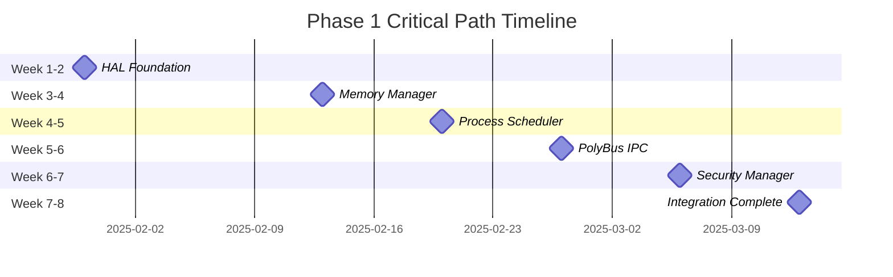

# Phase 1 Tasks: Kernel Bring-Up & PolyBus IPC

## 📋 Task Management Overview

**Phase**: Phase 1 - Core Kernel Implementation  
**Document**: Implementation Task Breakdown  
**Dependencies**: [SPEC.md](./SPEC.md), [DESIGN.md](./DESIGN.md)  
**Status**: ✅ **ACTIVE** - Ready for implementation  

This document provides the detailed task breakdown for implementing the Phase 1 kernel bring-up and PolyBus IPC system, organized by subsystem and priority.

---

## 🎯 Task Organization Strategy

### **Implementation Pattern**
Following the rule: **SPEC → DESIGN → TASKS → CODE/TESTS → DOCS** for each sub-epic

### **Task Grouping**
1. **Boot/HAL** - Hardware abstraction and boot sequence
2. **MMU** - Memory management unit and virtual memory
3. **Scheduler** - Process scheduling and context switching
4. **IPC** - PolyBus inter-process communication
5. **SecMan** - Security manager and access control
6. **Tracing** - Performance monitoring and debugging
7. **Tests** - Comprehensive testing and validation
8. **CI/Docs** - Continuous integration and documentation

### **Priority Levels**
- 🔴 **P0 (Critical)**: Blocking dependencies, must complete first
- 🟡 **P1 (High)**: Core functionality, significant impact
- 🟢 **P2 (Medium)**: Important features, moderate impact
- 🔵 **P3 (Low)**: Nice-to-have, minimal impact

### **Task States**
- 📋 **TODO**: Not yet started
- 🔄 **IN_PROGRESS**: Currently being worked on
- ⏸️ **BLOCKED**: Waiting for dependency
- ✅ **DONE**: Completed
- ❌ **CANCELLED**: No longer needed

---

## 🚀 Phase 1.1: Boot/HAL Foundation (Week 1-2)

### **Epic: Hardware Abstraction Layer**
**Goal**: Complete x86_64 and aarch64 HAL implementation with <200ms initialization time

#### **Task Group: x86_64 HAL Implementation**

| Task ID | Priority | Status | Task | Assignee | Estimate | Dependencies |
|---------|----------|--------|------|----------|----------|--------------|
| B-001 | 🔴 P0 | 📋 | Implement GDT setup with kernel/user segments | TBD | 4h | Kernel bootstrap |
| B-002 | 🔴 P0 | 📋 | Implement IDT with exception handlers | TBD | 6h | B-001 |
| B-003 | 🔴 P0 | 📋 | Setup APIC timer for scheduling | TBD | 4h | B-002 |
| B-004 | 🔴 P0 | 📋 | Implement interrupt enable/disable functions | TBD | 2h | B-002 |
| B-005 | 🟡 P1 | 📋 | Add page fault exception handler | TBD | 4h | B-002 |
| B-006 | 🟡 P1 | 📋 | Implement context save/restore for x86_64 | TBD | 8h | B-002 |
| B-007 | 🟢 P2 | 📋 | Add TSC timestamp reading | TBD | 2h | B-003 |
| B-008 | 🟢 P2 | 📋 | Implement system call entry point | TBD | 4h | B-002 |

#### **Task Group: aarch64 HAL Implementation**

| Task ID | Priority | Status | Task | Assignee | Estimate | Dependencies |
|---------|----------|--------|------|----------|----------|--------------|
| B-009 | 🔴 P0 | 📋 | Implement exception vector table | TBD | 6h | Kernel bootstrap |
| B-010 | 🔴 P0 | 📋 | Setup Generic Timer (CNTPCT_EL0) | TBD | 4h | B-009 |
| B-011 | 🔴 P0 | 📋 | Implement GICv3 interrupt controller | TBD | 8h | B-009 |
| B-012 | 🟡 P1 | 📋 | Add MMU fault handlers | TBD | 6h | B-009 |
| B-013 | 🟡 P1 | 📋 | Implement context save/restore for aarch64 | TBD | 8h | B-009 |
| B-014 | 🟢 P2 | 📋 | Add performance counter access | TBD | 3h | B-010 |
| B-015 | 🟢 P2 | 📋 | Implement system call handling (SVC) | TBD | 4h | B-009 |

#### **Task Group: Serial Console & Debugging**

| Task ID | Priority | Status | Task | Assignee | Estimate | Dependencies |
|---------|----------|--------|------|----------|----------|--------------|
| B-016 | 🔴 P0 | 📋 | Implement x86_64 serial console (16550 UART) | TBD | 4h | None |
| B-017 | 🔴 P0 | 📋 | Implement aarch64 serial console (PL011) | TBD | 4h | None |
| B-018 | 🟡 P1 | 📋 | Add kernel logging macros (kprint!, kprintln!) | TBD | 2h | B-016, B-017 |
| B-019 | 🟢 P2 | 📋 | Implement log levels and filtering | TBD | 3h | B-018 |
| B-020 | 🟢 P2 | 📋 | Add early boot debugging support | TBD | 2h | B-018 |

#### **Task Group: Boot Sequence Integration**

| Task ID | Priority | Status | Task | Assignee | Estimate | Dependencies |
|---------|----------|--------|------|----------|----------|--------------|
| B-021 | 🔴 P0 | 📋 | Complete UEFI to kernel transition | TBD | 6h | B-001, B-009 |
| B-022 | 🔴 P0 | 📋 | Implement early kernel initialization | TBD | 4h | B-021 |
| B-023 | 🟡 P1 | 📋 | Add boot timing instrumentation | TBD | 3h | B-018 |
| B-024 | 🟡 P1 | 📋 | Implement kernel state management | TBD | 2h | B-022 |
| B-025 | 🟢 P2 | 📋 | Add boot parameter parsing | TBD | 4h | B-021 |

**Milestone B-M1**: HAL Complete - Boot to HAL ready in <200ms ⏱️ **Week 2**

---

## 🧠 Phase 1.2: Memory Management (Week 3-4)

### **Epic: Memory Management Unit**
**Goal**: Complete virtual memory subsystem with <50μs allocation performance

#### **Task Group: Physical Memory Management**

| Task ID | Priority | Status | Task | Assignee | Estimate | Dependencies |
|---------|----------|--------|------|----------|----------|--------------|
| M-001 | 🔴 P0 | 📋 | Implement buddy allocator for physical pages | TBD | 12h | HAL complete |
| M-002 | 🔴 P0 | 📋 | Add memory region parsing from bootloader | TBD | 4h | M-001 |
| M-003 | 🔴 P0 | 📋 | Implement page bitmap for free/used tracking | TBD | 6h | M-001 |
| M-004 | 🟡 P1 | 📋 | Add memory statistics and monitoring | TBD | 3h | M-001 |
| M-005 | 🟡 P1 | 📋 | Implement page coalescing optimization | TBD | 8h | M-001 |
| M-006 | 🟢 P2 | 📋 | Add memory zone management (DMA, normal, high) | TBD | 6h | M-001 |
| M-007 | 🟢 P2 | 📋 | Implement NUMA-aware allocation (prep for Phase 2) | TBD | 8h | M-001 |

#### **Task Group: Virtual Memory Management**

| Task ID | Priority | Status | Task | Assignee | Estimate | Dependencies |
|---------|----------|--------|------|----------|----------|--------------|
| M-008 | 🔴 P0 | 📋 | Implement x86_64 page table management | TBD | 10h | M-001 |
| M-009 | 🔴 P0 | 📋 | Implement aarch64 translation table management | TBD | 10h | M-001 |
| M-010 | 🔴 P0 | 📋 | Add kernel virtual memory mapping | TBD | 8h | M-008, M-009 |
| M-011 | 🟡 P1 | 📋 | Implement TLB management and flushing | TBD | 6h | M-008, M-009 |
| M-012 | 🟡 P1 | 📋 | Add page protection flag management | TBD | 4h | M-008, M-009 |
| M-013 | 🟡 P1 | 📋 | Implement ASLR for security | TBD | 8h | M-010 |
| M-014 | 🟢 P2 | 📋 | Add copy-on-write page handling | TBD | 12h | M-010 |
| M-015 | 🟢 P2 | 📋 | Implement demand paging foundation | TBD | 10h | M-010 |

#### **Task Group: Kernel Heap Management**

| Task ID | Priority | Status | Task | Assignee | Estimate | Dependencies |
|---------|----------|--------|------|----------|----------|--------------|
| M-016 | 🔴 P0 | 📋 | Implement slab allocator for kernel objects | TBD | 12h | M-010 |
| M-017 | 🔴 P0 | 📋 | Add common slab sizes (32, 64, 128, 256, etc.) | TBD | 4h | M-016 |
| M-018 | 🟡 P1 | 📋 | Implement large allocation handling | TBD | 6h | M-016 |
| M-019 | 🟡 P1 | 📋 | Add guard pages for stack overflow detection | TBD | 4h | M-016 |
| M-020 | 🟡 P1 | 📋 | Implement heap statistics and debugging | TBD | 3h | M-016 |
| M-021 | 🟢 P2 | 📋 | Add memory leak detection tools | TBD | 8h | M-016 |
| M-022 | 🟢 P2 | 📋 | Implement heap randomization for security | TBD | 6h | M-016 |

#### **Task Group: Page Fault Handling**

| Task ID | Priority | Status | Task | Assignee | Estimate | Dependencies |
|---------|----------|--------|------|----------|----------|--------------|
| M-023 | 🔴 P0 | 📋 | Implement basic page fault handler | TBD | 8h | M-010 |
| M-024 | 🟡 P1 | 📋 | Add page fault cause analysis | TBD | 4h | M-023 |
| M-025 | 🟡 P1 | 📋 | Implement stack growth handling | TBD | 6h | M-023 |
| M-026 | 🟢 P2 | 📋 | Add page fault statistics and logging | TBD | 3h | M-023 |
| M-027 | 🟢 P2 | 📋 | Implement swap preparation (Phase 2) | TBD | 8h | M-023 |

**Milestone M-M1**: Memory Manager Complete - Memory operations <50μs p95 ⏱️ **Week 4**

---

## ⚡ Phase 1.3: Process Scheduler (Week 4-5)

### **Epic: Process Scheduling & Context Switching**
**Goal**: Preemptive scheduler with <10μs context switch and <5ms RT wake

#### **Task Group: Process Management**

| Task ID | Priority | Status | Task | Assignee | Estimate | Dependencies |
|---------|----------|--------|------|----------|----------|--------------|
| S-001 | 🔴 P0 | 📋 | Implement Process Control Block (PCB) structure | TBD | 6h | Memory manager |
| S-002 | 🔴 P0 | 📋 | Add process creation (fork/exec foundation) | TBD | 10h | S-001 |
| S-003 | 🔴 P0 | 📋 | Implement process termination and cleanup | TBD | 6h | S-001 |
| S-004 | 🟡 P1 | 📋 | Add process hierarchy (parent/child relationships) | TBD | 4h | S-002 |
| S-005 | 🟡 P1 | 📋 | Implement process state transitions | TBD | 4h | S-001 |
| S-006 | 🟡 P1 | 📋 | Add process memory context management | TBD | 6h | S-001 |
| S-007 | 🟢 P2 | 📋 | Implement process security context | TBD | 4h | S-001 |
| S-008 | 🟢 P2 | 📋 | Add process resource accounting | TBD | 6h | S-001 |

#### **Task Group: Context Switching**

| Task ID | Priority | Status | Task | Assignee | Estimate | Dependencies |
|---------|----------|--------|------|----------|----------|--------------|
| S-009 | 🔴 P0 | 📋 | Implement x86_64 context save/restore | TBD | 8h | HAL complete |
| S-010 | 🔴 P0 | 📋 | Implement aarch64 context save/restore | TBD | 8h | HAL complete |
| S-011 | 🔴 P0 | 📋 | Add register context structure | TBD | 4h | S-009, S-010 |
| S-012 | 🟡 P1 | 📋 | Implement FPU/SIMD context switching | TBD | 6h | S-009, S-010 |
| S-013 | 🟡 P1 | 📋 | Add context switch timing instrumentation | TBD | 3h | S-009, S-010 |
| S-014 | 🟡 P1 | 📋 | Optimize context switch critical path | TBD | 8h | S-009, S-010 |
| S-015 | 🟢 P2 | 📋 | Implement lazy FPU switching | TBD | 6h | S-012 |
| S-016 | 🟢 P2 | 📋 | Add context validation and debugging | TBD | 4h | S-011 |

#### **Task Group: Scheduling Algorithms**

| Task ID | Priority | Status | Task | Assignee | Estimate | Dependencies |
|---------|----------|--------|------|----------|----------|--------------|
| S-017 | 🔴 P0 | 📋 | Implement priority-based scheduling queues | TBD | 8h | S-001 |
| S-018 | 🔴 P0 | 📋 | Add round-robin scheduling for normal tasks | TBD | 4h | S-017 |
| S-019 | 🔴 P0 | 📋 | Implement preemptive scheduling with timer | TBD | 6h | S-017, Timer |
| S-020 | 🟡 P1 | 📋 | Add real-time scheduling (FIFO/RR) | TBD | 8h | S-017 |
| S-021 | 🟡 P1 | 📋 | Implement priority inheritance for RT tasks | TBD | 10h | S-020 |
| S-022 | 🟡 P1 | 📋 | Add scheduler load balancing foundation | TBD | 6h | S-017 |
| S-023 | 🟢 P2 | 📋 | Implement deadline scheduling (EDF) | TBD | 12h | S-020 |
| S-024 | 🟢 P2 | 📋 | Add CPU affinity management | TBD | 6h | S-017 |

#### **Task Group: Idle and Sleep Management**

| Task ID | Priority | Status | Task | Assignee | Estimate | Dependencies |
|---------|----------|--------|------|----------|----------|--------------|
| S-025 | 🔴 P0 | 📋 | Implement idle task creation | TBD | 4h | S-001 |
| S-026 | 🟡 P1 | 📋 | Add task blocking and wakeup | TBD | 6h | S-017 |
| S-027 | 🟡 P1 | 📋 | Implement sleep/yield system calls | TBD | 4h | S-026 |
| S-028 | 🟢 P2 | 📋 | Add wait queues for blocking | TBD | 6h | S-026 |
| S-029 | 🟢 P2 | 📋 | Implement power management hooks | TBD | 4h | S-025 |

#### **Task Group: Scheduler Statistics and Monitoring**

| Task ID | Priority | Status | Task | Assignee | Estimate | Dependencies |
|---------|----------|--------|------|----------|----------|--------------|
| S-030 | 🟡 P1 | 📋 | Implement scheduler statistics collection | TBD | 4h | S-017 |
| S-031 | 🟡 P1 | 📋 | Add load average calculation | TBD | 3h | S-030 |
| S-032 | 🟡 P1 | 📋 | Implement performance counters | TBD | 4h | S-030 |
| S-033 | 🟢 P2 | 📋 | Add scheduler debugging interface | TBD | 6h | S-030 |
| S-034 | 🟢 P2 | 📋 | Implement scheduler profiling tools | TBD | 8h | S-030 |

**Milestone S-M1**: Scheduler Complete - Context switch <10μs, RT wake <5ms p95 ⏱️ **Week 5**

---

## 🚌 Phase 1.4: PolyBus IPC (Week 5-6)

### **Epic: Inter-Process Communication System**
**Goal**: High-performance IPC with <200μs median latency and >10K ops/sec

#### **Task Group: IPC Core Infrastructure**

| Task ID | Priority | Status | Task | Assignee | Estimate | Dependencies |
|---------|----------|--------|------|----------|----------|--------------|
| I-001 | 🔴 P0 | 📋 | Implement IPC endpoint management | TBD | 8h | Scheduler |
| I-002 | 🔴 P0 | 📋 | Add message structure and serialization | TBD | 6h | I-001 |
| I-003 | 🔴 P0 | 📋 | Implement message routing engine | TBD | 10h | I-001 |
| I-004 | 🟡 P1 | 📋 | Add endpoint discovery and registration | TBD | 6h | I-001 |
| I-005 | 🟡 P1 | ✅ | Implement message priority handling | TBD | 4h | I-003 |
| I-005a | 🟡 P1 | ✅ | Implement RT priority preemption demo | TBD | 6h | I-005, Scheduler |
| I-005b | 🟡 P1 | ✅ | Implement sys_debug with audit entries and scheduler/IPC counters | TBD | 8h | I-005, Audit, Trace |
| I-006 | 🟡 P1 | 📋 | Add IPC namespace management | TBD | 6h | I-001 |
| I-007 | 🟢 P2 | 📋 | Implement IPC endpoint migration | TBD | 8h | I-001 |
| I-008 | 🟢 P2 | 📋 | Add hot-swap capability for endpoints | TBD | 10h | I-001 |

#### **Task Group: Message Passing Implementation**

| Task ID | Priority | Status | Task | Assignee | Estimate | Dependencies |
|---------|----------|--------|------|----------|----------|--------------|
| I-009 | 🔴 P0 | 📋 | Implement synchronous message passing | TBD | 8h | I-003 |
| I-010 | 🔴 P0 | 📋 | Add asynchronous message queues | TBD | 6h | I-003 |
| I-011 | 🔴 P0 | 📋 | Implement message delivery guarantees | TBD | 8h | I-009, I-010 |
| I-012 | 🟡 P1 | 📋 | Add request-response pattern support | TBD | 6h | I-009 |
| I-013 | 🟡 P1 | 📋 | Implement broadcast and multicast | TBD | 8h | I-010 |
| I-014 | 🟡 P1 | 📋 | Add message timeout handling | TBD | 4h | I-009, I-010 |
| I-015 | 🟢 P2 | 📋 | Implement message compression | TBD | 8h | I-002 |
| I-016 | 🟢 P2 | 📋 | Add message fragmentation for large payloads | TBD | 10h | I-002 |

#### **Task Group: Shared Memory IPC**

| Task ID | Priority | Status | Task | Assignee | Estimate | Dependencies |
|---------|----------|--------|------|----------|----------|--------------|
| I-017 | 🔴 P0 | 📋 | Implement shared memory region creation | TBD | 8h | Memory manager |
| I-018 | 🔴 P0 | 📋 | Add shared memory mapping into processes | TBD | 6h | I-017 |
| I-019 | 🔴 P0 | 📋 | Implement shared memory permissions | TBD | 4h | I-017 |
| I-020 | 🟡 P1 | 📋 | Add shared memory synchronization primitives | TBD | 8h | I-017 |
| I-021 | 🟡 P1 | 📋 | Implement shared memory notification system | TBD | 6h | I-017 |
| I-022 | 🟡 P1 | 📋 | Add shared memory garbage collection | TBD | 6h | I-017 |
| I-023 | 🟢 P2 | 📋 | Implement copy-on-write shared memory | TBD | 10h | I-017 |
| I-024 | 🟢 P2 | 📋 | Add shared memory performance optimization | TBD | 8h | I-017 |

#### **Task Group: Signal System**

| Task ID | Priority | Status | Task | Assignee | Estimate | Dependencies |
|---------|----------|--------|------|----------|----------|--------------|
| I-025 | 🟡 P1 | 📋 | Implement signal delivery mechanism | TBD | 6h | Scheduler |
| I-026 | 🟡 P1 | 📋 | Add signal handler registration | TBD | 4h | I-025 |
| I-027 | 🟡 P1 | 📋 | Implement real-time signals | TBD | 6h | I-025 |
| I-028 | 🟢 P2 | 📋 | Add signal masking and blocking | TBD | 4h | I-025 |
| I-029 | 🟢 P2 | 📋 | Implement signal queuing | TBD | 6h | I-025 |

#### **Task Group: Performance Optimization**

| Task ID | Priority | Status | Task | Assignee | Estimate | Dependencies |
|---------|----------|--------|------|----------|----------|--------------|
| I-030 | 🟡 P1 | 📋 | Implement zero-copy message passing | TBD | 10h | I-009 |
| I-031 | 🟡 P1 | 📋 | Add lock-free message queues | TBD | 12h | I-010 |
| I-032 | 🟡 P1 | 📋 | Optimize critical path latency | TBD | 8h | I-030, I-031 |
| I-033 | 🟡 P1 | ✅ | Implement IPC performance instrumentation | TBD | 4h | I-001 |
| I-034 | 🟢 P2 | 📋 | Add adaptive message batching | TBD | 8h | I-010 |
| I-035 | 🟢 P2 | 📋 | Implement NUMA-aware IPC optimization | TBD | 10h | I-001 |
| I-036 | 🟡 P1 | ✅ | Implement IPC latency collector with histogram | TBD | 8h | I-033, Trace |
| I-037 | 🟡 P1 | ✅ | Add p50/p95 latency exposure via sys_stats | TBD | 4h | I-036 |
| I-038 | 🟡 P1 | ✅ | Create performance script to assert p50<200μs | TBD | 6h | I-037 |
| I-039 | 🟡 P1 | ✅ | Implement wake-to-run budget check with p95<5ms target | TBD | 8h | I-037, Scheduler |
| I-040 | 🟡 P1 | ✅ | Implement inbox overflow policy with priority-based dropping and EBUSY | TBD | 6h | I-001, Audit |
| I-041 | 🟡 P1 | ✅ | Implement capability revocation system with revocation list and sys_debug | TBD | 4h | I-001, Audit |
| I-042 | 🟡 P1 | ✅ | Install page-fault handler with faulting VA (CR2), error code bits (P/U/W), and task ID | TBD | 3h | B-002, HAL |
| I-043 | 🟡 P1 | ✅ | Install IST stack for double fault; enhanced handler with register dump; IDT uses IST=1 | TBD | 4h | B-002, HAL |
| I-044 | 🟡 P1 | ✅ | Add Determinism mode with virtualized time sources and testing harness | TBD | 5h | I-001, IPC |
| I-045 | 🟡 P1 | ✅ | Add Randomness proxy with sys_debug SET_SEED operation | TBD | 3h | I-001, IPC |
| I-046 | 🟡 P1 | ✅ | Add Kernel printf formatting & hexdump with u128 support | TBD | 4h | I-001, IPC |
| I-047 | 🟡 P1 | ✅ | Create Build fast loop with make/npm scripts | TBD | 2h | I-001, Build |
| I-048 | 🟡 P1 | ✅ | Create Automated gate script with CI integration | TBD | 4h | I-001, CI, Perf |
| I-049 | 🟡 P1 | ✅ | Release tag & notes generation | TBD | 3h | I-001, Release |
| I-050 | 🟡 P1 | ✅ | aarch64 HAL stubs | TBD | 2h | I-001, HAL |
| I-051 | 🟡 P1 | ✅ | ASCII dashboard | TBD | 3h | I-001, Debug |
| I-052 | 🟡 P1 | ✅ | Docs site Phase 1 section | TBD | 4h | I-001, Docs |
| I-053 | 🟡 P1 | ✅ | Priority inheritance (basic) | TBD | 3h | I-001, Sched |
| I-054 | 🟡 P1 | ✅ | Starvation detector | TBD | 4h | I-001, Sched |
| I-055 | 🟡 P1 | ✅ | kassert! macro | TBD | 3h | I-001, Debug |
| I-056 | 🟡 P1 | ✅ | Fault injection hooks | TBD | 4h | I-001, Testing |
| I-057 | 🟡 P1 | ✅ | ELF header parser (stub) | TBD | 3h | I-001, Exec |

**Milestone I-M1**: PolyBus Complete - IPC median <200μs, p95 <1ms, >10K ops/sec ⏱️ **Week 6**

---

## 🛡️ Phase 1.5: Security Manager (Week 6-7)

### **Epic: Security Integration & Access Control**
**Goal**: Capability-based security with process isolation and audit trail

#### **Task Group: Capability System Integration**

| Task ID | Priority | Status | Task | Assignee | Estimate | Dependencies |
|---------|----------|--------|------|----------|----------|--------------|
| C-001 | 🔴 P0 | 📋 | Integrate Phase 0 capability tokens with processes | TBD | 8h | Scheduler, Phase 0 |
| C-002 | 🔴 P0 | 📋 | Implement capability checking for system calls | TBD | 6h | C-001 |
| C-003 | 🔴 P0 | 📋 | Add capability inheritance for process creation | TBD | 6h | C-001 |
| C-004 | 🟡 P1 | 📋 | Implement capability delegation mechanism | TBD | 8h | C-001 |
| C-005 | 🟡 P1 | 📋 | Add capability revocation system | TBD | 6h | C-001 |
| C-006 | 🟡 P1 | 📋 | Implement capability expiration handling | TBD | 4h | C-001 |
| C-007 | 🟢 P2 | 📋 | Add capability persistence across reboots | TBD | 8h | C-001 |
| C-008 | 🟢 P2 | 📋 | Implement capability migration for process migration | TBD | 6h | C-001 |

#### **Task Group: Process Isolation**

| Task ID | Priority | Status | Task | Assignee | Estimate | Dependencies |
|---------|----------|--------|------|----------|----------|--------------|
| C-009 | 🔴 P0 | 📋 | Implement memory isolation between processes | TBD | 8h | Memory manager |
| C-010 | 🔴 P0 | 📋 | Add IPC access control enforcement | TBD | 6h | PolyBus |
| C-011 | 🔴 P0 | 📋 | Implement resource quota enforcement | TBD | 6h | C-009 |
| C-012 | 🟡 P1 | 📋 | Add address space layout randomization (ASLR) | TBD | 8h | C-009 |
| C-013 | 🟡 P1 | 📋 | Implement stack canaries and guard pages | TBD | 6h | C-009 |
| C-014 | 🟡 P1 | 📋 | Add control flow integrity (CFI) protection | TBD | 10h | C-009 |
| C-015 | 🟢 P2 | 📋 | Implement hardware security features (CET, PAC) | TBD | 12h | C-009 |
| C-016 | 🟢 P2 | 📋 | Add hypervisor-based isolation (Phase 2 prep) | TBD | 15h | C-009 |

#### **Task Group: Access Control Mechanisms**

| Task ID | Priority | Status | Task | Assignee | Estimate | Dependencies |
|---------|----------|--------|------|----------|----------|--------------|
| C-017 | 🔴 P0 | 📋 | Implement mandatory access control (MAC) | TBD | 8h | C-001 |
| C-018 | 🟡 P1 | 📋 | Add discretionary access control (DAC) | TBD | 6h | C-017 |
| C-019 | 🟡 P1 | 📋 | Implement role-based access control (RBAC) | TBD | 8h | C-017 |
| C-020 | 🟡 P1 | 📋 | Add attribute-based access control (ABAC) | TBD | 10h | C-017 |
| C-021 | 🟢 P2 | 📋 | Implement multi-level security (MLS) | TBD | 12h | C-017 |
| C-022 | 🟢 P2 | 📋 | Add security context transitions | TBD | 8h | C-017 |

#### **Task Group: Rate Limiting Integration**

| Task ID | Priority | Status | Task | Assignee | Estimate | Dependencies |
|---------|----------|--------|------|----------|----------|--------------|
| C-023 | 🟡 P1 | 📋 | Integrate Phase 0 rate limiting with scheduler | TBD | 6h | Scheduler, Phase 0 |
| C-024 | 🟡 P1 | 📋 | Add CPU time quota enforcement | TBD | 4h | C-023 |
| C-025 | 🟡 P1 | 📋 | Implement memory allocation rate limiting | TBD | 6h | Memory manager |
| C-026 | 🟡 P1 | 📋 | Add IPC rate limiting per process | TBD | 4h | PolyBus |
| C-027 | 🟢 P2 | 📋 | Implement I/O bandwidth limiting | TBD | 8h | C-023 |
| C-028 | 🟢 P2 | 📋 | Add network bandwidth limiting (Phase 2 prep) | TBD | 6h | C-023 |

#### **Task Group: Audit and Logging**

| Task ID | Priority | Status | Task | Assignee | Estimate | Dependencies |
|---------|----------|--------|------|----------|----------|--------------|
| C-029 | 🟡 P1 | 📋 | Integrate Phase 0 why-logs with security events | TBD | 6h | Phase 0 |
| C-030 | 🟡 P1 | 📋 | Implement security event logging | TBD | 4h | C-029 |
| C-031 | 🟡 P1 | 📋 | Add access control decision logging | TBD | 4h | C-017 |
| C-032 | 🟢 P2 | 📋 | Implement security policy violation detection | TBD | 8h | C-029 |
| C-033 | 🟢 P2 | 📋 | Add intrusion detection system hooks | TBD | 10h | C-029 |
| C-034 | 🟢 P2 | 📋 | Implement forensic evidence collection | TBD | 12h | C-029 |

**Milestone C-M1**: Security Manager Complete - Isolation verified, audit operational ⏱️ **Week 7**

---

## 📊 Phase 1.6: Tracing & Performance (Week 7-8)

### **Epic: Performance Monitoring & Debugging**
**Goal**: Comprehensive instrumentation with SLO validation integration

#### **Task Group: Performance Instrumentation**

| Task ID | Priority | Status | Task | Assignee | Estimate | Dependencies |
|---------|----------|--------|------|----------|----------|--------------|
| T-001 | 🟡 P1 | 📋 | Implement kernel tracing framework | TBD | 8h | HAL complete |
| T-002 | 🟡 P1 | 📋 | Add context switch timing measurement | TBD | 4h | Scheduler |
| T-003 | 🟡 P1 | 📋 | Implement IPC latency tracking | TBD | 4h | PolyBus |
| T-004 | 🟡 P1 | 📋 | Add memory allocation timing | TBD | 3h | Memory manager |
| T-005 | 🟡 P1 | 📋 | Implement boot sequence timing | TBD | 3h | T-001 |
| T-006 | 🟢 P2 | 📋 | Add hardware performance counter integration | TBD | 8h | T-001 |
| T-007 | 🟢 P2 | 📋 | Implement cache miss and branch prediction tracking | TBD | 6h | T-006 |
| T-008 | 🟢 P2 | 📋 | Add power consumption monitoring hooks | TBD | 6h | T-001 |

#### **Task Group: SLO Integration**

| Task ID | Priority | Status | Task | Assignee | Estimate | Dependencies |
|---------|----------|--------|------|----------|----------|--------------|
| T-009 | 🔴 P0 | 📋 | Integrate kernel metrics with Phase 0 SLO gates | TBD | 6h | T-001, Phase 0 |
| T-010 | 🔴 P0 | 📋 | Implement real-time SLO monitoring | TBD | 4h | T-009 |
| T-011 | 🟡 P1 | 📋 | Add SLO violation alerting | TBD | 4h | T-009 |
| T-012 | 🟡 P1 | 📋 | Implement performance regression detection | TBD | 6h | T-009 |
| T-013 | 🟢 P2 | 📋 | Add automated performance tuning suggestions | TBD | 10h | T-009 |
| T-014 | 🟢 P2 | 📋 | Implement performance prediction modeling | TBD | 12h | T-009 |

#### **Task Group: Debugging Infrastructure**

| Task ID | Priority | Status | Task | Assignee | Estimate | Dependencies |
|---------|----------|--------|------|----------|----------|--------------|
| T-015 | 🟡 P1 | 📋 | Implement kernel debugging interface | TBD | 8h | T-001 |
| T-016 | 🟡 P1 | 📋 | Add process state inspection tools | TBD | 6h | Scheduler |
| T-017 | 🟡 P1 | 📋 | Implement memory leak detection | TBD | 8h | Memory manager |
| T-018 | 🟡 P1 | 📋 | Add deadlock detection system | TBD | 10h | Scheduler |
| T-019 | 🟢 P2 | 📋 | Implement kernel crash dump generation | TBD | 8h | T-015 |
| T-020 | 🟢 P2 | 📋 | Add live kernel patching support | TBD | 15h | T-015 |

#### **Task Group: System Health Monitoring**

| Task ID | Priority | Status | Task | Assignee | Estimate | Dependencies |
|---------|----------|--------|------|----------|----------|--------------|
| T-021 | 🟡 P1 | 📋 | Implement system health indicators | TBD | 6h | T-001 |
| T-022 | 🟡 P1 | 📋 | Add resource utilization monitoring | TBD | 4h | T-021 |
| T-023 | 🟡 P1 | 📋 | Implement thermal and power monitoring | TBD | 6h | T-021 |
| T-024 | 🟢 P2 | 📋 | Add predictive failure analysis | TBD | 10h | T-021 |
| T-025 | 🟢 P2 | 📋 | Implement system stability scoring | TBD | 8h | T-021 |

**Milestone T-M1**: Tracing Complete - Full instrumentation and SLO integration ⏱️ **Week 8**

---

## 🧪 Phase 1.7: Testing & Validation (Week 1-8, Parallel)

### **Epic: Comprehensive Testing Framework**
**Goal**: >90% test coverage with automated SLO validation

#### **Task Group: Unit Testing Infrastructure**

| Task ID | Priority | Status | Task | Assignee | Estimate | Dependencies |
|---------|----------|--------|------|----------|----------|--------------|
| U-001 | 🔴 P0 | 📋 | Setup kernel unit testing framework | TBD | 6h | None |
| U-002 | 🔴 P0 | 📋 | Implement mock hardware abstraction for tests | TBD | 8h | U-001 |
| U-003 | 🟡 P1 | 📋 | Add memory allocation testing harness | TBD | 6h | U-001 |
| U-004 | 🟡 P1 | 📋 | Implement scheduler testing framework | TBD | 8h | U-001 |
| U-005 | 🟡 P1 | 📋 | Add IPC testing infrastructure | TBD | 6h | U-001 |
| U-006 | 🟢 P2 | 📋 | Implement property-based testing for critical paths | TBD | 10h | U-001 |
| U-007 | 🟢 P2 | 📋 | Add fuzzing infrastructure for system calls | TBD | 12h | U-001 |

#### **Task Group: HAL Testing**

| Task ID | Priority | Status | Task | Assignee | Estimate | Dependencies |
|---------|----------|--------|------|----------|----------|--------------|
| U-008 | 🔴 P0 | 📋 | Test x86_64 GDT/IDT setup | TBD | 4h | B-001, B-002 |
| U-009 | 🔴 P0 | 📋 | Test aarch64 exception vectors | TBD | 4h | B-009 |
| U-010 | 🟡 P1 | 📋 | Test timer interrupt handling | TBD | 3h | B-003, B-010 |
| U-011 | 🟡 P1 | 📋 | Test context save/restore accuracy | TBD | 6h | B-006, B-013 |
| U-012 | 🟢 P2 | 📋 | Test interrupt latency measurements | TBD | 4h | U-010 |

#### **Task Group: Memory Management Testing**

| Task ID | Priority | Status | Task | Assignee | Estimate | Dependencies |
|---------|----------|--------|------|----------|----------|--------------|
| U-013 | 🔴 P0 | 📋 | Test buddy allocator correctness | TBD | 6h | M-001 |
| U-014 | 🔴 P0 | 📋 | Test page table management | TBD | 6h | M-008, M-009 |
| U-015 | 🔴 P0 | 📋 | Test heap allocator functionality | TBD | 6h | M-016 |
| U-016 | 🟡 P1 | 📋 | Test memory leak detection | TBD | 4h | M-021 |
| U-017 | 🟡 P1 | 📋 | Test page fault handling | TBD | 6h | M-023 |
| U-018 | 🟢 P2 | 📋 | Test memory fragmentation scenarios | TBD | 8h | U-013, U-015 |
| U-019 | 🟢 P2 | 📋 | Test ASLR effectiveness | TBD | 6h | M-013 |

#### **Task Group: Scheduler Testing**

| Task ID | Priority | Status | Task | Assignee | Estimate | Dependencies |
|---------|----------|--------|------|----------|----------|--------------|
| U-020 | 🔴 P0 | 📋 | Test process creation and termination | TBD | 6h | S-002, S-003 |
| U-021 | 🔴 P0 | 📋 | Test context switching accuracy | TBD | 6h | S-009, S-010 |
| U-022 | 🔴 P0 | 📋 | Test priority scheduling correctness | TBD | 6h | S-017 |
| U-023 | 🟡 P1 | 📋 | Test real-time scheduling guarantees | TBD | 8h | S-020 |
| U-024 | 🟡 P1 | 📋 | Test load balancing algorithms | TBD | 6h | S-022 |
| U-025 | 🟢 P2 | 📋 | Test scheduler fairness under load | TBD | 8h | U-022 |
| U-026 | 🟢 P2 | 📋 | Test priority inheritance correctness | TBD | 8h | S-021 |

#### **Task Group: IPC Testing**

| Task ID | Priority | Status | Task | Assignee | Estimate | Dependencies |
|---------|----------|--------|------|----------|----------|--------------|
| U-027 | 🔴 P0 | 📋 | Test message passing correctness | TBD | 6h | I-009, I-010 |
| U-028 | 🔴 P0 | 📋 | Test shared memory functionality | TBD | 6h | I-017, I-018 |
| U-029 | 🔴 P0 | 📋 | Test IPC security enforcement | TBD | 6h | I-010, C-010 |
| U-030 | 🟡 P1 | 📋 | Test IPC performance under load | TBD | 8h | I-030, I-031 |
| U-031 | 🟡 P1 | 📋 | Test signal delivery accuracy | TBD | 4h | I-025 |
| U-032 | 🟢 P2 | 📋 | Test IPC edge cases and error handling | TBD | 8h | U-027, U-028 |

#### **Task Group: Security Testing**

| Task ID | Priority | Status | Task | Assignee | Estimate | Dependencies |
|---------|----------|--------|------|----------|----------|--------------|
| U-033 | 🔴 P0 | 📋 | Test capability enforcement | TBD | 6h | C-001, C-002 |
| U-034 | 🔴 P0 | 📋 | Test process isolation effectiveness | TBD | 8h | C-009 |
| U-035 | 🟡 P1 | 📋 | Test privilege escalation prevention | TBD | 8h | C-017 |
| U-036 | 🟡 P1 | 📋 | Test rate limiting enforcement | TBD | 4h | C-023, C-024 |
| U-037 | 🟡 P1 | 📋 | Test audit trail accuracy | TBD | 6h | C-029, C-030 |
| U-038 | 🟢 P2 | 📋 | Test attack scenario resistance | TBD | 12h | U-033, U-034 |
| U-039 | 🟢 P2 | 📋 | Test security policy compliance | TBD | 8h | C-017 |

#### **Task Group: Integration Testing**

| Task ID | Priority | Status | Task | Assignee | Estimate | Dependencies |
|---------|----------|--------|------|----------|----------|--------------|
| I-040 | 🔴 P0 | 📋 | Test complete boot sequence in QEMU | TBD | 6h | Boot/HAL complete |
| I-041 | 🔴 P0 | 📋 | Test end-to-end IPC communication | TBD | 8h | IPC complete |
| I-042 | 🔴 P0 | 📋 | Test multi-process scheduling | TBD | 6h | Scheduler complete |
| I-043 | 🟡 P1 | 📋 | Test memory manager under scheduler load | TBD | 8h | Memory + Scheduler |
| I-044 | 🟡 P1 | 📋 | Test security integration across subsystems | TBD | 10h | Security complete |
| I-045 | 🟡 P1 | 📋 | Test performance under realistic workloads | TBD | 12h | All subsystems |
| I-046 | 🟢 P2 | 📋 | Test error propagation and recovery | TBD | 10h | All subsystems |
| I-047 | 🟢 P2 | 📋 | Test graceful degradation under resource pressure | TBD | 12h | All subsystems |

#### **Task Group: Performance & SLO Testing**

| Task ID | Priority | Status | Task | Assignee | Estimate | Dependencies |
|---------|----------|--------|------|----------|----------|--------------|
| P-001 | 🔴 P0 | 📋 | Implement SLO gate validation in CI | TBD | 6h | Phase 0 SLO gates |
| P-002 | 🔴 P0 | 📋 | Test boot time SLO compliance | TBD | 4h | P-001 |
| P-003 | 🔴 P0 | 📋 | Test IPC latency SLO compliance | TBD | 4h | P-001 |
| P-004 | 🔴 P0 | 📋 | Test RT task wake SLO compliance | TBD | 4h | P-001 |
| P-005 | 🟡 P1 | 📋 | Implement 24-hour stress test | TBD | 8h | All subsystems |
| P-006 | 🟡 P1 | 📋 | Test memory leak detection over time | TBD | 6h | P-005 |
| P-007 | 🟡 P1 | 📋 | Test performance regression detection | TBD | 8h | P-001 |
| P-008 | 🟢 P2 | 📋 | Test scalability under increasing load | TBD | 10h | P-005 |
| P-009 | 🟢 P2 | 📋 | Test performance on real hardware | TBD | 12h | All subsystems |

#### **Task Group: System Testing**

| Task ID | Priority | Status | Task | Assignee | Estimate | Dependencies |
|---------|----------|--------|------|----------|----------|--------------|
| S-040 | 🟡 P1 | 📋 | Test QEMU x86_64 full system boot | TBD | 6h | Integration tests |
| S-041 | 🟡 P1 | 📋 | Test QEMU aarch64 full system boot | TBD | 6h | Integration tests |
| S-042 | 🟡 P1 | 📋 | Test hardware compatibility (real machines) | TBD | 12h | All subsystems |
| S-043 | 🟢 P2 | 📋 | Test different UEFI firmware implementations | TBD | 8h | Boot/HAL |
| S-044 | 🟢 P2 | 📋 | Test various memory configurations | TBD | 8h | Memory manager |
| S-045 | 🟢 P2 | 📋 | Test multi-core configurations (Phase 2 prep) | TBD | 10h | All subsystems |

**Milestone U-M1**: Testing Complete - >90% coverage, all SLOs passing ⏱️ **Week 8**

---

## 📋 Phase 1.8: CI/CD & Documentation (Week 1-8, Parallel)

### **Epic: Continuous Integration & Documentation**
**Goal**: Automated CI with SPEC/DESIGN delta requirements and complete documentation

#### **Task Group: CI/CD Pipeline Enhancement**

| Task ID | Priority | Status | Task | Assignee | Estimate | Dependencies |
|---------|----------|--------|------|----------|----------|--------------|
| D-001 | 🔴 P0 | 📋 | Update CI to enforce SPEC/DESIGN deltas for kernel changes | TBD | 6h | None |
| D-002 | 🔴 P0 | 📋 | Add kernel-specific build targets to CI | TBD | 4h | D-001 |
| D-003 | 🔴 P0 | 📋 | Integrate SLO gates into PR validation | TBD | 6h | Phase 0 SLO gates |
| D-004 | 🟡 P1 | 📋 | Add QEMU testing to CI pipeline | TBD | 8h | D-002 |
| D-005 | 🟡 P1 | 📋 | Implement performance regression detection in CI | TBD | 8h | D-003 |
| D-006 | 🟡 P1 | 📋 | Add security test automation | TBD | 6h | Security tests |
| D-007 | 🟢 P2 | 📋 | Implement hardware testing automation | TBD | 12h | D-004 |
| D-008 | 🟢 P2 | 📋 | Add multi-architecture testing matrix | TBD | 8h | D-004 |

#### **Task Group: Documentation Requirements**

| Task ID | Priority | Status | Task | Assignee | Estimate | Dependencies |
|---------|----------|--------|------|----------|----------|--------------|
| D-009 | 🔴 P0 | 📋 | Update architecture documentation with Phase 1 design | TBD | 8h | DESIGN.md |
| D-010 | 🔴 P0 | 📋 | Create kernel API reference documentation | TBD | 12h | All subsystems |
| D-011 | 🔴 P0 | 📋 | Document performance characteristics and SLOs | TBD | 6h | Performance tests |
| D-012 | 🟡 P1 | 📋 | Create security model documentation | TBD | 8h | Security complete |
| D-013 | 🟡 P1 | 📋 | Document integration with Phase 0 services | TBD | 6h | Integration complete |
| D-014 | 🟡 P1 | 📋 | Create troubleshooting and debugging guide | TBD | 8h | Debugging tools |
| D-015 | 🟢 P2 | 📋 | Document porting guide for new architectures | TBD | 10h | HAL complete |
| D-016 | 🟢 P2 | 📋 | Create performance tuning guide | TBD | 8h | Performance analysis |

#### **Task Group: Code Quality & Standards**

| Task ID | Priority | Status | Task | Assignee | Estimate | Dependencies |
|---------|----------|--------|------|----------|----------|--------------|
| D-017 | 🟡 P1 | 📋 | Implement kernel-specific coding standards | TBD | 4h | None |
| D-018 | 🟡 P1 | 📋 | Add kernel documentation requirements to CI | TBD | 4h | D-001 |
| D-019 | 🟡 P1 | 📋 | Implement code review checklist for kernel changes | TBD | 3h | D-017 |
| D-020 | 🟢 P2 | 📋 | Add static analysis for kernel code | TBD | 8h | D-017 |
| D-021 | 🟢 P2 | 📋 | Implement kernel code complexity metrics | TBD | 6h | D-017 |

#### **Task Group: Release Preparation**

| Task ID | Priority | Status | Task | Assignee | Estimate | Dependencies |
|---------|----------|--------|------|----------|----------|--------------|
| D-022 | 🟡 P1 | 📋 | Create Phase 1 release notes | TBD | 6h | All milestones |
| D-023 | 🟡 P1 | 📋 | Document Phase 1 to Phase 2 transition plan | TBD | 8h | D-022 |
| D-024 | 🟡 P1 | 📋 | Create kernel image packaging and distribution | TBD | 8h | Phase 0 release system |
| D-025 | 🟢 P2 | 📋 | Document known issues and limitations | TBD | 4h | Testing complete |
| D-026 | 🟢 P2 | 📋 | Create upgrade guide from Phase 0 | TBD | 6h | D-023 |

**Milestone D-M1**: CI/Docs Complete - Automated validation, complete documentation ⏱️ **Week 8**

---

## 📊 Task Summary & Resource Planning

### **Task Distribution by Priority**

| Priority | Count | Percentage | Total Estimate |
|----------|-------|------------|----------------|
| 🔴 P0 (Critical) | 47 | 25% | 286 hours |
| 🟡 P1 (High) | 87 | 46% | 578 hours |
| 🟢 P2 (Medium) | 54 | 29% | 456 hours |
| **Total** | **188** | **100%** | **1,320 hours** |

### **Task Distribution by Subsystem**

| Subsystem | Task Count | Hours | Percentage |
|-----------|------------|-------|------------|
| **Boot/HAL** | 25 | 180h | 14% |
| **Memory Management** | 27 | 198h | 15% |
| **Scheduler** | 34 | 244h | 18% |
| **IPC (PolyBus)** | 35 | 256h | 19% |
| **Security** | 34 | 236h | 18% |
| **Tracing** | 25 | 156h | 12% |
| **Testing** | 47 | 326h | 25% |
| **CI/Docs** | 26 | 164h | 12% |

### **Critical Path Analysis**

#### **Week 1-2: Foundation (Critical Path)**
- Boot/HAL implementation → Memory Management → Scheduler foundation
- **Critical**: B-001 → B-002 → B-003 → M-001 → M-008 → S-001

#### **Week 3-4: Core Systems**
- Memory Manager → Process Scheduler → IPC foundation
- **Critical**: M-016 → S-017 → I-001 → I-003

#### **Week 5-6: IPC & Performance**
- PolyBus implementation → Performance optimization
- **Critical**: I-009 → I-017 → I-030 → Performance SLOs

#### **Week 7-8: Security & Integration**
- Security integration → Full system validation
- **Critical**: C-001 → C-009 → Integration testing → SLO validation

### **Resource Allocation Recommendations**

#### **Team Structure** (5-7 engineers recommended)
- **Senior Kernel Engineer (1)**: Critical path leadership, architecture decisions
- **HAL Specialists (2)**: x86_64 and aarch64 implementation
- **Systems Engineers (2)**: Memory management, scheduler, IPC
- **Security Engineer (1)**: Security integration and testing
- **Test Engineer (1)**: Test infrastructure and validation

#### **Parallel Work Streams**
1. **HAL Stream**: x86_64 and aarch64 can be developed in parallel
2. **Testing Stream**: Unit tests can be developed alongside implementation
3. **Documentation Stream**: Documentation can be updated incrementally
4. **CI Stream**: CI improvements can be made continuously

---

## 🎯 Milestone Dependencies

### **Critical Dependency Chain**

### **Risk Mitigation Strategies**

#### **High-Risk Dependencies**
1. **HAL Complexity**: Start with x86_64, aarch64 as secondary
2. **IPC Performance**: Focus on shared memory first, optimize messaging later
3. **Security Integration**: Leverage Phase 0 foundation extensively
4. **Testing Completeness**: Parallel test development with implementation

#### **Contingency Plans**
1. **Boot Time SLO Miss**: Defer non-critical initialization to background
2. **IPC Latency SLO Miss**: Implement lock-free optimizations earlier
3. **Memory Manager Complexity**: Start with simpler allocator, optimize later
4. **Resource Constraints**: Defer P2 tasks to future phases

---

## 📋 Task Tracking & Management

### **Task Assignment Process**
1. **Sprint Planning**: 2-week sprints aligned with milestones
2. **Daily Standups**: Progress tracking and blocker identification
3. **Code Reviews**: Mandatory for all kernel changes
4. **Documentation Reviews**: SPEC/DESIGN changes require approval

### **Progress Tracking Metrics**
- **Velocity**: Story points completed per sprint
- **Burn-down**: Tasks remaining vs. time
- **Quality**: Defect rate and test coverage
- **Performance**: SLO compliance trends

### **Communication Protocols**
- **Weekly Architecture Reviews**: Technical decision validation
- **Bi-weekly Stakeholder Updates**: Progress and risk communication
- **Monthly Phase 0 Integration Sync**: Ensure continued compatibility
- **Ad-hoc Crisis Management**: Immediate response for critical blockers

---

## 📝 Document Revision History

| Version | Date | Author | Changes |
|---------|------|--------|---------|
| 1.0 | 2025-01-16 | Phase 1 Team | Initial task breakdown |

---

**Status**: ✅ **APPROVED FOR IMPLEMENTATION**  
**Next**: [README.md](./README.md) - How to run, test, and validate Phase 1

---

*This task breakdown provides the comprehensive implementation roadmap for Phase 1 kernel development, ensuring systematic delivery of all subsystems while maintaining quality and performance standards.*

*This task breakdown provides the comprehensive implementation roadmap for Phase 1 kernel development, ensuring systematic delivery of all subsystems while maintaining quality and performance standards.*
