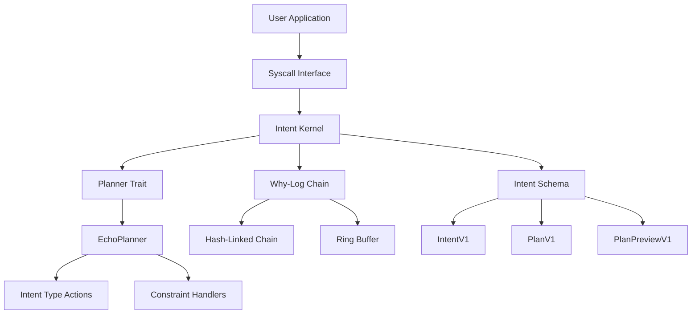

# Intent Kernel v0 — Schema, Planner Hooks, and Why-Logs

## Overview

Intent Kernel v0 is a minimal in-kernel Intent subsystem for Polymera OS that enables Jarvis-style, real-time tasking. It provides deterministic schemas, a planner plugin interface, and an append-only Why-Log chain for explainability, laying the foundation for AI agents while remaining deterministic and policy-safe.

## Architecture



## Core Components

### 1. Intent Schema (`kernel/src/intent/schema.rs`)

The Intent Kernel v0 defines deterministic schemas for all core data structures with stable serialization and versioning.

#### Schema Versioning
- **SCHEMA_VERSION**: 1 (stable)
- **Schema Hash**: Deterministic 32-byte hash computed at build time
- **Serialization**: JSON with consistent field ordering

#### Data Structures

##### IntentV1
```rust
pub struct IntentV1 {
    pub version: u16,                    // Schema version (1)
    pub id: u128,                        // Unique identifier
    pub description: String,              // Human-readable description
    pub intent_type: u16,                // Intent classification
    pub priority: u8,                    // Priority level (0-9)
    pub constraints: Vec<ConstraintV1>,  // Operational constraints
    pub metadata: BTreeMap<String,String>, // Key-value metadata
    pub requested_caps: Vec<CapRef>,     // Required capabilities
    pub deadline_ms: u64,                // Execution deadline
}
```

##### ConstraintV1
```rust
pub struct ConstraintV1 {
    pub kind: u16,                       // Constraint type
    pub value: ConstraintValue,          // Constraint value
}

pub enum ConstraintValue {
    Bytes(Vec<u8>),                      // Binary data
    Scalar(u64),                         // Numeric value
    String(String),                       // Text value
}
```

##### ActionV1
```rust
pub struct ActionV1 {
    pub kind: u16,                       // Action type
    pub params: BTreeMap<String,String>, // Action parameters
}
```

##### PlanV1
```rust
pub struct PlanV1 {
    pub intent_id: u128,                 // Associated intent
    pub actions: Vec<ActionV1>,          // Sequence of actions
    pub cost: u64,                       // Estimated cost
}
```

##### PlanPreviewV1
```rust
pub struct PlanPreviewV1 {
    pub plan: PlanV1,                    // Generated plan
    pub risks: Vec<String>,              // Identified risks
    pub notes: Vec<String>,              // Planning notes
}
```

##### EvidenceV1
```rust
pub struct EvidenceV1 {
    pub key: String,                     // Evidence key
    pub value: String,                   // Evidence value
}
```

##### CapRef
```rust
pub struct CapRef {
    pub cap_id: u64,                     // Capability ID
    pub scope: u64,                      // Capability scope
}
```

##### PreviewHandle
```rust
pub struct PreviewHandle {
    pub intent_id: u128,                 // Intent identifier
    pub preview_hash: [u8; 32],         // Plan preview hash
    pub timestamp: u64,                  // Creation timestamp
}
```

#### Size Limits
- **Intent**: ≤ 8KB (`INTENT_MAX_SIZE`)
- **PlanPreview**: ≤ 16KB (`PLAN_PREVIEW_MAX_SIZE`)
- **WhyLog Entry**: ≤ 1KB (`WHYLOG_ENTRY_MAX_SIZE`)

### 2. Planner Trait (`kernel/src/intent/planner.rs`)

The Planner trait provides a plugin interface for expanding intents into executable plans.

#### Trait Definition
```rust
pub trait Planner: Send + Sync {
    fn preview(
        &self,
        intent: &IntentV1,
        caps: &[u64],
        why_log: &mut WhyLog,
        vclock: u64,
    ) -> PlanPreviewV1;
}
```

#### EchoPlanner Implementation

The default `EchoPlanner` provides rule-based planning without external dependencies:

##### Intent Type Actions
- **BACKUP (1)**: snapshot → verify → archive
- **UPDATE (2)**: check → download → install
- **MONITOR (3)**: start → collect → report
- **DEPLOY (4)**: validate → prepare → deploy

##### Constraint Handlers
- **MAX_COST (1)**: Limits actions based on cost constraint
- **MAX_TIME (2)**: Limits actions based on time constraint
- **SECURITY_LEVEL (3)**: Adds verification actions for high security

##### Customization
```rust
// Register custom intent type
planner.register_intent_type(100, custom_actions);

// Register custom constraint handler
planner.register_constraint_handler(100, custom_handler);
```

### 3. Why-Log Chain (`kernel/src/intent/whylog.rs`)

The Why-Log chain provides an append-only, hash-linked record of reasoning and decision-making.

#### Structure
```rust
pub struct WhyLogEntry {
    pub ts_vclock: u64,                 // Virtual clock timestamp
    pub reason: String,                  // Human-readable reason
    pub evidence: Vec<EvidenceV1>,      // Supporting evidence
    pub prev_hash: [u8; 32],            // Previous entry hash
    pub entry_hash: [u8; 32],           // Current entry hash
}

pub struct WhyLogTail {
    pub tail_hash: [u8; 32],            // Chain tail hash
    pub entries_count: u64,              // Total entries
    pub truncated: bool,                 // Ring buffer overflow
    pub last_update: u64,                // Last update timestamp
}
```

#### Features
- **Hash Chaining**: Each entry links to the previous via cryptographic hash
- **Ring Buffer**: Bounded size with automatic truncation
- **Tamper Evidence**: Hash chain integrity verification
- **Helper Functions**: Common logging patterns for intents, constraints, and actions

#### Ring Buffer Behavior
- **Default Capacity**: 1000 entries (`WHYLOG_MAX_ENTRIES`)
- **Truncation**: Oldest entries removed when capacity exceeded
- **Chain Integrity**: Hash chain remains valid despite truncation

### 4. Intent Kernel (`kernel/src/intent/mod.rs`)

The main Intent Kernel orchestrates all components and provides the public interface.

#### Core Functionality
```rust
pub struct IntentKernel {
    planner: Box<dyn Planner>,          // Planning engine
    why_log: Mutex<WhyLog>,             // Why-Log chain
    counters: Mutex<IntentCounters>,    // Operation counters
    intents: Mutex<HashMap<u128, IntentV1>>, // Intent storage
    virtual_clock: Mutex<u64>,          // Deterministic clock
}
```

#### Public Interface
- **submit()**: Record intent and generate preview
- **preview()**: Generate preview without recording
- **get_whylog_tail()**: Retrieve Why-Log chain tail
- **get_counters()**: Retrieve operation statistics

#### Policy Simulation
The kernel includes a stubbed policy engine for development:
- **Reserved Intent Types**: Type 0 is denied
- **Priority Limits**: Priority > 9 is denied
- **Deadline Limits**: Deadline < 10ms is denied

### 5. Syscall Interface (`kernel/src/syscall/handlers/intent.rs`)

The Intent Kernel exposes four syscalls for user applications:

#### SYS_INTENT_SUBMIT
```c
long sys_intent_submit(const void *intent_buf, size_t buf_len, void *result_buf);
```
- **Input**: Intent data buffer and length
- **Output**: Preview handle in result buffer
- **Behavior**: Records intent, generates preview, returns handle
- **Audit**: `INTENT_SUBMIT` event

#### SYS_INTENT_PREVIEW
```c
long sys_intent_preview(const void *intent_buf, size_t buf_len, void *result_buf);
```
- **Input**: Intent data buffer and length
- **Output**: Plan preview in result buffer
- **Behavior**: Generates preview without recording intent
- **Audit**: `INTENT_PREVIEW` event

#### SYS_INTENT_WHYLOG_TAIL
```c
long sys_intent_whylog_tail(void *result_buf);
```
- **Input**: None
- **Output**: Why-Log tail information
- **Behavior**: Retrieves current Why-Log chain state
- **Audit**: `INTENT_WHYLOG_TAIL` event

#### SYS_INTENT_STATS
```c
long sys_intent_stats(void *result_buf);
```
- **Input**: None
- **Output**: Operation counters
- **Behavior**: Retrieves current statistics
- **Audit**: `INTENT_STATS` event

## Determinism Rules

### 1. No External Dependencies
- **No Network Calls**: All operations are local
- **No LLM Integration**: Planning uses rule-based logic only
- **No Random Sources**: Virtual clock provides deterministic timing

### 2. Stable Serialization
- **Field Ordering**: Consistent JSON field sequence
- **Schema Versioning**: Stable version numbers across builds
- **Hash Consistency**: Identical content produces identical hashes

### 3. Virtual Clock
- **Monotonic**: Always increases with each operation
- **Deterministic**: Same sequence produces same timestamps
- **Configurable**: Can be set for testing and replay

## Security Features

### 1. Policy Integration
- **Stubbed Engine**: Simple rule-based policy for development
- **Capability Checks**: Intent capabilities validated against available caps
- **Risk Assessment**: Automatic risk identification and reporting

### 2. Audit Logging
- **Structured Events**: All operations generate audit records
- **Evidence Collection**: Why-Log entries include supporting evidence
- **Tamper Detection**: Hash chain integrity verification

### 3. Input Validation
- **Size Limits**: Strict enforcement of payload size constraints
- **Schema Validation**: JSON structure and field validation
- **Version Checking**: Schema version compatibility verification

## Performance Characteristics

### 1. Memory Usage
- **Bounded Storage**: Intent storage limited by available memory
- **Ring Buffer**: Why-Log chain has fixed maximum size
- **Efficient Serialization**: JSON with minimal overhead

### 2. Processing Time
- **Deterministic**: Same input produces same output in same time
- **Rule-Based**: Planning uses simple rule evaluation
- **Hash Computation**: Blake3 hashing for Why-Log entries

### 3. Scalability
- **Concurrent Access**: Thread-safe with mutex protection
- **Bounded Queues**: No unbounded memory growth
- **Efficient Lookups**: HashMap-based intent storage

## Development and Testing

### 1. Test Coverage
- **Schema Stability**: Round-trip serialization tests
- **Planner Logic**: EchoPlanner behavior verification
- **Why-Log Chain**: Hash chain integrity tests
- **Syscall Interface**: Error handling and success path tests

### 2. Feature Flags
- **INTENT_BUS_V1**: Enables Intent Bus ABI v1 (from P2-AI1)
- **INTENT_KERNEL_V0**: Enables Intent Kernel v0

### 3. Debugging Support
- **Why-Log Chain**: Complete decision-making history
- **Operation Counters**: Performance and error statistics
- **Virtual Clock**: Deterministic timing for replay

## Integration Points

### 1. Kernel Integration
- **Module Loading**: Integrated into kernel build system
- **Syscall Table**: Registered in kernel syscall handler
- **Audit System**: Integrated with kernel audit framework

### 2. User Applications
- **C Interface**: C header files for syscall access
- **Rust Stubs**: Rust bindings for kernel operations
- **Documentation**: Comprehensive API documentation

### 3. Future Extensions
- **Agent Runtime**: Foundation for AI agent execution
- **Policy Engine**: Integration with OPA→WASM policy system
- **Execution Engine**: Plan execution and monitoring

## Usage Examples

### 1. Basic Intent Submission
```rust
use kernel::intent::schema::*;

let intent = IntentV1::new(123, "backup system".to_string(), 1)
    .with_priority(5)
    .with_constraints(vec![
        ConstraintV1::scalar(1, 100), // MAX_COST = 100
    ]);

let serialized = serde_json::to_vec(&intent).unwrap();
let handle = kernel.submit(&serialized)?;
```

### 2. Custom Planner
```rust
struct CustomPlanner;

impl Planner for CustomPlanner {
    fn preview(&self, intent: &IntentV1, caps: &[u64], why_log: &mut WhyLog, vclock: u64) -> PlanPreviewV1 {
        // Custom planning logic
        PlanPreviewV1::new(PlanV1::new(intent.id))
    }
}

let kernel = IntentKernel::new().with_planner(Box::new(CustomPlanner));
```

### 3. Why-Log Analysis
```rust
let tail = kernel.get_whylog_tail();
println!("Why-Log entries: {}", tail.entries_count);
println!("Chain hash: {:?}", tail.tail_hash);
println!("Truncated: {}", tail.truncated);
```

## Troubleshooting

### 1. Common Issues
- **Schema Version Mismatch**: Ensure client uses compatible schema version
- **Size Limit Exceeded**: Check intent and preview payload sizes
- **Policy Denial**: Verify intent type, priority, and deadline values

### 2. Debugging Tools
- **Why-Log Chain**: Review decision-making history
- **Operation Counters**: Check success/failure statistics
- **Virtual Clock**: Verify deterministic timing behavior

### 3. Performance Tuning
- **Ring Buffer Size**: Adjust `WHYLOG_MAX_ENTRIES` for memory constraints
- **Intent Storage**: Monitor memory usage for large numbers of intents
- **Hash Computation**: Consider caching for frequently accessed entries

## Future Enhancements

### 1. Policy Engine Integration
- **OPA→WASM**: Full policy evaluation engine
- **Dynamic Policies**: Runtime policy updates
- **Policy Composition**: Complex policy rule combinations

### 2. Execution Engine
- **Plan Execution**: Actual action execution
- **Progress Monitoring**: Real-time execution status
- **Error Recovery**: Automatic failure handling

### 3. Advanced Planning
- **ML Integration**: Machine learning-based planning
- **Resource Optimization**: Cost and time optimization
- **Multi-Intent Planning**: Coordinated intent execution

## Conclusion

Intent Kernel v0 provides a solid foundation for AI-powered tasking in Polymera OS. Its deterministic design, comprehensive Why-Log chain, and flexible planner interface enable both current development needs and future AI agent capabilities. The system balances security, performance, and usability while maintaining the deterministic characteristics required for regulated environments.

The modular architecture allows for incremental enhancement, with clear integration points for policy engines, execution systems, and advanced planning algorithms. The comprehensive test suite ensures reliability and the detailed documentation supports both development and operational use.
