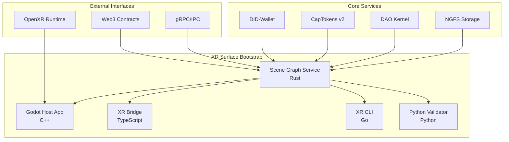

# P4-06-A1: XR/Metaverse Surface Bootstrap

## Overview

The XR/Metaverse Surface Bootstrap (P4-06-A1) is a comprehensive system for managing 3D virtual worlds in Aetheris OS. It provides a deterministic scene graph service, avatar management, capability-based access control, and policy enforcement, all integrated with the existing NGFS storage and DAO governance systems.

## Architecture

### System Components



### Component Responsibilities

- **Scene Graph Service (Rust)**: Core service managing scene state, avatars, and policies
- **Godot Host App (C++)**: 3D rendering engine with native module integration
- **XR Bridge (TypeScript)**: Client-side SDK for scene interaction
- **XR CLI (Go)**: Command-line interface for scene management
- **Python Validator**: Comprehensive testing and validation suite

## Scene Graph Service

### Core Features

- **Deterministic Tick Loop**: Predictable scene updates with virtual monotonic clock
- **DID-bound Avatars**: User representations linked to Decentralized Identifiers
- **Capability-based Access Control**: Fine-grained permissions using CapTokens v2
- **DAO Policy Integration**: Governance-driven scene management
- **NGFS Snapshot Integration**: Content-addressed scene persistence

### Data Structures

#### SceneNode
```rust
pub struct SceneNode {
    pub id: NodeId,
    pub name: String,
    pub parent_id: Option<NodeId>,
    pub transform: Transform,
    pub components: Vec<Component>,
    pub metadata: HashMap<String, serde_json::Value>,
}
```

#### Avatar
```rust
pub struct Avatar {
    pub id: AvatarId,
    pub did: String,
    pub profile: AvatarProfile,
    pub transform: Transform,
    pub is_online: bool,
    pub metadata: HashMap<String, serde_json::Value>,
}
```

#### Transform
```rust
pub struct Transform {
    pub position: Vector3,
    pub rotation: Vector3,
    pub scale: Vector3,
}
```

### API Endpoints

#### Node Management
- `CreateNode(parent_id, kind, transform, components) → NodeId`
- `UpdateNode(node_id, transform?, components?) → Ack`
- `DeleteNode(node_id) → Ack`

#### Avatar Management
- `BindAvatar(did, profile) → AvatarId`
- `UpdateAvatar(avatar_id, transform) → Ack`
- `UnbindAvatar(avatar_id) → Ack`

#### Snapshot Management
- `SnapshotSave(label) → SnapshotId`
- `SnapshotLoad(snapshot_id) → Ack`

#### Policy and Capability
- `AttachPolicy(scope, rego_bundle_cbor) → Ack`
- `CheckCapability(capability, context) → bool`
- `CheckPolicy(action, context) → PolicyResult`

## Godot Host Application

### Project Structure

```
ui/xr/godot_app/
├── project.godot          # Godot project configuration
├── main.tscn             # Main scene file
├── main.gd               # Main scene controller
├── AetherisScene.gd      # Scene graph integration
└── autoload/
    └── AetherisBus.gd    # Global communication bus
```

### GDExtension Module

```
ui/xr/godot_modules/aetheris/
├── CMakeLists.txt        # Build configuration
├── aetheris.gdextension.in # Extension configuration
├── src/
│   ├── aetheris.cpp      # Main module entry point
│   ├── aetheris_scene.cpp # Scene management
│   ├── aetheris_avatar.cpp # Avatar management
│   └── aetheris_bus.cpp  # Communication bus
└── include/
    ├── aetheris_scene.hpp
    ├── aetheris_avatar.hpp
    └── aetheris_bus.hpp
```

### Key Features

- **Headless Mode**: Run without GPU for CI/testing
- **OpenXR Integration**: XR device support (build-time configurable)
- **Real-time Sync**: 60Hz synchronization with scene service
- **Event-driven Architecture**: Signal-based communication

## XR Bridge (TypeScript)

### Core Classes

#### XRBridge
```typescript
export class XRBridge extends EventEmitter {
  async connect(): Promise<void>
  async disconnect(): Promise<void>
  async spawnNode(options: SpawnNodeOptions): Promise<SceneNode>
  async updateNode(nodeId: string, updates: NodeUpdates): Promise<void>
  async removeNode(nodeId: string): Promise<void>
  async spawnAvatar(options: SpawnAvatarOptions): Promise<Avatar>
  async updateAvatar(avatarId: string, updates: AvatarUpdates): Promise<void>
  async removeAvatar(avatarId: string): Promise<void>
  async saveSnapshot(label: string, description?: string): Promise<Snapshot>
  async loadSnapshot(snapshotId: string): Promise<Snapshot>
  async checkCapability(capability: string, context: Record<string, any>): Promise<boolean>
  async checkPolicy(action: string, context: PolicyContext): Promise<PolicyResult>
}
```

### Event System

```typescript
export interface XREvents {
  'scene_ready': () => void;
  'scene_error': (error: string) => void;
  'node_spawned': (node: SceneNode) => void;
  'node_updated': (node: SceneNode) => void;
  'node_removed': (nodeId: string) => void;
  'avatar_spawned': (avatar: Avatar) => void;
  'avatar_updated': (avatar: Avatar) => void;
  'avatar_removed': (avatarId: string) => void;
  'policy_denied': (action: string, reason: string) => void;
  'snapshot_saved': (snapshot: Snapshot) => void;
  'snapshot_loaded': (snapshot: Snapshot) => void;
}
```

## XR CLI (Go)

### Command Structure

```bash
xrctl scene spawn cube --position 0,1,0 --parent root
xrctl scene update node_123 --position 1,2,3 --rotation 0,90,0
xrctl scene remove node_123
xrctl scene import scene.json
xrctl scene export scene.json

xrctl avatar bind did:aeth:user123 --position 0,1,2
xrctl avatar update avatar_456 --position 1,2,3
xrctl avatar remove avatar_456

xrctl policy apply policy.rego
xrctl policy check spawn

xrctl demo run --headless --spawn cube --bind-did did:aeth:demo
```

### Configuration

```yaml
# ~/.xrctl.yaml
scene_service_url: "localhost:50051"
connection_timeout: 5000
sync_interval: 16
enable_policy_enforcement: true
enable_capability_checking: true
auto_reconnect: true
max_reconnect_attempts: 10
```

## Python Validator

### Test Suite

The Python validator provides comprehensive testing for:

- **Snapshot Round-trip**: Save/load scene state verification
- **DID-Avatar Binding**: Identity and avatar association
- **Capability Enforcement**: Permission system validation
- **Policy Enforcement**: DAO policy compliance
- **Determinism**: Consistent behavior across multiple ticks
- **Performance**: Benchmarking and threshold validation
- **Error Handling**: Robust error recovery

### Usage

```bash
python tooling/python/xr_validator.py --config config.yaml --output results.json
```

### Test Results

```json
{
  "total_tests": 7,
  "passed_tests": 7,
  "failed_tests": 0,
  "success_rate": 1.0,
  "test_results": [
    {
      "test": "snapshot_roundtrip",
      "status": "passed",
      "details": {
        "nodes": 2,
        "avatars": 1,
        "label": "test_snapshot"
      }
    }
  ],
  "validator_stats": {
    "total_requests": 15,
    "successful_requests": 15,
    "failed_requests": 0,
    "average_response_time": 0.05
  }
}
```

## Security and Policy

### CapTokens v2 Integration

All scene mutations require valid CapTokens v2:

```rust
pub struct CapToken {
    pub id: String,
    pub name: String,
    pub permissions: Vec<Permission>,
    pub scope: CapScope,
    pub expires_at: Option<DateTime<Utc>>,
    pub created_at: DateTime<Utc>,
    pub created_by: String,
}
```

### DAO Policy Enforcement

Policies are defined in Rego and enforced at runtime:

```rego
package aetheris.xr

default allow = false

allow {
    input.action == "spawn"
    input.user_did != ""
    has_capability("spawn_node")
}

allow {
    input.action == "modify"
    input.user_did == node_owner[input.node_id]
}
```

### Access Control Matrix

| Action | Capability Required | Policy Check | DAO Approval |
|--------|-------------------|--------------|--------------|
| Spawn Node | `spawn_node` | `spawn` | Optional |
| Modify Node | `modify_node` | `modify` | Optional |
| Remove Node | `remove_node` | `remove` | Optional |
| Bind Avatar | `spawn_avatar` | `bind_avatar` | Required |
| Create Snapshot | `create_snapshot` | `create_snapshot` | Required |
| Load Snapshot | `load_snapshot` | `load_snapshot` | Required |

## Performance Requirements

### Benchmarks

- **p95 End-to-end**: "spawn node → visible in Godot" ≤ 120ms (headless CI path)
- **Performance Regression**: ≤10% vs. current networking/IO baselines
- **Deterministic Tick**: Consistent timing across runs
- **Snapshot I/O**: Byte-stable across runs

### Optimization Strategies

- **Spatial Indexing**: Efficient node lookup and culling
- **Component Systems**: ECS architecture for performance
- **Async Processing**: Non-blocking I/O operations
- **Memory Pooling**: Reduced allocation overhead
- **Batch Operations**: Grouped scene updates

## Build and Deployment

### Prerequisites

- Rust 1.70+
- Go 1.21+
- Node.js 18+
- Python 3.9+
- Godot 4.3+
- CMake 3.16+
- gRPC and Protobuf

### Build Instructions

#### Rust Scene Service
```bash
cd services/xr/scene
cargo build --release
cargo test
```

#### Godot Module
```bash
cd ui/xr/godot_modules/aetheris
mkdir build && cd build
cmake ..
make -j$(nproc)
```

#### Go CLI
```bash
cd go/tooling/xrctl
go build -o xrctl main.go
```

#### TypeScript Bridge
```bash
cd tooling/ts
npm install
npm run build
```

#### Python Validator
```bash
cd tooling/python
pip install -r requirements.txt
python xr_validator.py --help
```

### Docker Deployment

```dockerfile
FROM rust:1.70 as rust-builder
WORKDIR /app
COPY services/xr/scene .
RUN cargo build --release

FROM node:18 as node-builder
WORKDIR /app
COPY tooling/ts .
RUN npm install && npm run build

FROM golang:1.21 as go-builder
WORKDIR /app
COPY go/tooling/xrctl .
RUN go build -o xrctl main.go

FROM python:3.9-slim
WORKDIR /app
COPY --from=rust-builder /app/target/release/xr-scene .
COPY --from=node-builder /app/dist .
COPY --from=go-builder /app/xrctl .
COPY tooling/python .
RUN pip install -r requirements.txt
```

## Testing and Validation

### Unit Tests

```bash
# Rust tests
cargo test -p xr-scene

# Go tests
go test ./go/tooling/xrctl/...

# TypeScript tests
npm test

# Python tests
pytest tooling/python/
```

### Integration Tests

```bash
# Full system test
./scripts/test-xr-system.sh

# Performance benchmarks
./scripts/benchmark-xr.sh

# Determinism validation
python tooling/python/xr_validator.py --repeat 3
```

### CI/CD Pipeline

The CI pipeline includes:

1. **Build Verification**: All components build successfully
2. **Unit Testing**: Comprehensive test coverage
3. **Integration Testing**: End-to-end system validation
4. **Performance Testing**: Benchmark validation
5. **Security Scanning**: Vulnerability assessment
6. **Documentation**: API documentation generation

## Troubleshooting

### Common Issues

#### Connection Failures
```bash
# Check service status
xrctl status

# Verify configuration
xrctl config show

# Test connectivity
xrctl ping
```

#### Performance Issues
```bash
# Monitor performance
xrctl stats

# Profile scene service
cargo run --release --bin xr-scene -- --profile

# Check memory usage
xrctl memory
```

#### Policy Violations
```bash
# Check policy status
xrctl policy status

# Validate policy syntax
xrctl policy validate policy.rego

# Test policy enforcement
xrctl policy test --action spawn --context '{"user_did": "did:aeth:test"}'
```

### Debug Mode

Enable debug logging:

```bash
# Rust service
RUST_LOG=debug cargo run --bin xr-scene

# Go CLI
xrctl --debug scene spawn cube

# TypeScript bridge
DEBUG=xr:* node app.js

# Python validator
python xr_validator.py --verbose
```

## Future Enhancements

### Planned Features

- **Multi-user Support**: Concurrent user sessions
- **Spatial Audio**: 3D audio integration
- **Physics Simulation**: Realistic physics engine
- **AI NPCs**: Intelligent non-player characters
- **Cross-platform**: Mobile and web support
- **Cloud Integration**: Distributed scene hosting

### Extension Points

- **Custom Components**: User-defined scene components
- **Plugin System**: Third-party extensions
- **Scripting API**: Lua/Python scripting support
- **Asset Pipeline**: Automated asset processing
- **Analytics**: Usage and performance metrics

## References

### External Documentation

- [Godot Engine Documentation](https://docs.godotengine.org/)
- [OpenXR Specification](https://www.khronos.org/openxr/)
- [gRPC Documentation](https://grpc.io/docs/)
- [Rego Policy Language](https://www.openpolicyagent.org/docs/latest/policy-language/)

### Internal References

- [NGFS Storage System](../P4-01-NGFS.md)
- [DAO Kernel](../P4-04-A2-DAO.md)
- [CapTokens v2](../P4-04-A1-WALLET.md)
- [Web3 Contracts](../P4-05-CONTRACTS.md)

## Conclusion

The XR/Metaverse Surface Bootstrap provides a robust foundation for building immersive 3D experiences in Aetheris OS. With its deterministic scene graph, capability-based security, and comprehensive tooling, it enables developers to create secure, scalable virtual worlds that integrate seamlessly with the broader Aetheris ecosystem.

The system's polyglot architecture ensures broad compatibility while maintaining performance and security standards. The comprehensive testing suite and validation tools provide confidence in system reliability and correctness.

As the foundation for future XR and metaverse applications, this bootstrap system sets the stage for advanced features like multi-user collaboration, AI-driven interactions, and cross-platform deployment.
