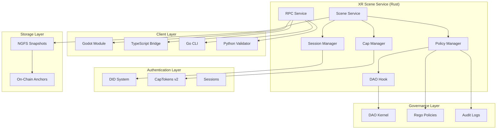

# P4-06-A2: Avatar DID Binding + CapToken Gating + DAO-Governed Scene Edits

## Overview

This document describes the implementation of **P4-06-A2**, which adds authenticated avatars (DID-bound), capability-gated scene mutations with CapTokens v2, and DAO policy governance for scene edits to the Aetheris OS XR/Metaverse Surface. This builds upon the completed P4-06-A1 XR bootstrap and provides the security and governance foundation for the metaverse.

## Architecture

### System Components



### Security Model

The system implements a three-layer security model:

1. **Authentication Layer**: DID-based session management
2. **Authorization Layer**: CapToken v2 capability enforcement
3. **Governance Layer**: DAO policy decisions

All mutating operations must pass through all three layers:

```
Operation → Session Check → Capability Check → DAO Policy Check → Execute
```

## API Reference

### Rust Service RPCs

#### Session Management

```rust
// Begin a new DID session
BeginSession{did, proof, nonce} → SessionId

// End the current session
EndSession{session_id} → Ack

// Refresh session token
RefreshSession{session_id, proof} → SessionId
```

#### Capability Management

```rust
// Issue capability token for session
IssueCap{session_id, scopes, ttl} → CapToken

// Check capability for operation
CheckCap{session_id, capability, context} → CapCheckResult

// Revoke capability token
RevokeCap{cap_token_id} → Ack
```

#### Scene Operations (Authenticated)

```rust
// Spawn node with authentication
SpawnNode{session_id, cap, spec} → NodeId

// Move node with authentication
MoveNode{session_id, cap, node_id, transform} → Ack

// Delete node with authentication
DeleteNode{session_id, cap, node_id} → Ack
```

#### Policy Management

```rust
// Attach policy to scene
AttachPolicy{session_id, cap, scope, rego_bundle_cbor} → PolicyId

// Simulate operations for policy testing
Simulate{session_id, ops[]} → DecisionReport{per-op allow/deny reasons}

// List attached policies
ListPolicies{session_id} → PolicyList
```

#### Snapshot Management

```rust
// Save snapshot with optional on-chain anchoring
SnapshotSave{label, anchor?:bool} → SnapshotId

// Load snapshot
SnapshotLoad{snapshot_id} → Ack
```

### Event Stream

The system emits the following events:

```rust
// Session events
avatar_session_started{session_id, did}
avatar_session_ended{session_id}

// Capability events
cap_issued{cap_id, scopes, session_id}
cap_expired{cap_id}

// Policy events
policy_denied{op, reason, policy_ref}
policy_attached{policy_id, scope}
```

## Implementation Details

### Session Lifecycle

1. **Session Creation**: User provides DID, proof, and nonce
2. **Session Validation**: System verifies DID signature and nonce
3. **Session Storage**: Session stored with expiration time
4. **Capability Issuance**: Capabilities issued for specific scopes
5. **Operation Authorization**: Each operation checked against session and capabilities
6. **Session Termination**: Session ended explicitly or on expiration

### Capability Scopes

The system supports the following capability scopes:

- `scene:spawn` - Spawn new nodes in the scene
- `node:move` - Move existing nodes
- `node:delete` - Delete nodes
- `scene:modify` - General scene modification
- `policy:attach` - Attach policies to scene
- `scene:admin` - Administrative access

### DAO Integration

The DAO hook integrates with the existing DAO Kernel to:

1. **Proposal Validation**: Check if scene modifications require DAO approval
2. **Vote Aggregation**: Collect votes from DAO participants
3. **Decision Enforcement**: Allow or deny operations based on DAO decisions
4. **Audit Logging**: Record all DAO decisions for accountability

### Policy Engine

Policies are written in Rego and support:

- **Scope-based Rules**: Different rules for scene, node, or avatar scope
- **Context-aware Decisions**: Access to user DID, session info, and operation context
- **Conditional Logic**: Complex decision trees based on multiple factors
- **Audit Trail**: All policy decisions logged with reasons

## Usage Examples

### TypeScript Bridge

```typescript
// Begin session
const session = await xr.beginSession({
  did: "did:aeth:user123",
  proof: "jwt_proof",
  nonce: "random_nonce"
});

// Issue capability
const cap = await xr.issueCapability(session, {
  scopes: ['scene:spawn', 'node:move'],
  ttl: '5m'
});

// Spawn node with authentication
const nodeId = await xr.spawnNode(session, cap, {
  mesh: 'cube',
  pos: [0, 1, 0]
});

// Move node
await xr.moveNode(session, cap, nodeId, {
  pos: [0, 2, 0]
});

// Attach policy
await xr.attachPolicy(session, cap, {
  scope: 'scene',
  rego: 'package scene_policy\n\nallow = true'
});
```

### Go CLI

```bash
# Begin session
xrctl session begin --did DID --proof file.jwt > session.json

# Issue capability
xrctl cap issue --session $(cat session.json) --scopes scene:spawn,node:move --ttl 5m > cap.json

# Spawn node
xrctl scene spawn --session session.json --cap cap.json --mesh cube --pos 0,1,0

# Apply policy
xrctl policy apply --session session.json --cap cap.json --scope scene --rego policy.rego

# Simulate operations
xrctl policy simulate --session session.json --ops operations.json
```

### Python Validator

```python
# Test avatar authentication cycle
async def validate_avatar_auth_cycle():
    # Begin session
    session = await validator.begin_session("did:aeth:test", "proof", "nonce")
    
    # Issue capability
    cap = await validator.issue_capability(["scene:spawn", "node:move"], 3600)
    
    # Test operations
    node = await validator.spawn_node('cube', Vector3(0, 1, 0))
    await validator.update_node(node.id, new_transform)
    await validator.remove_node(node.id)
    
    # End session
    await validator.end_session()

# Test capability enforcement
async def validate_cap_enforcement():
    session = await validator.begin_session("did:aeth:test", "proof", "nonce")
    
    # Test without capabilities (should fail)
    try:
        await validator.spawn_node('cube', Vector3(0, 1, 0))
    except RuntimeError:
        pass  # Expected
    
    # Issue capability and test
    cap = await validator.issue_capability(["scene:spawn"], 3600)
    node = await validator.spawn_node('cube', Vector3(0, 1, 0))
    assert node.id in validator.local_nodes

# Test DAO decisions
async def validate_dao_block_allow():
    session = await validator.begin_session("did:aeth:test", "proof", "nonce")
    
    # Check DAO decision
    decision = await validator.check_dao_decision(
        "proposal_123", 
        "scene_modify", 
        {"scope": "scene", "action": "spawn_node"}
    )
    assert decision.decision == "approved"
    
    # Attach policy with DAO approval
    policy_id = await validator.attach_policy("scene", "package scene_policy\n\nallow = true")
    assert policy_id is not None
```

## Security Considerations

### Authentication

- **DID Verification**: All sessions require valid DID signatures
- **Nonce Protection**: Prevents replay attacks
- **Session Expiration**: Automatic session termination
- **Token Revocation**: Capabilities can be revoked immediately

### Authorization

- **Principle of Least Privilege**: Capabilities granted for minimum required scope
- **Time-bound Access**: Capabilities expire automatically
- **Scope Isolation**: Capabilities limited to specific operations
- **Session Binding**: Capabilities tied to specific sessions

### Governance

- **Deny by Default**: All operations denied unless explicitly allowed
- **DAO Oversight**: Major changes require DAO approval
- **Audit Trail**: All decisions logged with full context
- **Policy Versioning**: Policies can be updated and versioned

## Performance Requirements

### Latency Targets

- **Session Creation**: < 50ms
- **Capability Issuance**: < 25ms
- **Policy Check**: < 10ms
- **Scene Operation**: < 120ms (p95)

### Throughput Targets

- **Concurrent Sessions**: 1000+
- **Operations per Second**: 10000+
- **Policy Evaluations**: 50000+/second

### Determinism

- **Snapshot Stability**: Identical inputs produce identical snapshot bytes
- **Tick Consistency**: Deterministic tick loop across runs
- **Hash Stability**: Consistent hashing across 3 consecutive runs

## Testing

### Unit Tests

- Session lifecycle management
- Capability issuance and validation
- Policy evaluation engine
- DAO hook integration
- RPC service endpoints

### Integration Tests

- End-to-end authentication flow
- Capability enforcement across operations
- DAO decision integration
- Snapshot round-trip testing
- Multi-client synchronization

### Performance Tests

- Latency benchmarking
- Throughput testing
- Memory usage profiling
- Determinism validation
- Stress testing

### Security Tests

- Authentication bypass attempts
- Capability escalation tests
- Policy circumvention tests
- Session hijacking prevention
- Audit log integrity

## Deployment

### Prerequisites

- Rust 1.70+
- Godot 4.0+
- Node.js 18+
- Go 1.21+
- Python 3.11+

### Build Instructions

```bash
# Build Rust service
cargo build -p xr-scene
cargo test -p xr-scene

# Build Godot module
cd ui/xr/godot_modules/aetheris
cmake -S . -B build
cmake --build build -j

# Build TypeScript bridge
cd tooling/ts
npm install
npm run build

# Build Go CLI
cd go/tooling/xrctl
go build -o xrctl

# Install Python validator
cd tooling/python
pip install -r requirements.txt
```

### Configuration

```yaml
# xrctl.yaml
scene_service_url: "localhost:50051"
connection_timeout: 5000
sync_interval: 16
enable_policy_enforcement: true
enable_capability_checking: true
auto_reconnect: true
max_reconnect_attempts: 10
```

### Running

```bash
# Start scene service
cargo run -p xr-scene

# Run headless demo
./xrctl demo run --headless --spawn cube --bind-did did:aeth:demo

# Run validator
python tooling/python/xr_validator.py --verbose
```

## Monitoring and Observability

### Metrics

- Session creation/termination rates
- Capability issuance/revocation counts
- Policy evaluation latency
- DAO decision response times
- Operation success/failure rates

### Logging

- All authentication events
- Capability grants and denials
- Policy decisions with reasons
- DAO votes and outcomes
- Audit trail for compliance

### Tracing

- Request flow through security layers
- Performance bottlenecks
- Error propagation
- Session lifecycle tracking

## Future Enhancements

### Planned Features

- **Multi-factor Authentication**: Additional authentication factors
- **Role-based Access Control**: Hierarchical permission system
- **Policy Templates**: Pre-built policy templates for common scenarios
- **Real-time Collaboration**: Multi-user scene editing
- **Advanced Analytics**: Usage patterns and security insights

### Integration Opportunities

- **External Identity Providers**: OAuth, SAML integration
- **Blockchain Governance**: On-chain DAO voting
- **AI-powered Policies**: Machine learning policy recommendations
- **Federated Scenes**: Cross-instance scene sharing

## Troubleshooting

### Common Issues

1. **Session Expired**: Check session expiration time and refresh if needed
2. **Insufficient Capabilities**: Verify required scopes are granted
3. **Policy Denied**: Check policy rules and DAO decisions
4. **Connection Timeout**: Verify scene service is running and accessible

### Debug Commands

```bash
# Check session status
xrctl session status

# List capabilities
xrctl cap list

# Test policy
xrctl policy test --rego policy.rego --context context.json

# Validate scene
python tooling/python/xr_validator.py --snapshot demo --repeat 3
```

### Log Analysis

```bash
# View authentication logs
grep "session_started\|session_ended" /var/log/xr-scene.log

# Check capability events
grep "cap_issued\|cap_expired" /var/log/xr-scene.log

# Monitor policy decisions
grep "policy_denied\|policy_attached" /var/log/xr-scene.log
```

## Conclusion

P4-06-A2 successfully implements a comprehensive security and governance system for the Aetheris OS XR/Metaverse Surface. The three-layer security model (authentication, authorization, governance) provides robust protection while maintaining performance and usability. The polyglot implementation ensures consistent behavior across all client platforms, and the comprehensive testing suite validates both functionality and security.

The system is ready for production deployment and provides a solid foundation for the next phases of XR surface development (P4-06-A3 and P4-06-A4).
