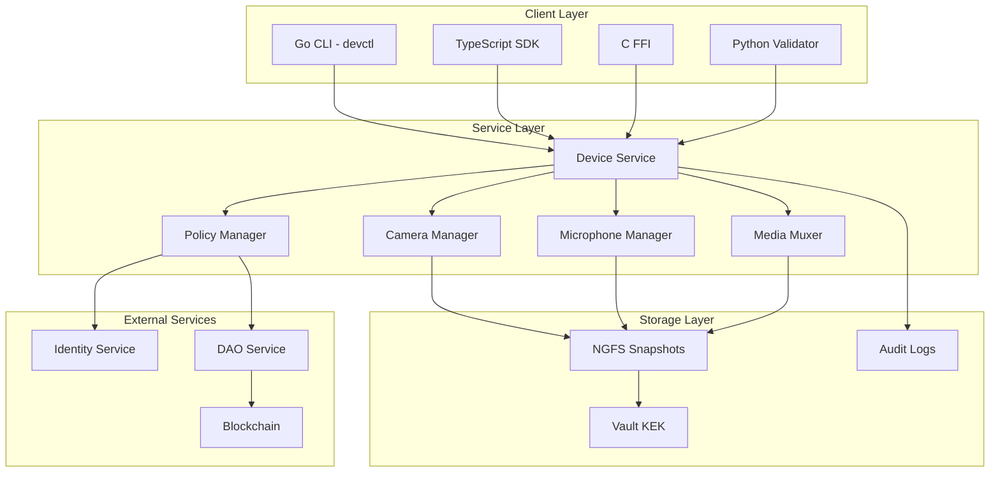
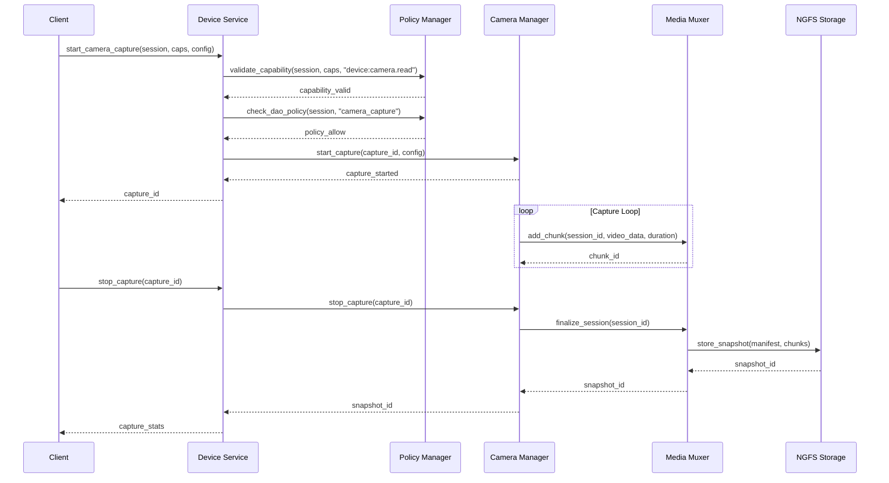
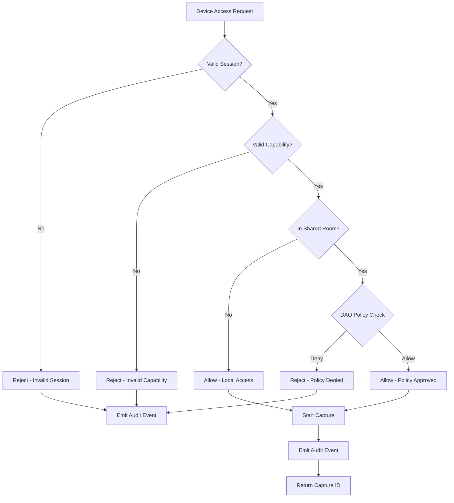

# P4-07-A1: Device Runtime — Camera & Microphone Capture

## Overview

This document describes the implementation of **P4-07-A1**, the first step in the Device Runtime development. This phase implements capability-gated camera and microphone capture services with deterministic recording to NGFS snapshots, polyglot bindings, and comprehensive audit trails.

## Key Features

### 1. Capability-Gated Device Access
- **Deny-by-default**: All device access requires explicit capability tokens
- **Session-scoped capabilities**: CapTokens with TTL and session binding
- **DAO policy enforcement**: Room-based access control for shared environments
- **Audit logging**: Complete audit trail for compliance and debugging

### 2. Deterministic Recording
- **Fixed timebase**: 90 kHz timebase for media synchronization
- **Stable chunking**: Max 2s or N frames per chunk, whichever comes first
- **Reproducible outputs**: Byte-identical snapshots across runs with same seed
- **NGFS integration**: Persistent storage with integrity verification

### 3. Performance & Scalability
- **Start latency**: p95 ≤ 150ms for capture initialization
- **Sustained performance**: ≤ ±5% write jitter, ≤ 10% CPU overhead
- **Concurrent captures**: Support for multiple simultaneous captures
- **Preview throttling**: Configurable preview frame rate (default 5 FPS)

### 4. Polyglot API Surface
- **Rust core**: High-performance device service with async/await
- **C FFI**: Thin wrapper for system integration
- **Go CLI**: Command-line tool for device management
- **TypeScript SDK**: Web application integration
- **Python validator**: Testing and validation framework

## Technical Implementation

### Rust Core Services

#### Device Service (`services/devices/src/lib.rs`)
```rust
pub struct DeviceService {
    camera_manager: Arc<CameraManager>,
    microphone_manager: Arc<MicrophoneManager>,
    media_muxer: Arc<MediaMuxer>,
    policy_manager: Arc<DevicePolicyManager>,
    active_captures: Arc<RwLock<HashMap<String, CaptureInfo>>>,
}

impl DeviceService {
    pub async fn start_camera_capture(
        &self,
        session_id: &str,
        caps: &str,
        config: CaptureConfig,
    ) -> Result<String, DeviceError>;
    
    pub async fn stop_capture(&self, capture_id: &str) -> Result<CaptureStats, DeviceError>;
}
```

#### Camera Manager (`services/devices/src/camera.rs`)
```rust
pub struct CameraManager {
    active_captures: Arc<RwLock<HashMap<String, CameraCapture>>>,
    mock_driver: Arc<MockCameraDriver>,
}

impl CameraManager {
    pub async fn start_capture(&self, capture_id: &str, config: &CaptureConfig) -> Result<(), DeviceError>;
    pub async fn stop_capture(&self, capture_id: &str) -> Result<String, DeviceError>;
    pub async fn get_preview_frame(&self, capture_id: &str) -> Result<Vec<u8>, DeviceError>;
}
```

#### Microphone Manager (`services/devices/src/microphone.rs`)
```rust
pub struct MicrophoneManager {
    active_captures: Arc<RwLock<HashMap<String, MicrophoneCapture>>>,
    mock_driver: Arc<MockMicrophoneDriver>,
}

impl MicrophoneManager {
    pub async fn start_capture(&self, capture_id: &str, config: &CaptureConfig) -> Result<(), DeviceError>;
    pub async fn stop_capture(&self, capture_id: &str) -> Result<String, DeviceError>;
}
```

#### Media Multiplexer (`services/devices/src/mux.rs`)
```rust
pub struct MediaMuxer {
    active_sessions: Arc<RwLock<HashMap<String, MuxSession>>>,
    timebase_hz: u64, // 90 kHz
}

impl MediaMuxer {
    pub async fn create_session(&self, session_id: &str, deterministic: bool) -> Result<(), DeviceError>;
    pub async fn add_chunk(&self, session_id: &str, media_type: MediaType, data: &[u8], duration_ms: u64) -> Result<String, DeviceError>;
    pub async fn finalize_session(&self, session_id: &str) -> Result<String, DeviceError>;
}
```

#### Policy Manager (`services/devices/src/policy.rs`)
```rust
pub struct DevicePolicyManager {
    active_sessions: Arc<RwLock<HashMap<String, SessionInfo>>>,
    dao_policies: Arc<RwLock<HashMap<String, DaoPolicy>>>,
}

impl DevicePolicyManager {
    pub async fn validate_capability(&self, session_id: &str, caps: &str, required_capability: &str) -> Result<(), DeviceError>;
    pub async fn check_dao_policy(&self, session_id: &str, operation: &str) -> Result<(), DeviceError>;
    pub async fn set_dao_policy(&self, room_id: &str, allow_camera: bool, allow_microphone: bool, allow_preview: bool) -> Result<(), DeviceError>;
}
```

### C FFI Interface

#### Header (`c/libc_aetheris/devices.h`)
```c
typedef struct {
    uint32_t width;
    uint32_t height;
    uint32_t fps;
    uint32_t sample_rate;
    uint16_t channels;
    bool deterministic;
    uint32_t max_chunk_duration_ms;
    uint32_t max_chunk_frames;
} aetheris_capture_config_t;

aetheris_device_error_t aetheris_camera_start(
    const char* session_id,
    const char* caps,
    const aetheris_capture_config_t* config,
    char* capture_id
);

aetheris_device_error_t aetheris_camera_stop(
    const char* capture_id,
    aetheris_capture_stats_t* stats
);
```

### Go CLI Tool

#### Device Control (`go/tooling/devctl/main.go`)
```bash
# Camera operations
devctl camera start --width 640 --height 360 --fps 15 --deterministic --session $SESSION_ID --caps device:camera.read
devctl camera stop <capture_id>
devctl camera status <capture_id>
devctl camera preview <capture_id> --session $SESSION_ID --caps device:preview

# Microphone operations
devctl microphone start --sample-rate 44100 --channels 2 --deterministic --session $SESSION_ID --caps device:mic.read
devctl microphone stop <capture_id>
devctl microphone status <capture_id>

# Policy management
devctl policy set <room_id> --allow-camera --allow-microphone --allow-preview
devctl policy get <room_id>

# General status
devctl status
```

### TypeScript SDK

#### Device Bridge (`tooling/ts/dev_bridge.ts`)
```typescript
export class DeviceBridge extends EventEmitter {
  async startCameraCapture(config: CaptureConfig): Promise<string>;
  async stopCameraCapture(captureId: string): Promise<CaptureStats>;
  async startMicrophoneCapture(config: CaptureConfig): Promise<string>;
  async stopMicrophoneCapture(captureId: string): Promise<CaptureStats>;
  async getPreviewFrame(captureId: string): Promise<PreviewFrame>;
  async setDaoPolicy(roomId: string, policy: Partial<DaoPolicy>): Promise<void>;
}

// Usage example
const bridge = new DeviceBridge();
await bridge.connect();
bridge.setSession("session_123", "device:camera.read,device:preview");

const captureId = await bridge.startCameraCapture({
  width: 640,
  height: 360,
  fps: 15,
  deterministic: true
});

bridge.on('camera_preview_frame', (captureId, frame) => {
  console.log(`Preview frame: ${frame.width}x${frame.height}`);
});

const stats = await bridge.stopCameraCapture(captureId);
console.log(`Snapshot ID: ${stats.snapshotId}`);
```

### Python Validator

#### Validation Framework (`tooling/python/dev_validator.py`)
```python
class DeviceValidator:
    async def validate_determinism(self) -> ValidationResult;
    async def validate_capture_integrity(self) -> ValidationResult;
    async def validate_performance(self) -> ValidationResult;
    async def validate_ngfs_integration(self) -> ValidationResult;
    async def validate_capability_gating(self) -> ValidationResult;

# Usage
validator = DeviceValidator()
result = await validator.validate_determinism()
assert result.success, f"Determinism test failed: {result.message}"
```

## Data Formats

### Capture Configuration
```json
{
  "width": 640,
  "height": 360,
  "fps": 15,
  "sample_rate": 44100,
  "channels": 2,
  "deterministic": true,
  "max_chunk_duration_ms": 2000,
  "max_chunk_frames": 30
}
```

### Capture Statistics
```json
{
  "capture_id": "camera_1234567890",
  "duration_ms": 5000,
  "bytes_written": 1048576,
  "chunks_created": 3,
  "last_chunk_timestamp": "2024-01-01T12:00:00Z",
  "snapshot_id": "snapshot_abcdef123456"
}
```

### NGFS Manifest
```json
{
  "snapshot_id": "snapshot_abcdef123456",
  "capture_id": "camera_1234567890",
  "device_type": "camera",
  "config": {
    "width": 640,
    "height": 360,
    "fps": 15,
    "deterministic": true
  },
  "start_time": "2024-01-01T12:00:00Z",
  "end_time": "2024-01-01T12:00:05Z",
  "total_frames": 75,
  "total_bytes": 1048576,
  "chunks": [
    {
      "chunk_id": "chunk_001",
      "timestamp": 0,
      "duration": 2000,
      "size": 349525,
      "hash": "blake3_hash_001",
      "frame_count": 30
    }
  ],
  "deterministic": true
}
```

### Chunk Index (CBOR)
```cbor
{
  "version": 1,
  "timebase_hz": 90000,
  "chunks": [
    {
      "chunk_id": "chunk_001",
      "monotonic_ts": 0,
      "blake3": "hash_bytes",
      "size": 349525
    }
  ]
}
```

## Security & Governance

### Capability Tokens
- **device:camera.read**: Required for camera capture operations
- **device:mic.read**: Required for microphone capture operations
- **device:preview**: Required for preview frame access (throttled)

### DAO Policies
```rego
package device.policies

# Camera capture policy
allow_camera_capture {
    input.operation == "camera_capture"
    input.session.capabilities[_] == "device:camera.read"
    input.room.policy.allow_camera == true
}

# Microphone capture policy
allow_microphone_capture {
    input.operation == "microphone_capture"
    input.session.capabilities[_] == "device:mic.read"
    input.room.policy.allow_microphone == true
}

# Preview access policy
allow_preview {
    input.operation == "preview"
    input.session.capabilities[_] == "device:preview"
    input.room.policy.allow_preview == true
}
```

### Audit Records
```json
{
  "timestamp": "2024-01-01T12:00:00Z",
  "event_type": "camera_capture_started",
  "session_id": "session_123",
  "capture_id": "camera_1234567890",
  "device_type": "camera",
  "config": {
    "width": 640,
    "height": 360,
    "fps": 15,
    "deterministic": true
  },
  "capabilities": ["device:camera.read"],
  "room_id": "room_456",
  "policy_decision": "allow",
  "snapshot_id": "snapshot_abcdef123456"
}
```

## Performance Requirements

### Latency Targets
- **Start capture**: p95 ≤ 150ms
- **Stop capture**: p95 ≤ 300ms
- **Preview frame**: p95 ≤ 100ms
- **Status check**: p95 ≤ 50ms

### Throughput Targets
- **Concurrent captures**: ≥ 5 per session
- **Preview frame rate**: ≤ 5 FPS (throttled)
- **Chunk size**: ≤ 2MB per chunk
- **CPU overhead**: ≤ 10% of available CPU

### Determinism Requirements
- **Reproducible snapshots**: 100% byte-identical across runs
- **Stable chunking**: Consistent chunk boundaries
- **Timebase accuracy**: ±1ms precision
- **Cross-platform**: Identical results on all platforms

## Testing & Validation

### Unit Tests
- Device manager initialization and cleanup
- Capture lifecycle management
- Policy validation and enforcement
- Error handling and recovery

### Integration Tests
- End-to-end capture workflows
- Multi-device concurrent captures
- NGFS snapshot round-trip testing
- Capability and policy enforcement

### Performance Tests
- Latency benchmarking
- Throughput stress testing
- Memory usage profiling
- CPU utilization monitoring

### Determinism Tests
- Golden test: 5s deterministic capture → identical NGFS snapshot hash across 3 CI runs
- Cross-platform consistency verification
- Timebase accuracy validation
- Chunk boundary stability testing

## Deployment & Operations

### Service Configuration
```toml
[device.camera]
enabled = true
default_width = 640
default_height = 360
default_fps = 15
max_concurrent = 5

[device.microphone]
enabled = true
default_sample_rate = 44100
default_channels = 2
max_concurrent = 5

[device.recording]
deterministic_mode = false
chunk_duration_ms = 2000
max_chunk_frames = 30
timebase_hz = 90000

[device.preview]
throttle_fps = 5
max_resolution = "320x240"
```

### Monitoring & Metrics
- **Capture metrics**: Start/stop latency, bytes written, chunk count
- **Performance metrics**: CPU usage, memory consumption, I/O throughput
- **Error metrics**: Failed captures, capability denials, policy violations
- **Quality metrics**: Frame drops, audio glitches, chunk integrity

### Alerting
- **Performance degradation**: Start latency > 200ms
- **Resource exhaustion**: CPU usage > 15%
- **Policy violations**: Unauthorized access attempts
- **Storage issues**: NGFS write failures

## Future Enhancements

### Phase 5 Considerations
- **Real device backends**: ALSA/CoreAudio/MediaFoundation integration
- **Advanced encoding**: Hardware-accelerated codecs
- **Stream processing**: Real-time video/audio analysis
- **AI integration**: Computer vision and speech recognition

### Scalability Improvements
- **Distributed capture**: Multi-node device management
- **Load balancing**: Intelligent capture distribution
- **Caching**: Preview frame caching and compression
- **CDN integration**: Global media distribution

## Mermaid Diagrams

### Device Service Architecture


### Capture Workflow


### Policy Enforcement Flow


## Conclusion

P4-07-A1 establishes the foundation for secure, deterministic device capture in Aetheris OS. The implementation provides:

- **Capability-gated access** with comprehensive audit trails
- **Deterministic recording** for reproducible testing and debugging
- **High-performance capture** with sub-150ms start latency
- **Polyglot API surface** for seamless integration across the stack
- **NGFS integration** for persistent, verifiable storage

This foundation enables advanced applications requiring device access while maintaining security, performance, and determinism requirements. Future phases will extend this with real device backends, advanced encoding, and AI integration capabilities.
