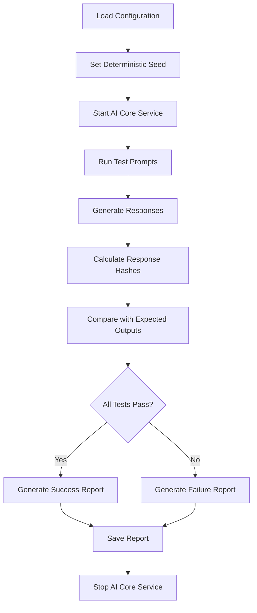

# AI Core Service Golden Tests

This document describes the golden test system for the AI Core Service, which ensures deterministic behavior and reproducible results across different runs.

## Overview

Golden tests are a form of regression testing that captures the expected output of a system and compares it against actual output in subsequent runs. For the AI Core Service, golden tests ensure that:

- **Deterministic Behavior**: The same input with the same seed produces identical output
- **Model Stability**: Changes to the model or system don't break expected behavior
- **Regression Detection**: Unintended changes are caught early
- **Reproducible Results**: Tests can be run multiple times with consistent results

## Architecture

### Components

1. **Golden Test Script** (`scripts/golden/ai_core_golden.rs`)
   - Main golden test runner
   - Handles test execution and result comparison
   - Supports rebaseline mode for updating expected outputs

2. **Configuration File** (`scripts/golden/ai_core_config.json`)
   - Defines test prompts and expected responses
   - Contains model configuration settings
   - Specifies deterministic seed for reproducible results

3. **Golden File** (`artifacts/ai_core/golden.json`)
   - Stores expected outputs (response hashes, token counts, etc.)
   - Used for comparison during test runs
   - Updated during rebaseline operations

4. **Test Report** (`artifacts/ai_core/golden_report.json`)
   - Contains detailed test results and statistics
   - Generated after each test run
   - Used for analysis and debugging

### Test Flow



## Usage

### Running Golden Tests

```bash
# Run all golden tests
make golden-ai-core

# Run with verbose output
cargo run --bin ai_core_golden --manifest-path scripts/golden/Cargo.toml
```

### Rebaselining Golden Tests

When the expected behavior changes (e.g., model updates, prompt improvements), you need to rebaseline the golden tests:

```bash
# Rebaseline all golden tests
make golden-ai-core-rebaseline

# Or use the script directly
bash scripts/ai-core-rebaseline.sh
```

### Manual Rebaseline

```bash
# Run golden tests in rebaseline mode
cargo run --bin ai_core_golden --manifest-path scripts/golden/Cargo.toml -- --rebaseline
```

## Configuration

### Test Prompts

The configuration file defines various test prompts covering different scenarios:

- **Simple Questions**: Basic factual queries
- **Math Problems**: Arithmetic and logical reasoning
- **Code Generation**: Programming task requests
- **File Operations**: File system interactions
- **Search Queries**: Information retrieval
- **Complex Reasoning**: Multi-step problem solving
- **System Commands**: OS-level operations
- **Memory Operations**: Persistent memory usage
- **Error Handling**: Error condition testing
- **Multimodal Requests**: Image and text processing

### Model Configuration

```json
{
  "model_config": {
    "model_name": "gpt-3.5-turbo",
    "temperature": 0.0,
    "max_tokens": 1000,
    "top_p": 1.0,
    "stop_sequences": ["\n\n", "Human:", "Assistant:"]
  }
}
```

**Key Settings:**
- `temperature: 0.0` - Ensures deterministic output
- `seed: 42` - Fixed seed for reproducible results
- `stop_sequences` - Prevents infinite generation

### Expected Outputs

Each test prompt has an expected output definition:

```json
{
  "simple_question": {
    "response_hash": "a1b2c3d4e5f6g7h8i9j0k1l2m3n4o5p6q7r8s9t0",
    "token_count": 25,
    "processing_time_ms": 150,
    "tool_calls": [],
    "expected_error": null
  }
}
```

**Fields:**
- `response_hash` - SHA-256 hash of the response content
- `token_count` - Expected number of tokens generated
- `processing_time_ms` - Expected processing time
- `tool_calls` - Expected tool calls made
- `expected_error` - Expected error (if any)

## Deterministic Behavior

### Seed Management

The golden test system uses a fixed seed (42) to ensure deterministic behavior:

```rust
// Set deterministic environment
std::env::set_var("AETHERIS_SEED", "42");
std::env::set_var("AETHERIS_DETERMINISTIC", "true");
```

### Hash Calculation

Response hashes are calculated deterministically:

```rust
fn calculate_response_hash(&self, response: &ChatResponse) -> String {
    use std::collections::hash_map::DefaultHasher;
    use std::hash::{Hash, Hasher};
    
    let mut hasher = DefaultHasher::new();
    response.content.hash(&mut hasher);
    response.tokens_generated.hash(&mut hasher);
    response.model_used.hash(&mut hasher);
    
    format!("{:x}", hasher.finish())
}
```

### Verification

The system runs tests multiple times to verify deterministic behavior:

```bash
# Run 3 iterations with the same seed
for i in {1..3}; do
    make golden-ai-core
    cp artifacts/ai_core/golden_report.json "artifacts/ai_core/golden_report_$i.json"
done

# Compare results
# All iterations should produce identical response hashes
```

## CI Integration

### GitHub Actions Workflow

The golden tests are integrated into the CI pipeline via `.github/workflows/p5-15-golden-ai-core.yml`:

**Jobs:**
1. **golden-tests** - Runs the golden tests
2. **deterministic-verification** - Verifies deterministic behavior
3. **golden-test-summary** - Generates summary report

**Triggers:**
- Push to main/develop branches
- Pull requests affecting AI Core Service
- Manual workflow dispatch

### Artifact Management

Test artifacts are automatically uploaded and stored:

- **Golden Results** - Test reports and configurations
- **Deterministic Verification** - Multi-iteration comparison results
- **Retention** - 30 days for analysis and debugging

## Troubleshooting

### Common Issues

#### Test Failures

**Symptom:** Golden tests fail with hash mismatches

**Causes:**
- Model version changes
- Non-deterministic behavior
- Environment differences
- Code changes affecting output

**Solutions:**
1. Verify deterministic settings are enabled
2. Check for environment differences
3. Rebaseline if changes are intentional
4. Review code changes for non-deterministic behavior

#### Rebaseline Failures

**Symptom:** Rebaseline process fails

**Causes:**
- AI Core Service not running
- Configuration errors
- Permission issues
- Network problems

**Solutions:**
1. Ensure AI Core Service is running
2. Check configuration file syntax
3. Verify file permissions
4. Check network connectivity

#### Non-Deterministic Behavior

**Symptom:** Same test produces different results

**Causes:**
- Random number generation
- Threading issues
- External dependencies
- System time dependencies

**Solutions:**
1. Set deterministic seed
2. Disable threading
3. Mock external dependencies
4. Use fixed system time

### Debugging

#### Enable Verbose Logging

```bash
export RUST_BACKTRACE=1
export RUST_LOG=debug
make golden-ai-core
```

#### Check Test Reports

```bash
# View detailed test results
cat artifacts/ai_core/golden_report.json | jq '.'

# Check specific test failure
cat artifacts/ai_core/golden_report.json | jq '.results[] | select(.passed == false)'
```

#### Compare Iterations

```bash
# Compare response hashes across iterations
for i in {1..3}; do
    echo "Iteration $i:"
    jq -r '.results[] | "\(.prompt_id): \(.actual_response_hash)"' "artifacts/ai_core/golden_report_$i.json"
done
```

## Best Practices

### Test Design

1. **Comprehensive Coverage**: Include various prompt types and scenarios
2. **Realistic Prompts**: Use prompts that reflect real usage patterns
3. **Edge Cases**: Test error conditions and boundary cases
4. **Tool Integration**: Include prompts that trigger tool calls

### Maintenance

1. **Regular Updates**: Rebaseline when model behavior changes
2. **Version Control**: Track changes to golden files
3. **Documentation**: Document any intentional changes
4. **Monitoring**: Monitor test performance and reliability

### Performance

1. **Parallel Execution**: Run tests in parallel when possible
2. **Caching**: Cache model loads and configurations
3. **Resource Management**: Monitor memory and CPU usage
4. **Timeout Handling**: Set appropriate timeouts for long-running tests

## Examples

### Basic Test Run

```bash
$ make golden-ai-core
Running AI Core Service Golden Tests...
🧪 Running golden tests...

============================================================
AI CORE GOLDEN TEST SUMMARY
============================================================
Total Tests: 10
Passed: 10
Failed: 0
Success Rate: 100.0%
Average Processing Time: 185.2ms

✅ GOLDEN TEST PASSED
```

### Failed Test Example

```bash
$ make golden-ai-core
Running AI Core Service Golden Tests...
🧪 Running golden tests...

============================================================
AI CORE GOLDEN TEST SUMMARY
============================================================
Total Tests: 10
Passed: 8
Failed: 2
Success Rate: 80.0%
Average Processing Time: 192.5ms

❌ GOLDEN TEST FAILED - See artifacts/ai_core/golden_report.json
  Failed: simple_question - Hash mismatch
  Failed: code_generation - Token count mismatch
```

### Rebaseline Example

```bash
$ make golden-ai-core-rebaseline
Rebaselining AI Core Service Golden Tests...
🔄 Running golden tests in rebaseline mode...
✅ Rebaselined golden tests successfully!

📊 Summary:
  - Configuration: scripts/golden/ai_core_config.json
  - Golden file: artifacts/ai_core/golden.json
  - Report: artifacts/ai_core/golden_report.json

🔍 To verify the rebaseline:
  make golden-ai-core
```

## Future Enhancements

### Planned Features

1. **Multi-Model Testing**: Support for testing multiple model backends
2. **Performance Benchmarking**: Track and compare processing times
3. **A/B Testing**: Compare different model configurations
4. **Automated Rebaseline**: Smart rebaseline based on confidence scores
5. **Visual Regression**: Support for image and video golden tests

### Integration Opportunities

1. **Model Versioning**: Automatic golden test updates for model releases
2. **Quality Gates**: Block deployments on golden test failures
3. **Performance Monitoring**: Track golden test performance over time
4. **Alerting**: Notify on golden test failures or performance regressions

## Conclusion

The AI Core Service golden test system provides a robust foundation for ensuring deterministic behavior and catching regressions early. By following the guidelines and best practices outlined in this document, teams can maintain high-quality, reliable AI services while enabling rapid iteration and deployment.

For questions or issues, please refer to the troubleshooting section or contact the development team.
