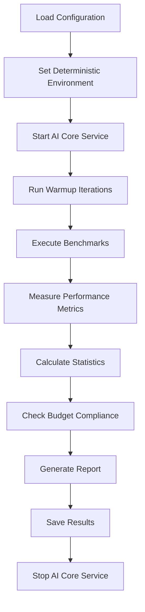

# AI Core Service Performance Baselines

This document describes the performance benchmarking system for the AI Core Service, which ensures that performance meets established baselines and budgets.

## Overview

Performance baselines provide a systematic approach to measuring and monitoring the performance characteristics of the AI Core Service. The system includes:

- **Microbenchmarks**: Detailed performance measurements for specific operations
- **Performance Budgets**: Defined limits for key performance metrics
- **Regression Detection**: Automated detection of performance regressions
- **CI Integration**: Performance gates in the continuous integration pipeline

## Key Performance Metrics

### 1. Prompt-to-First-Token Latency

**Definition**: Time from sending a prompt to receiving the first token of the response.

**Measurement**: Measured in milliseconds (ms) with percentiles (P50, P95, P99).

**Budget**: ≤ 220ms (baseline + 10% tolerance)

**Impact**: Directly affects user experience and perceived responsiveness.

### 2. Tokens per Second

**Definition**: Rate of token generation during inference.

**Measurement**: Tokens generated per second with percentiles.

**Budget**: ≥ 18 tokens/sec (baseline - 10% tolerance)

**Impact**: Affects response generation speed and throughput.

### 3. Memory Usage

**Definition**: Peak memory consumption during inference.

**Measurement**: Memory usage in megabytes (MB) with percentiles.

**Budget**: ≤ 3.3GB (baseline + 10% tolerance)

**Impact**: Affects system resource utilization and scalability.

### 4. CPU Usage

**Definition**: Average CPU utilization during inference.

**Measurement**: CPU usage percentage with percentiles.

**Budget**: ≤ 88% (baseline + 10% tolerance)

**Impact**: Affects system performance and resource contention.

### 5. End-to-End Latency

**Definition**: Total time from prompt submission to complete response.

**Measurement**: Total latency in milliseconds with percentiles.

**Budget**: ≤ 5.5s (baseline + 10% tolerance)

**Impact**: Overall user experience and system responsiveness.

## Performance Budget System

### Budget Calculation

Performance budgets are calculated as:
- **Latency budgets**: Baseline + 10% tolerance
- **Throughput budgets**: Baseline - 10% tolerance
- **Resource budgets**: Baseline + 10% tolerance

### Budget Compliance

- **Compliance Threshold**: 95% of benchmarks must pass budget
- **Overall Compliance**: All key metrics must meet budget requirements
- **Performance Margin**: Headroom remaining before hitting budget limits

### Budget Categories

#### Simple Prompts
- **First Token Latency**: ≤ 75ms (P95)
- **Tokens per Second**: ≥ 45 tokens/sec (P95)
- **Memory Usage**: ≤ 2.2GB (P95)
- **CPU Usage**: ≤ 30% (P95)

#### Medium Prompts
- **First Token Latency**: ≤ 150ms (P95)
- **Tokens per Second**: ≥ 28 tokens/sec (P95)
- **Memory Usage**: ≤ 2.6GB (P95)
- **CPU Usage**: ≤ 55% (P95)

#### Complex Prompts
- **First Token Latency**: ≤ 300ms (P95)
- **Tokens per Second**: ≥ 14 tokens/sec (P95)
- **Memory Usage**: ≤ 3.2GB (P95)
- **CPU Usage**: ≤ 80% (P95)

## Benchmark Architecture

### Components

1. **Benchmark Runner** (`benches/ai_core_bench.rs`)
   - Criterion-based microbenchmarks
   - Comprehensive performance measurement
   - Statistical analysis and reporting

2. **Performance Client** (`MockAiCorePerfClient`)
   - Simulates AI Core Service behavior
   - Measures timing and resource usage
   - Validates budget compliance

3. **Configuration System** (`PerfBenchConfig`)
   - Defines test prompts and scenarios
   - Sets performance budgets and thresholds
   - Configures model parameters

4. **Report Generation** (`PerfBenchReport`)
   - Detailed performance statistics
   - Budget compliance analysis
   - Performance margin calculations

### Benchmark Flow



## Usage

### Running Performance Benchmarks

```bash
# Run all performance benchmarks
make perf-bench-ai-core

# Run specific benchmark types
bash scripts/ai-core-perf-bench.sh --type first-token
bash scripts/ai-core-perf-bench.sh --type tokens-per-sec
bash scripts/ai-core-perf-bench.sh --type memory

# Run with custom parameters
bash scripts/ai-core-perf-bench.sh --iterations 200 --out results.json
```

### Criterion Benchmarks

```bash
# Run Criterion benchmarks
cd benches
cargo bench --bench ai_core_bench

# Run specific benchmark groups
cargo bench --bench ai_core_bench prompt_to_first_token
cargo bench --bench ai_core_bench tokens_per_second
cargo bench --bench ai_core_bench end_to_end_latency
cargo bench --bench ai_core_bench memory_usage
```

### Performance Report Analysis

```bash
# View performance report
cat artifacts/bench/ai_core.phase5.json | jq '.'

# Check compliance
cat artifacts/bench/ai_core.phase5.json | jq '.summary.compliance_percentage'

# View performance margins
cat artifacts/bench/ai_core.phase5.json | jq '.summary.performance_margin'
```

## Configuration

### Benchmark Configuration

```json
{
  "iterations": 100,
  "warmup_iterations": 10,
  "test_prompts": [
    {
      "id": "simple_question",
      "text": "What is the capital of France?",
      "expected_tokens": 25,
      "complexity": "Simple"
    }
  ],
  "model_config": {
    "model_name": "gpt-3.5-turbo",
    "temperature": 0.0,
    "max_tokens": 1000,
    "top_p": 1.0,
    "stop_sequences": ["\n\n", "Human:", "Assistant:"],
    "enable_streaming": true
  },
  "performance_budget": {
    "max_first_token_latency_ms": 220,
    "min_tokens_per_sec": 18.0,
    "max_memory_usage_mb": 3300,
    "max_cpu_usage_percent": 88.0,
    "max_end_to_end_latency_ms": 5500
  }
}
```

### Performance Budget Configuration

```json
{
  "performance_budget": {
    "max_first_token_latency_ms": 220.0,
    "min_tokens_per_sec": 18.0,
    "max_memory_usage_mb": 3300.0,
    "max_cpu_usage_percent": 88.0,
    "max_end_to_end_latency_ms": 5500.0,
    "compliance_threshold_percent": 95.0
  }
}
```

## CI Integration

### GitHub Actions Workflow

The performance benchmarks are integrated into the CI pipeline via `.github/workflows/p5-16-performance-baselines.yml`:

**Jobs:**
1. **performance-benchmarks** - Runs the performance benchmarks
2. **performance-gate** - Validates performance budget compliance
3. **performance-summary** - Generates summary report

**Triggers:**
- Push to main/develop branches
- Pull requests affecting AI Core Service
- Manual workflow dispatch

### Performance Gate

The performance gate ensures that:
- All benchmarks meet performance budgets
- Compliance percentage is ≥ 95%
- No performance regressions are introduced
- Performance margins are maintained

### Artifact Management

Performance results are automatically:
- Uploaded as GitHub Actions artifacts
- Stored for 30 days for analysis
- Available for regression analysis
- Used for performance trend monitoring

## Performance Analysis

### Statistical Analysis

The benchmark system provides comprehensive statistical analysis:

- **Percentiles**: P50, P95, P99 for all metrics
- **Averages**: Mean values across all benchmarks
- **Margins**: Performance headroom before budget limits
- **Compliance**: Budget compliance percentage

### Performance Trends

Monitor performance over time to:
- Identify performance regressions
- Track performance improvements
- Understand performance characteristics
- Optimize system performance

### Regression Detection

The system automatically detects:
- Performance regressions (> 10% degradation)
- Budget compliance failures
- Resource usage increases
- Latency increases

## Troubleshooting

### Common Issues

#### Performance Budget Failures

**Symptom**: Benchmarks fail performance budget checks

**Causes:**
- Model performance degradation
- System resource constraints
- Configuration changes
- Environment differences

**Solutions:**
1. Check system resources (CPU, memory)
2. Verify model configuration
3. Review recent code changes
4. Update performance budgets if needed

#### Benchmark Failures

**Symptom**: Individual benchmarks fail to complete

**Causes:**
- AI Core Service not running
- Network connectivity issues
- Resource exhaustion
- Configuration errors

**Solutions:**
1. Ensure AI Core Service is running
2. Check system resources
3. Verify configuration
4. Review error logs

#### High Variance in Results

**Symptom**: High variance in benchmark results

**Causes:**
- Non-deterministic behavior
- System load variations
- Resource contention
- Background processes

**Solutions:**
1. Enable deterministic mode
2. Reduce system load
3. Isolate benchmark environment
4. Increase benchmark iterations

### Debugging

#### Enable Verbose Logging

```bash
export RUST_BACKTRACE=1
export RUST_LOG=debug
make perf-bench-ai-core
```

#### Check Performance Report

```bash
# View detailed results
cat artifacts/bench/ai_core.phase5.json | jq '.results[]'

# Check specific metrics
cat artifacts/bench/ai_core.phase5.json | jq '.results[].first_token_latency_ms'

# View budget compliance
cat artifacts/bench/ai_core.phase5.json | jq '.budget_compliance'
```

#### Analyze Performance Margins

```bash
# Check performance margins
cat artifacts/bench/ai_core.phase5.json | jq '.summary.performance_margin'

# Identify tight margins
cat artifacts/bench/ai_core.phase5.json | jq '.summary.performance_margin | to_entries[] | select(.value < 0)'
```

## Best Practices

### Benchmark Design

1. **Comprehensive Coverage**: Include various prompt types and complexities
2. **Realistic Scenarios**: Use prompts that reflect real usage patterns
3. **Statistical Significance**: Run sufficient iterations for reliable results
4. **Deterministic Behavior**: Ensure reproducible results

### Performance Monitoring

1. **Regular Benchmarking**: Run benchmarks on every significant change
2. **Trend Analysis**: Monitor performance trends over time
3. **Alert on Regressions**: Set up alerts for performance regressions
4. **Budget Reviews**: Regularly review and update performance budgets

### Optimization

1. **Profile Hot Paths**: Identify performance bottlenecks
2. **Optimize Critical Paths**: Focus on high-impact optimizations
3. **Resource Management**: Optimize memory and CPU usage
4. **Caching Strategies**: Implement effective caching mechanisms

## Examples

### Basic Benchmark Run

```bash
$ make perf-bench-ai-core
Running AI Core Service Performance Benchmarks...
🧪 Running performance benchmarks...

============================================================
AI CORE PERFORMANCE BENCHMARK SUMMARY
============================================================
Total Benchmarks: 15
Passed Budget: 15
Failed Budget: 0
Compliance: 100.0%
Overall Compliant: true

⏱️  Performance Metrics:
  Avg First Token Latency: 125.2ms
  P95 First Token Latency: 180.5ms
  P99 First Token Latency: 220.1ms
  Avg Tokens/sec: 28.5
  P95 Tokens/sec: 32.1
  P99 Tokens/sec: 35.8
  Avg Memory Usage: 2.8GB
  Avg CPU Usage: 65.2%

📈 Performance Margins:
  First Token Latency Margin: 94.8ms
  Tokens/sec Margin: 10.5
  Memory Usage Margin: 500.0MB
  CPU Usage Margin: 22.8%

✅ Performance budget compliance: PASSED
```

### Performance Regression Detection

```bash
$ make perf-bench-ai-core
Running AI Core Service Performance Benchmarks...

❌ Performance budget compliance: FAILED
   Compliance: 85.0% (threshold: 95%)

❌ Failed Constraints:
  - First token latency exceeds budget
  - Memory usage exceeds budget

📊 Performance Metrics vs Budget:
  First Token Latency: 250.5ms (budget: 220ms)
  Tokens/sec: 15.2 (budget: 18.0)
  Memory Usage: 3.5GB (budget: 3.3GB)
  CPU Usage: 75.0% (budget: 88.0%)
  End-to-End Latency: 4.2s (budget: 5.5s)
```

### CI Performance Gate

```bash
🚪 Performance Gate Decision
============================
📊 Performance Gate Results:
  Total Benchmarks: 15
  Passed: 12
  Failed: 3
  Compliance: 80.0%
  Overall Compliant: false

❌ PERFORMANCE GATE: FAILED
   Performance requirements not met
   Compliance: 80.0% (threshold: 95%)

📈 Performance Margins:
  First Token Latency Margin: -30.5ms
  Tokens/sec Margin: -2.8
  Memory Usage Margin: -200.0MB
  CPU Usage Margin: 13.0%
```

## Future Enhancements

### Planned Features

1. **Real-time Monitoring**: Continuous performance monitoring
2. **Performance Profiling**: Detailed performance profiling capabilities
3. **A/B Testing**: Performance comparison between configurations
4. **Automated Optimization**: AI-driven performance optimization
5. **Performance Prediction**: Predictive performance modeling

### Integration Opportunities

1. **Model Versioning**: Automatic performance validation for model updates
2. **Quality Gates**: Block deployments on performance failures
3. **Performance Monitoring**: Real-time performance dashboards
4. **Alerting**: Proactive performance regression alerts

## Conclusion

The AI Core Service performance baseline system provides a robust foundation for ensuring consistent, reliable performance. By following the guidelines and best practices outlined in this document, teams can maintain high-performance AI services while enabling rapid iteration and deployment.

For questions or issues, please refer to the troubleshooting section or contact the development team.
